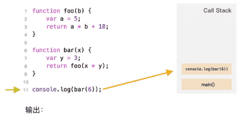
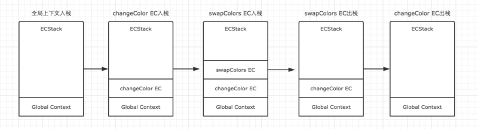
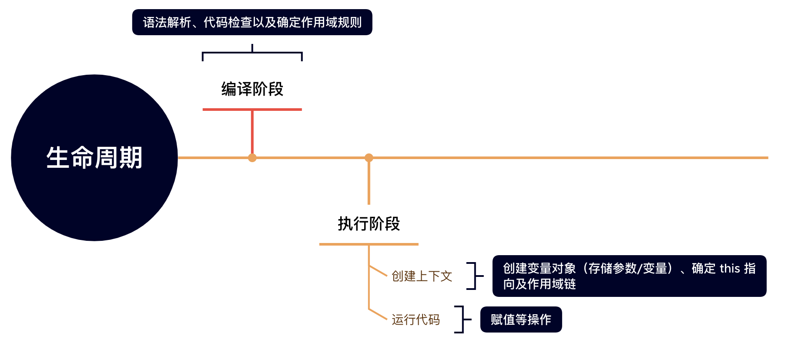

前端三大基础（又称 **三大马车**）：

- HTML：结构层（标签）
- CSS：渲染层（样式）
- JavaScript：行为层（交互）

# 一、JavaScript 

## 1. 概述 

JavaScript是一种高级编程语言，用于Web开发和创建交互式用户界面。它是一种动态类型语言，意味着变量类型在运行时确定。JavaScript可以在浏览器中运行，也可以在服务器端使用Node.js运行。它具有广泛的应用，包括网页开发、游戏开发、移动应用程序开发等。JavaScript具有易学性和灵活性，是Web开发中必不可少的一部分。

## 2. 为什么学习 JavaScript

JavaScript 是一种广泛使用的编程语言，它可以用于网页开发、游戏开发、移动应用程序开发等多个领域。学习 JavaScript 可以帮助我们更好地理解网页的交互和动态效果，提高网页开发的效率和质量。此外，JavaScript 还是现代前端开发中必不可少的一部分，掌握 JavaScript 可以让我们更好地理解和使用现代前端框架和工具，提高我们的职业竞争力。

## 3. JavaScript 历史

JavaScript 最初由 Brendan Eich 在 10 天内创建。它于 1995 年首次在 Netscape Navigator 中发布。JavaScript 最初被称为 LiveScript，但由于 Java 的流行，Netscape 更改了名称。JavaScript 旨在为 Web 开发提供交互式功能。它现在已成为 Web 开发中最常用的编程语言之一。

## 4. JavaScript 与 ECMAScript 

JavaScript 和 ECMAScript 是同一个东西吗？答案是：不完全是。JavaScript 是一种编程语言，而 ECMAScript 是 JavaScript 语言的标准。JavaScript 实现了 ECMAScript 标准，并且在此基础上发展出了更多的功能和特性。因此，我们可以认为 JavaScript 是 ECMAScript 的超集。

## 5. ECMAScript 的历史

ECMAScript 是一种由 Ecma 国际（前身为欧洲计算机制造商协会）通过 ECMA-262 标准化的脚本程序设计语言。它是一种用于创建动态网页和其他互联网应用程序的脚本语言。ECMAScript 的历史可以追溯到 1995 年，当时 Netscape Communications Corporation 的 Brendan Eich 开发了一种名为 LiveScript 的脚本语言。后来，Netscape 将其改名为 JavaScript，并将其提交给 Ecma 国际进行标准化。ECMAScript 1.0 于 1997 年发布，自那以后，该语言已经经历了多个版本的更新和改进，目前最新的版本是 ECMAScript 2021。

## 6. JavaScript 与 Java 的关系

JavaScript 与 Java 是两种不同的编程语言，它们的语法、用途和运行环境都不同。JavaScript 是一种脚本语言，主要用于网页前端开发，而 Java 是一种面向对象的编程语言，主要用于后端开发和桌面应用程序开发。虽然它们的名称相似，但它们之间没有直接的关系。

# 二、JavaScript 引入方式

## 1. 内嵌方式

直接在 html 文档的 **head** 或 **body** 标签中嵌入 js，如下所示：

```html
<!DOCTYPE html>
<html lang="zh-CN">
<head>
	<meta charset="UTF-8">
	<title>Document</title>
    <script>
        // insert javascript codes in here....
    </script>
</head>
<body>
    <script>
        // insert javascript codes in here....
    </script>
</body>
</html>
```

> Tips：\<script> 标签可以放在网页任意位置，通常不建议这样使用，而是将js代码独立放到一个文件中然后在\<body>结束标签之前引入使用。

## 2. 外链方式

首先你需要创建脚本文件，后缀名为 `.js`，然后在html文件 \<body> 结束标签之前通过 \<script src="">  标签引入。

```javascript
// my.js
// insert javascript codes in here...
```

```html
<!-- index.html -->
<!DOCTYPE html>
<html lang="zh-CN">
<head>
	<meta charset="UTF-8">
	<title>Document</title>
    <!-- 引入方式1 -->
    <script type="text/javascript" src="my.js"></script>
</head>
<body>
    <!-- 引入方式2 -->
	<script type="text/javascript" src="my.js"></script>
</body>
</html>
```

> Tips：
>
> 1. 这里建议大家使用外链方式，将js代码独立放置到一个文件中，便于我们后期维护优化。
> 2. 一般建议将引入脚本的位置放在 **body结束标签之前**。

# 三、拓展

## 1. 数据结构

这里只是简单介绍一些数据结构及其特点：

- **栈**：先进后出
- **堆**：部分顺序，因为储存方式不一样，知道 `key` 就行（对象）
- **队列**：先进先出

## 2. 执行上下文（环境）

js 执行上下文是指在代码执行期间，js 引擎创建的一个内部数据结构，用于存储代码执行期间的所有信息，包括变量、函数、作用域链等。每个执行上下文都有一个与之关联的变量对象，用于存储当前执行环境中的所有变量和函数声明。在代码执行期间，JavaScript 引擎会根据执行上下文的类型和作用域链来确定变量和函数的访问权限。js 执行上下文分为三种类型：全局执行上下文、函数执行上下文和 eval 执行上下文。

- **全局执行上下文**：任何不在函数内部的代码都会在全局上下文中执行，它会做两件事：

  1）创建一个全局对象和全局变量对象，并将其绑定到全局执行上下文中

  2）将 this 指针指向这个全局对象。

- **函数执行上下文**：当一个函数被调用时,都会为该函数创建一个新的上下文。

- **Eval函数执行上下文**：（少用）

## 3. 执行上下文的生命周期

执行上下文的生命周期包括三个阶段：**创建阶段 → 执行阶段 → 销毁阶段**，本文重点介绍创建阶段。

**① 创建阶段**

在创建阶段，js 引擎会创建一个执行上下文对象，并进行以下操作：
- 创建变量对象（Variable Object，VO）：包括函数声明、函数参数、变量声明等。
- 确定 this 的指向。
- 创建作用域链（Scope Chain）：用于解析变量和函数的作用域。
- 初始化变量的值：将变量初始化为 undefined。

**② 执行阶段**

在执行阶段，js 引擎会按照代码的顺序执行，将变量赋值、函数调用等操作加入执行栈（Execution Stack）中，直到执行栈为空。

**③ 回收阶段**

在销毁阶段，JavaScript 引擎会进行以下操作：
- 执行垃圾回收（Garbage Collection）：回收不再使用的内存空间。
- 销毁变量对象和作用域链。

## 4. 执行栈

执行栈，即 “调用栈”，是一种拥有 LIFO（后进先出）数据结构的栈，被用来存储代码运行时创建的所有执行上下文。

js代码执行时首先会创建一个全局的执行上下文并且压入当前执行栈。每当引擎遇到一个函数调用，它会为该函数创建一个新的执行上下文并压入栈的顶部。引擎会执行那些执行上下文位于栈顶的函数。当该函数执行结束时，执行上下文从栈中弹出，控制流程到达当前栈中的下一个上下文。



从上面的流程图，我们需要记住几个关键点：

- js执行在单线程上，所有的代码都是排队执行。
- 一开始浏览器执行全局的代码时，首先创建全局的执行上下文，压入执行栈的顶部。
- 每当进入一个函数的执行就会创建函数的执行上下文，并且把它压入执行栈的顶部。当前函数执行完成后，当前函数的执行上下文出栈，并等待垃圾回收。
- 浏览器的 js 执行引擎总是访问栈顶的执行上下文。
- 全局上下文只有唯一的一个，它在浏览器关闭时出栈。

我们再来看个例子：

```javascript
var color = 'blue';
function changeColor() {
  var anotherColor = 'red';
  function swapColors() {
    var tempColor = anotherColor;
    anotherColor = color;
    color = tempColor;
  }
  swapColors();
}
changeColor();
```

上述代码运行按照如下步骤：

- 当上述代码在浏览器中加载时，JavaScript 引擎会创建一个全局执行上下文并且将它推入当前的执行栈
- 调用 `changeColor` 函数时，此时 `changeColor` 函数内部代码还未执行，js 执行引擎立即创建一个 changeColor 的执行上下文（简称 EC），然后把这执行上下文压入到执行栈（简称 ECStack）中。
- 执行 changeColor 函数过程中，调用 `swapColors` 函数，同样地，swapColors 函数执行之前也创建了一个 swapColors 的执行上下文，并压入到执行栈中。
- swapColors 函数执行完成，swapColors 函数的执行上下文出栈，并且被销毁。
- changeColor 函数执行完成，changeColor 函数的执行上下文出栈，并且被销毁。



## 5. 运行生命周期

js运行的生命周期，参照下图：



js的运行生命周期包括以下几个阶段：
1. **解析阶段**：js代码在执行之前需要被解析，解析器会对代码进行词法分析和语法分析，生成抽象语法树（AST）。
2. **编译阶段**：在编译阶段，js引擎会对AST进行优化和编译，生成可执行代码。
3. **执行阶段**：在执行阶段，js引擎会按照编译阶段生成的可执行代码，逐行执行js代码，执行过程中会涉及到变量的声明、赋值、函数调用等操作。在执行过程中，js引擎还会进行垃圾回收等操作，确保内存的有效使用。

## 6. 编译原理

js编译原理是将js代码转换为可执行的机器代码的过程，它包括三个主要阶段：解析、转换和代码生成。

1. 在解析阶段，编译器将js代码转换为抽象语法树（AST）。
2. 在转换阶段，编译器将AST转换为中间表示（IR），并对其进行优化。
3. 在代码生成阶段，编译器将IR转换为机器代码，并生成可执行文件。

js编译器还包括一些其他的步骤，如词法分析、语法分析、类型检查和错误处理。这些步骤都是为了确保js代码能够正确地编译和执行。

