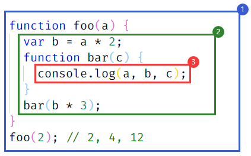

#  一、注释与语句

## 1、注释

- 单行注释：`//`
- 多行注释：`/**/`

```javascript
// This is Single-line comments
/*
This is
Multi-line comment  
 */
```

> 提示：单行注释不能折行，可以嵌套；多行注释可以折行，不能嵌套；

## 2、语句

一段脚本就是一系列计算机能够一步一步执行的指令。每一条单独的指令或步骤就被称为一条语句。语句以分号（`;`）结尾，多个语句可以写在一行内。

```javascript
var a = 10;                // 这是一条赋值语句
var b = 10; var c = a + b; // 多条语句可以写在一行内；
```

> 提示：分号在 JavaScript 中不是必须的，但为了养成良好的编码习惯，建议每一条语句之后都加上分号。

## 3、输出

1）、控制台输出

```javascript
var name = 'Petter';

// 1、输出字符串
console.log('Hello, world!');
// "Hello, world!"

// 2、输出变量
console.log(name);
// "Petter"

// 3、输出变量/字符串
console.log('Hello, ' + name + '!');
// "Hello, Petter!"
```
2）、页面输出

```javascript
document.write('Hello, world!');
```

3）、提示框输出

```javascript
alert('Hello, world!');
```

4）、确认框

```js
confirm("您确定要退游么？");
```

5）、输入框

```js
prompt("请输入您的名字");
```

# 二、变量

脚本必须暂时地存储一些完成工作所需的信息，可以将这些数据存储在变量中，变量是对 `值` 的引用，使用变量等同于引用一个值。每一个变量都有一个变量名。定义变量使用 `var` 关键字。

```javascript
var a = 10;
```

代码解读：为一个变量分配内存，将其命名为 `a`，然后将值 `10` 保存进这个变量。

> 提示：变量的赋值操作会执行两个动作，首先编译器会在当前作用域中声明一个变量（如果之前没有声明过），然后在运行时引擎会在作用域中查找该变量，如果能够找到就会对它赋值。

## 1、声明与赋值

```javascript
var a;  // 声明变量a
a = 10; // 为变量a赋值
```

> 提示：你可以将变量的声明与赋值放在一起，一步到位，如 `var a = 10`，这种定义变量的方式被称为 **字面量定义**，即在声明的同时为变量赋值。

如果只是声明变量而不为其赋值，则该变量的值是 `undefined`。`undefined` 是一个JavaScript 数据类型，表示未定义。

```javascript
var a;
a; // undefined
```

你可以在同一行中声明多个变量。

```javascript
var a = 10, name = 'Muzili';
```

> tips 1：变量一定先声明，后使用，如果访问一个未定义的变量，程序将报错：
>
> ```javascript
> console.log(a);
> // Uncaught ReferenceError: a is not defined
> ```

> tips 2：可以修改变量的值：
>
> ```javascript
> var a = 10;
> a; // 10
>
> a = 20;
> a; // 20
> ```

> tips 3：`JavaScript` 允许重复定义变量，如果重复定义，之前的值将会被覆盖，如果只定义不赋值，则新定义的变量无效：
>
> ```javascript
> // 定义变量a
> var a = 10; 
> console.log(a); // 10
>
> // 重复定义变量a
> var a;
> console.log(a); // 10
>
> var a = 20;
> console.log(a); // 20
> ```

## 2、类型推断

JavaScript是一种动态类型的语言，也就是说变量的类型没有限制，可以赋予各种类型的值，变量的类型在赋值之后确定，JavaScript本身存在一种类型推断机制，所谓类型推断，就是根据变量的值确定变量的类型。

## 3、typeof

通过typeof可以查看变量的数据类型，其返回值类型主要包括：string、boolean、number、undefined、function、object。

# 三、标识符

标识符是用来识别具体对象的一个名称。最常见的标识符就是 “变量名 ”，以及后面要提到的 “函数名 ”。JavaScript语言的标识符对**大小写敏感**，所以 `a` 和 `A` 是两个不同的标识符。标识符的命名规则如下：。

- 必须以字母、美元符号(**$**)以及下划线（**_**）开头，不能以数字开头；
- 名字可以包含字母、数字、下划线、美元符。注意，在变量中不能使用连字符(***-***)和点(***.***)号；
- 不能使用关键字或保留字来对变量命名。
- 所有的变量都是大小写敏感的，变量 `x` 与变量 `X` 是不一样的；
- 变量命名必须见名知意，语义化，如创建一个表示年龄的变量，变量名可以取名为 `age`，再或者要描述一个人的名字你应该取名为`name`，不能使用拼音或中文命名变量；
- 如果变量的名字由多个单词组成，则应遵守 **驼峰命名** 法则，即第一个单词首字母小写，后面单词首字母大写，如一个描述人的姓名的变量，正确的变量命名应该是 `personName`;

# 四、关键字与保留字

在上一节中我们提到了两个词语——“**关键字**”和“**保留字**”，就是我们在进行变量命名的时候需要避免使用的两类名称。所谓“关键字”，就是JavaScript现在正常使用的一些名称，它们可能是系统变量名，也可能是一个JS内置的方法函数名，还可能是已知宿主环境提供的API。而“保留字”是现在暂时没有使用，但在未来JavaScript可能会使用的名称，这些“保留字”经过JS不断的发展，已经有一些成为了“关键字”。

- 关键字

| break    | do     | instanceof | typeof    | if       | else      |
| -------- | ------ | ---------- | --------- | -------- | --------- |
| case     | var    | new        | finally   | return   | void      |
| continue | for    | switch     | while     | debugger | function  |
| this     | with   | try        | catch     | throw    | delete    |
| default  | in     | implements | package   | public   | interface |
| private  | static | let        | protected | yield    |           |

- 保留字

| abstract | enum    | int    | short | boolean | export       |
| -------- | ------- | ------ | ----- | ------- | ------------ |
| byte     | extends | long   | super | native  | synchronized |
| class    | float   | throws | const | goto    | transient    |
| volatile | double  | import |       |         |              |

但是需要明白的是JavaScript中的“关键字”和“保留字”也不是一成不变的，它们也会随着这个语言的发展新增或删除（例如“debugger”就是ECMAScript 5中新增的关键字）。但考虑到“向上兼容”，以前提出的这些“关键字”和“保留字”也应该在规范出现更改之后也避免去使用，以免造成程序异常。

# 五、作用域

## 1、作用域是什么？

我们之前谈到变量是对值的引用，那这些变量住在哪里？换句话说，它们储存在哪里？最重要的是，程序需要时如何找到它们呢？这些问题说明需要一套设计良好的规则来存储变量，并且之后可以方便地找到这些变量。这套规则被称为 **作用域**。

## 2、理解作用域

要理解作用域，首先我们需要了解几个点：

- **引擎**：从头到尾负责整个 `JavaScript` 程序的 **编译** 及 **执行过程**。
- **编译器**：负责 **语法分析** 及 **代码生成** 等脏活累活。
- **作用域**：负责收集并维护由所有声明的标识符（变量）组成的一系列查询，并实施一套非常严格的规则，确定当前执行的代码对这些标识符的访问权限。

当你看见 *`var a = 2;`* 这段程序时，很可能认为这是一句声明。但引擎却不这么看。事实上，引擎认为这里有两个完全不同的声明，一个由编译器在编译时处理，另一个则由引擎在运行时处理。

下面我们将这段程序进行分解，看看引擎/编译器/作用域是如何协同工作的。

编译器首先会将这段程序分解成词法单元，然后将词法单元解析成一个树结构。但是当编译器开始进行代码生成时，它对这段程序的处理方式会和预期的有所不同。可以合理地假设编译器所产生的代码能够用下面的伪代码进行概括：**为一个变量分配内存，将其命名为 a，然后将值 2 保存进这个变量。**然而，这并不完全正确。

事实上编译器会进行如下处理。

1）遇到 `var a`，编译器会询问作用域是否已经有一个该名称的变量存在于同一个作用域的集合中。如果是，编译器会忽略该声明，继续进行编译；否则它会要求作用域在当前作用域的集合中声明一个新的变量，并命名为 `a`。

2）接下来编译器会为引擎生成运行时所需的代码，这些代码被用来处理 `a = 2` 这个赋值操作。引擎运行时会首先询问作用域，在当前的作用域集合中是否存在一个叫作 `a` 的变量。如果是，引擎就会使用这个变量；如果否，引擎会继续查找该变量。

如果引擎最终找到了 `a` 变量，就会将 `2` 赋值给它。否则引擎就会举手示意并抛出一个异常！

> **编译器有话说**

为了进一步理解，我们需要多介绍一点编译器的术语，编译器在编译过程的第二步中生成了代码，引擎执行它时，会通过查找变量 **a** 来判断它是否已声明过。查找的过程由作用域进行协助，但是引擎执行怎样的查找，会影响最终的查找结果。在我们的例子中，引擎会为变量 `a` 进行 **LHS** 查询。另外一个查找的类型叫作**RHS**。

**LHS** 和 **RHS** 的含义是 “赋值操作的左侧或右侧” 并不一定意味着就是 “=赋值操作符的左侧或右侧”。赋值操作还有其他几种形式，因此在概念上最好将其理解为“赋值操作的目标是谁（LHS）”以及“谁是赋值操作的源头（RHS）”。比如：

```javascript
console.log(a);
```

其中对 `a` 的引用是一个 **RHS** 引用，因为这里 `a` 并没有赋予任何值。相应地，需要查找并取得 a 的值，这样才能将值传递给 `console.log(..)`。

相比之下，例如：

```javascript
a = 2;
```

这里对 `a` 的引用则是 **LHS** 引用，因为实际上我们并不关心当前的值是什么，只是想要为 `= 2` 这个赋值操作找到一个目标。

> **引擎和作用域的对话**

```javascript
function foo(a) {
 console.log( a ); // 2 
} 
foo( 2 );
```

让我们把上面这段代码的处理过程想象成一段对话，这段对话可能是下面这样的。

- 引擎：我说作用域，我需要为 `foo` 进行 `RHS` 引用。你见过它吗？
- 作用域：别说，我还真见过，编译器那小子刚刚声明了它。它是一个函数，给你。
- 引擎：哥们太够意思了！好吧，我来执行一下 `foo`。
- 引擎：作用域，还有个事儿。我需要为 `a` 进行 `LHS` 引用，这个你见过吗？
- 作用域：这个也见过，编译器最近把它声名为 `foo` 的一个形式参数了，拿去吧。
- 引擎：大恩不言谢，你总是这么棒。现在我要把 `2` 赋值给 `a`。
- 引擎：哥们，不好意思又来打扰你。我要为 `console` 进行 `RHS` 引用，你见过它吗？
- 作用域：咱俩谁跟谁啊，再说我就是干这个。这个我也有，`console` 是个内置对象。给你。
- 引擎：么么哒。我得看看这里面是不是有 `log(..)`。太好了，找到了，是一个函数。
- 引擎：哥们，能帮我再找一下对 `a` 的 `RHS` 引用吗？虽然我记得它，但想再确认一次。
- 作用域：放心吧，这个变量没有变动过，拿走，不谢。
- 引擎：真棒。我来把 `a` 的值，也就是 2，传递进 `log(..)`。
- ......

## 3、作用域嵌套

作用域是根据名称查找变量的一套规则。当一个块或函数嵌套在另一个块或函数中时，就发生了作用域的嵌套。因此，在当前作用域中无法找到某个变量时，引擎就会在外层嵌套的作用域中继续查找，直到找到该变量，或抵达最外层的作用域（也就是全局作用域）为止。考虑以下代码：

```javascript
function foo(a) {
 console.log( a + b ); 
} 
var b = 2; 
foo( 2 ); // 4
```

对 **b** 进行的 **RHS** 引用无法在函数 **foo** 内部完成，但可以在上一级作用域（在这个例子中就是全局作用域）中完成。因此，回顾一下引擎和作用域之间的对话，会进一步听到：

- 引擎：`foo` 的作用域兄弟，你见过 b 吗？我需要对它进行 `RHS` 引用。
- 作用域：听都没听过，走开。
- 引擎：`foo` 的上级作用域兄弟，咦？有眼不识泰山，原来你是全局作用域大哥，太好了。你见过 `b` 吗？我需要对它进行 `RHS` 引用。
- 作用域：当然了，给你吧。

遍历嵌套作用域链的规则很简单：引擎从当前的执行作用域开始查找变量，如果找不到，就向上一级继续查找。当抵达最外层的全局作用域时，无论找到还是没找到，查找过程都会停止。

## 4、词法作用域

词法作用域就是定义在词法阶段的作用域，换句话说，词法作用域是由你在写代码时将变量和块作用域写在哪里来决定的，因此当词法分析器处理代码时会保持作用域不变。考虑以下代码：

```javascript
function foo(a) {
  var b = a * 2;
  function bar(c) {
    console.log(a, b, c);
  }
  bar(b * 3);
}
foo(2); // 2, 4, 12
```

在这个例子中有三个逐级嵌套的作用域。为了帮助理解，可以将它们想象成几个逐级包含的气泡。



- ① 包含着整个全局作用域，其中只有一个标识符：`foo`。
- ② 包含着 `foo` 所创建的作用域，其中有三个标识符：`a`、`bar` 和 `b`。
- ③ 包含着 `bar` 所创建的作用域，其中只有一个标识符：`c`。

作用域气泡由其对应的作用域块代码写在哪里决定，它们是逐级包含的。

`bar` 的气泡被完全包含在 `foo` 所创建的气泡中，唯一的原因是那里就是我们希望定义函数 `bar` 的位置。

> 注意：这里所说的气泡是严格包含的。换句话说，没有任何函数的气泡可以（部分地）同时出现在两个外部作用域的气泡中，就如同没有任何函数可以部分地同时出现在两个父级函数中一样。

**@查找**

作用域气泡的结构和互相之间的位置关系给引擎提供了足够的位置信息，引擎用这些信息来查找标识符的位置。

在上一个代码片段中，引擎执行 `console.log(..)` 声明，并查找 `a`、`b` 和 `c` 三个变量的引用。它首先从最内部的作用域，也就是 `bar(..)` 函数的作用域气泡开始查找。引擎无法在这里找到 `a`，因此会去上一级到所嵌套的 `foo(..)` 的作用域中继续查找。在这里找到了 `a`，因此引擎使用了这个引用。对 `b` 来讲也是一样的。而对 `c` 来说，引擎在 `bar(..)` 中就找到了它。

如果 `a`、`c` 都存在于 `bar(..)` 和 `foo(..)` 的内部，`console.log(..)` 就可以直接使用 `bar(..)`中的变量，而无需到外面的 `foo(..)` 中查找。

**作用域查找会在找到第一个匹配的标识符时停止**。在多层的嵌套作用域中可以定义同名的标识符，这叫作“**遮蔽效应**”（内部的标识符“遮蔽”了外部的标识符）。抛开遮蔽效应，作用域查找始终从运行时所处的最内部作用域开始，逐级向外或者说向上进行，直到遇见第一个匹配的标识符为止。

> 提示：全局变量会自动成为全局对象（比如浏览器中的 `window` 对象）的属性，因此可以不直接通过全局对象的词法名称，而是间接地通过对全局对象属性的引用来对其进行访问，如：`window.a`，通过这种技术可以访问那些被同名变量所遮蔽的全局变量。但非全局的变量如果被遮蔽了，无论如何都无法被访问到。

无论函数在哪里被调用，也无论它如何被调用，它的词法作用域都只由函数被声明时所处的位置决定。

词法作用域查找只会查找一级标识符，比如 `a`、`b` 和 `c`。如果代码中引用了 `foo.bar.baz`，词法作用域查找只会试图查找 `foo` 标识符，找到这个变量后，对象属性访问规则会分别接管对 `bar` 和 `baz` 属性的访问。

> **总结**：词法作用域意味着作用域是由书写代码时函数声明的位置来决定的。编译的词法分析阶段基本能够知道全部标识符在哪里以及是如何声明的，从而能够预测在执行过程中如何对它们进行查找。

## 5、函数作用域

JavaScript 变量分为 **局部变量** 和 **全局变量** 。所谓“局部变量”就是指所定义的变量只会在一个限定的范围内生效，通常指在某一个函数内。而通过全局的方法或者其它函数是无法获取该变量的值的。

而“全局变量”，它的值可以被所有的方法或函数获取到。通常将一个变量写在所有函数的外部的变量，就叫做“全局变量”，但是在函数内部，若忘记在变量名前加上`var`的话，该变量也会成为全局变量，从而不小心被其它函数将值给误改了，所以在函数内部一定要记得在变量名前加上关键字 `var` 来定义一个变量。

```javascript
var a = "全局变量";
function print() {
  // a 为全局变量，在任意位置都可以访问
  console.log(a);    
}

function test(y) {
  // 参数 y 也为局部变量
  // x 在函数内部创建，为一个局部变量
  var x = "局部变量"; 
}
console.log(x); // x 为局部变量，此处不能访问x变量，程序会报错
console.log(y); // y 为局部变量，此处不能访问y变量，程序会报错    
```

变量作用域表示变量起作用的范围，全局变量的作用域为整个文件内部，称之为**全局作用域**。而局部变量的作用域通常限于函数内部，称之为**函数作用域**。

```javascript
// 立即执行函数
(function () {
    var str = 'Hello, World!';
    console.log(str);
})();
```

## 6、块作用域

块作用域主要是描述包含在花括号 `{}` 中的代码片段，比如 `if` 语句、`for `循环、`try...catch` 等等。在ES6之前，并没有严格意义上额块作用域，比如：

```javascript
if(true) {
  var a = 10;
}
console.log(a); // 10
```

在ES6之后，引入了 `let` 和 `const` 关键字，可以生成块作用域，如：

```javascript
if(true) {
  const a = 10;
}
console.log(a); // → Uncaught ReferenceError: a is not defined
```

## 7、小结

作用域是一套规则，用于确定在何处以及如何查找变量（标识符）。如果查找的目的是对变量进行赋值，那么就会使用 **LHS** 查询；如果目的是获取变量的值，就会使用 **RHS** 查询。

# 六、提升

## 1、变量提升

任何声明在某个作用域内的变量，都将附属于这个作用域。直觉上会认为 `JavaScript` 代码在执行时是由上到下一行一行执行的。但实际上这并不完全正确，有一种特殊情况会导致这个假设是错误的。

考虑以下代码：

```javascript
a = 2;
var a;
console.log(a); // → 2
```

很多开发者会认为是 `undefined`，因为 `var a` 声明在 `a = 2` 之后，他们自然而然地认为变量被重新赋值了，因此会被赋予默认值 `undefined`。但是，真正的输出结果是 `2`。

考虑另外一段代码：

```javascript
console.log( a ); // → undefined
var a = 2;
```

鉴于上一个代码片段所表现出来的某种非自上而下的行为特点，你可能会认为这个代码片段也会有同样的行为而输出 `2`。还有人可能会认为，由于变量 `a` 在使用前没有先进行声明，因此会抛出 `ReferenceError` 异常。

不幸的是两种猜测都是不对的。输出来的会是 `undefined`。

那么到底发生了什么？看起来我们面对的是一个先有鸡还是先有蛋的问题。到底是声明（蛋）在前，还是赋值（鸡）在前？

**引擎会在解释 JavaScript 代码之前首先对其进行编译。编译阶段中的一部分工作就是找到所有的声明，并用合适的作用域将它们关联起来**，因此，包括变量和函数在内的所有声明都会在任何代码被执行前首先被处理。

当你看到 `var a = 2;` 时，可能会认为这是一个声明。但 JavaScript 实际上会将其看成两个声明：`var a;` 和 `a = 2;`。第一个定义声明是在编译阶段进行的。第二个赋值声明会被留在原地等待执行阶段。我们的第一个代码片段会以如下形式进行处理：

```javascript
var a;
a = 2;
console.log(a);
```

其中第一部分是编译，而第二部分是执行。类似地，我们的第二个代码片段实际是按照以下流程处理的：

```javascript
var a;
console.log(a);
a = 2;
```

因此，打个比方，这个过程就好像变量和函数声明从它们在代码中出现的位置被“移动”到了最上面。这个过程就叫作 **提升**。换句话说，先有蛋（声明）后有鸡（赋值）。

> 提示：**只有声明本身会被提升**，而赋值或其他运行逻辑会留在原地。如果提升改变了代码执行的顺序，会造成非常严重的破坏。

```javascript
foo();
function foo() {
  console.log(a); // undefined
  var a = 2;
}
```

`foo` 函数的声明被提升了，因此第一行中的调用可以正常执行。

另外值得注意的是，每个作用域都会进行提升操作。所以， `foo(..)` 函数自身也会在内部对 `var a` 进行提升（显然并不是提升到了整个程序的最上方）。因此这段代码实际上会被理解为下面的形式：

```javascript
function foo() {
  var a;
  console.log(a); // undefined
  a = 2;
}
foo();
```

我们再来看一个代码片段：

```javascript
foo(); // → TypeError: foo is not a function
var foo = function () {};
```

可以看到，函数声明会被提升，但是 **函数表达式不会被提升**。

这段程序中的变量标识符 `foo()` 被提升并分配给所在作用域（在这里是全局作用域），因此 `foo()` 不会导致 `ReferenceError`。但是 `foo` 此时并没有赋值（如果它是一个函数声明而不是函数表达式，那么就会赋值）。`foo()` 由于对 `undefined` 值进行函数调用而导致非法操作，因此抛出 `TypeError` 异常。

同时也要记住，即使是具名的函数表达式，名称标识符在赋值之前也无法在所在作用域中使用：

```javascript
foo(); // → TypeError
bar(); // → ReferenceError
var foo = function bar() {
  // ...
};
```

这个代码片段经过提升后，实际上会被理解为以下形式：

```javascript
var foo;
foo(); // TypeError 
bar(); // ReferenceError 
foo = function() { 
var bar = ...self... 
 // ... 
}
```

## 2、函数优先

函数声明和变量声明都会被提升。但是一个值得注意的细节（这个细节可以出现在有多个“**重复**”声明的代码中）是函数会首先被提升，然后才是变量。

考虑以下代码：

```javascript
foo(); // 1
var foo;
function foo() {
  console.log(1);
}
foo = function () {
  console.log(2);
};
```

会输出 `1` 而不是 `2` ！这个代码片段会被引擎理解为如下形式：

```javascript
function foo() {
  console.log(1);
}
foo(); // 1
foo = function () {
  console.log(2);
};
```

> 注意，`var foo` 尽管出现在 `function foo()...`  的声明之前，但它是重复的声明（因此被忽略了），因为函数声明会被提升到普通变量之前。

尽管重复的 var 声明会被忽略掉，但出现在后面的函数声明还是可以覆盖前面的。

```javascript
foo(); // 3
function foo() {
  console.log(1);
}
var foo = function () {
  console.log(2);
};
function foo() {
  console.log(3);
}
```

虽然这些听起来都是些无用的学院理论，但是它说明了在同一个作用域中进行重复定义是非常糟糕的，而且经常会导致各种奇怪的问题。

# 七、运算符与表达式	

## 1、 基本运算符

基本运算符主要用于一些数值操作：

- `+`：加法运算符，如 `a + b`
- `-`：减法运算符，如 `a - b`
- `*`：乘法运算符，如 `a * b`
- `/`：除法运算符，如 `a / b`
- `%`：模运算（取余数），如 `a % b`
- `++`：自增运算符（自身+1）
- `--`：自减运算符（自身-1）

> 提示：自增与自减运算符都是让自身 `+1` 或 `-1`，在使用上无差别，这里以自增运算符为例。
>
> 1）、无论 `++` 运算符在变量前还是在变量后，变量自身都会 `+1`
>
> ```javascript
> var a = 10;
> a++; // 11
> ++a; // 12
> ```
>
> 2）、`++` 在前，先自增、再赋值；`++` 在后，先赋值，再自增
>
> ```javascript
> var a = 10;
> var x = ++a; // x = 11, a = 11
>
> var a = 10;
> var x = a++; // x = 10, a = 11
> ```

## 2、 赋值运算符

赋值运算符是为JavaScript中的变量赋值，即将该运算符右方计算出的值赋予左侧的变量。

- `=`：赋值运算符，如 `x = 10;` ，将 `10` 赋值给变量 `x`

## 3、复合运算符

- `+=`：变量与值相加，如 `x += y;` 相当于 `x = x + y`
- `-=`：变量与值相加，如 `x -= y;` 相当于 `x = x - y`
- `*=`：变量与值相加，如 `x *= y;` 相当于 `x = x * y`
- `/=`：变量与值相加，如 `x /= y;` 相当于 `x = x / y`
- `%=`：变量与值相加，如 `x %= y;` 相当于 `x = x % y`

## 4、关系运算符

关系运算符描述两个变量的关系，其返回值类型为布尔类型（boolean），即 `true` 和 `false`。

- `==`：判断两个变量是否相等，如 `'China' == 'China'`，返回 `true`
- `!=`：判断两个变量是否不相等
- `>`：判断等号左边的变量是否大于等号右边的变量，如 `20 > 10`，返回 `true`
- `<`：判断等号左边的变量是否小于等号右边的变量，如 `20 < 10` ，返回 `false`
- `>=`：判断等号左边的变量是否大于等于等号右边的变量，如 `20 >= 10`，返回 `true`
- `<=`：判断等号左边的变量是否小于等于等号右边的变量，如 `20 <= 10`，返回 `false`
- `===`：恒等于，要求不仅数据类型要一致，值也要一致，如 `1 === '1'`，返回 `false`
- `!==`：不恒等于，只要类型或值不一样，结果为true，如 `1 !== '1'`，返回 `true`

## 5、逻辑运算符

逻辑运算符是JavaScript用于判断几条语句成立情况的一种运算，该运算符的返回值类型为布尔类型。

- 逻辑与：`&&` ，同时为真才为真，如 `(1 > 2) && (2 > 3)`，返回 `false`
- 逻辑或：`||` ，同时为假才为假，如 `(1 > 2) || (2 > 1)`，返回 `true`
- 逻辑非：` !` ，取反，如 `!(1 > 2)`，返回 `true`

## 6、三元运算符

三元运算用于条件判断，根据判断的结果执行不同的语句，其语法形式为：`a ? b : c`。如果a表达式的条件为真，则执行b语句，否则执行c语句。我们来看一个示例：

```javascript
var isLogin = true; // 定义变量’isLogin‘用于记录登录状态
isLogin ? console.log('已登录！') : console.log('未登录！');
```

上述代码使用三目运算符根据登录状态执行不同的语句，代码中的 `console.log()` 函数用于向控制台输出信息。由于定义的变量值为true，因此上述代码执行后会在控制台输出：“您已登录！”

## 7、优先级

| **优先级** |                          **运算符**                          |                        **说明**                         |         **结合性**         |
| :--------: | :----------------------------------------------------------: | :-----------------------------------------------------: | :------------------------: |
|     1      |                       `[]`、`.`、`()`                        |        字段访问、数组索引、函数调用和表达式分组         |          从左向右          |
|     2      |    `++`、 `--`、 `-~!delete`、 `new` 、`typeof` 、`void`     |     一元运算符、返回数据类型、对象创建、未定义的值      |          从右向左          |
|     3      |                        `*`、`/`、`%`                         |                   相乘、相除、求余数                    |          从左向右          |
|     4      |                           `+`、`-`                           |                 相加、相减、字符串串联                  |          从左向右          |
|     5      |                      `<<`、`>>`、`>>>`                       |               左位移、右位移、无符号右移                |          从左向右          |
|     6      |              `<`、`<=`、`>`、`>=`、`instanceof`              | 小于、小于或等于、大于、大于或等于、是否 为特定类的实例 |          从左向右          |
|     7      |                   `==`、`!=`、`===`、`!==`                   |               相等、不相等、全等，不全等                |          从左向右          |
|     8      |                             `&`                              |                        按位“与”                         |          从左向右          |
|     9      |                             `^`                              |                       按位“异或”                        |          从左向右          |
|     10     |                             `|`                              |                        按位“或”                         |          从左向右          |
|     11     |                             `&&`                             |                   短路与（逻辑“与”）                    |          从左向右          |
|     12     |                             `||`                             |                   短路或（逻辑“或”）                    |          从左向右          |
|     13     |                             `?:`                             |                       条件运算符                        |          从右向左          |
|     14     | `=`、`+=`、`-=`、`*=`、`/=`、`%=`、`&=`、`|=`、`^=`、`<`、`<=`、`>`、`>=`、`>>=` |                     混合赋值运算符                      |          从右向左          |
|     15     |                             `,`                              |                        多个计算                         | 按优先级计算，然后从右向左 |

# 八、基本数据类型（概述）

- 原始数据类型：Number，String，Boolean，BigInt，Symbols，Null，Undefined

- 对象数据类型：Object，Function，Date，Array，Maps，Sets，JSON

> **# 比较 null 与 undefined：**

> - `null` 是一个表示"**空**"的对象，转为数值时为 `0`；
>
> - `undefined` 是一个表示"**空**"的原始值，转为数值时为 `NaN`；
>
> 当声明的变量还未被初始化时，变量的默认值为 `undefined`。 `null` 用来表示尚未存在的对象。
>
> `undefined`：表示"缺少值"，就是此处应该有一个值，但是还没有定义。典型用法是：
>
> 1. 变量被声明了，但没有赋值时，就等于 undefined。
>
> 2. 调用函数时，应该提供的参数没有提供，该参数等于 undefined。
>
> 3. 对象没有赋值的属性，该属性的值为 undefined。
>
> 4. 函数没有返回值时，默认返回 undefined。
>
> `null`：表示"没有对象"，即该处不应该有值。典型用法是：
>
> 1. 作为函数的参数，表示该函数的参数不是对象。
>
> 2. 作为对象原型链的终点。

# 九、类型转换

## 1、强制类型转换

数值类型：`Number()`、`parseInt()`、`parseFloat()`

字符串类型：`String()`

布尔值类型：`Boolean()`  →  `undefined`、`0`、`+0`、`-0`、`NaN`、`""`、`null` 转换为`false`

> 提示：

- `Number()`：整体转换，只要存在非数字字符均返回NaN

- `parseInt()`：转换整数，不能转换科学计数法，从左往右依次转换，直到遇到非数字字符为止

- `parseFloat()`：转换浮点数，可以转换科学计数法，从左往右依次转换，直到遇到非数字字符为止

代码示例：

```javascript
Number('a'); // NaN
Number('1'); // 1

parseInt('1a'); // 1
parseInt('a');  // NaN
```

## 2、自动类型转换

- 数值类型：`10 - "2"` 等，示例中，字符串 `"2"` 会被转换成数值 `2` 再进行运算，所以结果为 `8`。

- 字符串类型：`10 + "2"` 等，示例中，数值 `10` 会被转换成字符串 `"10"`，然后再进行拼接，所以结果为 `"102"`。

- 布尔值类型：`if`、`==`、`===`、`&&`、`||`、`！`等

## 3、类型转换优化

> 提示：显式转换比隐式转换性能更好；

在一般转换中，还可以通过如下示例提升性能。

```javascript
var n = "3.14";
"" + n; // -> string
~~n;    // -> integer
1 * n;  // -> float
!!n;    // -> boolean
[n];    // -> array
+n;     // -> number
```


