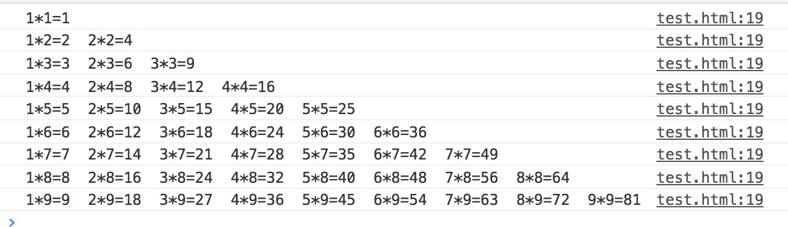
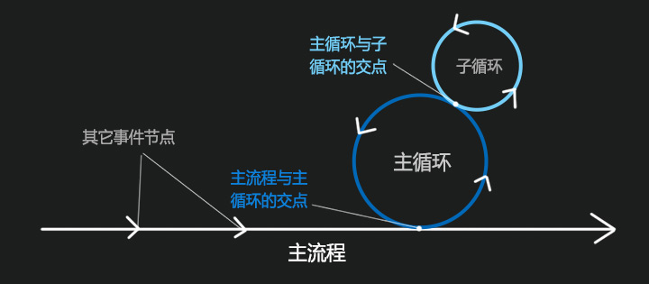
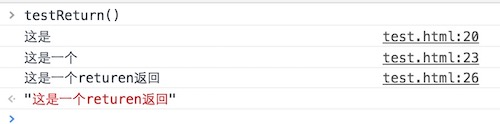
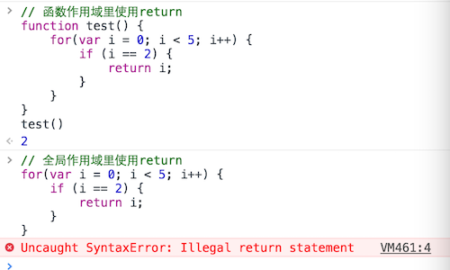
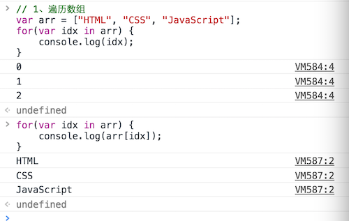
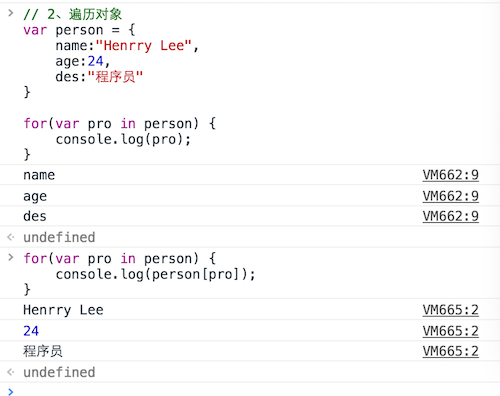

# # 概述

从程序流程的角度来看，程序可以分为三种基本结构：顺序结构、分支结构、循环结构。这三种基本结构可以组成所有的各种复杂程序。JavaScript提供了多种语句来实现这些程序结构。

# # 顺序结构

  顺序结构即程序从上往下依次执行语句。

# # 分支（选择）结构

  分支结构主要包括条件语句（ `if` 语句）与分支语句（ `switch` 语句）。

## 3.1、条件语句

### 3.1.1、if 语句

`if` 语句会对一个条件进行判断，如果这个条件的结果为 `true`，就会执行后续代码块中的语句。其语法形式为：

```javascript
if (condition) { 
};
```

```javascript
window.onload = function() {
	let age = 16;     // 定义变量age存储年龄
	if (age < 18) {   // 判断age是否小于18，如果条件为真，则执行花括号里的内容
		console.log("您是未成年，不得入内！");
	}
}
```

上述示例使用 *if* 语句判断是否成年，如果是未成年即年龄小于18岁，则在控制台输出相应信息。其中‘*window.onload = function(){}* ’用于确保JavaScript在文档加载完成后执行，‘ *console.log()*’ 函数为JavaScript输出函数，将会在控制台显示输出结果，你可以在浏览器审查元素选中 **Console** 项来查看输出结果。

我们再来看一个复杂一点的关于求闰年的练习：

```javascript
var year = 2017;
if((year % 4 == 0 && year % 100 != 0) || (year % 400 == 0)) {
    console.log(year + '是闰年');
}
```

我们知道，闰年是能被4整除但不能被100整除，或者能被400整除的年份，因此，我们可以得出判断条件：*(year % 4 == 0 && year % 100 != 0) || year % 400 == 0*，只要这个条件为真，则是闰年，否则为平年。 

 ### 3.1.2、if-else 语句

`if-else` 语句通常用来进行条件判断，如果条件的结果是 `true`，那么第一个代码块会被执行，如果条件的结果是 `false`，那么第二个代码块会被执行，其语法形式如下：

```javascript
if(condition) {
  // 代码块1
}else {
  // 代码块2
}
```

我们来看一个例子，判断用户是否登录成功，如果用户登录成功，则弹框提示‘恭喜您，登录成功！’，否则弹框提示‘对不起，登录失败！’。

```html
<!-- index.htlm -->

<form name="myForm" action="javascript:;" method="POST" target="_blank" accept-charset="UTF-8">
	<label>账号：</label><input type="text" id="account" placeholder="请输入账号">
	<br>
	<label>密码：</label><input type="password" id="password" placeholder="请输入密码">
	<br><br>
	<button type="button" id="loginBtn">登录</button>
</form>
```

```javascript
// main.js

// 获取元素
let accountIpt  = document.getElementById('account');
let passwordIpt = document.getElementById('password');
let loginBtn    = document.getElementById('loginBtn');

// 为loginBtn添加点击事件
loginBtn.onclick = function() {
	// 获取账号密码值
	var accountText  = accountIpt.value;
	var passwordText = passwordIpt.value;
	
	// 判断用户是否登录成功，正确账号：Admin 密码：123
	if ((accountText == "Admin") && (passwordText == "123")) {
		alert('恭喜您，登录成功!');
	} else {
		alert('对不起，登录失败！');
	}
}
```

上述登录按钮点击事件触发函数中，通过 `if` 语句判断，在判断条件中，由于登录成功需要账号密码同时正确才满足条件，因此我使用了 `&&` 逻辑运算符，程序首先会去判断 `&&` 运算符前后的两个表达式的值，如果两个表达式的值同时为true，则会执行第一个代码块，否则会执行第二个代码块的内容。

> tips：一般情况下，*else* 匹配的是排除if条件之外的所有情况。对于 *if-else* 语句，我们可以转换为三目运算符（*a ? b : c*） 来表示。

### 3.1.3、if-else if-else 语句

`if` 语句还有更复杂的使用方法，即 `if-else if-else` 语句，前两种形式的if语句一般都用于两个分支的情况。当有多个分支选择时，可采用 `if-else if-else` 语句。我们来看一个示例：

```javascript
var score = 92;

if(score >= 90 && score <= 100) {
    console.log('优秀！');
}else if(score >= 70 && score < 90) {
    console.log('良好！');
}else if(score >= 60 && score < 70) {
    console.log('及格！');
}else if(score >= 0  && score < 60) {
    console.log('不及格！');
}else {
    console.log('成绩有误！');
}
// 注意：else 如果后面没有跟上if，则表示排除以上所有情况之外的情况，在这里当成绩小于0或成绩大于100时执行；
```

`if-else if-else` 语句，依次判断表达式的值，当出现某个值为真时，则执行其对应的语句，然后跳到整个if语句之外继续执行程序。如果所有的表达式均为假，则执行 *else* 后的代码块，然后继续执行后续程序。

> tips：在使用 *if* 语句中还应注意以下问题：
>
> - 在三种形式的if语句中，`if` 关键字之后均为表达式，该表达式通常是逻辑表达式或关系表达式，但也可以是其他表达式，如赋值表达式等，甚至也可以是一个变量。
> - 在 `if` 语句中，条件判断表达式必须用括号括起来，在语句之后必须加分号。
> - 嵌套使用 `if` 语句应该注意，`else` 总是与它前面最近的  `if` 配对。

## 3.2、switch语句

`switch` 语句的开头是一个被称作分支值的变量，每个case表示一个条件，当条件的值和这个变量的值匹配时，它后面的代码就会被执行，下面是switch语句的语法：

```javascript
switch (表达式) {
		case 常量表达式1: 语句1;break;
		case 常量表达式2: 语句2;break;
		case 常量表达式3: 语句3;break;
		...
		case 常量表达式n: 语句n;break;
		default: 语句n+1;
	}
```

> 上述表达式的语义是：计算表达式的值，并逐个与其后的常量表达式值比较。当表达式的值与某个常量表达式的值相等时，即执行其后的语句，然后不再进行判断，继续执行后面所有case后的语句。如表达式的值与所有case的常量表达式均不相同时，则执行 `default` 后的语句。语句后的 `break` 用于跳出switch，执行switch后面的内容。

```javascript
window.onload = function() {
	var week = 2;
	switch (week) {
		case 1 : {console.log('星期一');}break;
		case 2 : {console.log('星期二');}break; // 输出星期二
		case 3 : {console.log('星期三');}break;
		case 4 : {console.log('星期四');}break;
		case 5 : {console.log('星期五');}break;
		case 6 : {console.log('星期六');}break;
		case 7 : {console.log('星期天');}break;
		default: {console.log("异常！")}
	}
}
```

上述示例中，判断 `week` 的值，与每一个case值匹配，匹配到值之后执行相应的代码块，然后执行 `break` 跳出switch语句，因此上述示例输出 “*星期二* ”。如果没有添加 `break` 关键字，程序会执行从匹配到的case分支语句表达式及其之后的所有case分支语句表达式。

```javascript
var cooking = '川菜';
switch (cooking) {
    case '川菜': {
        console.log('麻婆豆腐，回锅肉，宫保鸡丁。');
    } break;
    case '粤菜': {
        console.log('梅菜扣肉，清蒸鲈鱼。');
    } break;
    case '湘菜': {
        console.log('剁椒鱼头，霸王别姬。');
    } break;
    case '鲁菜': {
        console.log('葱爆羊肉, 红烧海螺，锅塌豆腐。');
    }break;

    default: {
        console.log('本店没有该菜系！');
    }
}
// "麻婆豆腐，回锅肉，宫保鸡丁。"
```

  `switch` 语句匹配区间：

```javascript
var score = 60;
switch(true) {
	case score >= 80 && score <= 100: {
		console.log("优秀");
	} break;
    
	case score >= 60 && score < 80: {
		console.log("良好");
	} break;
    
	default:{
		console.log("不及格！");
	}
}
```

> tips：
>
> - switch语句括号中的表达式以及case分支后的表达式可以是数字或字符串；
> - 在case后的各常量表达式的值不能相同，否则会出现错误；
> - 在case后，允许有多个语句，可以不用`{}`括起来，一般不建议这样做；
> - 各case和default子句的先后顺序可以变动，而不会影响程序执行结果；
> - default子句可以省略不用；

  *if-else* 语句与 *switch* 语句比较：

| if-else语句                                | switch语句                                 |
| :--------------------------------------- | :--------------------------------------- |
| else不是必需的，可以只使用if语句；在多个if语句连续使用的时候，每一if都会被执行检测，即使已经找到了匹配（所以它的效率比switch语句要慢很多）； | 可以使用default语句来处理所有case之外的情况；如果找到了一个匹配，相应的代码会被执行，然后break语句会停止执行switch语句中的其他分支（比同样功能的连续多个if语句性能要好）； |

# # 循环结构

循环结构是程序中一种很重要的结构。其特点是，在给定条件成立时，反复执行某程序段，直到条件不成立为止。给定的条件称为循环条件，反复执行的程序段被称为循环体。JavaScript语言提供了多种循环语句，可以组成不同形式的循环结构。循环共有如下三种类型：

| for                                      | while                                    | do while                                 |
| ---------------------------------------- | ---------------------------------------- | ---------------------------------------- |
| 如果需要将一段代码运行特定的次数，那么可以使用 `for` 循环（这也是最常用的一种循环）。在  `for` 循环中，检查的条件通常是一个计数器，这个计数器用来计算循环需要运行多少次。 | 如果不确定代码究竟要被执行多少次，可以使用 `while` 循环。这里的判断条件也可以使用计数器之外的形式，只要这个条件返回 `true`，对应的代码就会一直重复运行。 | `do…while` 循环和 `while` 循环非常类似，只有一处关键的区别：在 `do...while` 中，即使条件返回`false`，被包裹在花括号之中的语句也至少会运行一次。 |

## 4.1、循环中的重要概念

在使用循环时，有三处需要考虑的地方。

### 4.1.1、关键字

  你经常会看到下面两个关键字被用在循环中：

- **break**：这个关键字会导致循环结束，然后通知解释器继续执行循环体之外接下来的代码（你同样可以在函数中看到它的身影）。
- **continue**：这个关键字通知解释器立即执行下一循环迭代，然后进行条件检查（如果返回 `true`，那么代码会被在此执行）。

### 4.1.2、循环与数组

  在处理数组时，如果想分别为数组中的每个条目执行同样的代码，循环是非常有用的手段。例如，可能需要把数组中的每个元素都输出到页面上。在编写脚本时，可能不知道数组中到底有多少个条目，不过在代码运行时，可以在循环中检测数组的条目数即数组元素个数。然后就可以将其作为计数器的检测条件，控制循环体中的语句要运行多少次。当循环运行的次数刚好等于数组元素个数时循环就会结束。

### 4.1.3、性能考虑

  有个重点需要牢牢记住：当浏览器遇到一段JavaScript脚本时，它会停下手头的所有工作，直到这段脚本运行结束。如果循环只是在处理少量条目，这还不是什么问题。不过，如果循环包含大量的条目，它可能会导致页面加载速度变慢。如果条件永远不会返回false，就会出现`死循环`。代码会一直不停的运行，直到浏览器耗光所有的内存（同样会导致脚本停止运行）。任何能够在循环之外赋值并且在循环过程中不会被更改的变量，都应该在循环外面进行赋值。如果在循环内赋值的话，每次代码运行时都会重复进行计算，造成资源不必要的浪费。

> tips：循环三要素包括：初始化、条件以及增量。在循环语句中缺一不可，否则死循环。增量在增加或减少的时候避免对其赋值，否则进入死循环。

## 4.2、for 

  `for` 循环的语法结构：

```javascript
for (初始化; 循环条件; 迭代增量) {
	循环体
}
```

> 语法解读：
>
> - **初始化**：创建一个变量，然后赋值为0。这个变量通常被命名为`i`，它起到计数器的作用；
> - **循环条件**：循环会一直重复运行下去，直到计数器达到特定的数值；
> - **迭代增量**：每次循环执行完花括号内部的语句之后，计数器会加1；

  我们来看一个示例：

```javascript
for (let i = 0; i < 5; i++) {
	console.log("Hello, world!");
}
```

  上述示例中，程序会去执行初始化语句，此时`i` 的值为 `0`，然后去判断循环条件，如果 `i < 5` 为 `true`，则执行循环体的内容，打印 *“Hello, world!”*，然后再执行 `i++`，此时 `i` 的值为 `2`，到这里一次循环结束；第1次循环结束之后，初始化语句不再执行，初始化语句只执行一次，第2次循环直接继续判断循环条件，`2 < 5` 为 `true`，那么会执行循环体，再打印一次 *“Hello, world!”*，然后再执行迭代增量 `i++`，此时第2次循环结束。以此类推，当 `i` 的值为 `5` 的时候，判断循环条件 `5 < 5` 为 `false`，则跳出循环，故控制台会打印**5**次 *“Hello, world!”*。

> tips：
>
> - for循环中，**初始化**、**循环条件**、**迭代增量**都是选择项，即可缺省，但 `;` 不能省略；
>
> - 省略 **初始化语句**，表示不对循环控制变量赋初始值；
>
> - 省略 **循环条件**，则不做其他处理时会进入死循环；
>
> - 省略 **迭代增量**，则不对循环控制变量进行操作，这时可在语句体中加入修改循环控制变量的语句，比如在循环体中，做增量操作；
>
> - 三个表达式都可以省略：
>
>   ```javascript
>   for (; ; ;) {
>
>   }
>   ```
>
> - **初始化**可以是设置循环变量的初值赋值表达式，也可以是其他表达式：
>
>   ```javascript
>   window.onload = function() {
>   	// 形式1
>   	let sum = 0, i = 0;
>   	for (i = 0; i < 100; i++) {
>   		sum += i;
>   	}
>   	// 形式2
>   	let sum, i;
>   	for(i = 0, sum = 0; i < 100; i++) {
>   		sum += i;
>   	}
>   }
>   ```
>
> - **初始化**语句和**迭代增量**可以是一个简单表达式，也可以是一个逗号表达式；
>
> - **循环条件**一般是关系表达式或逻辑表达式，但也可以是数值表达式或字符表达式，只要其值为true，就执行循环体；

## 4.3、while 

  `while` 循环语法结构：

```javascript
while(循环条件) {
  循环体
}
```

> 语法解读：`while` 循环先去判断循环条件，如果结果为 `true`，则执行循环体内容，否则结束循环。

  我们来看一个示例，计算0~100的和：

```javascript
var sum = 0, i = 0;
while (i <= 100) {
    sum += i;
    i++;
}
console.log('sum is ' + sum);
```

  上述示例输出语句中为字符串的拼接，在控制台中，*sum* 变量会呈现其实际值，故而控制台呈现*结果为：5050*。

## 4.4、do…while 

  `do…while` 循环语法结构：

```javascript
do {
	循环体
}while(循环条件)
```

> 语法解读：*do...while* 循环会先去执行循环体的内容，再判断循环条件，如果循环条件为结果 `true`，再执行循环体内容，如果循环条件结果为 `false`，则跳出循环。*do...while* 与 *while* 的区别在于，*do...while* 循环先执行循环体，再执行循环条件；`while` 循环，先判断循环条件，再执行循环体；*do...whilte* 循环至少执行一次循环体。

  同样地，我们来看一个使用 `do…while` 循环实现计算0~100的和的示例：

```javascript
var sum = 0, i = 0;
do {
    sum += i;
    i++
} while (i <= 100);
console.log('sum is ' + sum);
```

## 4.5、循环嵌套

  两个结论：

```javascript
var i, j, str;
// 外层循环
for(i = 0; i < 2; i++) {
    // 内层循环
    for(j = 0; j < 3; j++) {
        str  = '';
        str += 'i = ' + i + ' ';
        str += 'j = ' + j;
        console.log(str);
    }
}
// 结论：外层循环执行一次，内层循环执行n次。
```

```javascript
var i, j, str;
for(i = 0; i < 4; i++) {
    for(j = 0; j < 5; j ++) {
        str += '*';
    }
    str += '\n';
}
console.log(str);
// 结论：外层循环控制行数，内层循环控制列数。

// *****
// *****
// *****
// *****
```

  循环语句通过嵌套可以解决一些有规律的复杂性的重复性工作，如我们在小学期间就学习过的“九九乘法表”。

```javascript
let str = '';
for(let i = 1; i <= 9; i++) {
	str = '';
	for(let j = 1; j <= i; j++) {
		str += '${j} * ${i} = ${i*j} ';
	}
	console.log(str);
}
```

  输出结果为：



  如果不了解循环运作的原理，一开始看到这样的结果必然不理解，实际在理解上，嵌套循环和在一个函数里再嵌套一个函数非常类似。可以把循环看成一个主流程上的点，主循环（外层的循环）形成一个环状的流程，循环的开始点和结束点和主流程相交，而子循环（内层的循环）又单独形成一个环，子循环的开始点和结束点又和外层循环上的某个点想交。每次子循环结束的时候，又会回到子循环内，进行新一轮的条件循环，当主循环的条件再次得到的值为真的时候，又会根据条件判断语句（如果有的话）是否决定再次进入子循环，以此类推。



> tips：外层循环执行一次，内层循环执行n次；外层循环决定行数，内层循环决定列数；

  接下来我们看几个利用循环嵌套打印星星的示例：

```javascript
// 示例1
/*
   *       i = 1   space = 3  star = 1
  ***      i = 2   space = 2  star = 3
 *****     i = 3   space = 1  star = 5
*******    i = 4   space = 0  star = 7
row = 4 
space = row - i;   star = 2 * i - 1
*/

let row = 4;
let spaces, stars, str = ``;
for(let i = 1; i <= row; i++) {
	spaces = row - i;
	stars  = 2 * i - 1;
	// 打印空格
	for(let j = 1; j <= spaces; j++) {
		str += ` `;
	}
	// 打印星星
	for(let k = 1; k <= stars; k++) {
		str += `*`;
	}
	str += `\n`;
}
console.log(str);
```

```javascript
// 示例2
/*
   *      i = 1  space = 2 4  star = 1
  ***     i = 2  space = 1 2  star = 3
 *****    i = 3  space = 0 0  star = 5
  ***     i = 4  space = 1 2  star = 3
   *      i = 5  space = 2 4  star = 1
   
 提示：
 Math.ceil() 向上取整
 Math.abs()  取绝对值

 row = 5
 space = Math.abs(Math.ceil(row/2) - i);
 star  = row - 2 * space
*/

let row = 5;
let spaces, stars, str = ``;
for(let i = 1; i <= row; i++) {
	spaces = Math.abs(Math.ceil(row/2) - i);
	stars  = row - 2 * spaces;
	// 打印空格
	for(let j = 1; j <= spaces; j++) {
		str += ` `;
	}
	// 打印星星
	for(let k = 1; k <= stars; k++) {
		str += `*`;
	}
	str += `\n`;
}
console.log(str);
```

# # 流程控制

## 5.1、break

  `break` 关键字通常用在循环语句和分支语句中。当break用于分支语句switch中时，可以使程序跳出switch而执行switch以后的语句。如果没有break关键字，则将成为一个死循环而无法退出。break在switch中的用法已在前面的介绍到，这里不再举例。

  当 `break` 关键字用于do...while、for、while循环语句中时，可以使程序终止循环而执行循环后面的语句，通常break语句总是与if语句联在一起，即满足条件时退出。

```javascript
// 示例1
for (var i = 0; i < 5; i++) {
    if (i > 3) {
        break;
    }else {
        console.log('idx = ' + i);
    }
}
// 输出：
// idx = 0
// idx = 1
// idx = 2
// idx = 3
```

```javascript
// 示例2
var citys = ["北京", "上海", "深圳", "重庆", "成都", "昆明", "西安"];
for (var i = 0; i < citys.length; i++) {
	if (citys[i] === "成都") {
		console.log("已经找到" + citys[i] + "，其在数组中的下标值为：" + i);
		break;
	}
}
// 输出：已经找到成都，其在数组中的下标值为：4
```

> tips：在多层循环中，一个break关键字只向外跳出一层循环；

## 5.2、continue

  `continue` 关键字的作用是跳过循环体中剩余的语句而执行下一次循环。continue语句只用在for、while、do...while循环体中，常与if条件语句一起使用，用来加速循环。

```javascript
window.onload = function() {
	for (var i = 0; i < 5; i++) {
		if (i = 3) { // 如果i的值为3，则跳出这一次循环，执行下一次循环
			continue; 
		}
		console.log(i);
	}
}
```

  上述示例中，当i的值为3时，跳出本次循环，不再打印，继续执行下一次循环，故而控制台输出：*0,1,2,4*。

## 5.3、return

  `return` 关键字可以为函数返回一个需要的值，以被某个变量接收用于程序的其它操作，它在一个循环语句里也同样能够使用。当需要返回特定的值的时候，可以在 *return* 加空格后返回**一个值**（只能是一个值/一个对象），返回该值后程序结束，即函数内 *return* 关键字之后的代码都不会执行，如果是在全局环境，那全局 *return* 之后的代码同样不会执行（通常不会这样做）。如果不返回任何值而单独使用的话，它起到的作用就只限于一个“中断跳出”作用。

  需要注意的是循环是没有自己的作用域的，循环内定义的变量同样属于自己所在的父级作用域（函数或者全局），也就是说如果return关键字出现之后同样能起到一个中断后续代码的作用，包括正在进行的循环。

  先来看一个函数运行后通过return返回值的例子：

```javascript
function testReturn() {
	var s1 = "这是", 
	    s2 = "一个",
	    s3 = "returen返回",
	    s4 = "值的例子";
	var emptS = "";

	emptS += s1;
	console.log(emptS);

	emptS += s2;
	console.log(emptS);

	emptS += s3;
	console.log(emptS);

	return emptS;

	// return 关键字已经终止函数，一下代码不会被执行
	emptS += s4;
	console.log(emptS)

}
```

  函数被调用，在控制台的输出结果为：



  函数***testReturn()***中最后本应在控制台输出的“这是一个return返回值的例子”由于return出现的中断作用没有得到执行。再看一个return出现在循环语句中的例子：

```javascript
function testForReturn() {
	// 定义一个数组
	var arr = ["欢", "迎", "来", "到", "王者荣耀"];
	// 声明一个空字符串用于添加数组文字
	var str = "";
	// 执行循环为空字符串拼接文字
	for (var i = 0; i < arr.length; i++) {
		// 如果当前数组元素的值为‘王者荣耀’，则返回字符串str
		if (arr[i] === "王者荣耀") {
			return str + '!';
		}
		str += arr[i];
	}
}
```

  函数被调用，在控制台的输出结果为：


  函数 `testForReturn()` 内的if语句相当于是一个前置判断，当条件成立时才会返回特定的结果`str + ‘！’`，也就是说如果这个条件不成立时，数组内的元素应该全部会添加进“str”这个变量，而且函数的返回值应该为默认隐式设置的undefined。而且一旦return得到执行，函数会立即中止，并返回值，所以不要企图用一个循环来多次通过return来返回一个值。

  关于return使用的作用域需要特别注意的是，return这个关键字不能出现在全局作用域里，否则浏览器会报错。



# 七、遍历

  JavaScript原有的表示“集合”的数据结构，主要是数组（Array）和对象（Object），ES6又添加了Map和Set。这样就有了四种数据集合，用户还可以组合使用它们，定义自己的数据结构，比如数组的成员是Map，Map的成员是对象。这样就需要一种统一的接口机制，来处理所有不同的数据结构。

  遍历器（Iterator）就是这样一种机制。它是一种接口，为各种不同的数据结构提供统一的访问机制。任何数据结构只要部署Iterator接口，就可以完成遍历操作（即依次处理该数据结构的所有成员）。

## 1、for-in 循环遍历

  ***for-in***循环遍历一般用于数组与对象，在JavaScript中，实际没有数组类型，它属于特殊对象类，而对象的格式类似于***{key:value;}***键值对，比如***{name:"Admin";}***，在遍历的时候，是从***key***来遍历的：





## 2、for-of 循环遍历 

  ES6 借鉴 C++、Java、C# 和 Python 语言，引入了 `for...of` 循环，作为遍历所有数据结构的统一的方法。`for...of`循环可以使用的范围包括数组、Set 和 Map 结构、某些类似数组的对象（比如`arguments`对象、DOM NodeList 对象）以及字符串。

### 1）、遍历数组

```javascript
let nums = [1, 2, 3, 4, 5];
for(let item of nums) {
    console.log(item);
}
```

> 提示：for-of循环在遍历数组的时候，只返回具有数字索引的值

### 2）、遍历对象

  对于普通的对象，`for...in` 循环可以遍历键名，`for...of`循环会报错。一种解决方法是，使用`Object.keys`方法将对象的键名生成一个数组，然后遍历这个数组。

```javascript
let person = {
    name: `Henrry Lee`,
    age: 24,
    address: `四川省成都市`,
    profession: `Web前端工程师`
}

for(let key of Object.keys(person)) {
    console.log(`${key} -> ${person[key]}`);
}

// name -> Henrry Lee
// age -> 24
// address -> 四川省成都市
// profession -> Web前端工程师
```

### 


