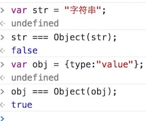

# 一、概述

  在JavaScript中，所谓字符串就是包含在英文“**双引号**”或‘**单引号**’中的内容，可以是数字、运算符号、各国语言、特殊编码字符，甚至还能是HTML的标签。也就是说，只要符合在“双引号”或‘单引号’中这个要求，计算机文本中的内容基本上都可以成为一个字符串，ES6引入了模板字符串，使用反引号（**`**）标识。

  获取一个字符串的途径非常多，特别是在进行表单操作的的时候，通过表单输入框，无论表单类型，哪怕是在输入一个纯数字的时候，得到的都是一个字符串。还有通过JavaScript获取DOM元素节点中文本的 `innerText` 和 `textContent` 属性得到的字符也是一个字符串。

  我们先来看从一系列的表单元素中获取到的值的数据类型的例子：

```html
<!-- HTML 部分 -->
<form>
	<input type="text" value="Henrry Lee">
	<input type="password" value="123">
	<input type="email" value="lihy_online@163.com">
	<input type="search" value="123">
	<input type="date" value="1993-07-16">
	<input type="number" value="123">
	<input type="tel" value="123">
	<input type="range" value="123">
	<input type="color" value="#008800">
</form>

<!-- JavaScript 部分 -->
<script type="text/javascript">
    // DOM操作，获取所有标签名为input的节点，返回NodeList;
	let elements = document.getElementsByTagName('input');
	// 获取数组长度
	let length = elements.length;
	// 遍历inputs
	for (let i = 0; i < length; i++) {
		let type = elements[i].type;
		let value = elements[i].value;
		// 在控制台输出type的类型与数据的类型
		console.log(`类型为：${type}，数据类型为：${typeof(getValue)}`);
	} 
</script>
```

  打开浏览器控制台后，得到的结果为：


  再来看一个通过innerText属性和textContent属性获取到的文本内容的数据类型的例子：

```html
<p>文本段落</p>
<p>123456789</p>

<script type="text/javascript">
	var elements = document.getElementsByTagName('p');
	for (var i = 0; i < elements.length; i++) {
		let element = elements[i];
		let innerText = element.innerText;
		let textContent = element.textContent;

		console.log("--------------------------------------------------------")
		console.log(`段落${(i + 1)}通过innerText获取到的文本内容是：${innerText}`);
		console.log(`段落${(i + 1)}内容的数据类型为：${typeof(innerText)}`);
		console.log(`段落${(i + 1)}通过textContent获取到的文本内容是：${textContent}`);
		console.log(`段落${(i + 1)}内容的数据类型为：${typeof(textContent)}`);
		console.log("--------------------------------------------------------")
	}
</script>
```

  打开浏览器控制台后，得到的结果为：


# 二、字符串引号使用规则

  在使用字符串的引号时需要注意，如果一个字符串已经使用过引号，若再在字符串内使用引号需要使用另外一个引号。即双引号内使用单引号，单引号内使用双引号，或者使用转义符 `\` 对同样的引号进行转换，多层引号嵌套，该规则同样适用，如：

```javascript
var x = "Hello, I'm Petter!";
var y = 'How do you think about "JavaScript"?';
var z = "设置字体的'颜色'代码是：<p style=\"color:red;\">";	
```

  需要了解的一个字符串常识就是，字符串不能直接分成多行去写，否则浏览器会报错。如果字符串过长，需要进行换行使视觉层次上更加地清晰，那需要这样去写：

```javascript
let str = "这是一个" + 
          "分行写的" +
          "字符串";
console.log(str); // 输出：这是一个分行写的字符串
```

# 三、模板字符串

  ES6引入了模板字符，模板字符串（template string）是增强版的字符串，用反引号（\`）标识。它可以当作普通字符串使用，也可以用来定义多行字符串，或者在字符串中通过 `${}` 嵌入变量。

```javascript
// 1、普通字符串
let str_1 = `Hello, world!`;

// 2、多行字符串
let str_2 = `Hey, girl,
             what are you doing now?`;

// 3、字符串中嵌入变量
let name = `Henrry Lee`;
let str_3 = `Hello, ${name}, where are you?`
```

> 提示：
>
> 1、如果在模板字符串中需要使用反引号，则前面要用反斜杠转义。
>
> 2、如果使用模板字符串表示多行字符串，所有的空格和缩进都会被保留在输出之中。
>
> 3、${} 中可以是一个变量、表达式、对象属性，甚至可以调用函数。

  模板字符串在写入HTML时非常方便，以往写入HTML文档的方式如下：

```html
<!-- HTML 部分 -->
<div id="wrap"></div>

<!-- JavaScript 部分 -->
<script type="text/javascript">

	let oWrap = document.getElementById('wrap');
	let name = `Henrry Lee`, age = 24, province = `SiChuan`, city = `ChengDu`;
	oWrap.innerHTML = 
	           'That\'s <b>' + name + '</b> ' +
	           'and He is ' + age + ' years old this year, ' +
	           'He from ' + city + ' in ' + province + ' province.';
</script>
```

  上面这种写法相当繁琐不方便，ES6引入了模板字符串解决这个问题。

```javascript
oWrap.innerHTML = `That\'s <b>${name}</b> and He is ${age} years old this year, He from ${city} in ${province} province.`;
```

# 四、字符串与Unicode

  反斜杠 `\` 在字符串中有特殊用途，用来表示一些特殊的字符，所以又称 **转义操作符**（简称：转义符），以下是一些常用转义符的表示法：（小括号中的值表示法为**Unicode**）

```javascript
\0（或：\u0000）用于表示：null

\b（或：\u0008）用于表示：后退键

\f（或：\u000C）用于表示：换页符

\n（或：\u000A）用于表示：换行符

\r（或：\u000D）用于表示：回车键

\t（或：\u0009）用于表示：制表符

\v（或：\u000B）用于表示：垂直制表符

\'（或：\u0027）用于表示：单引号

\"（或：\u0022）用于表示：双引号

\ （或：\u005C）用于表示：反斜杠
```

  当然，转义符远不止上面列出的这些，每个Unicode码都有各自对应的字符，如 `\251`（八进制表示法）、`\xA9`（十六进制两位表示法）和 `\u00A9`（十六进制四位表示法）就是用于输出版权符号“©”的，HTML你也可以使用 `&copy`。需要注意的是转义符本身也是字符串，在使用的时候也需要加上英文的引号。


  另外，在“非特殊”字符前面加上转义符“\”，那“\”会被省略掉，如果需要输出“\”，那就需要写成双斜杠“\ \”的形式。如：


  在JavaScript引擎内部，所有字符都用Unicode表示，它不仅以Unicode储存字符，还允许直接在程序中使用Unicode编号表示字符。解析代码的时候，JavaScript会自动识别一个字符是字面形式表示，还是Unicode形式表示。输出给用户的时候，所有字符都会转成字面形式。其实也就是说，任何JavaScript中允许的字符都是可以通过Unicode来表示的。


  如果是想将一个现成的字符转换为十六进制的Unicode的话，需要通过 `str.charCodeAt()`（这里的“str”表示原字符串）方法获取字符串需要转换字符的下标索引来转换为一个数字编码值。这个时候再通过字符串的原型方法“**toString(16)**”将刚才得到的数字编码值转化为一个十六进制的字符，并在这个十六进制的字符的前面拼接上“**\u**”，就可以得到一个十六进制表示法的Unicode了。

```javascript
/**
 * 功能：将字符串转为Unicode
 * 参数：字符串的下标索引
 */

var str = "这是一个字符串";

function toUnicode(str, idx) {
	var unitStr;
	unitStr = str.charCodeAt(idx);
	unitStr = unitStr.toString(16);
	unitStr = "\\u" + unitStr;
	return unitStr;
}

console.log(toUnicode(str, 0)); // \u8fd9 "这"
console.log(toUnicode(str, 1)); // \u662f "是"
console.log(toUnicode(str, 2)); // \u4e00 "一"
console.log(toUnicode(str, 3)); // \u4e2a "个"
console.log(toUnicode(str, 4)); // \u5b57 "字"
console.log(toUnicode(str, 5)); // \u7b26 "符"
console.log(toUnicode(str, 6)); // \u4e32 "串"

/**
 * 函数封装：将字符串转为Unicode编码
 */
Object.prototype.toUnicodeString = function(str) {
	var s = str || this.valueOf() ;
	var numCode = ``;
	var resStr = ``;
	for (var i = 0; i < s.length; i++) {
		numCode = s.charCodeAt(i);
		numCode = numCode.toString(16);
		numCode = '\\u' + numCode;
		resStr += numCode;
	}
	return resStr;	
}

`王者荣耀`.toUnicodeString() // "\u738b\u8005\u8363\u8000"
```

  另外，我们还可以利用字符串原型的方法：`String.fromCharCode(numCode)`（这里的“numCode”为转换出的数字编码），又重新转换为原来的字符串：

```javascript
// 将字符串转换成对应的数字编码输出，再转换回去并你会该值；
var str = "这是字符串";
function getNumberCodeToOrgStr() {
	// 获取字符串中每个字符对应的数值编码
	var numCode1 = str.charCodeAt(0),
		numCode2 = str.charCodeAt(1),
		numCode3 = str.charCodeAt(2),
		numCode4 = str.charCodeAt(3),
		numCode5 = str.charCodeAt(4);
	// 拼接获取到的字符编码
	var numCodeStr = "";
	numCodeStr += numCode1 + ", ";
	numCodeStr += numCode2 + ", ";
	numCodeStr += numCode3 + ", ";
	numCodeStr += numCode4 + ", ";
	numCodeStr += numCode5 + ", ";
	// 在控制台输出字符编码
	console.log(numCodeStr);

	// 将数值编码转换为原来的字符
	var orgStr1 = String.fromCharCode(numCode1),
		orgStr2 = String.fromCharCode(numCode2),
		orgStr3 = String.fromCharCode(numCode3),
		orgStr4 = String.fromCharCode(numCode4),
		orgStr5 = String.fromCharCode(numCode5);
	// 打印字符串拼接后的结果
	console.log(orgStr1 + orgStr2 + orgStr3 + orgStr4 + orgStr5);
}
// 调用函数
getNumberCodeToOrgStr()
```

  在控制台调用该函数得到的结果为：


  我们还需要知道，每个字符在JavaScript内部都是以16位（即2个字节）的UTF-16格式储存。也就是说，JavaScript的单位字符长度固定为16位长度，即2个字节。

# 五、字符串与数组

  通过上一节中学习的内容可以发现 `parseInt()` 和 `parseFloat()` 方法可以将字符串转换为数值，同时也能对数组元素中的第一个元素进行数值转化。这说明在某种程度上，字符串和数组是有一点联系的。实际上，数组拥有的很多属性，字符串也同样具备。来看这样一个控制台输出例子：


  通过上例可以清晰地发现，字符串和数组是何等的相似。实际上，数组和字符串是可以互相转换的，这就需要用到两个方法：`split()` 和 `join()`：


  从上例可以分析出 `split()` 方法可以将一个字符串转换为一个数组，若添加一个用引号引起来的参数，得出的数组就会以该参数进行分割（上例中使用的是“***,***”作为参数，用其它字符作为参数同样可行），若所给参数是一个空引号""，则形成的数组会合并为一个数组元素项。

  同样的，`join()` 方法是将一个数组元素转换为一个字符串，根据给出的参数对结果中的字符串进行分割，或者不进行分割。当然，这两个方法也可以不给出参数，用它们内置的默认值进行处理，如：


  直接用索引下标（`str[index]`）访问一个字符串的方式，是在ECMAScript第3版中新增的方式，对IE8之前的浏览器是不支持的，如果要兼容老版本浏览器建议使用 `charAt()` 这个方法。除了浏览器兼容性的区别外，这两个方法还有一个区别就是，直接使用字符串索引的方法去查找一个不存在的字符返回的是*dundefined*，而通过 `charAt()` 方法得到的是一个空字符串（很多时候我们更希望出现这个结果）。


  ES6为字符串添加了遍历器接口，使得字符串可以被 `for...of` 循环遍历。

```javascript
for(let ch of `China`) {
    console.log(ch);
}
// C
// h
// i
// n
// a
```

# 六、字符串包装对象

  在 JavaScript中“**对象**”主要分为两大类，一类称作“**包装对象**”，一类称作“**内置对象**”。从编码角度讲，它们的区别是在使用了 `Object()` 方法后是否还“全等于（`===`）自身，若不等于自身，那就是一个“**包装对象**”；若等于自身，那就是一个“**内置对象**”，具体内容我们会在“JavaScript对象”一章中进行详细讲解。



  字符串是JavaScript原生提供的三个包装对象之一，用来生成字符串的包装对象。既然作为对象的字符串肯定就有自己的方法。如 `valueOf()` 方法就是用于返回对象所包装的那个字符串。字符串的包装对象是一个类似数组的对象（但仍然不是数组）。


  上面提到了，只要是对象，就有自己的特定的方法，有些方法是所有对象公有的，有些方法是该类对象私有的。共有的方法无论是“包装对象”还是“内置对象”都可以使用，而私有的方法，只有指定类型的对象可以使用（有的方法可以有两种或以上的数据类型可以使用，如后面会讲到的 `concat()` 等方法）。

# 七、字符串对象方法

## 1、定义字符串

```javascript
let str = "Hello, world!";
let str = 'Hello, world!';

let str = "This is a 'Pen'.";
let str = 'This is a "Pen".';

let str = "This is a \'Pen\'.";
let str = 'This is a \"Pen\".';

let str = "Long\
           long\
           long string.";

let str = new String("Hi!");
let str = new Object("Hi!"); // typeof(str); 输出类型为object，其他方式输出类型为string；

let str = `Hello, world!`;
```

## 2、字符串长度

  **length**属性，用于返回字符串长度。

```javascript
var str = "China!";
str.length; // 6
```

## 3、字符串查询

### 1）、charAt()

  **charAt** 方法返回指定位置的字符，参数是从**0**开始编号的下标。其语法形式为：`charAt(idx)`

```javascript
var s = new String("abc");
s.charAt(0); // a
s.charAt(s.length - 1); // c

// 使用数组的下标语法
s.charAt(0); // a
s[0]; // a

// 如果参数为负数，或大于等于字符串的长度，charAt返回空字符串。
s.charAt(-1); // ""
s.charAt(10); // ""
```

### 2）、indexOf() 、 lastIndexOf()

  这两个方法用于确定一个字符串在另一个字符串中的位置，返回一个整数，表示匹配开始的位置。如果返回`-1`，就表示不匹配。两者的区别在于，**indexOf**从字符串头部开始匹配，**lastIndexOf**从尾部开始匹配。

```javascript
'hello world'.indexOf('e') // 1

'JavaScript'.indexOf('script') // -1

'hello world'.lastIndexOf('o') // 7
```

  它们还可以接受第二个参数，对于**indexOf**方法，第二个参数表示从该位置开始向后匹配；对于**lastIndexOf**，第二个参数表示从该位置起向前匹配。

```javascript
'hello world'.indexOf('o', 6) // 7
'hello world'.lastIndexOf('o', 6) // 4
```

### 3）、includes()、startsWith()、endsWith()

  传统上，JavaScript只有*indexOf*方法，可以用来确定一个字符串是否包含在另一个字符串中。ES6又提供了三种新方法。

- **includes()**：返回布尔值，表示是否找到了参数字符串。
- **startsWith()**：返回布尔值，表示参数字符串是否在源字符串的头部。
- **endsWith()**：返回布尔值，表示参数字符串是否在源字符串的尾部。

```javascript
let webNet = `https://www.baidu.com`;

console.log(webNet.includes(`baidu`));   // true
console.log(webNet.startsWith(`https`)); // true
console.log(webNet.endsWith(`com`));  // true
```

  这三个方法也可以接受第二个参数表示开始搜索的位置。

> 注意：使用第二个参数`n`时，**endsWith** 的行为与其他两个方法有所不同。它针对前`n`个字符，而其他两个方法针对从第`n`个位置直到字符串结束。

### 4）、match()

  `match` 方法用于字符串查询，如果没有找到，则返回**null**，如果找到，返回一个数组。

```
var str = "abc";

str.match("ab"); // ["ab"]
str.match("ac"); // null
```

### 5）、search()

  ***search***方法的用法等同于***match***，但是返回值为匹配到的第一个位置。如果没有找到匹配，则返回***-1***。

```
var str = "Hello, china!";

str.search("china"); // 7
str.search("world"); // -1
```

## 4、charCodeAt()

  ***charCodeAt***方法返回给定位置字符的Unicode码点（十进制表示），相当于***String.fromCharCode()***的逆操作。

```javascript
// b 的Unicode码点为98
"abc".charCodeAt(1); // 98

// 如果没有任何参数，charCodeAt返回首字符的Unicode码点。
"abc".charCodeAt(0); // 97
```

> tips：***charCodeAt***方法返回的Unicode码点不大于65536（0xFFFF），也就是说，只返回两个字节的字符的码点。如果遇到Unicode码点大于65536的字符，必需连续使用两次***charCodeAt***，不仅读入***charCodeAt(i)***，还要读入***charCodeAt(i+1)***，将两个16字节放在一起，才能得到准确的字符。如果参数为负数，或大于等于字符串的长度，***charCodeAt***返回***NaN***。

## 5、String.fromCharCode()

  String对象提供的静态方法（即定义在对象本身，而不是定义在对象实例的方法），主要是***fromCharCode()***。该方法的参数是一系列Unicode码点，返回对应的字符串。

```javascript
// 1、fromCharCode方法接受1个Unicode码点作为参数，返回它们组成的字符串。
String.fromCharCode(97); // a

// 2、fromCharCode方法接受5个Unicode码点作为参数，返回它们组成的字符串。
String.fromCharCode(104, 101, 108, 108, 111); // hello

```

> 注意，该方法不支持Unicode码点大于***0xFFFF***的字符，即传入的参数不能大于***0xFFFF***。

```javascript
String.fromCharCode(0x20BB7); // "ஷ"
```

  上面代码返回字符的编号是***0x0BB7***，而不是***0x20BB7***。它的根本原因在于，码点大于***0xFFFF***的字符占用四个字节，而JavaScript只支持两个字节的字符。这种情况下，必须把***0x20BB7***拆成两个字符表示。

```javascript
String.fromCharCode(0xD842, 0xDFB7) // "𠮷"
```

  上面代码中，***0x20BB7***拆成两个字符***0xD842***和***0xDFB7***（即两个两字节字符，合成一个四字节字符），就能得到正确的结果。码点大于***0xFFFF***的字符的四字节表示法，由UTF-16编码方法决定。

## 6、字符串拼接

  ***concat***方法用于连接两个字符串，返回一个新字符串，不改变原字符串。其语法形式为：***concat(str1, str2, str3...)***.

```javascript
let s1 = 'a', s2 = 'b';
s1.concat(s2); // "ab"

let s3 = 'c';
s1.concat(s2, s3); // "abc"
```

> tips：如果参数不是字符串，***concat***方法会将其先转为字符串，然后再连接。

  拼接字符串，也可以使用`+`号。

```javascript
let str1 = 'Hello, ';
let str2 = 'China!';
let str3 = str1 + str2; // "Hello, China!";
```

  当然，你也可以使用字符串模板拼接。

```javascript
let str1 = 'Hello, ';
let str2 = 'China!';
let str3 = `${str1}${str2}`;
```

## 7、字符串截取

### 1）、slice()

  ***slice***方法用于字符串截取，其语法形式为：***slice(start, end)***.

  它的第一个参数是开始位置，第二个参数是结束位置（不含该位置）。

```javascript
'JavaScript'.slice(0, 4) // "Java"
```

  如果省略第二个参数，则表示从指定位置开始截取到末尾。

```javascript
'JavaScript'.slice(4) // "Script"
```

  如果参数是负值，表示从结尾开始倒数计算的位置，即该负值加上字符串长度。

```javascript
'JavaScript'.slice(-6) // "Script"
'JavaScript'.slice(0, -6) // "Java"
'JavaScript'.slice(-2, -1) // "p"
```

  如果第一个参数大于第二个参数， ***slice***方法返回一个空字符串。

```javascript
'JavaScript'.slice(2, 1) // ""
```

### 2）、subString()

  ***substring***方法用于字符串截取，不改变原字符串。它与***slice***作用相同，使用方法类似，但有一些奇怪的规则，因此不建议使用这个方法，优先使用***slice***。其语法形式为：***subString(start, end)***

  它的第一个参数是开始位置，第二个参数是结束位置（不含该位置）。

```javascript
'JavaScript'.substring(0, 4) // "Java"
```

  如果省略第二个参数，则表示从指定位置开始截取到末尾。

```javascript
'JavaScript'.substring(4) // "Script"
```

 如果第二个参数大于第一个参数，***substring***方法会自动更换两个参数的位置。

```javascript
'JavaScript'.substring(10, 4) // "Script"
// 等同于
'JavaScript'.substring(4, 10) // "Script"
```

  如果参数是负数，***substring***方法会自动将负数转为0。

```javascript
'Javascript'.substring(-3) // "JavaScript"
'JavaScript'.substring(4, -3) // "Java"
```

### 3）、substr()

  ***substr***方法用于字符串截取，不改变原字符串。其语法形式为：***subStr(start, end)***

  它的第一个参数是开始位置，第二个参数是结束位置（不含该位置）。

```javascript
'JavaScript'.substr(4, 6) // "Script"
```

  如果省略第二个参数，则表示子字符串一直到原字符串的结束。

```javascript
'JavaScript'.substr(4) // "Script"
```

  如果第一个参数是负数，表示倒数计算的字符位置。如果第二个参数是负数，将被自动转为0，因此会返回空字符串。

```javascript
'JavaScript'.substr(-6) // "Script"
'JavaScript'.substr(4, -1) // ""
```

> 提示：字符串截取优先使用 ***slice*** 方法。

## 8、字符串去除空格

  ***trim***方法用于去除字符串两端的空格，返回一个新字符串，不改变原字符串。该方法去除的不仅是空格，还包括制表符（`\t`、`\v`）、换行符（`\n`）和回车符（`\r`）。

```javascript
'  hello world  '.trim()
// "hello world"
```

## 9、字符串大小写转换

  ***toLowerCase***方法用于将一个字符串全部转为小写，***toUpperCase***则是全部转为大写。它们都返回一个新字符串，不改变原字符串。

```javascript
'Hello World'.toLowerCase()
// "hello world"

'Hello World'.toUpperCase()
// "HELLO WORLD"
```

  这个方法也可以将布尔值或数组转为大写字符串，但是需要通过***call***方法使用。

```javascript
String.prototype.toUpperCase.call(true)
// 'TRUE'
String.prototype.toUpperCase.call(['a', 'b', 'c'])
// 'A,B,C'
```

## 10、字符串比较

  ***localeCompare***方法用于比较两个字符串。它返回一个整数，如果小于0，表示第一个字符串小于第二个字符串；如果等于0，表示两者相等；如果大于0，表示第一个字符串大于第二个字符串。其语法形式为：***localeCompare(otherStr)***

```
'apple'.localeCompare('banana')
// -1

'apple'.localeCompare('apple')
// 0
```

  该方法比较是根据ASCII码点比较，大写英文字母小于小写英文字母，具体可参考：[ASCII码参考表](http://ascii.911cha.com/)

```javascript
'B' > 'a' // false
```

## 11、字符串替换

  ***replace***方法用于字符串替换，其语法形式为：***replace(search, replacement)***

```javascript
var str = "Hello, world!";
str.replace("world", "china"); // "Hello, china!"
```

## 12、将字符串切割为数组

  ***split***方法将一个字符串根据某个字符串切割为数组，其语法形式为：***split(str)***

```javascript
var str = "HTML,CSS,JavaScript";
str.split(","); // ["HTML","CSS","JavaScript"]
```

## 13、重复字符串

  ***repeat***方法返回一个新字符串，表示将原字符串重复`n`次。

```javascript
let s = 'a';
console.log(s.repeat(3)); // aaa
```

# 八、Base64转码

  Base64是一种编码方法，可以将任意字符转成可打印字符。这种编码方法，一开始的作用是为了不显示特殊字符，简化程序的处理。但因为这种编码方式比较复杂，现在使用JavaScript的开发者都少有涉及这种编码方式，所以更多时候都将其作为一种加密手段在使用。该编码提供两个方法来转换字符：

- **btoa()**

  将字符串或二进制值转为Base64编码

- **atob()**

  将Base64编码转为原来的编码

  我们先来看一个将普通字符串转换为Base64格式编码，再将该格式转换为普通字符串在控制台中输出的例子：


  可以从示例中的前两个结果很直观的发现，我们首先是用btoa()将一串普通的字符串“Hello, world!”转换成为了Base64码“YXVsZW5jZQ==”，然后我们将得出的Base64码通过atob()方法将得到的Base64码再次成功地转换成为了普通的字符串“Hello, world!”。示例中的后两个结果我们是对二进制数“0b1001”进行了相同方式的转换，最后得到字符串“9”（若用parseInt(0b1001)，得出的结果为数字9，而不是字符串“9”）。可见这两种方法是可以将字符串和Base64码在两种格式之间互相转换的，但是要注意的是，通过atob()这种方法是不能还原出数值型的值的，这为我们拼接密码字符串提供了便利（因为“+”运算符只能做拼接运算了）。但在模型情况下需要得出的结果是一个数值型的值，那就得用“数值的转换”提供的三种方法来进行转换了。

  但是在使用这两个方法的时候需要注意的是，这两个方法不支持对***非ASC II字符***转换为Base64码，否则在浏览器中会报错。如果要对非ASC II的字符进行Base64转码，需要用到两个对URI组件编码的函数：“encodeURIComponent()”函数和“decodeURIComponent()”函数，前者能将字符串作为 URI 组件进行编码，后者能将encodeURIComponent() 函数编码的 URI 进行解码。如例：


  利用这个原理，就可以将非ASC II的稍微重要的机密字符串进行这样简单的加密传输，在传输的终端再进行一次解密。这样的方式对于熟悉计算机底层语言的黑客来说也许算不上什么高级手段，但对于一般用户和普通开发人员而言，这样的加密手段肯定是会让他们摸不着北的。但是，稍微高级一点的加密算法通常都不是用一两种编码转换或者几种二进制运算的方式来编写的，这些高级加密算法非常之复杂，令很多从事黑客技术多年的人都“望而生怯”。

  作为一个前端开发者，也许掌握那些高级加密手段一时间没有什么用。但在现在的用户体验设计主流思维方向都在追求着一种便捷性、易用性、效率性，哪怕曾经对安全要求特别高的金融行业、金融软件在现今都让“6位纯数字密码”取代了之前强制要求的“数字+字母组合密码”，类似微信支付、京东支付等这些金融类或电子商务类的App（Application，现在在计算机术语中通常指“移动端的应用软件”）甚至出现了免密支付。这和曾经要求类似“密码至少要求8位，需要以英文字母+数字+符号组成”这样的要求“背道而驰”了，这让很多用户反而对密码的安全产生了顾虑。

  其实针对这个问题大可不必有太多顾虑，因为现在的支付平台都提供了在线冻结支付相关的功能，只要一个电话核对用户相关的信息，只要基本能符合（不要求所有问题都能答得上）即可冻结支付的账户，这为手机不小心遗失提供了一个安全的便捷保障。如果手机还在你手里那就更不用担心了，因为现在的支付平台都是和设备绑定的，也就是同样一个密码只能在同一台设备上进行使用，如果要使用另外一台设备上使用，或者是IP段于原设备不符，都是需要提供绑定设备提供的短信验证码的。所以，就算是支付密码被别人知道了，他们拿去也是什么事也干不了的。而且现在的“6位数字密码”的键盘在绝大部分App上都并非是手机上提供的“原生”数字键盘，而是程序员“自己做”的，这样一来木马程序就无法获取到用户通过键盘输入使产生的“*键值*”，也就无法直接地获知用户到底输入的是什么，甚至根本就不认为用户正在进行着输入的行为，截获用户输入就更无从谈起了。