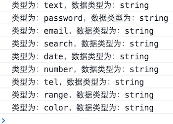
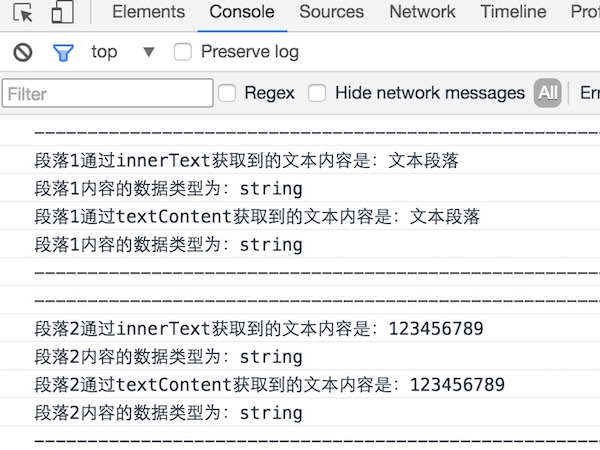
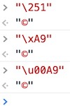
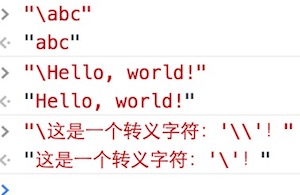
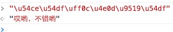
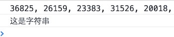
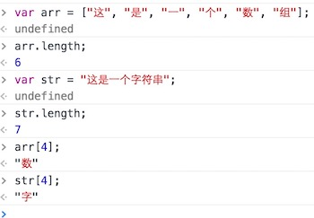
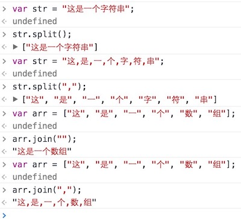
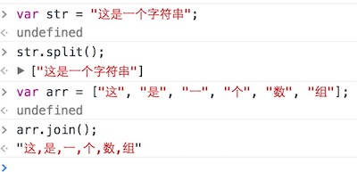
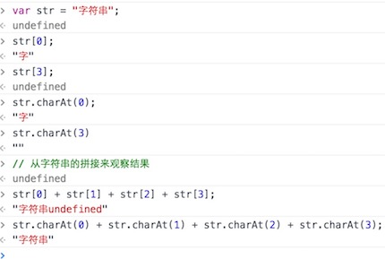

# 一、概述

  在JavaScript中，所谓的字符串就是包含在英文“***双引号***”或‘***单引号***’中的内容，可以是数字、运算符号、各国语言、特殊编码字符，甚至还能是HTML的标签。也就是说，只要符合在“双引号”或‘单引号’中这个要求，计算机文本中的内容基本上都可以成为一个字符串。

  获取一个字符串的途径非常多，特别是在进行表单操作的的时候，通过表单输入框（包括input标签的type属性为text、password、number、email、tel、date等的时候），哪怕是在输入一个纯数字的时候，得到的都是一个字符串。还有通过JS获取DOM元素节点中文本的***innerText***和***textContent***属性得到的字符也是一个字符串。

  我们先来看从一系列的表单元素中获取到的值的数据类型的例子：

```html
<form>
	<input type="text" value="123">
	<input type="password" value="123">
	<input type="email" value="123@qq.com">
	<input type="search" value="123">
	<input type="date" value="1993-07-16">
	<input type="number" value="123">
	<input type="tel" value="123">
	<input type="range" value="123">
	<input type="color" value="#008800">
</form>
<!-- js -->
<script type="text/javascript">
    // DOM操作，获取所有标签名为input的节点，返回数组;
	var elements = document.getElementsByTagName('input');
	// 获取数组长度
	var length = elements.length;
	// 遍历inputs
	for (var i = 0; i < length; i++) {
		var getType = elements[i].type;
		var getValue = elements[i].value;
		// 在控制台输出type的类型与数据的类型
		console.log("类型为：" + getType + "，数据类型为：" + typeof(getValue));
	}
</script>
```

  打开浏览器控制台后，得到的结果为：



  再来看一个通过innerText属性和textContent属性获取到的文本内容的数据类型的例子：

```html
<p>文本段落</p>
<p>123456789</p>

<script type="text/javascript">
	var elements = document.getElementsByTagName('p');
	for (var i = 0; i < elements.length; i++) {

		var element = elements[i];
		var innerText = element.innerText;
		var textContent = element.textContent;

		console.log("--------------------------------------------------------")
		console.log("段落" + (i + 1) + "通过innerText获取到的文本内容是：" + innerText);
		console.log("段落" + (i + 1) + "内容的数据类型为：" + typeof(innerText));
		console.log("段落" + (i + 1) + "通过textContent获取到的文本内容是：" + textContent);
		console.log("段落" + (i + 1) + "内容的数据类型为：" + typeof(textContent));
		console.log("--------------------------------------------------------")
	}
</script>
```

  打开浏览器控制台后，得到的结果为：



# 二、字符串引号使用规则

  在使用字符串的引号时需要注意，如果一个字符串已经使用过引号，若需要再在字符串内使用引号需要使用另外一个引号，即双引号内使用单引号，单引号内使用双引号，或者使用***转义符“\”***对同样的引号进行转换，多层引号嵌套，该规则同样适用，如：

```javascript
var x = "Hello, I'm Petter!";
var y = 'How do you think about "JavaScript"?';
var z = "设置字体的'颜色'代码是：<p style=\"color:red;\">";
```

  需要了解的一个字符串的常识就是，字符串不能直接分成多行去写，否则浏览器会报错。但如果，每行都加上完整的引号，返回的值又只会有最后一个字符串，不能获取到完整的字符串。如果字符串过长，需要进行换行使视觉层次上更加地清晰，那需要这样去写：

```javascript
var x = "这是一个\
         分行写的\
         字符串";
console.log(x); // 输出：这是一个分行写的字符串

// 或者，你还可以这样写
var x = "这是一个" + 
        "分行写的" +
        "字符串";
console.log(x); // 输出：这是一个分行写的字符串
```

  如果使用上例中的“`\`”进行字符串的分行需要特别注意的是，在“`\`”后除了换行符之外不能加上任何符号，包括空格，否则浏览器会报出“无效或意外的标记（Invalid or unexpected token）”的错误。考虑到这一点，实际程序中更多地是使用字符串拼接符“`+`”来拼接字符串，一来可以避免“`\`”产生的歧义（因为它是一个转义操作符），二来也不用小心翼翼地防止出现“习惯性空格”带来的错误。

# 三、字符串与Unicode

  反斜杠“`\`”在字符串中有特殊用途，用来表示一些特殊的字符，所以又称***转义操作符***（简称：转义符），以下是一些常用转义符的表示法：（小括号中的值表示法为***Unicode***）

```
\0（或：\u0000）用于表示：null
\b（或：\u0008）用于表示：后退键
\f（或：\u000C）用于表示：换页符
\n（或：\u000A）用于表示：换行符
\r（或：\u000D）用于表示：回车键
\t（或：\u0009）用于表示：制表符
\v（或：\u000B）用于表示：垂直制表符
\'（或：\u0027）用于表示：单引号
\"（或：\u0022）用于表示：双引号
\ （或：\u005C）用于表示：反斜杠
```


  当然，转义符远不止上面列出的这些，每个Unicode码都有各自对应的字符，如“***\251***”（八进制表示法）、“***\xA9***”（十六进制两位表示法）和“***\u00A9***”（十六进制四位表示法）就是用于输出版权符号“©”的（在HTML中表示版权符号的是“©”）。需要注意的是转义符本身也是字符串，在使用的时候也需要加上英文的引号。



  另外，在“非特殊”字符前面加上转义符“\”，那“\”会被省略掉，如果需要输出“\”，那就需要写成双斜杠“\ \”的形式。但是要特别注意那些有实际作用的转义符对输出内容的影响，如：



  在JavaScript引擎内部，所有字符都用Unicode表示，它不仅以Unicode储存字符，还允许直接在程序中使用Unicode编号表示字符。解析代码的时候，JavaScript会自动识别一个字符是字面形式表示，还是Unicode形式表示。输出给用户的时候，所有字符都会转成字面形式。其实也就是说，任何JavaScript中允许的字符都是可以通过Unicode来表示的。



  如果是想将一个现成的字符转换为十六进制的Unicode的话，需要通过***str.charCodeAt()***（这里的“str”表示原字符串）方法获取字符串需要转换字符的下标索引来转换为一个数字编码值。这个时候再通过字符串的原型方法“**toString(16)**”将刚才得到的数字编码值转化为一个十六进制的字符，并在这个十六进制的字符的前面拼接上“***\u***”，就可以得到一个十六进制表示法的Unicode了。

```javascript
/**
 * 功能：将字符串转为Unicode
 * 参数：字符串的下标索引
 */

var str = "这是一个字符串";
function toUnicode(str, idx) {
	var unitStr;
	unitStr = str.charCodeAt(idx);
	unitStr = unitStr.toString(16);
	unitStr = "\\u" + unitStr;
	return unitStr;
}
console.log(toUnicode(str, 0)); // \u8fd9 "这"
console.log(toUnicode(str, 1)); // \u662f "是"
console.log(toUnicode(str, 2)); // \u4e00 "一"
console.log(toUnicode(str, 3)); // \u4e2a "个"
console.log(toUnicode(str, 4)); // \u5b57 "字"
console.log(toUnicode(str, 5)); // \u7b26 "符"
console.log(toUnicode(str, 6)); // \u4e32 "串"
```

  另外，我们还可以利用字符串原型的方法：***String.fromCharCode(numCode)***（这里的“numCode”为转换出的数字编码，使用“***str.charCodeAt()***”得出数字编码结果），又从新转换为原来的字符串：

```javascript
// 将字符串转换成对应的数字编码输出，再转换回去并你会该值；
var str = "这是字符串";
function getNumberCodeToOrgStr() {
	// 获取字符串中每个字符对应的数值编码
	var numCode1 = str.charCodeAt(0),
		numCode2 = str.charCodeAt(1),
		numCode3 = str.charCodeAt(2),
		numCode4 = str.charCodeAt(3),
		numCode5 = str.charCodeAt(4);
	// 拼接获取到的字符编码
	var numCodeStr = "";
	numCodeStr += numCode1 + ", ";
	numCodeStr += numCode2 + ", ";
	numCodeStr += numCode3 + ", ";
	numCodeStr += numCode4 + ", ";
	numCodeStr += numCode5 + ", ";
	// 在控制台输出字符编码
	console.log(numCodeStr);

	// 将数值编码转换为原来的字符
	var orgStr1 = String.fromCharCode(numCode1),
		orgStr2 = String.fromCharCode(numCode2),
		orgStr3 = String.fromCharCode(numCode3),
		orgStr4 = String.fromCharCode(numCode4),
		orgStr5 = String.fromCharCode(numCode5);
	// 打印字符串拼接后的结果
	console.log(orgStr1 + orgStr2 + orgStr3 + orgStr4 + orgStr5);
}
// 调用函数
getNumberCodeToOrgStr()
```

  在控制台调用该函数得到的结果为：



  我们还需要知道，每个字符在JavaScript内部都是以16位（即2个字节）的UTF-16格式储存。也就是说，JavaScript的单位字符长度固定为16位长度，即2个字节。

# 四、字符串与数组

  通过上一节中学习的内容可以发现“***parseInt()***”和“***parseFloat()***”方法可以将字符串转换为数值，同时也能对数组元素中的第一个元素进行数值转化。这说明在某种程度上，字符串和数组是有一点联系的。实际上，数组拥有的很多属性，字符串也同样具备。来看这样一个控制台输出例子：



  通过上例可以清晰地发现，字符串和数组是何等的相似。实际上，数组和字符串是可以互相转换的，这就需要用到两个方法：“***split()***”和“ ***join()***”：



  从上例可以分析出“***split()***”方法可以将一个字符串转换为一个数组，若添加一个用引号引起来的参数，得出的数组就会以该参数进行分割（上例中使用的是“***,***”作为参数，用其它字符作为参数同样可行），若所给参数是一个空引号""，则形成的数组会合并为一个数组元素项。

  同样的，“***join()***”方法是将一个数组元素转换为一个字符串，根据给出的参数对结果中的字符串进行分割，或者不进行分割。当然，这两个方法也可以不给出参数，用它们内置的默认值进行处理，如：



  直接用索引下标（***str[index]***）访问一个字符串的方式，是在ECMAScript第3版中新增的方式，对IE8之前的浏览器是不支持的，如果要兼容老版本浏览器建议使用***charAt()***这个方法。除了浏览器兼容性的区别外，这两个方法还有一个区别就是，直接使用字符串索引的方法去查找一个不存在的字符返回的是*dundefined*，而通过***charAt()***方法得到的是一个空字符串（很多时候我们更希望出现这个结果）。

