# 一、概述

  数组是有序排列的一组值的集合，这些值被包含在一对方括号内，里面的这些值称作数组元素、数组项、数组成员等。每个数组内的值都会有一个“键名”，这些键名其实就是一个从0开始依次计数的***下标***，每个数组都会有一个“***length***”属性，表示数组元素的个数，所以数组内元素最大的下标值应该是***“length - 1”***。

  数组内的值可以是JavaScript允许的任何类型的值，甚至可以是数组自身，像这样数组内包含另外一个数组的数组被称作*“二维数组”*，如果数组内的数组任然继续包含数组，这样的数组就会形成“多维数组”。数组的基本表现形式如下：

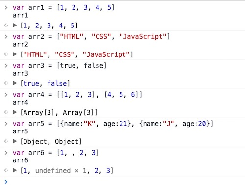

  数组虽然有很多独立的特性，但它的数据类型仍然为对象型（object），它仍旧具有对象的诸多特点：

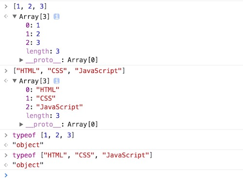

# 二、创建数组

```javascript
// 1、字面量方法
var arr1 = [1, 2, 3];
// 2、对象构造方法
var arr2 = new Array(1, 2, 3);

// 3、数组也可以先声明后赋值
var arr3 = [];
arr3[0] = "Petter";
arr3[1] = "Tom";
arr3[3] = "Lily"

// ["Petter", "Tom", undefined x 1, "Lily"]

var arr4 = new Array();
arr4[0] = "Petter";
arr4[1] = "Tom";
arr4[3] = "Lily"

// ["Petter", "Tom", undefined x 1, "Lily"]
```

# 三、访问/修改数组元素

  访问数组元素通过*下标法*访问，下标从***‘0’***开始，其语法形式为：***arr[idx]***。获取到数组元素之后即可修改数组元素。

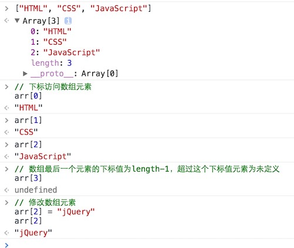

  你可以通过***Object***的“***keys()***属性方法去获取一个数组的“键名”，即元素下标：

```javascript
var arr = ["HTML", "CSS", "JavaScript"]

Object.keys(arr); // 输出：["0", "1", "2"]
```

  我们也可以通过如下方式去获取数组元素：

```javascript
var arr = ["HTML", "CSS", "JavaScript"]
arr["0"]; // "HTML"
arr["1"]; // "CSS"
arr["2"]; // "JavaScript"
```

  需要注意的是，数组虽然也是对象，但实际上下面这些获取数组元素的方法都是不合法的。

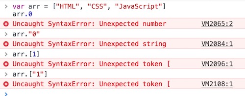

# 四、数组遍历

```javascript
var arr = ["HTML", "CSS", "JavaScript"]

// 1、for 循环遍历
for(var idx = 0; idx < arr.length; idx++) {
  console.log(arr[idx]);
}

// 2、for-in 遍历
for (var idx in arr) {
  console.log(arr[idx]);
}

// HTML
// CSS
// JavaScript
```

# 五、数组方法

## 1、Array.isArray()

  ***Array.isArray***方法用于判断某个对象是否是一个数组，如果是，则返回***true***，否则返回***false***。

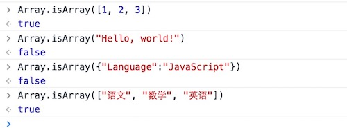

## 2、valueOf()/toString()

  ***valueOf***方法用于返回对象本身的值，这是各种数据类型对象的通用方法，***toString***方法可以将值转化成一个字符串，这和***String()***方法的作用是一样的，同样为一个通用的方法。

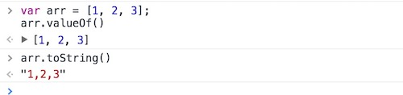

## 3、push()

  ***push***方法用于在数组的末端添加一个或多个元素，并返回添加新元素后的数组长度，该方法会改变原数组。

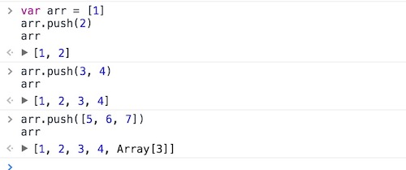

  数组***原型链***内的***push***方法内还内置了另外一个方法，就是“***apply***”方法，该方法主要用于合并数组，其语法形式为：***apply(arr1, arr2)***，其返回值为合并之后的数组长度，该方法参数内仍然需要包含自身，否则无法达到期望的结果，并且该方法内只能接受两个参数，为两个需要进行拼接的数组，如下所示：

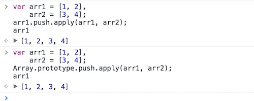

  使用***apply***方法合并数组局限于两个数组的合并，如果要合并多个数组，显然比较麻烦，我们可以使用***concat***（使用该方法需要定义一个空数组作为临时变量）方法合并多个数组。

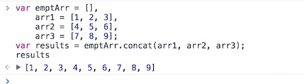

> tips：和使用***concat***方法相比，***push***方法会改变原有数组，而***concat***方法不会改变原有数组。

## 4、pop()

  ***pop***方法用于删除数组的*最后一个元素*，并返回该数组元素。也就是说该方法一次只能删除一个，不能删除多个，任何参数对于它来讲都是无效的，会被忽略。该方法同样会改变原数组。

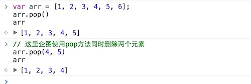

## 5、shift()

  ***shift***方法与***pop***方法类似，它的作用是删除数组的*第一个元素*，并返回该数组元素。仍然一次只能删除一个，参数对它无效。该方法同样会改变原数组。

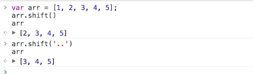

## 6、unshift()

  ***unshift***方法的使用和***push***方法类似，它的作用是在数组的***开始位置插入***或***添加***一个新的元素，并返回该数组长度。该方法同样会改变原数组。

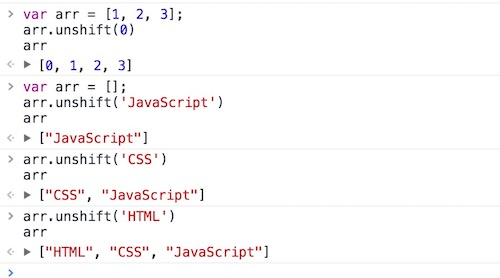

## 7、slice()

  ***slice***方法用于提取原数组的一部分，返回一个新数组，原数组不变。语法形式为：***slice(start, end)***，它的第一个参数为起始位置（从下标0开始），第二个参数为终止位置（不包括该位置）。如果省略第二个参数，则一直返回到原数组的最后一个成员。这和之前的字符串操作***slice()***方法非常类似。

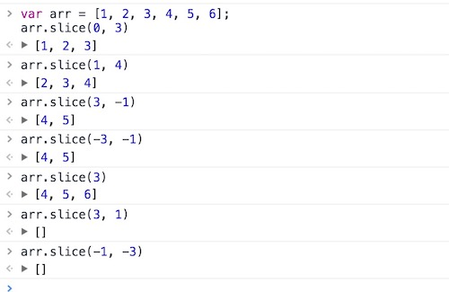

  除此之外，该方法还可以利用原型链中的“***call()***”方法将一个*类似数组*转化成真正的数组：


  将一个类似数组转换为真正的数组的意义在于，类似数组不具有数组的方法，如concat()、push()、shift()等方法，直接对一个类似数组使用数组的方法浏览器会报错，而很多时候我们的操作只有通过使用数组的方法才能完成，或用数组的方法完成才是最佳的选择。

## 8、splice()

  ***splice***方法用于删除原数组的一部分成员，并可以在被删除的位置添加入新的数组成员，返回值是被删除的元素。注意，该方法会改变原数组。其语法形式为：***splice(start, count, items...)***，该方法中的第一个参数是删除的起始位置，第二个参数是被删除的元素个数。如果后面还有更多的参数，则表示这些就是要被插入数组的新元素。


  另外，该方法的第一个参数可以为负数（但是第二个不能，因为它表示长度），表示从数组末端开始计数，开始计数的值为“***-1***”。

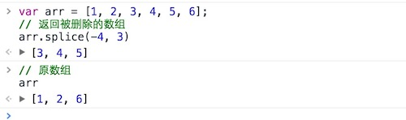

  利用该方法的原理可以达到向指定位置***插入数组元素***的效果。第一个参数仍然是表示开始下标，第二个参数设为0，这样后续设置的参数就会出现在第一个参数下标位置之前：


  和以往的数组操作一样，该方法同样可以省略第二个参数，这样一来删除的数组就会从给定的参数位置开始一直删除到末尾。通过获取该方法返回的值和原数组，达到了一个***分割数组***的目的。

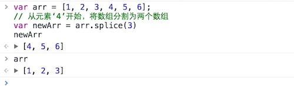

## 9、sort()

  ***sort***方法对数组成员进行*升序排序*，默认是按照*ASC II*码顺序排序，在*ASC II*码中，大写字母靠前。排序后，原数组将被改变。

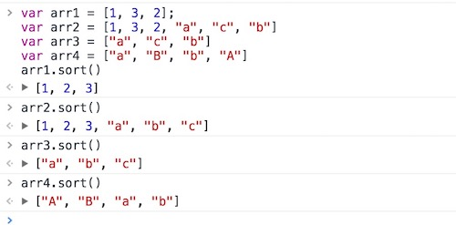

  需要注意的是，***sort()***方法对数组元素的排序的初始依据是数组元素中的***第一个字符***，当第一个字符一样时，会对数组元素中的第二个字符进行比较，以此类推。也就是说当对一个数组如***“[90,100,130,300]”***进行排序，得到的结果会是***“[100,130,300,90]”***，而并不是字面上数字大小的关系。

  若要对这样对数组实现数值大小的排序（实际项目中更多地是需要这样的结果），可以通过给***sort()***方法配置一个函数参数来实现，函数中需要配置两个参数，使该方法能实现一个差值排序的算法。用一个参数减去第二个参数，得到的是一个升序数组；用第二个参数减去第一个参数，得到的是一个降序的数组。如例：
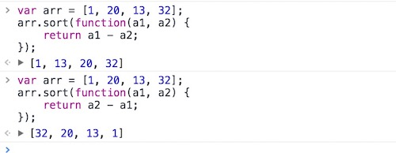

  通过示例可以发现，得出的排序结果已经不再是按照ASC II中首字符的前后顺序来排序了，而是按照数学中数字的大小来进行的排序。而且当sort()方法内的函数的两个参数在执行差值运算的位置发生变化后，得出结果的排序升降关系也不一样。

  但若要实现一个稍微复杂一点的排序，如对数组元素是对象的数组进行排序，这个方法能否办到呢，我们先来做这样一个尝试，让数组元素对象按照产品的价格进行排序。

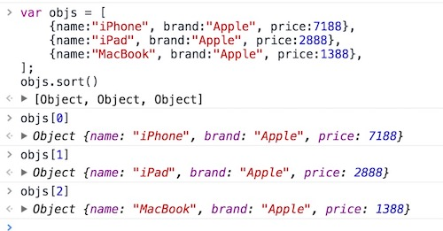

  通过访问元素组下标可以发现，素组内这三个对象的位置完全没有发生改变。其实要实现这个需求也是有办法的，就是同样需要给“sort()”方法配置一个函数作为参数来实现，实现思路和对数组排序时配置函数一致。

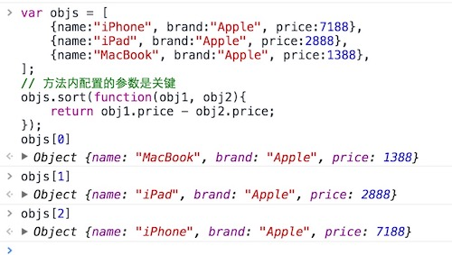

  该方法通过和下面会讲到的“reverse()”方法配合，可以实现一个简单的升序、降序排列的功能。

## 10、reverse()

  ***reverse***方法的作用是将已有数组倒序排列，并返回改变后的数组。该方法同样会改变原数组。

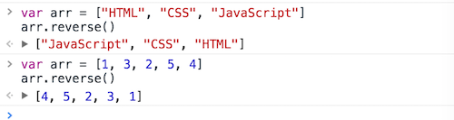

  需要注意的是该方法不具备***sort()***方法那样对数组排序的能力，它只是单纯地将当前的数组的元素进行先后顺序地调转而已。所以，在对一个有序（已经完成升序或降序排序）的数组进行反向排序的时候，会比***sort()***方法通过配置函数的参数，再对函数的参数进行位置调整来计算差值这种方式的性能要高很多。

## 11、map()

  ***map***方法对数组的所有成员依次调用一个函数，根据函数结果返回一个新数组。该方法不会改变原来的数组。

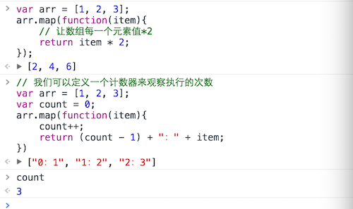

  上例中，***map***方法内有一个匿名函数，函数内有一个参数“***item***”，这个参数的名称是自定义的（只要不是关键字和保留字），这个参数在函数运行的时候通过一次内部的遍历指向数组内对应的元素，我们可以观察上述代码中的***count***变量，由0到3，执行了3次，而这个函数执行的次数正是由当前的数组元素的长度“length”属性决定的（也有特殊情况，后续会进行说明）。

  ***map***方法内的函数，最多可以接受3个参数。：第1个，就是上面例子中出现的参数，它表示数组内每个元素的本身；第2个，表示数组内元素的下标位置；第3个，表示数组本身，即：***function(item, idx, arr)***

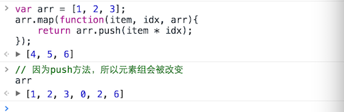

  现在看到***map***方法执行后返回的值可能会有些困惑，为什么会是***[4,5,6]***?那是因为***push***方法在执行后返回的值是数组当前的长度（***unshift***方法也是一样的），通过因为当前数组元素有3个，也就是说这个***push***方法会在数组内被执行三次，三次运行后也分别返回了当前数组的长度，而这三次值的返回又组成了一个新的数组（当若这个数组没有用变量存储，或参与到某个表达式中是没有意义的）。而元素组却发生了改变，输出了6个数组元素长度的新数组。当然让这个数组发生改变的并不是***map***方法，而是在该方法函数内的***push***方法产生的效果（***push***方法会改变原始数组）。

  该方法和***“for-in遍历循环”***语句有一个相似之处，即当数组元素中存在空位的时候，该函数是不会去执行的，但只要有明文的值，哪怕是遇到undefined、null、NaN等特殊的“无值”的值，该方法仍然能够执行。我们来看这样一个例子就明白了。


## 12、forEach()

  ***forEach***方法与***map***方法很相似，也是遍历数组的所有成员元素，执行某种操作，但是***forEach***方法一般不返回值，只用来操作数据。如果需要有返回值，一般使用***map***方法。***forEach***方法的参数与***map***方法一致，也是一个函数，数组的所有元素会依次执行该函数。它接受三个参数，分别是当前位置的值、当前位置的下标和整个数组。

  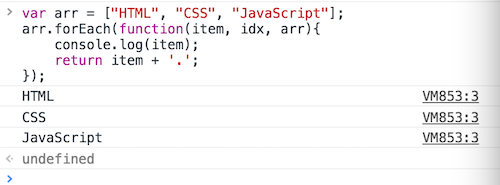

  上例中函数内的“***console.log()***”方法得到执行，但关键字“***return***”后续的内容却没有生效，说明***forEach***方法是不会执行返回值操作的。另外，该方法可以有第二个参数（并不是值函数内部的参数，而是指forEach()方法本身的参数），第二个参数用于“告诉”函数内部的“this”关键字的指向。


  同样地，由于***forEach***方法和***map***方法相比，不会去执行返回值的表达式的计算，实际使用起来性能会更加的优秀。所以，现在很多在重视性能的类库在封装类似的方法的时候，更多地是采用forEach()方法，而不是功能与之相近的map()方法。

## 13、filter()

  从方法名来看该方法的主要作用是*过滤*，它的参数是一个函数，所有数组成员依次执行该函数，返回结果为true的成员组成一个新数组返回。该方法不会改变原数组。


  和之前的***map***和f***orEach***方法一样，该方法的函数仍旧支持3个参数，参数位和之前的这两个方法也是一样的，分别表示：数组元素、元素下标和原数组。

## 14、indexOf() / lastIndexOf()

  ***indexOf***方法返回给定元素在数组中第一次出现的位置，如果没有出现则返回***-1***。该方法和字符串中的***indexOf***方法基本类似。

  ***lastIndexOf***方法返回给定元素在数组中最后一次出现的位置，如果没有出现则返回-1。该方法和字符串中的indexOf()方法基本类似。

```javascript
var arr = [1, 2, 3, 2, 5];
arr.indexOf(2);     // 1
arr.lastIndexOf(2); // 3
```

  这两个方法还可以指定开始检索的位置，其语法形式为：***indexOf(ctx, idx)***与***lastIndexOf(ctx, idx)***

## 15、链式使用

  在数组的方法中，除了可以实现数组操作方法的嵌套，若所用方法返回的仍旧是一个数组的话，还可以使用*方法链*来完成一个特定的功能。

```javascript
var arr = [1, 2, 3, 5, 4];
arr.sort().reverse().map(function(item){
  return item * 2;
});
```


