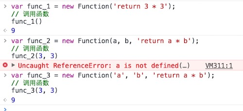

#  # 概述

所谓 “函数”，就是使用关键字 **“function”** 定义的一段具有**独立作用域**，能被**反复执行**的语句块，或者说函数就是功能。函数在JavaScript中也是以一种“值”的方式存在的，和其它数据类型相比，它是一种可以接收参数的、可运行的值，除此之外，它并没有任何的不同。JavaScript作为一个“**面向对象**”和“**函数式编程**”的语言，因此函数部分自然是一个重点

JavaScript函数根据不同的定义方法及功能可以分为不同的类型，大致包括普通函数、变量函数、构造函数、匿名函数、闭包函数、递归函数以及ES6新增的箭头函数等。接下来我们就对JS中的“函数”进行详细的学习，在函数介绍中，我们主要以普通函数为例。

# # 函数定义

函数利用关键字**“function”**声明，其语法形式如下：

```javascript
function function_name(arguments) {
	// body...
}
```

上述语法形式中，**“function”**关键字用于定义函数，**“function_name”**用于定义函数的名字，函数名字遵守标识符的命名规则，而圆括号里面的**“argument”**表示函数参数（注意，即使没有参数，圆括号也不能省略），花括号里面的内容为函数体，即处理的逻辑。

```javascript
function sayHi() {
	console.log('Hi');
}
```

上述代码中定义了一个函数，该函数的名字为**“sayHi”**，该函数没有设置参数，该函数的功能是打印输出一条语句，即**“Hi”**。

# # 函数调用

函数定义以后，并不会立即执行（自调函数除外，自调函数一旦创建，程序执行之后自调函数也会自动执行），因此要执行函数，需要调用函数，我们看下面这个实例。

```javascript
function sayHi() {
	console.log('Hi');
}

sayHi(); // "Hi"
```

上述代码定义函数之后，通过 `sayHi()` 对函数进行调用，控制台输出*‘Hi’*，函数调用的形式为：`function_name(argument)`，需要注意的是，即使没有参数，圆括号也不能省略。

# # 函数参数

我们在很早以前就已经接触过函数参数了，它是让函数可复用的关键性存在。就是当程序里很多地方都在做着同样一件事件，但只是部分需要呈现的内容不同的时候，我们就可以使用配置参数的形式来完成一个函数的功能。如在学习JavaScript之初，我们就已经接触到的`alert()`函数和`console.log()`方法一样，我们只需要在使用它们的时候往该函数或方法的括号内添加我们需要显示的内容即可让它实现其功能。

## 1、参数声明

函数参数无需指定类型，它的类型是在调用函数时，根据传递的参数值的类型所确定的，并且，函数参数无需使用`var`或 `let` 关键字声明，函数允许有多个参数。

```javascript
// 1、定义函数
function sayHelloWith(name) {
	console.log(`Hello, ${name}!`);
}

function sumWith(a, b) {
	console.log(a + b);
}

// 2、调用函数
sayHelloWith('Petter'); // "Hello, Petter!"
sumWith(10, 10);     // 20
sumWith("ab", "cd"); // "abcd"
```

上述代码中，我们可以看到*sayHiWith*函数有一个参数*name*，*sumWith*函数有两个参数，分别是*a*、*b*，在定义函数的时候，参数的类型是不确定的，只有在调用函数的时候，类型才会确定，比如调用函数*sumWith*时，第一次调用时传入两个数字*10*，此时变量*a*、*b*的数据类型为数值型*number*，第二次调用时传入两个字符串，此时变量*a*、*b*的数据类型为字符串型*String*。

## 2、参数作用域

在之前讲变量时我们已经提到变量的作用域，所谓“**作用域** “，就是变量起作用的范围，全局变量的作用域为全局，而局部变量的作用域限定在某个范围。函数参数为局部变量，其起作用的范围只限于函数内部，外界不能访问。

```javascript
function test() {
	var x = 10;
}
console.log(x);
// Uncaught ReferenceError: x is not defined(…)
```

上述代码在**test**函数内部定义了变量*x*，在函数外部访问*x*，程序报错，提示变量未定义。

## 3、形参与实参

函数参数分为”**形参** “与”**实参** “，所谓形参，就是指形式参数，它并无确定的值；所谓实参，就是指实际参数，它有确定的值。定义函数时，圆括号内的参数为形参，调用函数时，圆括号内的参数为实参，具有确定的值。

形参是对实参的引用，在函数内部，如果对传递的值进行修改，并不会修改原始值。

```javascript
var x = 0;
function test(n) {
	n++;
}
test(x)
console.log(x); // 0
```

上述例子中，函数外部定义了变量*x*，在调用**test**函数时，将*x*作为实参传递给形参*n*，函数内部 `n++`，变量*x*的值并未修改，依旧为*0*。

## 4、为参数设置默认值

为参数设置默认值可通过 三元运算符（`?:`）或者 或运算符（`||`）。

```javascript
function print(str, num) {
    num = num == undefined ? 18 : num;
    str = str || "Hello, world!";
    console.log(str);
}

print(); // "Hello, world!"
print('What are you doing?'); // "What are you doing?"
```

> 提示：值得注意的是，或运算符只对非数字对象有效，如果参数为数值类型，则使用三元运算符，因为如果传递的数字为0，根据自动类型转换，0被转换为false，因此也会认为该参数没有值。

## 6、对位传参法

函数参数的配置和参数的设置需要一一对位，即配置参数的顺序和函数定义参数时的顺序一致。根据这个要求参数的配置又可以分为另外几种特殊（异常）情况。

- 为函数预设了多余的参数
- 配置的参数少于预置的参数
- 配置的参数多于预置的参数
- 配置的参数与预置的参数没有对位

```javascript
// 1、为函数预设了多余的参数
function fnc_1(a, b, c) {
	return a;
} 
fnc_1(10); // 10

// 2、配置的参数少于预置的参数
function func_2(a, b, c) {
	return a + b + c;
} 
func_2(10, 5) // NaN

// 3、配置的参数多于预置的参数
function func_3(a, b, c) {
	return a + b + c;
} 
func_3(1, 2, 3, 4, 5) // 6

// 4、配置的参数与预置的参数没有对位
function func_4(a, b, c) {
	return b;
} 
func_4(1) // undefined
```

上面这种调用函数并传递参数的方式统称为“**对位传参**”。这种传递方式，在函数定义的时候，函数体内部有几个变量，那括号内就需要出现几个参数（位置没有要求，只需要保证括号内的参数名和函数体内部的变量名一致即可）。如果括号内的参数多设置了，没有什么影响，但括号内没有声明的参数，在函数内进行了使用，除非这个变量是个全局变量（或父级函数的变量，这在“闭包”中会讲到），否则就会报出变量未定义的错误。如果参数列表内已经设置了某项参数，但是在调用函数并配置参数的时候没有对该参数进行设置，那该参数的值就为undefined。如同上例中的最后一个例子（配置的参数实际上是“a”，但参数“a”并没有参与到函数内部去）。

像上例中最后一个例子，我们想让函数将参数变量“b”返回，那我们得明文地将参数变量“a”进行设置，设置为任何值都没有影响。如：

```javascript
function fnc_4(a, b) {
	return b;
} 
func_4(1, 2);            // 2
func_4(undefined, 2);    // 2
func_4("可以是任意值", 2); // 2
func_4( , 2);            // 程序报错
```

我们之前提到过，参数实际上也是变量。在这个例子中，参数变量“a”无论为何值，它都没有参与到函数体的语句中去，所以函数最终的返回结果自然与它无关了。当然，函数也不会因为不曾使用过某个已经声明的变量而报错的。

但从上面的“对位传参”的例子中可以发现一个问题，就是有的时候我们想省略某一项参数的时候，必须为省略参数至少配置一个有效值，哪怕是本来没有什么意义的“undefined”，否则会像上例中最后一个运行结果那样产生“无效标识符”的报错。这使得我们在调用一个函数时会做很多“无用功”。

为了解决这样的问题，我们最稳妥的做法，就是一开始就为这些参数在函数内部就设定好默认值。

在使用对位传参的时候，我们会遇到一些问题，就是在调用函数时，我们设置参数可能并不一定根据严格的顺序来设置参数，比如是用于处理类似于用户表单填写（有必填项，也有非必填项）的时候，问题就会出现了。我们还是先来看一次正常的对位传参的情况：

```javascript
function userInfo(name, sex, age, address) {
	console.log(`
		姓名：${name}
		性别：${sex}
		年龄：${age}
		地址：${address}
		`);
}
userInfo('小明', '男', 25, '四川省成都市');
// 姓名：小明
// 性别：男
// 年龄：25
// 地址：四川省成都市
```

如果，现在我们只想提供其中某几项信息，其它的不填写，就会出现下面的情况了：

```javascript
// 1、只填写姓名和性别
userInfo('小明', '男');

// 姓名：小明
// 性别：男
// 年龄：undefined
// 地址：undefined

// 2、只填写姓名和地址
userInfo('小明', '四川省成都市');

// 姓名：小明
// 性别：四川省成都市
// 年龄：undefined
// 地址：undefined
```

> 提示：示例使用ES6模板字符串输出。

## 7、对象传参法

通过上一节最后一个例子可以发现，除非我们依次对位地填写参数，否则出现的配置结果并不会乖乖的出现在应有的位置上。可以预知的是，就算我们給它配置好默认值，它们也不会按照开发者的“意念”出现在指定的位置。要解决这样的问题，我们只能采用唯一一种可行的方式了，那就是“**对象传参法**”，对象传参法在定义函数的时候只需要配置唯一的一个参数，而在调用的时候配置的参数是一个对象。首先我们来看一个将对象作为参数传递的完整示例：

```javascript
function userInfo(obj) {
	console.log(`
		姓名：${obj.name}
		性别：${obj.sex}
		年龄：${obj.age}
		地址：${obj.address}
		`)
}

userInfo({
	name: '小明',
	sex: '男',
	age: 25,
	address: '四川省成都市'
});

// 姓名：小明
// 性别：男
// 年龄：25
// 地址：四川省成都市
```

我们先来做一个分析对比。这次函数定义的参数部分和之前通过“`name, sex...`” 设置参数列表的方式不同，这次使用了一个单词 `obj` 作为参数，参数内部也不再是那些“ name, age...”的单词，而是使用 `obj.property` 的形式访问，其中obj为参数对象，property为定义的对象属性。你需要注意的是，调用函数时对象内的属性名需与函数定义时，函数体内部“`obj.`”之后的名称一一对应。为了证明函数调用时的对象属性名和函数内属性名的名称是对应的，我们来做这样一个实验，就是在调用的时候更改一下配置的顺序，再观察结果。

```javascript
userInfo({
	address: '四川省成都市',
	sex: '男',
	age: 25,
	name: '小明'
});

// 姓名：小明
// 性别：男
// 年龄：25
// 地址：四川省成都市
```

通过运行的结果可以清晰地对应出来，调用的时候无论怎么更改属性的顺序，函数最终的运行结果始终是按照函数内定义的顺序进行的。单是这一点“对位 传参法”就已经是办不到的了。为了提升程序的“健壮性”，我们需要对函数中的所有值都定义一个默认值，防止函数在被调用的时候没有配置对象的某一项参数（某一个属性）也能显示出“适当”的结果。

函数声明定义部分如下：

```javascript
function userInfo(obj) {
	obj.name    = obj.name    || `名字只是一个代号`;
	obj.sex     = obj.sex     || `你猜`;
	obj.age     = obj.age     || `身高不是问题，年龄不是距离`;
	obj.address = obj.address || `地球`
	console.log(`
		姓名：${obj.name}
		性别：${obj.sex}
		年龄：${obj.age}
		地址：${obj.address}
		`)
}
```

  调用函数并传递其中某些“参数”后，运行结果如下：

```javascript
userInfo({
	name: '小明'
});

// 姓名：小明
// 性别：你猜
// 年龄：身高不是问题，年龄不是距离
// 地址：地球
```

上例中，对未配置的参数属性都进行了默认值的强制显示，如果在未定义值的情况下不显示，只需要将 `||` 之后的文本替换成空字符串即可。用逻辑运算符处理默认字符只限于配置属性值为 “**非零**”（也包括会在条件语句中不会自动转换成false的值）的时候，若配置的参数对象内会出现数值计算，或需要显示数值的时候（如工龄、请假次数、迟到次数），这些值都很可能为数值0。逻辑运算符都会将其自动转换为false，直接就去使用我们默认配置的值（但默认值又是一个非0的数），这显然是一个bug。下面就是当参数内的属性传递的是数值0的时候出现的异常结果。

```javascript
userInfo({
	name: '小明',
	sex: '男',
	age: 0,
	address: '四川省成都市'
});

// 姓名：小明
// 性别：男
// 年龄：身高不是问题，年龄不是距离 (异常)
// 地址：四川省成都市
```

如果是这样的情况，还是建议使用“三元表达式”的形式对undefined进行严格等于的比较运算进行判断更为稳妥。

```javascript
function userInfo(obj) {
	obj.name    = obj.name    == undefined ? `名字只是一个代号`         : obj.name;
	obj.sex     = obj.sex     == undefined ? `你猜`                   : obj.sex;
	obj.age     = obj.age     == undefined ? `身高不是问题，年龄不是距离` : obj.age;
	obj.address = obj.address == undefined ? `地球`                   : obj.address; 

	console.log(`
		姓名：${obj.name}
		性别：${obj.sex}
		年龄：${obj.age}
		地址：${obj.address}
		`);
}
```

  如果参数出现同名，和对变量的处理一样，采用同名参数中最后一个参数的值。

  函数也具有 **length** 属性，但这个属性不是用来获取函数的个数的，而是用来表示函数内参数的个数的。这个属性显示的结果是函数在定义时预置的参数个数，与被调用的时候使用的参数个数没有关系。如例：

```javascript
function sum(a, b, c) {
	return a + b + c;
}
sum.length; // 3


function sum(a, b, c) {
	return a + b + c;
}
sum(1, 2, 3)
sum.length; // 3


function sum(a, b, c) {
	return a + b + c;
}
sum(1, 2, 3, 4, 5)
sum.length; // 3


function sum(a, b, c) {
	return a + b + c;
}
sum(1, 2)
sum.length; // 3
```

  上例中，需要注意，运行后的那个结果并不是值函数运算结果，而是该函数的“length”属性的运算结果。可以发现，无论调用函数的时候怎么去配置函数的参数，最终结果都是3，表示的是函数定义时内部的三个参数“a,b,c”。

## 8、arguments 对象

在某些特定的情况下，我们根本不知道函数在调用的时候到底需要配置几个参数，比如你要设置一个求和的函数，可能你需要求两个数的和，那就需要两个参数，如果需要求五个数的和，就需要五个参数。为了应对这种情况，JavaScript对函数提供了一个“**arguments** ”对象来应对以上情况。

我们首先要对“arguments”这个对象进行一个基本概念的了解。“arguments”对象只能出现在函数内部，在“全局空间”里该对象是无效的。该对象包含了函数运行时的所有参数，arguments[0]就是第一个参数，arguments[1]就是第二个参数，以此类推。

```javascript
function test(param) {
	console.log(arguments);
}

test(1, 2); // [1, 2]
test('a', 'b', 'c'); // ["a", "b", "c"]
```

arguments 会忽视函数定义时参数定义的个数，以实际调用时配置的参数为准，也就是说函数的括号内哪怕没有预置参数也是可以的。我们通过arguments对象的“length”属性（之前的length属性是对函数名使用的）来再次证明这一点。

```javascript
function test() {
	retutn arguments.length;
}
test({name:"Petter"}); // 1
test(1, 2);            // 2
test("a", "b", "c");   // 3
```

通过这个例子我们就已经证明了，哪怕声明定义函数的时候没有设置参数，在调用的时候仍然可以为其配置参数（但是在实际开发中仍然建议保留那个参数，以用于说明该函数的运行是依赖参数实现的）。根据上面两个例子总结出来的特点，再根据我们之前所学的知识点，实现一个不确定位数的“求和函数”应该就不那么困难了，代码如下：

```javascript
function sum(val) {
	var sum = 0;
	for(let idx = 0; idx < arguments.length; idx++) {
		sum += arguments[idx];
	}
	return sum;
}
console.log(sum(1, 2));    // 3
console.log(sum(1, 2, 3)); // 6
```

需要注意的是，虽然 **arguments** 很像数组，但它是一个对象（即“ **类似数组对象** ”）。数组专有的方法（比如 *push()* 、*pop()* 和 *forEach()* 等方法），不能在arguments对象上直接使用。不过我们可以通过数组的 **slice** 原型链中的 **call** 方法将一个类似数组转化为一个真正的数组，然后你就可以使用数组方法了。

```javascript
function argFunc() {
	arguments = Array.prototype.slice.call(arguments);
	arguments.push(4);
	return arguments;
}
argFunc(1, 2, 3);
// [1, 2, 3, 4]
```

那问题来了，将arguments对象转换成一个数组的意义是什么呢？我们知道将arguments对象转化成一个数组对象之后，它可以使用数组的专用方法。通过目前已经学习过的几种数据类型可以发现，数组的操作方法是最多的，这也成就了数组的操作是最为灵活的，最为方便的。其它数据格式不能完成的操作，在通过特定方式转换为数组之后都成为了可能。比如我们现在拿一个本不能修改其内容的字符串来进行举例：

```javascript
var str = "China";
str.length; // 5
console.log(str[0] + str[1] + str[2] + str[3] + str[4]); // "China"

str[0] = "A";
str[1] = "m";
str[2] = "e";
str[3] = "r";
str[4] = "i";
str[5] = "c";
str[6] = "a";
str; // "China"
```

通过上例可以发现，字符串拥有和数组一样的“length”属性，也可以像数组那样通过下标对值进行访问，但是却不能通过下标对位地去修改字符串内的值。但若将字符串转换为数组后，情况就有所改观了。

```javascript
var str = "China", strArr = [];
strArr = str.split("");
strArr;
// ["C", "h", "i", "n", "a"]

strArr[0] = "A";
strArr[1] = "m";
strArr[2] = "e";
strArr[3] = "r";
strArr[4] = "i";
strArr[5] = "c";
strArr[6] = "a";

str = strArr.join("");
str;
// "America"
```

虽然这个示例中的行为显得有些多余，在实际操作中我们只需要将“*var str = "baidu"; str = "google"* ”即可完成这个操作，但这里的示例希望的是发现数组的操作性是强是弱的问题。示例展示了一个通过下标本不能修改的字符串“China”通过转换为数组后硬是修改为了“America”的过程。

根据数组可操作性的特点，我们再来尝试一个，对传入任意数量参数的值求平均值的例子：

```javascript
function average(val) {
	console.log(arguments)
	let sum = 0;
	arguments = Array.prototype.slice.call(arguments);
	arguments.forEach(function(num) {
		sum += num;
	});
	return sum / arguments.length;
}

console.log(average(1, 2, 3)); // 2
console.log(average(6, 6));    // 6
```

## 9、值传递与地址传递

参数传递分为“**值传递**” 与 “**地址传递**”，所谓值传递，就是调用函数时，形参是对实参的拷贝，即将实参值拷贝一份赋给了形参，因此我们不能在函数内部通过形参修改原始值。而地址传递，传递的是地址，在计算机内存中，地址是唯一的，在函数内部我们可以通过该地址修改原始值。

在JavaScript中，如果参数为“**包装对象**”，即为值传递，如果参数为“**内置对象**”，即为地址传。判断是否为内置对象或包装对象的方法是，使用 `Object()` 方法之后是否还全等于自身。接下来我们看一组示例：

```javascript
var a = 10;
var b = {name: "Henrry Lee"};

console.log(Object(a) === a); // false 包装对象
console.log(Object(b) === b); // true  内置对象

function test1(argument) {
	argument = 20;
}
function test2(argument) {
	argument.name = `Petter`;
}

// 值传递
test1(a); 
console.log(a); // 10

// 参数传递
test2(b);
console.log(b.name);  // "Petter"
```

> 注意：尽管 **地址传递** 传递的是变量的地址，我们可以通过该地址修改原始值，但是我们不能改变原始变量的指向，即我们不能企图重新为变量赋值。如下所示：
>
> ```javascript
> var b = {name: `Henrry Lee`};
> function test(argument) {
> 	argument = 10;
> }
> console.log(b); // {name: `Henrry Lee`}
> ```

# #、函数返回值

每一个函数都会有一个返回值，这个返回值可以通过关键字 `return` 进行设置，若未显示地设置函数的返回值，那函数会默认返回一个 `undefined` 值。

```javascript
function test() {
    console.log("Hello, world!");
}
test(); // undefined
```

  但设置了返回值，则直接返回 `return` 之后的值。

```javascript
function getSkill() {
	return '佛山无影脚';
}
getSkill(); // "佛山无影脚"
```

  **return**关键字，除了能够返回值以外，另外一个作用便是终止函数，**return**关键字后的代码不会执行。

```javascript
function getSkill() {
	return '佛山无影脚';
    console.log("Hello, world!"); // 该语句不会被执行
}
getSkill(); // "佛山无影脚"
```

  **return**关键字后可以是变量也可以是表达式，甚至可以是数组或对象，只要符合JavaScript六种基本数据类型，都可以返回。

```javascript
// 1、返回值为变量
function func_1() {
	var a = 10;
	return a;
}
// 2、返回值为表达式
function func_2() {
	var a = 10, b = 10;
	return a + b;
}
// 3、返回值为数组
function func_3() {
	return [1, 2, 3];
}
// 4、返回值为对象
function func_4() {
	return {name:"Petter", age:23}
}
// 5、返回值为布尔类型的值
function func_5() {
	return true;
}
```

  函数返回值只能是一个，不能有多个返回值，否则程序报错，如果要返回多个值，可以用数组或对象。

```javascript
// 以数组形式返回
function minAndMaxNumInArr(arr) {
	var min = arr[0];
	var max = arr[0];
	for(var i = 0; i < arr.length; i++) {
		max = arr[i] > max ? arr[i] : max;
		min = arr[i] < min ? arr[i] : min;
	}
	return [min, max];
}

// 以对象形式返回
function minAndMaxNumInArr(arr) {
	var min = arr[0];
	var max = arr[0];
	for(var i = 0; i < arr.length; i++) {
		max = arr[i] > max ? arr[i] : max;
		min = arr[i] < min ? arr[i] : min;
	}
	return {minNum:min, maxNum:max};
}
```

# #、函数名的提升

  JavaScript引擎将函数名视同变量名，所以采用**function**命令声明函数时，整个函数会像变量声明一样，被提升到代码头部。所以，下面的代码不会报错。

```javascript
sayHello();
// "Hello, world!"
function sayHello() {
	console.log("Hello, world!");
}
```

  上述代码中，函数的调用在函数定义之前，但是由于变量提升，函数**sayHello**被提升到了代码头部，也就是在调用之前已经声明了。但是，如果采用赋值语句定义函数，JavaScript就会报错。

```javascript
f();
var f = function (){};
// TypeError: undefined is not a function
```

  上面的代码等同于下面的形式。

```javascript
var f;
f();
f = function () {};
```

  上面代码第二行，调用*f*的时候，*f*只是被声明了，还没有被赋值，等于*undefined*，所以会报错。因此，如果同时采用`function`命令和赋值语句声明同一个函数，最后总是采用赋值语句的定义。

```javascript
var f = function() {
  console.log('1');
}

function f() {
  console.log('2');
}

f() // 1
```

  如果函数名重复，则后定义的函数会覆盖之前定义的函数。

```javascript
function sayHello() {
	console.log("Hello, world!");
}
function sayHello() {
	console.log("Hello, China!");
}

sayHello();
// "Hello, China!"
```

# # 函数类型

## 1、变量函数

  变量函数利用函数表达式进行声明，基本语法形式为：

```javascript
var function_name = function(argument) {
	// body...
}
```

  通过表达式声明的函数需要注意两点：

- **1、**这样声明的函数，需要先声明后调用;
- **2、**表达式内部的 **function** 无需再设置函数名，如果这样写，function后方的函数名只能被函数内部调用，在外部是无法使用的;

  除了上述需要注意的两点外，这种方式声明的函数和利用funciton关键字定义的函数并没有什么区别。

## 2、自调用函数（IIFE）

  自调函数又叫立即调用函数。其基本的语法形式为：`(function() {...})(param);`

  这种函数声明方式的最大特点是“即时性”。它不需要任何调用，即可立即执行。自调用函数一般无需设置函数名（没有函数名的函数我们可以称其为匿名函数）。它执行的原理是利用小括号将函数自身括起来，以到达提升括号内函数表达式优先级的作用，括号内部的函数生效后，又紧接着后面的括号进行函数的调用，从而实现自我调用的效果。如下例：

```javascript
(function() {
	console.log("Hello, world!");
})();
// "Hello, world!"

(function(a, b) {
	return a + b;
})(1, 2);
// 3
```

  这种函数的声明方式和其它函数的声明方式一样，它仍然有自己的独立作用域。自调用函数还有一个特点就是，它的运行虽然还是在程序的独立线程完成的，但是却可以达到程序在主线程完成的效果。

## 3、闭包函数

闭包（closure）是Javascript语言的一个难点，也是它的特色，很多高级应用都要依靠闭包实现。

要理解闭包，首先必须理解变量作用域。前面提到，JavaScript有两种作用域：全局作用域和函数作用域。函数内部可以直接读取全局变量。

```javascript
var str = "Hello, world!";
function test() {
	console.log(str);
}
test()
```

上面代码中，函数**sayHi** 方法可以读取全局变量`str`。

但是，在函数外部无法读取函数内部声明的变量。

```javascript
function test() {
	var str = "Hello, world!";
}
test()
console.log(str);
// Uncaught ReferenceError: str is not defined
```

上面代码中，函数内部声明的变量`str`，函数外是无法读取的。

如果出于种种原因，需要得到函数内的局部变量。正常情况下，这是办不到的，只有通过变通方法才能实现。那就是在函数的内部，再定义一个函数。

```javascript
function func_1() {
	var str = "Hello, world!";
	function func_2() {
		console.log(str);
		// "Hello, world!"
	}
    func_2();
}
func_1();
```

上面代码中，函数 func\_2 定义在函数 func\_1 内部，这时 func\_1 内部的所有局部变量，对 func\_2 都是可见的。但是反过来就不行，func\_2 内部的局部变量，对 func\_1 是不可见的。这就是JavaScript语言特有的”链式作用域”结构（chain scope），子对象会一级一级地向上寻找所有父对象的变量。所以，父对象的所有变量，对子对象都是可见的，反之则不成立。

既然 func\_2 可以读取 func\_1 的局部变量，那么只要把 func\_2 作为返回值，我们就可以在 func\_1 外部读取它的内部变量了。

```javascript
function func_1() {
	var str = "Hello, world!";
	function func_2() {
		console.log(str);
	}
	return func_2;
}
func_1()(); // "Hello, world!"
```

上面代码中，函数 func\_1 的返回值就是函数 func\_2，由于 func\_2 可以读取 func\_1 的内部变量，所以就可以在外部获得 func\_1 的内部变量了。

func\_2 函数就是闭包 ，即能够读取其他函数内部变量的函数。由于在JavaScript语言中，只有函数内部的子函数才能读取内部变量，因此可以把闭包简单理解成 “**定义在一个函数内部的函数即为闭包**”。闭包最大的特点，就是它可以“记住”诞生的环境，比如 func\_2 记住了它诞生的环境 func\_1，所以从 func\_2 可以得到 func\_1 的内部变量。在本质上，闭包就是将函数内部和函数外部连接起来的一座桥梁。

闭包的最大用处有两个，一个是可以读取函数内部的变量，另一个就是让这些变量始终保持在内存中，即闭包可以使得它诞生环境一直存在。请看下面的例子，闭包使得内部变量记住上一次调用时的运算结果。

```javascript
function createIncrementor(val) {
	return function () {
		return val++;
	};;
}
var inc = createIncrementor(5);
inc() // 5
inc() // 6
inc() // 7
inc() // 8
```

上面代码中，`val`是函数**createIncrementor**的内部变量。通过闭包，`val` 的状态被保留了，每一次调用都是在上一次调用的基础上进行计算。从中可以看到，闭包 **inc** 使得函数 **createIncrementor** 的内部环境一直存在。所以，闭包可以看作是函数内部作用域的一个接口。

为什么会这样呢？原因就在于 **inc** 始终在内存中，而 **inc** 的存在依赖于 **createIncrementor**，因此也始终在内存中，不会在调用结束后，被垃圾回收机制回收。

闭包的另一个用处，是封装对象的私有属性和私有方法。

```javascript
function Person(name, sex, age) {
	var _id = 0;
	this.setId = function(val) {
		_id = val;
	}
	this.getId = function() {
		return _id;
	}
}
```

上面代码中，函数 `Person` 的内部变量 `_id` 为私有变量，通过闭包 `setId` 和 `getId` 封装，我们可以设置或访问该私有变量。

由于闭包会使得函数中的变量都被保存在内存中，内存消耗很大，所以不能滥用闭包，否则会造成网页的性能问题，在IE中可能导致内存泄露。解决方法是，在退出函数之前，将不使用的局部变量全部删除。如将当前变量的值设置为“*null*”，将变量的引用解除，当垃圾回收启动时，会自动对这些值为“null”的变量回收。将上面的闭包示例稍微修改一下来减少对内存的消耗：

```javascript
function createIncrementor(start) {
	return function () {
		return start++;
	};
}
var inc = createIncrementor(5);
createIncrementor = null;
```

## 4、构造函数

  语法形式：

```javascript
var function_name = new Function(argument);
```

  这种写法是将参数列表和函数体放置在了一起作为参数。构造函数内的参数无论有多少个，始终会将其最后一个参数作为函数体去执行，如果只有一个参数，那这个参数就是函数体内部的代码。但使用这种方式需要注意的是，就算是参数和函数体的语句也是要作为字符串去呈现的，即需要给参数和函数体执行的代码都加上引号，否则会报“未定义”的错误。



  这种将参数和函数体内的语句糅杂在一起的写法非常不直观，实际开发中并不推荐使用。

## 5、构造函数（对象）

  函数作为JavaScript的一个主要内置对象（即本身就是一个对象，通过 `Object(function) === function` 进行判定），也是创建对象的主要手段之一（另外还包含字面量“{}”形式和构造函数“new Object()”的形式）。

  我们来看一个使用函数来创建一个对象的示例：

```javascript
// 创建函数模板
function Person(name, sex, age) {
	this.name = name;
	this.sex  = sex;
	this.age  = age;

	this.skill = function() {
		return `动感光波`;
	}
}

// 实例化函数对象
let per = new Person('小明', '男', 25);
console.log(`
	姓名：${per.name}
	性别：${per.sex}
	年龄：${per.age}
	技能：${per.skill()}
	`);
```

  然后我们就可以像访问普通对象一样去访问实例化出来的对象的属性值了：

```javascript
per.name;    // "张三"
per.sex;     // "男"
per.age;     // 25
per.skill(); // "动感光波"
```

  在构造函数**Person**内部的**this**指向的是实例化后的对象，也就是说在构造函数内部的this指向不是固定的，它会随着实例化对象的不同而指向不同的对象。

  和字面量的形式相比，采用构造函数实例化对象的方式虽然并没有那么直观，但更适合批量创建对象。也就是说当需要创建的对象数量比较大的时候采用这种构造函数的形式会使得代码更佳得简洁。我们只要稍微增加一下对象的数量，就可以清晰地对比出来。

  用构造函数实例化的对象：

```javascript
// 创建对象模型
function Person(name, age, profession, address) {
	this.name       = name;
	this.age        = age;
	this.profession = profession;
	this.address    = address;
}
// 实例化对象
var person1 = new Person("张三", 24, "Web前端工程师", "四川省成都市");
var person2 = new Person("李四", 30, "iOS工程师", "重庆市");
var person3 = new Person("王五", 28, "Java工程师", "广东省深圳市");
```

  用字面量创建的对象：

```javascript
var person1 = {
	name:"张三",
	age:24,
	profession:"Web前端工程师",
	address:"四川省成都市"
}
var person2 = {
	name:"李四",
	age:30,
	profession:"iOS工程师",
	address:"重庆市"
}
var person3 = {
	name:"王五",
	age:28,
	profession:"Java工程师",
	address:"广东省深圳市"
}
```

  通过观察，采用字面量的形式创建对象会使代码量增大，随着对象个数的增加，这种差距会更大。

## 6、递归函数

  JavaScript和其它编程技术一样，拥有一种函数在执行的时候调用自身的实现，这种实现在编程技术中叫做**“递归”**，通过递归可以同更少的代码完成很多需要大量代码，甚至是不确定代码所能完成的事。我们先在看一个简单的“递归”实现的例子：

```javascript
function count(n) {
	console.log(n--);

	if (n > 0) {
		count(n);
	}
}

count(5); 

// 5
// 4
// 3
// 2
// 1
```

  通过上面的例子可以简单地分析递归的原理，可以发现它和循环十分的相似。在使用递归时同样要注意一个问题，就是要防止结束条件的不明确导致出现“死循环”，导致浏览器崩溃。根据浏览器不同报出的错误描述各有差异，但总得来说都属于“RangeError”类型的错误，按照O'Reilly技术书籍出版社出版的书籍中的称呼叫做“调用栈错误”，书中也建议使用“*迭代*”（即循环）来替代“递归”，防止有些浏览器对递归迭代周期过长而产生的报错。

  尽管如此，在思路和结束条件都比较明确的时候用递归去执行一些需要重复的“递增”或“递减”算法还是一件比较“有趣”的事的，它和执行一个循环一样，可以减少我们大部分不必要的重复性的工作，比如求n!。

```javascript
// 5! -> 5 * 4 * 3 * 2 * 1
function factorial(n) {
	if (n == 0 || n == 1) {
		return 1;
	}else {
		return n * factorial(n - 1);
	}
}
factorial(5);  // 120
```

# # 尾调用

## 1、尾调用概念

  尾调用（Tail Call）是函数式编程的一个重要概念，本身非常简单，一句话就能说清楚，就是指某个函数的最后一步是调用另一个函数，注意是最后一步。

```javascript
function f(x){
	return g(x);
}
```

  上面代码中，函数 **f** 的最后一步是调用函数 **g**，这就叫尾调用。以下三种情况，都不属于尾调用。

```javascript
// 情况一
function f(x) {
	var y = g(x);
	return y;
}

// 情况二
function f(x){
	return g(x) + 1;
}

// 情况三
function f(x){
	g(x);
}
```

  上面代码中，情况一是调用函数g之后，还有赋值操作，所以不属于尾调用，即使语义完全一样。情况二也属于调用后还有操作，即使写在一行内。情况三等同于下面的代码。

```javascript
function f(x){
	g(x);
	return undefined;
}
```

  尾调用不一定出现在函数尾部，只要是最后一步操作即可。

```javascript
function f(x) {
	if (x > 0) {
		return m(x);
	}
	return n(x);
}
```

  上面代码中，函数m和n都属于尾调用，因为它们都是函数f的最后一步操作。

## 2、尾调用优化

  尾调用之所以与其他调用不同，就在于它特殊的调用位置。我们知道，函数调用会在内存形成一个“调用记录”，又称“调用帧”（call frame），保存调用位置和内部变量等信息。如果在函数A的内部调用函数B，那么在A的调用帧上方，还会形成一个B的调用帧。等到B运行结束，将结果返回到A，B的调用帧才会消失。如果函数B内部还调用函数C，那就还有一个C的调用帧，以此类推。所有的调用帧，就形成一个“调用栈”（call stack）。

  尾调用由于是函数的最后一步操作，所以不需要保留外层函数的调用帧，因为调用位置、内部变量等信息都不会再用到了，只要直接用内层函数的调用帧，取代外层函数的调用帧就可以了。

```javascript
function f() {
	var m = 1;
	var n = 2;
	return g(m + n);
}
f();

// 等同于
function f() {
	return g(3);
}
f();

// 等同于
g(3);
```

  上面代码中，如果函数g不是尾调用，函数f就需要保存内部变量m和n的值、g的调用位置等信息。但由于调用g之后，函数f就结束了，所以执行到最后一步，完全可以删除 f(x) 的调用帧，只保留 g(3) 的调用帧。

  这就叫做“尾调用优化”（Tail call optimization），即只保留内层函数的调用帧。如果所有函数都是尾调用，那么完全可以做到每次执行时，调用帧只有一项，这将大大节省内存。这就是“尾调用优化”的意义。

  注意，只有不再用到外层函数的内部变量，内层函数的调用帧才会取代外层函数的调用帧，否则就无法进行“尾调用优化”。

```javascript
function addOne(a){
	var one = 1;
	function inner(b){
		return b + one;
	}
	return inner(a);
}
```

  上面的函数不会进行尾调用优化，因为内层函数`inner`用到了外层函数`addOne`的内部变量`one`。


