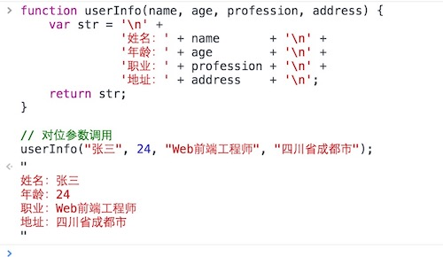
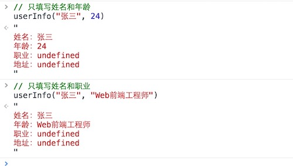
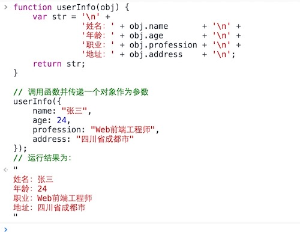
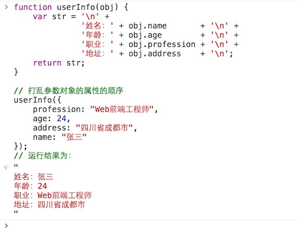
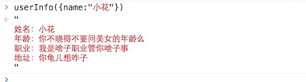
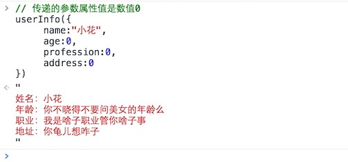

# 一、概述

  所谓“函数”，就是使用关键字“***function***”定义的一段有***独立作用域***，能被***反复执行***的语句块，或者说函数就是功能，就是某种行为，因为我们可以通过函数去做某一件事情。函数在JavaScript中也是以一种“值”的方式存在的（JS允许的六种数据类型之一），和其它数据类型相比，它是一种可以接收“***参数***”的，可运行的值，除此之外，它并没有任何的不同。

  但JavaScript作为一个“面向对象”和“函数式编程”的语言，“函数”部分自然是一个重点，而且也有一些区别于其它语言，即可以称为特色的地方。

  JavaScript函数根据不同的定义方法及功能可以分为不同的类型，大致包括基本函数、变量函数、构造函数、匿名函数、闭包以及递归函数等。接下来我们就对JS中的“函数”进行详细的学习。

# 二、函数定义

  函数利用关键字***“function”***声明，其基本的语法形式如下：

```javascript
function function_name(argument) {
	// body...
}
```

  上述语法形式中，***“function”***关键字用于定义函数，***“function_name”***用于定义函数的名字，函数名字遵守标识符的命名规则，而圆括号里面的***“argument”***表示函数参数（注意，即使没有参数，圆括号也不能省略），花括号里面的内容为函数体，即处理的逻辑。

```javascript
function sayHi() {
	console.log('Hi');
}
```

  上述代码中定义了一个函数，该函数的名字为***“sayHi”***，该函数没有设置参数，该函数的功能是打印输出一条语句，即***“Hi”***。

# 三、函数调用

  函数定义以后，并不会立即执行（匿名函数除外，匿名函数一旦创建，程序执行之后匿名函数也会自动执行），因此要执行函数，需要调用函数，我们看下面这个实例。

```javascript
function sayHi() {
	console.log('Hi');
}

sayHi(); // "Hi"
```

  上述代码定义函数之后，通过***sayHi()***对函数进行调用，控制台输出*‘Hi’*，函数调用的形式为：***function_name(argument)***，需要注意的是，即使没有参数，圆括号也不能省略。

# 四、函数参数

  我们在很早以前就已经接触过函数参数了，它是让函数可复用的关键性存在。就是当程序里很多地方都在做着同样一件事件，但只是部分需要呈现的内容不同的时候，我们就可以使用配置参数的形式来完成一个函数的功能。如在学习JavaScript之初，我们就会接触到的***“alert()”***函数和***“console.log()”***方法一样，我们只需要在使用它们的时候往该函数或方法的括号内添加我们需要显示的内容即可让它实现其功能。

## 1、参数声明

  函数参数无需指定类型，它的类型是在调用函数时，根据传递的参数值的类型所确定的，并且，函数参数无需使用***var***关键字声明，函数允许有多个参数。

```javascript
// 1、定义函数
function sayHiWith(name) {
	console.log('Hello, ' + name + '!');
}

function sumWith(a, b) {
	console.log(a + b);
}

// 2、调用函数
sayHiWith('Petter'); // "Hello, Petter!"
sumWith(10, 10);     // 20
sumWith("ab", "cd"); // "abcd"
```

  上述代码中，我们可以看到*sayHiWith*函数有一个参数*name*，*sumWith*函数有两个参数，分别是*a*、*b*，在定义函数的时候，参数的类型是不确定的，只有在调用函数的时候，类型才会确定，比如调用函数*sumWith*时，第一次调用时传入两个数字*10*，此时变量*a*、*b*的数据类型为数值型*number*，第二次调用时传入两个字符串，此时变量*a*、*b*的数据类型为字符串型*String*。

## 2、参数作用域

  在之前讲变量时我们讲到*变量的作用域*，所谓***作用域***，就是*变量起作用的范围*，全局变量的作用域为整个文件，而局部变量的作用域限定在某个范围。函数参数为*局部变量*，其起作用的范围只限于函数内部，外界不能访问。

```javascript
function test() {
	var x = 10;
}
console.log(x);
// Uncaught ReferenceError: x is not defined(…)
```

  上述代码在***test***函数内部定义了变量*x*，在函数外部访问*x*，程序报错，提示变量未定义。

## 3、实参与形参

  函数参数分为***形参***与***实参***，所谓*形参*，就是指形式参数，它并无确定的值；所谓*实参*，就是指实际参数，它有确定的值。定义函数时，圆括号内的参数为形参，调用函数时，圆括号内的参数为实参，具有确定的值。

  形参是对实参的引用，在函数内部，如果对传递的值进行修改，并不会修改原始值。

```javascript
var x = 0;
function test(n) {
	n++;
}
test(x)
console.log(x); // 0
```

  上述例子中，函数外部定义了变量*x*，在调用***test***函数时，将*x*作为实参传递给形参*n*，函数内部***n++***，变量*x*的值并未修改，依旧为*0*。

## 4、对位传参法

  既然参数可以是变量，那也可以为表达式，也可以为任意JavaScript允许的的数据类型（JS的六种数据类型），这和我们之前所接触的JavaScript提供的各种数据操作方法并没有什么不一样。所以，这样一来，参数的配置和参数的设置需要一一对位，即配置参数的顺序和函数定义参数时的顺序一致。根据这个要求参数的配置又可以分为另外几种特殊（异常）情况。

- 为函数配置了多余的参数
- 配置的参数少于预置的参数
- 配置的参数多于预置的参数
- 配置的参数与预置的参数没有对位

```javascript
// 1、为函数配置了多余的参数
function fnc_1(a, b, c) {
	return a;
} 
fnc_1(10); // 10

// 2、配置的参数少于预置的参数
function fnc_2(a, b, c) {
	return a + b + c;
} 
func_2(10, 5)l // NaN

// 3、配置的参数多于预置的参数
function fnc_3(a, b, c) {
	return a + b + c;
} 
func_3(1, 2, 3, 4, 5) // 6

// 4、配置的参数与预置的参数没有对位
function fnc_4(a, b, c) {
	return b;
} 
func_4(1) // undefined
```

  上面这种调用函数并传递参数的方式统称为“***对位传参***”。这种传递方式，在函数定义的时候，函数体内部有几个变量，那括号内就需要出现几个参数（位置没有要求，只需要保证括号内的参数名和函数体内部的变量名一致即可）。如果括号内的参数多设置了，没有什么影响，但括号内没有声明的参数，在函数内进行了使用，除非这个变量是个全局变量（或父级函数的变量，这在“闭包”中会讲到），否则就会报出变量未定义的错误。如果参数列表内已经设置了某项参数，但是在调用函数并配置参数的时候没有对该参数进行设置，那该参数的值就为undefined。如同上例中的最后一个例子（配置的参数实际上是“a”，但参数“a”并没有参与到函数内部去）。

  像上例中最后一个例子，我们想让函数将参数变量“b”返回，那我们得明文地将参数变量“a”进行设置，但设置为任何值都没有影响。如：

```javascript
function fnc_4(a, b) {
	return b;
} 
func_4(1, 2);            // 2
func_4(undefined, 2);    // 2
func_4("可以是任意值", 2); // 2
func_4( , 2);            // 程序报错
```

  我们之前提到过，参数实际上也是变量。在这个例子中，参数变量“a”无论为何值，它都没有参与到函数体的语句中去，所以函数最终的返回结果自然与它无关了。当然，函数也不会因为不曾使用过某个已经声明的变量而报错的。

  但从上面的“对位传参”的例子中可以发现一个问题，就是有的时候我们想省略某一项参数的时候，必须为省略参数至少配置一个有效值，哪怕是本来没有什么意义的“undefined”，否则会像上例中最后一个运行结果那样产生“无效标识符”的报错。这使得我们在调用一个函数时会做很多“无用功”。

  为了解决这样的问题，我们最稳妥的做法，就是一开始就为这些参数在函数内部就设定好默认值。

```javascript
function sum(a, b, c, d, e) {
	// 使用三目运算符配置默认值
	a = (a === undefined) ? 0 : a;
	b = (b === undefined) ? 0 : b;
	c = (c === undefined) ? 0 : c;
	d = (d === undefined) ? 0 : d;
	e = (e === undefined) ? 0 : e;
	return a + b + c + d + e;
}

sum(1); // 1
sum(1, 2); // 3
sum(1, 2, 3); // 6
sum(1, 2, 3, 4); // 9
sum(1, 2, 3, 4, 5); // 14
```

  这样一来，就完成了参数传递在5个以内的时候，无论是几个参数都能正确累加出结果的函数了。但在注释的时候就需要写明，最大支持的参数个数，但这通常是由项目的需求决定的（例如信用卡分期后的还款总额，其中的“分期数”就是我们参数列表中的最大值。现在一般最大的分期数是“24期”，也就是说，要实现一个不指定分期数的总额求和的函数，实际上允许最大参数个数是24个。当然，这里只是做一个参数功能的比喻，实现该功能肯定有更好的办法）。
  其实上例中的参数配置只是实现了“*依次*”的对位传参，也就是说，在只传递了1一个参数的时候，对应的是参数列表中的“a”；传递了2个参数，对一个参数对应的是“a”，第二个参数对应的是“b”，然后以此类推。这在处理数值求和运算的时候似乎是没有什么问题的，但若是用于处理类似于用户表单填写（有必填项，也有非必填项）的时候，问题就会出现了。我们还是先来看一次正常的对位传参的情况：



  如果，现在我们现在只想提供其中某几项信息，其它的不填写，就会出现下面的情况了：




## 5、对象传参法

  通过上一节最后一个例子可以发现，除非我们依次对位地填写参数，否则出现的配置结果并不会乖乖的出现在应有的位置上。可以预知的是，就算我们給它配置好默认值，它们也不会按照开发者的“意念”出现在指定的位置。要解决这样的问题，我们只能采用唯一一种可行的方式了，那就是“***对象传参法***”，对象传参法在定义函数的时候只需要配置唯一的一个参数，而在调用的时候配置的参数是一个对象。首先我们来看一个将对象作为参数传递的完整示例：



  我们先来做一个分析对比。这次函数定义的参数部分和之前通过“name,age...”设置参数列表的方式不同，这次使用了一个自定义单词“obj”（译为：对象）作为参数，而参数内部也不再是那些“name,age...”的单词，而全是改成了*“obj”（参数里列表内的那个词） + “.” + “自定义名称”*的形式。如果你对之前学习过的“对象型数据类型”还算熟悉的话，应该不难判断，这个变量就是一个对象。而在下方调用该函数时，函数内的参数应证了这一点。函数内配置的参数就是一个对象，而对象内的属性名正好与函数定时，函数体内部“obj.”之后的名称正好一一对应。为了证明函数调用时的对象属性名和函数内属性名的名称是对应的，我们来做这样一个实验，就是在调用的时候更改一下配置的顺序，再观察结果。



  通过运行的结果可以清晰地对应出来，调用的时候无论怎么更改属性的顺序，函数最终的运行结果始终是按照函数内定义的顺序进行的。单是这一点“对位传参法”就已经是办不到的了。为了提升程序的“健壮性”，我们需要对函数中的所有值都定义一个默认值，防止函数在被调用的时候没有配置对象的某一项参数（某一个属性）也能显示出“适当”的结果。

  函数声明定义部分如下：

```javascript
function userInfo(obj) {
	obj.name       = obj.name       || "名字只是个代号";
	obj.age        = obj.age        || "你不晓得不要问美女的年龄么";
	obj.profession = obj.profession || "我是啥子职业管你啥子事";
	obj.address    = obj.address    || "你龟儿想咋子";
	var str = '\n' +
	          '姓名：' + obj.name       + '\n' +
	          '年龄：' + obj.age        + '\n' +
	          '职业：' + obj.profession + '\n' +
	          '地址：' + obj.address    + '\n';
	return str;
}
```

  调用函数并传递其中某些“参数”后，运行结果如下：



  上例中，对未配置的参数属性都进行了默认值的强制显示，若不需要显示配置的参数属性，在表达式的“或”逻辑运算符“||”后方用一对空引号""替代即可。用逻辑运算符处理默认字符只限于配置属性值为“非零”（也包括会在条件语句中不会自动转换成false的值）的时候，若配置的参数对象内会出现数值计算，或需要显示数值的时候（如工龄、请假次数、迟到次数），这些值都很可能为数值0。逻辑运算符都会将其自动转换为false，直接就去使用我们默认配置的值（但默认值又是一个非0的数），这显然是一个bug。如果是这样的情况，还是建议使用“三元表达式”的形式对undefined进行严格等于的比较运算进行判断更为稳妥。下面就是当参数内的属性传递的是数值0的时候出现的异常结果。



  但是在通过对象传递参数的时候千万不要忘记一个问题，就是作为参数时值的类型仍然要分为原始值类型的“*传值传递*”和复合值类型的“*地址传递*”。再次进行说明，凡是是需要进行包装才能成为对象的，即通过“Object()”方法转换后的值不等于自身的，那它们进行的赋值操作就是“传值传递”。凡是通过“Object()”方法转换后的值仍然等于自身的，那它们进行的赋值操作就是“地址传递”。这一理论，在数据作为参数时仍然成立（其实在任何语境中都成立），需要加以注意。

  如果参数出现同名，和对变量的处理一样，采用同名参数中最后一个参数的值。

  函数也具有*length*属性，但这个属性不是用来获取函数的个数的，而是用来表示函数内参数的个数的。这个属性显示的结果是函数在定义时预置的参数个数，与被调用的时候使用的参数个数没有关系。如例：

## 6、参数属性 arguments

  在某些特定的情况下，我们根本不知道函数在调用的时候到底需要配置几个参数，如刚开始我们在讲解通过配置参数来进行求和的那个例子（最多只能配置5个参数），但在实际调用时，可能用到的参数不到5个，或者或者会超出5个。这个时候无论通过普通的“对位传参”再处理默认值的方式，还是通过“对象传参”再处理默认值的方式都基本上是行不通的。为了应对这种情况，JavaScript对函数提供了一个“arguments”对象来应对以上情况。

  我们首先要对“arguments”这个对象进行一个基本概念的了解。“arguments”对象只能出现在函数内部，在“全局空间”里该对象是无效的。该对象包含了函数运行时的所有参数，arguments[0]就是第一个参数，arguments[1]就是第二个参数，以此类推。

```javascript
function test(param) {
	console.log(arguments);
}
test(1, 2);          // [1, 2] undefined
test("a", "b", "c"); // ["a", "b", "c"] undefined
test("HTML", "CSS"); // ["HTML", "CSS"] undefined
```

  示例运行后，每次函数被调用后最后的结果都会有一个undefined，这是函数的默认返回值，我们不必理会。我们只用观察每次在调用函数“test()”时，为其配置的不同参数。还记得，之前我们在通过“对位传参”的方式调用函数时，超出原始函数预设的参数个数后，超出预设参数个数部分的参数会被忽略掉，但这次显然是没有的。因为，这次的预设参数就一个“param”，但是我们在后面进行了2次配置3个参数的调用和1次配置2个参数的调用（最后一个结果为undefined应是在清理之中）都没有出现异常，arguments对象在这里的作用想必应该能分析得出来了，也就是说它能会忽视函数定义时参数定义的个数，以实际调用时配置的参数为准，也就是说函数的括号内哪怕没有预置参数都是可以的。我们通过arguments对象的“length”属性（之前的length属性是对函数名使用的）来再次证明这一点。

```javascript
function test() {
	retutn arguments.length;
}
test({name:"Petter"}); // 1
test(1, 2);            // 2
test("a", "b", "c");   // 3
```

  通过这个例子我们就已经证明了，哪怕声明定义函数的时候没有设置参数，在调用的时候仍然可以为其配置参数（但是在实际开发中仍然建议保留那个参数，以用于说明该函数的运行是依赖参数实现的）。根据上面两个例子总结出来的特点，再根据我们之前所学的知识点，实现一个不确定位数的“求和函数”应该就不那么困难了。

  arguments对象除了可以读取参数，还可以为参数赋值。但在严格模式下不支持这种做法。


# 五、函数返回值

  每一个函数都会有一个返回值，这个返回值可以通过关键字***“return”***进行设置，若未*显示*地设置函数的返回值，那函数会默认返回一个***undefined***值

```javascript
function test() {
    console.log("Hello, world!");
}
test(); // undefined
```

  但若手动地设置了函数的返回值，即手动地设置了关键字“return”空格之后的值后，函数将不再会返回undefined了，而是返回开发者手动设置的那个值。

```javascript
function getNum() {
	return 10;
}
getNum(); // 10
```

  ***return***关键字，除了能够返回值以为，另外一个作用便是终止函数，***return***关键字后的代码不会执行。

```javascript
var getNum() {
	return 10;
	console.log("Hello, world!"); // 该语句不会被执行
}
getNum(); 
// 10
```

  ***return***关键字可以是变量也可以是表达式，甚至可以是数组或对象，只要符合JavaScript六种基本数据类型，都可以返回。

```javascript
// 1、返回值为变量
function func_1() {
	var a = 10;
	return a;
}
// 2、返回值为表达式
function func_2() {
	var a = 10, b = 10;
	return a + b;
}
// 3、返回值为数组
function func_3() {
	return [1, 2, 3];
}
// 4、返回值为对象
function func_4() {
	return {name:"Petter", age:23}
}
// 5、返回值为布尔类型的值
function func_5() {
	return true;
}
```

  函数返回值只能是一个，不能有多个返回值，否则程序报错，如果要返回多个值，可以用数组或对象。

```javascript
// 以数组形式返回
function minAndMaxNumInArr(arr) {
	var min = arr[0];
	var max = arr[0];
	for(var i = 0; i < arr.length; i++) {
		max = arr[i] > max ? arr[i] : max;
		min = arr[i] < min ? arr[i] : min;
	}
	return [min, max];
}

// 以对象形式返回
function minAndMaxNumInArr(arr) {
	var min = arr[0];
	var max = arr[0];
	for(var i = 0; i < arr.length; i++) {
		max = arr[i] > max ? arr[i] : max;
		min = arr[i] < min ? arr[i] : min;
	}
	return {minNum:min, maxNum:max};
}
```


# 六、函数名的提升

  JavaScript引擎将函数名视同变量名，所以采用***function***命令声明函数时，整个函数会像变量声明一样，被提升到代码头部。所以，下面的代码不会报错。

```javascript
sayHello();
// "Hello, world!"
function sayHello() {
	console.log("Hello, world!");
}
```

  上述代码中，函数的调用在函数定义之前，但是由于***变量提升***，函数*sayHello*被提升到了代码头部，也就是在调用之前已经声明了。但是，如果采用赋值语句定义函数，JavaScript就会报错。

```javascript
f();
var f = function (){};
// TypeError: undefined is not a function
```

  上面的代码等同于下面的形式。

```javascript
var f;
f();
f = function () {};
```

  上面代码第二行，调用*f*的时候，*f*只是被声明了，还没有被赋值，等于*undefined*，所以会报错。因此，如果同时采用*function*命令和赋值语句声明同一个函数，最后总是采用赋值语句的定义。

```javascript
var f = function() {
  console.log('1');
}

function f() {
  console.log('2');
}

f() // 1
```

  如果函数名重复，则后定义的函数会覆盖之前定义的函数。

```javascript
function sayHello() {
	console.log("Hello, world!");
}
function sayHello() {
	console.log("Hello, China!");
}

sayHello();
// "Hello, China!"
```

# 七、其他函数类型

## 1、变量函数

## 2、构造函数

## 3、匿名函数

## 4、闭包函数

## 5、递归函数


