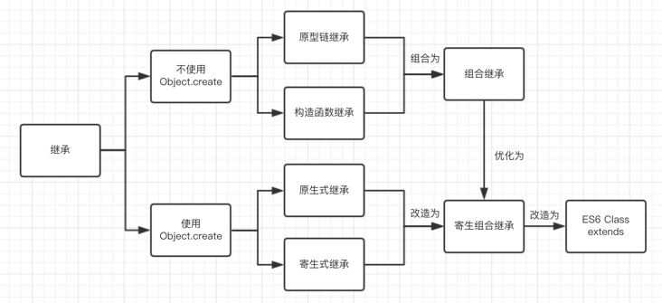

# 一、概述

## 1. 什么是对象？

对象（Object）是JavaScript的核心概念，也是最重要的数据类型。JavaScript的所有数据都可以被视为对象。简单说，所谓对象，就是一种 **无序** 的数据集合，由若干个“ **键值对** ”（key-value，亦称属性名值对）构成。

JavaScript支持面 **向对象编程** ，虽然不同于传统的面向对象编程语言，但是JavaScript具有很强的面向对象编程能力。“面向对象编程”（Object Oriented Programming，缩写为OOP）是目前主流的编程范式。它的核心思想是将真实世界中各种复杂的关系，抽象为一个个对象，然后由对象之间的分工与合作，完成对真实世界的模拟。

传统的过程式编程（procedural programming）由一系列函数或一系列指令组成，而面向对象编程的程序由一系列对象组成。每一个对象都是功能中心，具有明确分工，可以完成接受信息、处理数据、发出信息等任务。因此，面向对象编程具有灵活性、代码的可重用性、模块性等特点，容易维护和开发，非常适合多人合作的大型软件项目。

那么，对象到底是什么？我们从两个层次来理解。

- **“对象”是单个实物的抽象。**

  一本书、一辆汽车、一个人都可以是“对象”，一个数据库、一张网页、一个与远程服务器的连接也可以是“对象”。当实物被抽象成“对象”，实物之间的关系就变成了“对象”之间的关系，从而就可以模拟现实情况，针对“对象”进行编程。

- **“对象”是一个容器，封装了“属性”（property）和“方法”（method）。**

  所谓“属性”，就是对象的状态；所谓“方法”，就是对象的行为（完成某种任务）。比如，我们可以把动物抽象为Animal对象，“属性”记录具体是那一种动物，“方法”表示动物的某种行为（奔跑、捕猎、休息等等）。

## 2. 三大特征

- **封装**，就是把客观事物封装成抽象的类，并且类可以把自己的数据和方法只让可信的类或者对象操作，对不可信的进行信息隐藏。一个类就是一个封装了数据以及操作这些数据的代码的逻辑实体。在一个对象内部，某些代码或某些数据可以是私有的，不能被外界访问。通过这种方式，对象对内部数据提供了不同级别的保护，以防止程序中无关的部分意外的改变或错误的使用了对象的私有部分。
- **继承**，指可以让某个类型的对象获得另一个类型的对象的属性和方法。它支持按级分类的概念。继承是指这样一种能力：它可以使用现有类的所有功能，并在无需重新编写原来的类的情况下对这些功能进行扩展。通过继承创建的新类称为“子类”或“派生类”，被继承的类称为“基类”、“父类”或“超类”。继承的过程，就是从一般到特殊的过程。要实现继承，可以通过 “继承”（Inheritance）和“组合”（Composition）来实现。继承概念的实现方式有二类：实现继承与接口继承。实现继承是指直接使用基类的属性和方法而无需额外编码的能力；接口继承是指仅使用属性和方法的名称、但是子类必须提供实现的能力。
- **多态**，是指一个类实例的相同方法在不同情形有不同表现形式。多态机制使具有不同内部结构的对象可以共享相同的外部接口。这意味着，虽然针对不同对象的具体操作不同，但通过一个公共的类，它们（那些操作）可以通过相同的方式予以调用。（比如输入的形参可以不同等去实现同一个方法从而得到不同的表现形式）

## 3. 六大基本原则

SRP,OCP,LSP,DIP,ISP,LoD

**1）单一职责原则SRP(Single Responsibility Principle)**

是指 `一个类的功能要单一，不能包罗万象`。如同一个人一样，分配的工作不能太多，否则一天到晚虽然忙忙碌碌的，但效率却高不起来。

**2）开放封闭原则OCP(Open－Close Principle)**

`一个模块在扩展性方面应该是开放的而在更改性方面应该是封闭的`。比如：一个网络模块，原来只服务端功能，而现在要加入客户端功能，那么应当在不用修改服务端功能代码的前提下，就能够增加客户端功能的实现代码，这要求在设计之初，就应当将服务端和客户端分开，公共部分抽象出来。

**3）里式替换原则LSP(the Liskov Substitution Principle LSP)**

`子类应当可以替换父类并出现在父类能够出现的任何地方`。（比如父类public，子类一定是public）比如：公司搞年度晚会，所有员工可以参加抽奖，那么不管是老员工还是新员工，也不管是总部员工还是外派员工，都应当可以参加抽奖，否则这公司就不和谐了。

**4）依赖倒置原则DIP(the Dependency Inversion Principle DIP)**

A、高层次的模块不应该依赖于低层次的模块，<u>他们都应该依赖于抽象</u>。

B、抽象不应该依赖于具体实现，具体实现应该依赖于抽象。

> 具体依赖抽象，上层依赖下层。高层模块就是调用端，底层模块就是具体实现类。（应该让底层模块定义抽象接口并且实现，让高层模块调用抽象接口，而不是直接调用实现类）

通俗来讲：依赖倒置原则的本质就是通过抽象（接口或抽象类）使个各类或模块的实现彼此独立，互不影响，实现模块间的低耦合。

问题描述：类A直接依赖类B，假如要将类A改为依赖类C，则必须通过修改类A的代码来达成。这种场景下，类A一般是高层模块，负责复杂的业务逻辑；类B和类C是低层模块，负责基本的原子操作；假如修改类A，会给程序带来不必要的风险。

解决方案：将类A修改为依赖接口interface，类B和类C各自实现接口interface，类A通过接口interface间接与类B或者类C发生联系，则会大大降低修改类A的几率。（比如A依赖于车的轮胎，速度，牌子等接口，然后让B，C直接实现这些接口的方法，A间接通过接口与BC发生联系。）

好处：依赖倒置的好处在小型项目中很难体现出来。但在大中型项目中可以减少需求变化引起的工作量。使并行开发更友好。

**5）接口分离原则ISP(the Interface Segregation Principle ISP)**

`模块间要通过抽象接口隔离开，而不是通过具体的类强耦合起来，即面向接口编程`。（提供接口，给其他模块调用）

核心思想：类间的依赖关系应该建立在最小的接口上通俗来讲：建立单一接口，不要建立庞大臃肿的接口，尽量细化接口，接口中的方法尽量少。

> 也就是说，我们要为各个类建立专用的接口，而不要试图去建立一个很庞大的接口供所有依赖它的类去调用。

问题描述：类A通过接口interface依赖类B，类C通过接口interface依赖类D，如果接口interface对于类A和类C来说不是最小接口，则类B和类D必须去实现他们不需要的方法。

需注意：接口尽量小，但是要有限度。对接口进行细化可以提高程序设计灵活性，但是如果过小，则会造成接口数量过多，使设计复杂化。所以一定要适度提高内聚，减少对外交互。使接口用最少的方法去完成最多的事情为依赖接口的类定制服务。只暴露给调用的类它需要的方法，它不需要的方法则隐藏起来。只有专注地为一个模块提供定制服务，才能建立最小的依赖关系。

**6）迪米特法则（Law of Demeter,简称LoD）**

核心思想：类间解耦。

通俗来讲：一个类对自己依赖的类知道的越少越好。自从我们接触编程开始，就知道了软件编程的总的原则：`低耦合，高内聚`。无论是面向过程编程还是面向对象编程，只有使各个模块之间的耦合尽量的低，才能提高代码的复用率。


> **耦合是：**简单地说，软件工程中对象之间的耦合度就是对象之间的依赖性。指导使用和维护对象的主要问题是对象之间的多重依赖性。对象之间的耦合越高，维护成本越高。因此对象的设计应使类和构件之间的耦合最小。有软硬件之间的耦合，还有软件各模块之间的耦合。耦合性是程序结构中各个模块之间相互关联的度量。它取决于各个模块之间的接口的复杂程度、调用模块的方式以及哪些信息通过接口。

耦合可以分为以下几种，它们之间的耦合度由高到低排列如下：

1）内容耦合：当一个模块直接修改或操作另一个模块的数据时，或一个模块不通过正常入口而转入另一个模块时，这样的耦合被称为内容耦合。内容耦合是最高程度的耦合，应该避免使用之。

2）公共耦合：两个或两个以上的模块共同引用一个全局数据项，这种耦合被称为公共耦合。在具有大量公共耦合的结构中，确定究竟是哪个模块给全局变量赋了一个特定的值是十分困难的。

3）外部耦合：一组模块都访问同一全局简单变量而不是同一全局数据结构，而且不是通过参数表传递该全局变量的信息，则称之为外部耦合。

4）控制耦合：一个模块通过接口向另一个模块传递一个控制信号，接受信号的模块根据信号值而进行适当的动作，这种耦合被称为控制耦合。

5）标记耦合：若一个模块A通过接口向两个模块B和C传递一个公共参数，那么称模块B和C之间存在一个标记耦合。

6）数据耦合：模块之间通过参数来传递数据，那么被称为数据耦合。数据耦合是最低的一种耦合形式，系统中一般都存在这种类型的耦合，因为为了完成一些有意义的功能，往往需要将某些模块的输出数据作为另一些模块的输入数据。

7）非直接耦合：两个模块之间没有直接关系，它们之间的联系完全是通过主模块的控制和调用来实现的。

> 总结：耦合是影响软件复杂程度和设计质量的一个重要因素，在设计上我们应采用以下原则：如果模块间必须存在耦合，就尽量使用数据耦合，少用控制耦合，限制公共耦合的范围，尽量避免使用内容耦合。

同一个模块内的各个元素之间要高度紧密，但是各个模块之间的相互依存度却要不那么紧密。

# 二、创建对象

## 1. 原始模式 *

```javascript
// 1、原始模式，Object构造函数方式
var per = new Object();
per.name = "Muzili";
per.age = 32;
per.showName = function() {
  console.log(this.name);
}

// 2、原始模式，对象字面量方式 *
var per = {
  name: 'Muzili',
  age: 32,
  showName: function() {
    console.log(this.name);
  }
}
```

> 优势：创建单一对象时比较快捷方便。
>
> 缺陷：当我们要创建批量对象时，代码过于冗余。脱离对象原型。

> 提问：new 操作符具体做了什么事情？
>
> 1、创建一个空对象，并且 this 变量引用该对象，同时还继承了该函数的原型。
>
> 2、属性和方法被加入到 this 引用的对象中。
>
> 3、新创建的对象由 this 所引用，并且最后隐式的返回 this 。

## 2. 工厂模式

```javascript
function createPerson(name, age) {
	var obj = new Object();
	obj.name = name;
	obj.age  = age;
	obj.showName = function() {
		console.log(obj.name);
	}
	return obj;
}

var obj1 = createPerson('张三', 22);
var obj2 = createPerson('李四', 28);
```

> 优势：批量化生产，便捷方便。
>
> 缺陷：脱离对象原型。

## 3. 构造函数

```javascript
function Person(name, age) {
	this.name = name,
	this.age  = age,
	this.showName = function() {
		console.log(this.name);
	}
}
var per1 = new Person("张三", 22);
var per2 = new Person("李四", 28);
```

上面代码中，**Person** 就是构造函数，它提供模板，用来生成对象实例。为了与普通函数区别，构造函数名字的第一个字母通常大写。

构造函数的特点有两个。

- 函数体内部使用了 `this` 关键字，代表了所要生成的对象实例。
- 生成对象的时候，必需用 `new` 命令调用 `Person` 函数。

> 优势：对象实例拥有对象原型（ `constructor` ）
>
> ```javascript
> console.log(per1.constructor === Person); // true
> console.log(per2.constructor === Person); // true
> ```
> 缺陷：内存浪费

Javascript还提供了一个`instanceof` 运算符，验证原型对象与实例对象之间的关系。

```javascript
console.log(per1 instanceof Person); // true
console.log(per2 instanceof Person); // true
```

## 3. 原型模式

Javascript规定，每一个构造函数都有一个 `prototype` 属性，指向另一个对象。**这个对象的所有属性和方法，都会被构造函数的实例继承**。意味着，我们可以把那些不变的属性和方法，直接定义在`prototype`对象上。

```javascript
// 1、原型模式，直接定义prototype属性
function Person(){};
Person.prototype.name = "Muzili";
Person.prototype.age = 28;
Person.prototype.showName = function() {
  console.log(this.name);
}

// 2、原型模式，字面量定义方式
function Person () {}
Person.prototype = {
  name: 'Muzili',
  age: 28,
  showName: function () {
    console.log(this.name);
  },
};
var p1 = new Person(); // name='Muzili'
var p2 = new Person(); // name='Muzili'
```

## 5. 混合模式（构造 + 原型） *

```javascript
// 原型构造组合模式，
function Person(name, age) {
  this.name = name;
  this.age = age;
}

Person.prototype = {
  nationality: "China",
  showName: function() {
    console.log(this.name);
  }
}

var per1 = new Person("张三", 28);
var per2 = new Person("李四", 29);
```

> 提示：做法是将需要独立的属性方法放入构造函数中，而可以共享的部分则放入原型中，这样做可以最大限度节省内存而又保留对象实例的独立性。

# 三、属性与方法 *

## 1. 属性

在对象中，变量被认为是属性。属性向我们描述对象，比如王者荣耀一个英雄有名字、技能属性：

```javascript
// 1、键值对
var hero = {
  name: '李白',
  skill: '青莲剑歌',
};
// 2、点语法
var hero = {};
hero.name = '李白';
hero.skill = '青莲剑歌';

// 3、表达式
var hero = {};
hero['hero' + 'Name'] = '李白'; // === hero.heroName = "李白";
```

**访问对象属性**，主要有两种方法：

- 点语法，其语法形式为：`Obj.prop_name`，如  `hero.name`
- 下标法，其语法形式为：`Obj["prop_name"]`，如  `hero["name"]`

## 2. 方法

在对象中，函数被认为是方法。方法代表和对象相关的任务。例如一部车可以加速或减速行驶。

```javascript
var car = {
  // 属性
  brand: '东风本田',
  color: '珍珠白',
  model: '思域',
  // 方法
  speedUp: function () {
    console.log('正在加速！');
  },
  slowDown: function () {
    console.log('正在减速！');
  },
};
```

**访问对象方法**，直接通过点语法即可访问，其语法形式：`Obj.function_name()`，如  `car.speedUp()`

# 四、对象操作 *

对于数据操作来讲，无非就是四种操作“增、删、改、查”。对于对象来讲，“**增**” 就是为一个对象新增一个之前不存在的属性名，然后进行赋值；“**改**” 就是对对象已经存在的属性名进行重新赋值，达到一个修改原始对象的效果；而 “**查**” 就是简单地通过对象的属性名访问即可。这些我们之前都讲解过，但对于 “**删**”来讲稍微有些特殊，需要用到关键字 “`delete`” 进行操作，为了说明问题，我们还是对这些操作进行回顾并在其中列出delete的使用方式。原对象如下：

```javascript
var phone = {
  brand: '华为',
  model: 'P30 Pro',
  pubDate: '2019年4月10日',
};

{ brand: '华为', model: 'P30 Pro', pubDate: '2019年4月10日' }
```

## 1. 增

```javascript
phone.postAddress = "上海东方体育中心";

{
  brand: '华为',
  model: 'P30 Pro',
  pubDate: '2019年4月10日',
  postAddress: '上海东方体育中心'
}
```

## 2. 删

```javascript
delete phone.postAddress; 

{ brand: '华为', model: 'P30 Pro', pubDate: '2019年4月10日' }
```

## 3. 改

```javascript
phone.pubDate = "2019年4月11日";

{ brand: '华为', model: 'P30 Pro', pubDate: '2019年4月11日' }
```

## 4. 查

```javascript
phone.model;
P30 Pro
```

# 五、原型链 *

每个实例对象都有一个私有属性（称之为`__proto__` ）指向它的构造函数的原型对象（`prototype` ）。该原型对象也有一个自己的原型对象(`__proto__`) ，层层向上直到一个对象的原型对象为 `null`。

根据定义，`null` 没有原型，并作为这个**原型链**中的最后一个环节。

```javascript
function Person(name, age) {
    this.name = name;
    this.age  = age;
}
var per = new Person("Admin", 28);
console.log(per.__proto__);  // Person.prototype
console.log(per.__proto__.__proto__);  // Object.prototype
console.log(per.__proto__.__proto__.__proto__); // null
```


> 注意：
>
> 1. 只有函数才有prototype。
> 2. prototype 原型对象包括了共享的属性、方法以及构造函数。
> 3. 上述示例中，`per` 实例对象，`Person.prototype` 原型对象，`Person` 构造函数。
> 4. `prototype.constructor`  指向构造函数。

# 六、对象继承 *



## 1. 原型链继承

核心：将父类的实例作为子类的原型

```javascript
// -- 父类
function Person(name, age) {
  this.name = name || 'unknow';
  this.age = age || 0;
}
Person.prototype.say = function() {
  console.log("I'm person!");
}
// -- 子类
function Student(name) {
  this.name = name;
  this.major = '软件技术';
}

// -- 继承必须要写在子类方法定义的前面，否则子类定义的方法会被覆盖
Student.prototype = new Person();
Student.prototype.study = function() {
  console.log("I'm studing!");
}


var stu = new Student('张三');
console.log(stu.name);  // 子类覆盖父类的属性
console.log(stu.age);   // 父类属性
console.log(stu.major); // 子类自己的属性 
stu.say();              // 继承自父类的方法
stu.study();            // 子类自己的方法
```

以上代码就是原型链继承的实现了，但是原型链继承有一个缺点，就是属性如果是引用类型的话，会共享引用类型，请看以下代码：

```javascript
// -- 父类
function Person() {
  this.hobbies = ['music','reading']
}

// -- 子类
function Student(name) {}

// -- 继承
Student.prototype = new Person();

var stu1 = new Student();
var stu2 = new Student();

stu1.hobbies.push("game");
console.log(stu1.hobbies); // [ 'music', 'reading', 'game' ]
console.log(stu2.hobbies); // [ 'music', 'reading', 'game' ]
```

我们可以看到，当我们改变 `stu1` 的引用类型的属性时，`stu2` 对应的属性也会跟着更改，这就是原型链继承缺点：**引用属性会被所有实例共享**。

**总结**

1）优点：父类方法可以复用

2）缺陷：

- 父类的引用属性会被所有子类实例共享
- 子类构建实例时不能向父类传递参数

## 2. 构造函数继承

要解决原型链继承的缺陷，我们可以借用构造函数继承。

核心：将父类构造函数的内容复制给了子类的构造函数。这是所有继承中唯一一个不涉及到 `prototype` 的继承。

```javascript
// -- 父类
function Person() {
  this.hobbies = ['music','reading']
}

// -- 子类
function Student(name) {
  // 通过call / apply实现继承
  Person.call(this, arguments);
  this.name = name;
}

var stu1 = new Student();
var stu2 = new Student();

stu1.hobbies.push("game");
console.log(stu1.hobbies); // [ 'music', 'reading', 'game' ]
console.log(stu2.hobbies); // [ 'music', 'reading' ]
```

构造函数解决了引用类型被所有实例共享的问题，但正是因为解决了这个问题，导致另一个很矛盾的问题出现了。

由于函数也是引用类型，所以函数也没办法共享了，也就是说，每个实例里面的函数，虽然功能一样，但是却不是同一个函数，就相当于我们每实例化一个子类，就复制了一遍函数代码。

```javascript
// -- 父类
function Person(name) {
  this.name = name;
  this.sayHi = function() {
    console.log("Hi");
  }
}

// -- 子类
function Student(name) {
  Person.call(this, name);
}

var stu1 = new Student("张三");
var stu2 = new Student("李四");

console.log(stu1);
console.log(stu2);
console.log(stu1.sayHi === stu2.sayHi);

Student { name: '张三', sayHi: [Function (anonymous)] }
Student { name: '李四', sayHi: [Function (anonymous)] }
false
```

以上代码可以证明，父类的函数，在子类的实例下是不共享的。

**总结：**

1）优点：

- 父类的引用属性不会被共享
- 子类构建实例时可以向父类传递参数

2）缺点：父类的方法不能复用，子类实例的方法每次都是单独创建的。

## 3. 组合继承

从上表的示例中我们可以看出 原型链继承 和 构造函数继承 这两种继承方式的优缺点刚好是互相矛盾的，那么我们有没有办法鱼和熊掌兼得呢？答案是肯定的，那就是使用组合继承把它们组合起来。

组合继承，就是各取上面两种继承的长处，普通属性 使用 构造函数继承，函数 使用 原型链继承，这个代码稍微复杂一点，不过相信有了上面的基础后，看起来也是很轻松。

```javascript
// -- 父类
function Person() {
  this.hobbies = ['music','reading']
}
Person.prototype.sayHi = function() {
  console.log('Hi');
}

// -- 子类
function Student(name) {
  Person.call(this, name);        // 构造函数继承(继承属性)
}
Student.prototype = new Person(); // 原型链继承(继承方法)

var stu1 = new Student();
var stu2 = new Student();

stu1.hobbies.push("game");
console.log(stu1.hobbies); // [ 'music', 'reading', 'game' ]
console.log(stu2.hobbies); // [ 'music', 'reading' ]
console.log(stu1.sayHi === stu2.sayHi); // true
```

这样，我们就既能实现属性的独立，又能做到函数的共享，是不是很完美呢?

**总结：**

1）优点

- 父类的方法可以被复用
- 父类的引用属性不会被共享
- 子类构建实例时可以向父类传递参数

2）缺点：调用了两次父类的构造函数，第一次给子类的原型添加了父类的 `hobbies` 属性，第二次又给子类的构造函数添加了父类的 `hobbies` 属性，从而覆盖了子类原型中的同名参数。这种被覆盖的情况造成了性能上的浪费。

## 4. 原型式继承

核心：原型式继承的object方法本质上是对参数对象的一个浅复制。
优点：父类方法可以复用
缺点：

- 父类的引用属性会被所有子类实例共享
- 子类构建实例时不能向父类传递参数

```javascript
function object(o) {
  function F() {}
  F.prototype = o;
  return new F();
}

var person = {
  name: '张三',
  hobbies: ['music', 'reading']
};

var p1 = object(person);
p1.name = '李四';
p1.hobbies.push('reading');

var p2 = object(person);
p2.name = '赵二';
p2.hobbies.push('swim');
console.log(person.hobbies); // [ 'music', 'reading', 'reading', 'swim' ]
```

> ECMAScript 5 通过新增 `Object.create()` 方法规范化了原型式继承。其语法形式如下：`Object.create(proto，[propertiesObject])`
>
> - `proto`：新创建对象的原型对象。
> - `propertiesObject`：为新对象定义额外属性的对象
>
> 在传入一个参数的情况下， `Object.create()`与 `object()` 方法的行为相同。——《JAVASCript高级编程》

所以上文中代码可以转变为：

```javascript
var p1 = object(person); // === var p1 = Object.create(person);
```

## 5. 寄生式继承

核心：使用原型式继承获得一个目标对象的浅复制，然后增强这个浅复制的能力。
优缺点：仅提供一种思路，没什么优点

```javascript

function object(o) {
  function F() {}
  F.prototype = o;
  return new F();
}
function createAnother(original) {
  var clone = object(original); // 通过调用函数创建一个新对象
  clone.sayHi = function () {
    // 以某种方式来增强这个对象
    console.log('Hi');
  };
  return clone; // 返回这个对象
}

var person = {
  name: 'Nicholas',
  colors: ['red', 'green', 'blue'],
};

var anotherPerson = createAnother(person);
anotherPerson.sayHi(); // "Hi"
```

## 6. 寄生组合继承

刚才说到组合继承有一个会两次调用父类的构造函数造成浪费的缺点，寄生组合继承就可以解决这个问题。

所谓寄生组合式继承，即通过借用构造函数来继承属性，通过原型链的混成形式来继承方法。

- 实现思路： 不必为了指定子类型的原型而调用父类的构造函数，我们所需要的无非就是父类原型的一个副本而已
- 本质上，就是使用寄生式继承来继承父类的原型，然后再将结果指定给子类的原型。

```javascript
function $extends(subType, superType) {
  var prototype = Object.create(superType.prototype); // 创建对象
  prototype.constructor = subType; // 增强对象
  subType.prototype = prototype; // 指定对象
}
```

上述示例代码中，函数接收两个参数：子类构造函数和父类构造函数。在函数内部：

- 第一步是创建父类原型的一个副本。
- 第二步是为创建的副本添加 `constructor`  属性，从而弥补因重写原型而失去的默认的 `constructor` 属性。
- 最后一步，将新创建的对象（即副本）赋值给子类型的原型。

```javascript
function $extends(subType, superType) {
  var prototype = Object.create(superType.prototype); // 创建对象，创建父类原型的一个副本
  prototype.constructor = subType; // 增强对象，弥补因重写原型而失去的默认的constructor 属性
  subType.prototype = prototype;  // 指定对象，将新创建的对象赋值给子类的原型
}

// -- 父类初始化实例属性和原型属性
function SuperType(name) {
  this.name = name;
  this.colors = ['red', 'blue', 'green'];
}

SuperType.prototype.sayName = function () {
  console.log(this.name);
};

// -- 借用构造函数传递增强子类实例属性（支持传参和避免篡改）
function SubType(name, age) {
  SuperType.call(this, name);
  this.age = age;
}
// 将父类原型指向子类
$extends(SubType, SuperType);
// 新增子类原型属性
SubType.prototype.sayAge = function () {
  console.log(this.age);
};

var instance1 = new SubType("张三", 23);
var instance2 = new SubType("李四", 23);

instance1.colors.push("2"); // ["red", "blue", "green", "2"]
instance1.colors.push("3"); // ["red", "blue", "green", "3"]

```

上述代码的高效率体现在它只调用了一次 `SuperType` 构造函数，并且因此避免了在 SubType. prototype 上面创建不必要的、多余的属性。与此同时，原型链还能保持不变；因此，还能够正常使用 `instanceof` 和 `isPrototypeOf()`，这是一种完美的继承方式。

## 7. ES6 Class extends

核心： ES6继承的结果和寄生组合继承相似，本质上，ES6继承是一种语法糖。但是，寄生组合继承是先创建子类实例this对象，然后再对其增强；而ES6先将父类实例对象的属性和方法，加到this上面（所以必须先调用super方法），然后再用子类的构造函数修改this。

```javascript
class A {}

class B extends A {
  constructor() {
    super();
  }
}
```

ES6实现继承的具体原理：

```javascript
class A {}

class B {}

Object.setPrototypeOf = function (obj, proto) {
  obj.__proto__ = proto;
  return obj;
};

// B 的实例继承 A 的实例
Object.setPrototypeOf(B.prototype, A.prototype);

// B 继承 A 的静态属性
Object.setPrototypeOf(B, A);
```

ES6继承与ES5继承的异同：
1）相同点：本质上ES6继承是ES5继承的语法糖
2）不同点：

- ES6继承中子类的构造函数的原型链指向父类的构造函数，ES5中使用的是构造函数复制，没有原型链指向。
- ES6子类实例的构建，基于父类实例，ES5中不是。

# 七、对象的引用 *

如果不同的变量名指向同一个对象，那么它们都是这个对象的引用，也就是说指向同一个内存地址。修改其中一个变量，会影响到其他所有变量。

```javascript
var car = {
	brand: "东风本田",
	model: "思域",
	color: "珍珠白"
};
var obj = car;
obj
// {brand: "东风本田", model: "思域", color: "珍珠白"}

obj.color = "炫动蓝";

obj
// {brand: "东风本田", model: "思域", color: "炫动蓝"}
car
// {brand: "东风本田", model: "思域", color: "炫动蓝"}
```

如果取消某一个变量对原对象的引用，不会影响到另一个变量。

```javascript
obj = null;
console.log(obj); // null
console.log(car); // { brand: '东风本田', model: '思域', color: '炫动蓝' }
```

# 八、数据类型嵌套使用 *

在实际开发过程中，通常会通过 `ajax` 向后台服务器发送请求，后台服务器一般返回 `json` 数据格式，json 数据格式的结构就是多种数据类型嵌套的一种形式，外层一般是对象或数组，接下来我们模拟一个登陆成功返回的数据形式，如下所示：

```js
var response = {
  status: 200,
  data: {
    username: 'lihy_online@163.com',
    age: 28,
    nikename: '木子李',
    tel: '152-2888-5771',
    isVip: true,
    tags: ['IT', '吉他', '烹饪', '老司机'],
  },
};
```

从上述代码中可以看出，res对象里面可以嵌套字符串、数值、数组、布尔值甚至还可以是一个对象，实际返回数据可能比这个更复杂。我们要做的事情是要学会读取这种复杂结构下的数据，比如我们要访问 ”老司机“，代码如下：

```javascript
res.data.tags[3]
```

在实际开发中，我们可以在代码中找到该对象，在该对象的后面输入 debugger，打开谷歌浏览器，鼠标右键，在控制台进行调试取值。

# 九、[Object](https://developer.mozilla.org/zh-CN/docs/Web/JavaScript/Reference/Global_Objects/Object)

## 1. [Object.defineProperty()](https://developer.mozilla.org/zh-CN/docs/Web/JavaScript/Reference/Global_Objects/Object/defineProperty)

数据劫持：该方法会直接在一个对象上定义一个新属性，或者修改一个对象的现有属性， 并返回这个对象。

语法形式如下：

```javascript
Object.defineProperty(obj, prop, descriptor)
```

语法解读：

- `obj`：操作「对象」。
- `prop`：要定义或修改的「属性名称」。
- `descriptor`：将被定义或修改的「属性描述符」

对象属性一般来说可以修改也可以删除，使用 `Object.defineProperty()` 定义属性，通过描述符的设置可以进行更精准的对象属性控制。

**# 属性描述符**

通过 `Object.defineProperty()` 为对象定义属性，有两种形式，**且不能混合使用**，分别为数据描述符，存取描述符，下面分别描述下两者的区别：

**① 数据描述符**
| 属性           | 默认值      | 属性描述                                                     |
| -------------- | ----------- | ------------------------------------------------------------ |
| `value`        | `undefined` | 该属性对应的值。可以是任何有效的 JavaScript 值（数值，对象，函数等）。 |
| `writable`     | `false`     | 是否允许编辑                                                 |
| `configurable` | `false`     | 是否允许配置（改变属性的描述符 / 属性是否可以从对象上删除 `delete`） |
| `enumerable`   | `false`     | 是否出现在对象的枚举属性中                                   |

```js
let Person = {};
Object.defineProperty(Person, "name", {
    value: "Muzili", // 属性值
    writable: true // 是否可以改变，默认为false
});
```

**② 存取描述符：set、get**

```js
let Person = {
    desc: ""
};
Object.defineProperty(Person, "name", {
    get: function() {
        return "Muzili";
    },
    set: function(val) {
        this.desc =  `Hello, I'm ${val}`;
    }
});

Person.name;
"Muzili"
Person.name = "Li-HONGYAO";
"Li-HONGYAO"
Person.desc
"Hello, I'm Li-HONGYAO"
```

**# 数据描述符与存取描述均可使用的描述符**

1. `configrable`：描述属性是否配置，以及可否删除
2. `enumerable` ：描述属性是否会出现在`for in` 或者 `Object.keys()` 的遍历中

## 2. [Object.preventExtensions(obj)](https://developer.mozilla.org/zh-CN/docs/Web/JavaScript/Reference/Global_Objects/Object/preventExtensions)

禁止对象扩展属性。

```js
let Person = {
  name: 'Muzili',
};
// 禁止扩展
Object.preventExtensions(Person);
// 不过仍然可以进行配置
Object.defineProperty(Person, 'name', {
  value: 'Li-HONGYAO',
  writable: false,
  configurable: false,
});
Person.name;
('Li-HONGYAO');
// 只是不能进行属性扩展
Person.tel = '17398888669';
Person.tel;
('17398888669');
```

## 3. Object.prototype.toString.call()

通过此方法可以精确匹配对象类型：

```js
function toRawType (target) {
  return Object.prototype.toString.call(target).slice(8, -1).toLowerCase();
}

console.log(toRawType([])); // array
console.log(toRawType({})); // object
console.log(toRawType("")); // string
console.log(toRawType(false)); // boolean
console.log(toRawType(0)); // number
console.log(toRawType(function(){})); // function
```

## 4. [Object.seal(obj)](https://developer.mozilla.org/zh-CN/docs/Web/JavaScript/Reference/Global_Objects/Object/seal)

`Object.seal()` 会创建一个密封的对象，这个方法实际上会在一个现有对象上调用 `object.preventExtensions()` 并把所有现有属性标记为`configurable:false`。

```js
let Person = {
    name: "Muzili"
};
Object.seal(Person);
Person.age = 20;
Person;
{name: "Muzili"}
```

所以， 密封之后不仅不能添加新属性，也不能重新配置或者删除任何现有属性（虽然可以改属性的值）。

## 5. [Object.freeze(obj)](https://developer.mozilla.org/zh-CN/docs/Web/JavaScript/Reference/Global_Objects/Object/freeze)

`Object.freeze()` 会创建一个 **冻结** 对象，这个方法实际上会在一个现有对象上调用 `Object.seal()` ,并把所有现有属性标记为 `writable: false`，这样就无法修改它们的值。

## 6. [Obejct.entries(obj)](https://developer.mozilla.org/zh-CN/docs/Web/JavaScript/Reference/Global_Objects/Object/entries)

返回一个数组，其元素是与直接在`object`上找到的可枚举属性键值对相对应的数组。属性的顺序与通过手动循环对象的属性值所给出的顺序相同。

```js
let Person = {
    name: "Muzili",
    job: "前端工程师",
    gender: "男"
};
for(var [key, value] of Object.entries(Person)) {
    console.log(`${key}:${value}`);
};
name:Muzili
job:前端工程师
gender:男
```

## 7. [Object.assign()](https://developer.mozilla.org/zh-CN/docs/Web/JavaScript/Reference/Global_Objects/Object/assign)

`Object.assign()` 方法用于将所有可枚举属性的值从一个或多个源对象分配到目标对象。它将返回目标对象。简单理解就是合并对象：

```javascript
var o1 = { name: 'Muzili' };
var o2 = { major: '软件技术', name: '张三'};

var t1 = Object.assign(o1, o2);
console.log(target); // { name: '张三', major: '软件技术' }
console.log(target === o1); // true
```

## 8. [Object.keys()](https://developer.mozilla.org/zh-CN/docs/Web/JavaScript/Reference/Global_Objects/Object/keys)

获取对象所有的 `key`

## 9. [Object.values](https://developer.mozilla.org/zh-CN/docs/Web/JavaScript/Reference/Global_Objects/Object/values)

获取对象所有的 `value`

# 十、拓展

## 1. 如何判断两个对象是否相等？

```javascript
Object.prototype.compare = function (object) {
  var propNamesA = Object.getOwnPropertyNames(this);
  var propNamesB = Object.getOwnPropertyNames(object);

  if (propNamesA.length !== propNamesB.length) {
    return false;
  }
    
  for (var i = 0; i < propNamesA.length; i++) {
    var propName = propNamesA[i];
    var valueA = this[propName];
    var valueB = object[propName];
    if (typeof valueA === 'object') {
      if (!valueA.compare(valueB)) {
        return false;
      }
    } else {
      if (valueA !== valueB) {
        return false;
      }
    }
  }
  return true;
};
```

试用：

```javascript
var o1 = { a: 1, b: { name: '张三' } };
var o2 = { b: { name: '张三' }, a: 1 };
console.log(o1.compare(o2));
// false
```

