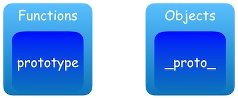
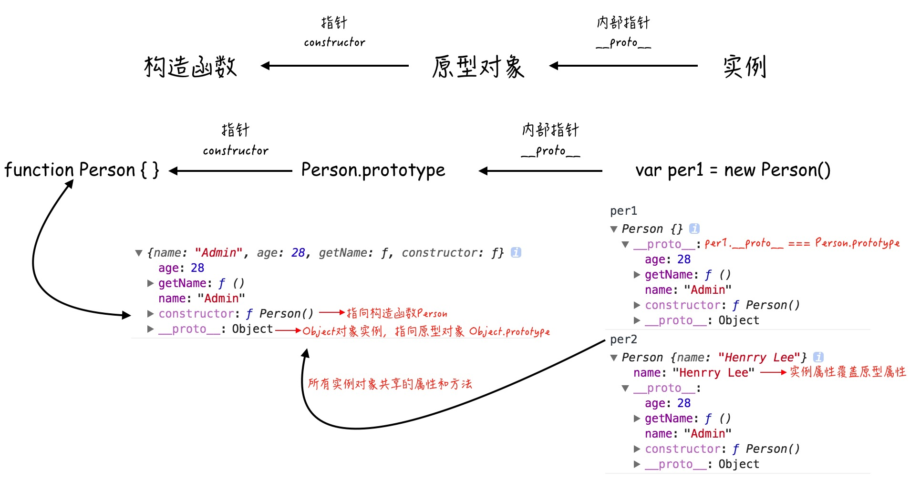
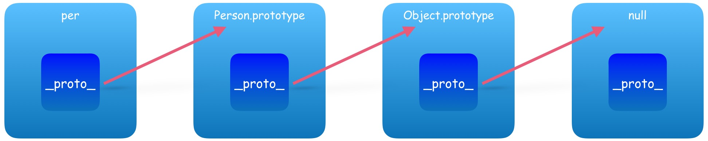
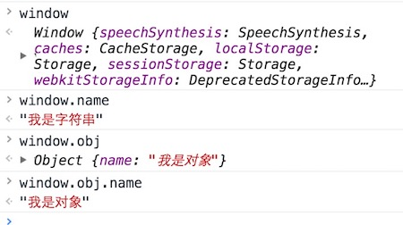

# # 概述

对象（object）是JavaScript的核心概念，也是最重要的数据类型。JavaScript的所有数据都可以被视为对象。简单说，所谓对象，就是一种 **无序** 的数据集合，由若干个“ **键值对** ”（key-value，亦称属性名值对、成员等）构成。

JavaScript支持面 **向对象编程** ，虽然不同于传统的面向对象编程语言，但是JavaScript具有很强的面向对象编程能力。“面向对象编程”（Object Oriented Programming，缩写为OOP）是目前主流的编程范式。它的核心思想是将真实世界中各种复杂的关系，抽象为一个个对象，然后由对象之间的分工与合作，完成对真实世界的模拟。

传统的过程式编程（procedural programming）由一系列函数或一系列指令组成，而面向对象编程的程序由一系列对象组成。每一个对象都是功能中心，具有明确分工，可以完成接受信息、处理数据、发出信息等任务。因此，面向对象编程具有灵活性、代码的可重用性、模块性等特点，容易维护和开发，非常适合多人合作的大型软件项目。

那么，“对象”（object）到底是什么？我们从两个层次来理解。

- **“对象”是单个实物的抽象。**

  一本书、一辆汽车、一个人都可以是“对象”，一个数据库、一张网页、一个与远程服务器的连接也可以是“对象”。当实物被抽象成“对象”，实物之间的关系就变成了“对象”之间的关系，从而就可以模拟现实情况，针对“对象”进行编程。

- **“对象”是一个容器，封装了“属性”（property）和“方法”（method）。**

  所谓“属性”，就是对象的状态；所谓“方法”，就是对象的行为（完成某种任务）。比如，我们可以把动物抽象为animal对象，“属性”记录具体是那一种动物，“方法”表示动物的某种行为（奔跑、捕猎、休息等等）。

# # 创建对象

## 1.1、原始模式

```javascript
// 1、原始模式，Object构造函数方式
var obj = new Object();
obj.name = 'Petter';
obj.age  =  28;
obj.showName = function() { alert(this.name); }

// 2、原始模式，对象字面量方式
var obj = {
    name: 'Petter',
  	age: 28,
  	showName: function() {
        alert(this.name);
    }
}
```

> 优势：创建单一对象时比较快捷方便。
>
> 缺陷：当我们要创建批量对象时，代码过于冗余。脱离对象原型。

## 1.2、工厂模式

```javascript
function createPerson(name, age) {
	var obj = new Object();
	obj.name = name;
	obj.age  = age;
	obj.showName = function() {
		alert(obj.name);
	}
	return obj;
}

var obj1 = createPerson('Admin', 22);
var obj2 = createPerson('Petter', 28);
```

> 优势：批量化生产，便捷方便。
>
> 缺陷：脱离对象原型。

## 1.3、构造函数

```javascript
function Person(name, age) {
	this.name = name,
	this.age  = age,
	this.showName = function() {
		alert(this.name);
	}
}
var per1 = new Person("李强", 24);
var per2 = new Person("李伟", 28);
```

上面代码中，**Person** 就是构造函数，它提供模板，用来生成对象实例。为了与普通函数区别，构造函数名字的第一个字母通常大写。

构造函数的特点有两个。

- 函数体内部使用了 `this` 关键字，代表了所要生成的对象实例。
- 生成对象的时候，必需用 `new` 命令调用 `Person` 函数。

> 优势：对象实例拥有对象原型（ `constructor` ）
>
> ```javascript
> console.log(per1.constructor === Person); // true
> console.log(per2.constructor === Person); // true
> ```
> 缺陷：内存浪费

Javascript还提供了一个`instanceof` 运算符，验证原型对象与实例对象之间的关系。

```javascript
console.log(per1 instanceof Person); // true
console.log(per2 instanceof Person); // true
```

## 1.4、原型模式

Javascript规定，每一个构造函数都有一个 `prototype` 属性，指向另一个对象。这个对象的所有属性和方法，都会被构造函数的实例继承。意味着，我们可以把那些不变的属性和方法，直接定义在`prototype`对象上。

```javascript
// 1、原型模式，直接定义prototype属性
function Person () {}
Person.prototype.name = 'Henrry Lee';
Person.prototype.age = 26;
Person.prototype.showName = function () { alert(this.name); };

// 2、原型模式，字面量定义方式
function Person () {}
Person.prototype = {
    name: 'Jack',
    age: 18,
    showName: function () { alert(this.name); }
};
var p1 = new Person(); //name='Jack'
var p2 = new Person(); //name='Jack'
```

> 提示：这里需要注意的是原型属性和方法的共享，即所有实例中都只是引用原型中的属性方法，任何一个地方产生的改动会引起其他实例的变化，因为它们指向同一块内存。

## 1.5、混合模式（构造 + 原型）

```javascript
// 原型构造组合模式，
function Person (name, age) {
    this.name = name;
    this.age = age;
}
Person.prototype = {
    hobby: ['running', 'game'],
    showName: function () { alert(this.name); },
    showAge: function () { alert(this.age); }
};

var p1 = new Person('Jack', 20); 
//p1:'Jack',20; __proto__: ['running','game'],showName,showAge
var p2 = new Person('Mark', 18); 
//p1:'Mark',18; __proto__: ['running','game'],showName,showAge
```

> 提示：做法是将需要独立的属性方法放入构造函数中，而可以共享的部分则放入原型中，这样做可以最大限度节省内存而又保留对象实例的独立性。

# # 属性与方法

## 2.1、属性

在对象中，变量被认为是属性。属性向我们描述对象，正如一部车的品牌、颜色或车型。定义属性的方法如下：

```javascript
// 1、直接使用 key : value 对形式创建属性
var car = {
	brand: "Benz",
	color: "black",
	model: "E200"
}
// 2、直接使用标识符作为属性(点语法)
var car = new Object();
car.brand = "Benz";

// 3、使用表达式作为属性(中括号)
var car = new Object();
car["car" + "Color"] = "black";
```

  **访问对象属性**，主要有两种方法：

- 点语法，其语法形式为：`Obj.property`，如  `person.name`
- 下标法，其语法形式为：`Obj["property"]`，如  `person["name"]`

## 2.2、方法

在对象中，函数被认为是方法。方法代表和对象相关的任务。例如一部车可以加速或减速行驶。

```javascript
let car = {
	// 属性
	brand: "Benz",
	color: "black",
	model: "E200",
	// 方法
	speedUp: function() {
		console.log("正在加速！");
	},
	slowDown: function() {
		console.log("正在减速！");
	}
}
```

  **访问对象方法**，直接通过点语法即可访问，其语法形式：`Obj.function_name()`，如  `car.speedUp()`

# # 对象操作

对于数据操作来讲，无非就是四种操作“增、删、改、查”。对于对象来讲，“**增**” 就是为一个对象新增一个之前不存在的属性名，然后进行赋值；“**改**” 就是对对象已经存在的属性名进行重新赋值，达到一个修改原始对象的效果；而 “**查**” 就是简单地通过对象的属性名访问即可。这些我们之前都讲解过，但对于 “**删**”来讲稍微有些特殊，需要用到关键字 “`delete`” 进行操作，为了说明问题，我们还是对这些操作进行回顾并在其中列出delete的使用方式。原对象如下：

```javascript
var phone = {
	brand:   "iPhone"
	model:   "iPhone7 Plus",
	pubDate: "2016-09-10",
	company: "Apple"
}
```

## 3.1、对象操作（增）

```javascript
phone.color = 'black';
```

## 3.2、对象操作（删）

```javascript
delete phone.company; // true
```

## 3.3、对象操作（改）

```javascript
phone.pubDate = '2016-09-11';
```

## 3.4、对象操作（查）

```javascript
phone.brand; // "iPhone"
phone.model; // "iPhone7 Plus"	
```

# # 原型链

JavaScript 原生提供一个Object对象，所有其他对象都继承自这个对象。Object本身也是一个构造函数，可以直接通过它来生成新对象。原型链理解起来比较绕，网上很多关于原型链的介绍，不用纠结于一堆专业术语，参考 [码农网](http://www.codeceo.com/article/javascript-prototype-chain.html?utm_source=funteas.com&utm_medium=article&utm_content=web)上一篇关于原型链的文章，简单粗暴的了解原型链。

## 4.1、\_proto_ & prototype

**1）、概念**

- prototype：显式原型（ explicit prototype property ），只有函数才有的属性。
- \__proto__ ：隐式原型（  implicit prototype link ），每一个对象都有 \_\_proto__ 属性。



 **2）、作用**

- 显式原型的作用：用来实现基于原型的继承与属性的共享。
- 隐式原型的作用：构成原型链，同样用于实现基于原型的继承。举个例子，当我们访问obj这个对象中的x属性时，如果在obj中找不到，那么就会沿着 \__proto__ 依次往上查找。

**3）、指向**

- prototype：这个属性是一个指针，指向一个对象（通过该构造函数创建实例对象的原型对象）
- \_\_proto__：这个属性是一个内部指针，指向原型对象（构造函数）

```javascript
function Person() {};
Person.prototype.name = "Admin";
Person.prototype.age  = 28;

var per1 = new Person();
var per2 = new Person();

per2.name = "Henrry Lee";

console.log(per1.name); // Admin 来自原型
console.log(per2.name); // Henrry Lee 来自实例
```

从一张图看懂原型对象、构造函数、实例对象之间的关系



## 4.2、原型链

由于  \_\_proto__  是任何对象都有的属性，而 js 里万物皆对象，所以会形成一条由  \_\_proto__  连起来的链条，递归访问  \_\_proto__  必须最终到头，并且值是` null `。当 js 引擎查找对象属性时，先查找对象本身是否存在该属性，如果不存在，会在原型链上查找，但不会查找自身的 prototype。

```javascript
function Person(name, age) {
    this.name = name;
    this.age  = age;
}
var per = new Person("Henrry Lee", 28);
console.log(per.__proto__); // Person {}，即构造器 function Person 的原型对象
console.log(per.__proto__.__proto__); // Object {}，即构造器 function object 的原型对象
console.log(per.__proto__.__proto__.__proto__); // null
```



# # 对象继承

## 5.1、构造函数继承

这里主要给大家介绍构造函数继承的5种方法。

比如，现在有一个“动物”对象的构造函数：

```javascript
function Animal() {
    this.species = "动物"
}
```

还有一个猫对象的构造函数

```javascript
function Cat(name,color){
    this.name = name;
    this.color = color;
}
```

怎样才能使"猫"继承"动物"呢？

### 5.1.1、构造函数绑定

第一种方法也是最简单的方法，使用call或apply方法，将父对象的构造函数绑定在子对象上，即在子对象构造函数中加一行：

```javascript
function Cat(name,color){
    // 继承 Animal
    Animal.apply(this, arguments);
    this.name = name;
    this.color = color;
}
var cat = new Cat("小黄", "黄色");
console.log(cat.species); // 动物
```

### 5.1.2、prototype 模式

使用原型继承，这种方法非常常见。如果"猫"的 prototype 对象，指向一个 Animal 的实例，那么所有"猫"的实例，就能继承Animal了。

```javascript
// 将Cat的prototype指向Animal的一个实例
// 它相当于完全删除了prototype 对象原先的值，然后赋予一个新值。
Cat.prototype = new Animal();

// 任何一个prototype对象都有一个constructor属性，指向它的构造函数。
// 如果没有这一行，Cat.prototype.constructor是指向Animal的；
// 加了这一行以后，Cat.prototype.constructor指向Cat。
Cat.prototype.constructor = Cat;

var cat = new Cat("小黄","黄色");
console.log(cat1.species); // 动物
```

> 提示：如果替换了prototype对象，那么，下一步必然是为新的prototype对象加上constructor属性，并将这个属性指回原来的构造函数。

### 5.1.3、直接继承 prototype

该方法是对上一个方法的改进，由于Animal对象中，不变的属性都可以直接写入Animal.prototype。所以，我们也可以让Cat()跳过 Animal()，直接继承Animal.prototype。

现在，我们先将Animal对象改写：

```javascript
function Animal(){ }
Animal.prototype.species = "动物";
```

然后，将Cat的prototype对象指向Animal的prototype对象，这样就完成了继承。

```javascript
Cat.prototype = Animal.prototype;
Cat.prototype.constructor = Cat;
var cat = new Cat("小黄","黄色");
alert(cat1.species); // 动物
```

> 提示：
>
> 优势：与前一种方法相比，这样做的优点是效率比较高（不用执行和建立Animal的实例了），比较省内存。
>
> 缺陷： Cat.prototype和Animal.prototype现在指向了同一个对象，那么任何对Cat.prototype的修改，都会反映到Animal.prototype。

所以，上面这一段代码其实是有问题的。请看第二行：

```javascript
Cat.prototype.constructor = Cat;
```

这一句实际上把 Animal.prototype 对象的constructor属性也改掉了！

```javascript
console.log(Animal.prototype.constructor); // Cat
```

### 5.1.4、利用空对象作为中介

由于"直接继承prototype"存在上述的缺点，所以就有第四种方法，利用一个空对象作为中介。

```javascript
var F = function(){};
F.prototype = Animal.prototye;
Cat.prototype = new F();
Cat.prototype.constructor = Cat;
```

F是空对象，所以几乎不占内存。这时，修改Cat的prototype对象，就不会影响到Animal的prototype对象。

```javascript
console.log(Animal.prototype.constructor); // Animal
```

我们将上面的方法，封装成一个函数，便于使用。

```javascript
function extend(Child, Parent) {
　　var F = function(){};
　　F.prototype = Parent.prototype;
　　Child.prototype = new F();
　　Child.prototype.constructor = Child;
　　Child.uber = Parent.prototype;
}
```

使用的时候，方法如下：

```javascript
extend(Cat, Animal);
var cat = new Cat("小黄","黄色");
console.log(cat1.species); // 动物
```

另外，说明一点，函数体最后一行：

```javascript
Child.uber = Parent.prototype;
```

意思是为子对象设一个uber属性，这个属性直接指向父对象的prototype属性。（uber是一个德语词，意思是"向上"、"上一层"。）这等于在子对象上打开一条通道，可以直接调用父对象的方法。这一行放在这里，只是为了实现继承的完备性，纯属备用性质。

### 5.1.5、拷贝继承

上面是采用prototype对象，实现继承。我们也可以换一种思路，纯粹采用"拷贝"方法实现继承。简单说，如果把父对象的所有属性和方法，拷贝进子对象，不也能够实现继承吗？这样我们就有了第五种方法。

首先，还是把Animal的所有不变属性，都放到它的prototype对象上。

```javascript
function Animal(){}
Animal.prototype.species = "动物";
```

然后，再写一个函数，实现属性拷贝的目的。

```javascript
function extend(Child, Parent) {
    var p = Parent.prototype;
    var c = Child.prototype;
    for (var key in p) {
      c[key] = p[key];
    }
    c.uber = p;
}
```

这个函数的作用，就是将父对象的prototype对象中的属性，一一拷贝给Child对象的prototype对象。

使用的时候，这样写：

```javascript
extend2(Cat, Animal);
var cat1 = new Cat("小黄","黄色");
alert(cat1.species); // 动物
```

## 5.2、非构造函数继承

### 5.2.1、什么是非构造函数继承？

比如，现在有一个对象，叫做"中国人"。

```javascript
var Chinese = {
　　nation:'中国'
};
```

还有一个对象，叫做"医生"。

```javascript
var Doctor = {
　　career:'医生'
}
```

请问怎样才能让"医生"去继承"中国人"，也就是说，我怎样才能生成一个"中国医生"的对象？

这里要注意，这两个对象都是普通对象，不是构造函数，无法使用构造函数方法实现"继承"。

### 5.2.2、Object 方法

json格式的发明人Douglas Crockford，提出了一个object()函数，可以做到这一点。

```javascript
function object(o) {
    function F() {}
    F.prototype = o;
    return new F();
}
```

这个object()函数，其实只做一件事，就是把子对象的prototype属性，指向父对象，从而使得子对象与父对象连在一起。

使用的时候，第一步先在父对象的基础上，生成子对象：

```javascript
var Doctor = object(Chinese);
```

然后，再加上子对象本身的属性：

```javascript
Doctor.career = '医生';
```

这时，子对象已经继承了父对象的属性了。

```
console.log(Doctor.nation); // 中国
```

### 5.2.3、浅拷贝

除了使用"prototype链"以外，还有另一种思路：把父对象的属性，全部拷贝给子对象，也能实现继承。

下面这个函数，就是在做拷贝：

```javascript
function extendCopy(parent) {
    var child = {};
    for (var key in parent) { 
    child[key] = parent[key];
    }
    child.uber = parent;
    return child;
}
```

使用的时候，这样写：

```javascript
var Doctor = extendCopy(Chinese);
Doctor.career = '医生';
console.log(Doctor.nation); // 中国
```

但是，这样的拷贝有一个问题。那就是，如果父对象的属性等于数组或另一个对象，那么实际上，子对象获得的只是一个内存地址，而不是真正拷贝，因此存在父对象被篡改的可能。

请看，现在给Chinese添加一个"出生地"属性，它的值是一个数组。

```javascript
Chinese.birthPlaces = ['北京','上海','香港'];
```

通过extendCopy()函数，Doctor继承了Chinese。

```javascript
var Doctor = extendCopy(Chinese);
```

然后，我们为Doctor的"出生地"添加一个城市：

```javascript
Doctor.birthPlaces.push('厦门');
```

发生了什么事？Chinese的"出生地"也被改掉了！

```javascript
console.log(Doctor.birthPlaces);  // 北京, 上海, 香港, 厦门
console.log(Chinese.birthPlaces); // 北京, 上海, 香港, 厦门
```

所以，extendCopy()只是拷贝基本类型的数据，我们把这种拷贝叫做"浅拷贝"。这是早期jQuery实现继承的方式。

### 5.2.4、深拷贝

所谓"深拷贝"，就是能够实现真正意义上的数组和对象的拷贝。它的实现并不难，只要递归调用"浅拷贝"就行了。

```javascript
function deepCopy(parent, child) {
    var child = child || {};
    for (var key in parent) {
        if (typeof parent[key] === 'object') {
            child[key] = (parent[key].constructor === Array) ? [] : {};
            // 递归调用
            deepCopy(parent[key], child[key]);
        } else {
            child[key] = parent[key];
        }
    }
    return child;
}
```

使用的时候这样写：

```javascript
var Doctor = deepCopy(Chinese);
```

现在，给父对象加一个属性，值为数组。然后，在子对象上修改这个属性：

```javascript
Chinese.birthPlaces = ['北京','上海','香港'];
Doctor.birthPlaces.push('厦门');
```

这时，父对象就不会受到影响了。

```javascript
console.log(Doctor.birthPlaces);  // 北京, 上海, 香港, 厦门
console.log(Chinese.birthPlaces); // 北京, 上海, 香港
```

目前，jQuery库使用的就是这种继承方法。

# # 内置对象与包装对象

并非只有数组（Array）和普通对象（Object）才是所谓的“对象”，我们可以将JavaScript任何允许的数据类型放置于 `Object()`  方法的参数内转换成为一个对象。如果转换后的对象全等于自身，则这样的对象称作“**内置对象**”，反之称为“**包装对象**”。

```javascript
var str = "Hi";
var arr = [1, 2, 3];
var obj = {name: "Petter"};
var bol = false;

str === Object(str)
// false
arr === Object(arr)
// true
obj === Object(obj)
// true
bol === Object(bol)
// false
```

# # 对象的引用

如果不同的变量名指向同一个对象，那么它们都是这个对象的引用，也就是说指向同一个内存地址。修改其中一个变量，会影响到其他所有变量。

```javascript
var stu = {
	name: "Petter",
	age: 24,
	address: "四川省成都市"
}
var otherStu = stu;
otherStu.age = 28;
otherStu.age; // 28
stu.age       // 28
```

如果取消某一个变量对原对象的引用，不会影响到另一个变量。

```javascript
otherStu = null;
otherStu
// null
stu
// Object {name: "Petter", age: 28, address: "四川省成都市"}
```

# # 数据类型的精确判定

通过  `String()` 方法可以将任何类型的数据转换成字符串，其转换时都是在对应的数据上加上一个引号，但在转换数组和对象时比较特殊，对象出现的结果是`[object Object]`，其实这里的第一个值表示该值是一个对象（之前提到过，JavaScript中任何值都可以成为对象），第二个值为该类型值的构造函数（有些对象是通过包装而来的）。当然，除了将需要转换字符串的内容放置于`String()`方法的参数内，还能通过对象属性的方式来使用该方法，它的写法是`toString()`，不需要配置参数。

```javascript
"Hello".toString() // "Hello"
(3.14).toString()  // "3.14"
true.toString() // "true"
[1, 2, 3].toString() // "1,2,3"
var obj = {name:"Petter"};
obj.toString() // "[object Object]"
(function(){}).toString() // "function (){}"
```

可以从运行结果中看出来，这和我们上次使用的“`String()`”方法得出的结果完全一样。但其实作为一个对象属性的“`toString()`”方法来讲自然会有一些不同的。它其实是对象原型链的一个方法，语法如下：`Object.prototype.toString`。

既然是原型链的方法，那很多时候它们还有自己的子方法，如 `call()` 方法。基本使用方法如下：

```javascript
Object.prototype.toString.call('Hello, world!'); 
// "[object String]"

Object.prototype.toString.call(3.14);
// "[object Number]"

Object.prototype.toString.call(true);
// "[object Boolean]"

Object.prototype.toString.call([1, 2, 3]);
// "[object Array]"

Object.prototype.toString.call({});
// "[object Object]"

Object.prototype.toString.call(new Date());
// "[object Date]"

Object.prototype.toString.call(Math);
// "[object Math]"

Object.prototype.toString.call(/[0-9]/);
// "[object RegExp]"

Object.prototype.toString.call(null);
// "[object Null]"

Object.prototype.toString.call(NaN);
// "[object Number]"

Object.prototype.toString.call(undefined);
// "[object Undefined]"
```

通过示例可以发现，除了特殊的自身不等于自身的 `NaN` 值以外，其它的值都在返回结果的第二个值中表现出了自己真实的“值类型”，这最大程度地弥补了 `typeof()` 方法（通常情况下，`typeof()`方法还是首选）的不足。但是单是发现了这个原型方法的特性还没有什么用，要真正地将该特性利用起来，还得我们自己写成一个方法函数。

```javascript
function getType(val, callBack) {
    // 1、获取值类型 "[object Xxx]"
    let call = Object.prototype.toString.call(val);
    // 2、截取类型
    let startIdx = call.indexOf(' ') + 1;
    let endIdx   = call.length - 1;
    let type     = call.slice(startIdx, endIdx).toLowerCase();
    // 3、闭包回调
    if(callBack) {
        callBack(type);
    }else {
        return type;
    }
}
getType(123)  // "number"
getType("Hi") // "string"
getType({})   // "object"
getType([])   // "array"
```

  经过简单测试，自定义的方法完美地实现了数组类型的精确判定。

  在这里需要说明一下`call()`方法在这里扮演的“角色”，`call()`方法是用于绑定对象内部“`this`”关键字的指向，因为this在非事件执行的情况下，或没有被实例化为一个对象时都是默认指向 **window** 这个对象的。我们来看一个这样的例子来证明这一点，并说明`call()`在这里的作用：

```javascript
let name = "我是字符串";
let obj  = {name: "我是对象"};

function testCall() {
	return this.name;
}

console.log(testCall.call()) // "我是字符串"
console.log(testCall.call(null)) // "我是字符串"
console.log(testCall.call(undefined)) // "我是字符串"
console.log(testCall.call(window)) // "我是字符串"
console.log(testCall.call(obj)) // "我是对象
```

  为什么会出现这样的执行结果呢，我们再来看一个这样的小测试：




  可以发现，window是一个当前全局环境里的 **根对象**，所有设置在全局里的变量都是它的属性，所以我们可以通过以上形式对设置在全局内的变量进行访问。通过这一点，我们再去联系之前示例的运行结果应该更好理解。就是当`call()`方法的参数是一些非指定变量名的时候，或window对象的时候，函数`testCall()`内的`this`都是指向全局内的“`name`”变量的，而当`call()`方法内的参数为全局下的对象“`obj`”的时候，this指向的就是“obj”了，通过运行函数，返回的值相当于是“`obj.name`”了。

  明白了这些特性后，我们还可以发挥自己的想象能力玩一些更为“高端的操作”，如：

```javascript
function getType(val) {
	// 获取参数返回类型（肯定是对象）和构造函数类型
	var call = Object.prototype.toString.call(val);
	// 下标开始位置
	var startIdx = call.indexOf(" ") + 1;
	// 下标结束为止
	var endIdx = call.lastIndexOf("\]");
	// 将截取出来的字符串转成小写字母并返回
	return call.slice(startIdx, endIdx).toLowerCase();
}
var types = ["Null", "Undefined", "Number", "String", "Object", "Function", "RegExp", "Math", "Date"];
var TYPE = {};
types.map(function(type){
	TYPE["is" + type] = function(val) {
		return getType(val) === type.toLowerCase();
	}
});


// 验证
TYPE.isNull("") // false
TYPE.isNull(null) // true
```


