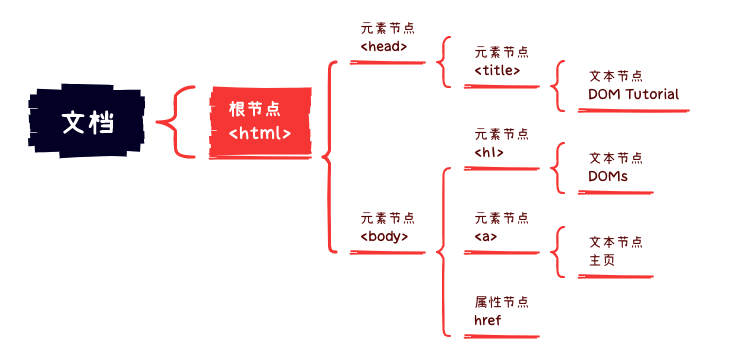

# # 概述

DOM是JavaScript操作网页的接口，全称为 “**文档对象模型** ”（Document Object Model）。它的作用是将网页转为一个JavaScript对象，从而可以用脚本进行各种操作（比如增删内容）。

浏览器会根据DOM模型，将结构化文档（比如HTML和XML）解析成一系列的节点，再由这些节点组成一个树状结构。所有的节点和最终的树状结构，都有规范的对外接口。所以，DOM可以理解成网页的编程接口。DOM有自己的国际标准，目前的通用版本是DOM 3，下一代版本DOM 4正在拟定中。

严格地说，DOM不属于JavaScript，但是操作DOM是JavaScript最常见的任务，而JavaScript也是最常用于DOM操作的语言。本章介绍的就是JavaScript对DOM标准的实现和用法。

# # 节点

## 1、节点

DOM的最小组成单位叫做节点（Node）。文档的树形结构（DOM树），就是由各种不同类型的节点组成。

节点的类型有七种：

- **Document**：整个文档树的顶层节点
- **DocumentType**：*doctype* 标签（比如 `<!DOCTYPE html>` ）
- **Element**：网页的各种HTML标签（比如 `<body>`、`<a>`等）
- **Attribute**：网页元素的属性（比如 `class="right"` ）
- **Text**：标签之间或标签包含的文本
- **Comment**：注释
- **DocumentFragment**：文档的片段

> 提示：这七种节点都属于浏览器原生提供的节点对象的派生对象，具有一些共同的属性和方法。

我们可通过 nodeName 和 nodeType 属性判断对应节点的名称和类型。

| 类型                     | 描述   | nodeName             | nodeType |
| ---------------------- | ---- | -------------------- | -------- |
| ELEMENT_NODE           | 元素节点 | 大写的HTML元素名           | 1        |
| ATTRIBUTE_NODE         | 属性节点 | 等同于Attr.name（属性名）    | 2        |
| TEXT_NODE              | 文本节点 | #text                | 3        |
| COMMENT_NODE           | 注释节点 | #comment             | 8        |
| DOCUMENT_NODE          | 文档节点 | #document            | 9        |
| DOCUMENT_FRAGMENT_NODE |      | #document-fragment   | 11       |
| DOCUMENT_TYPE_NODE     |      | 等同于DocumentType.name | 10       |

##  2、节点树

一个文档的所有节点，按照所在的层级，可以抽象成一种树状结构。这种树状结构就是DOM树。

最顶层的节点就是 **document** 节点，它代表了整个文档。文档里面最高一层的HTML标签，一般是 `<html>`，它构成树结构的根节点（root node），其他HTML标签节点都是它的下级。

除了根节点以外，其他节点对于周围的节点都存在三种关系。

- **父节点关系 parentNode**：直接的那个上级节点
- **子节点关系 childNodes**：直接的下级节点
- **同级节点关系 sibling**：拥有同一个父节点的节点

DOM提供操作接口，用来获取三种关系的节点。其中，子节点接口包括 **firstChild**（第一个子节点）和**lastChild**（最后一个子节点）等属性，同级节点接口包括 **nextSibling**（紧邻在后的那个同级节点）和 **previousSibling**（紧邻在前的那个同级节点）属性。

示例：

```html
<!DOCTYPE html>
<html>  
	<head>  
	    <title>DOM Tutorial</title>   
	</head>   
	<body>   
	    <h1>DOM Lesson one</h1>    
	    <a href="javascript:;">主页</a>   
	</body>   
</html> 
```

上述代码的节点树模型：



## 3、节点集合

节点都是单个对象，有时会需要一种数据结构，能够容纳多个节点。DOM提供两种集合对象，用于实现这种节点的集合：NodeList  和 HTMLCollection。

这两个对象都是构造函数。

```javascript
typeof NodeList // "function"
typeof HTMLCollection // "function"
```

但是，一般不把它们当作函数使用，甚至都没有直接使用它们的场合。主要是许多DOM属性和方法，返回的结果是 NodeList 实例或 HTMLCollection 实例，所以一般只使用它们的实例。

### 3.1、NodeList

NodeList  实例对象是一个“类似数组”的对象，它的成员是节点对象。

*Node.childNodes*、*document.querySelectorAll()* 返回的都是 NodeList 实例对象。

```javascript
// instanceof 用于判断对象或函数的类型
document.childNodes instanceof NodeList // true
```

NodeList 实例对象可能是动态集合，也可能是静态集合。所谓动态集合就是一个活的集合，DOM树删除或新增一个相关节点，都会立刻反映在 NodeList 接口之中。*Node.childNodes*  返回的，就是一个动态集合。

```javascript
var parent = document.getElementById('parent');
parent.childNodes.length // 2
parent.appendChild(document.createElement('div'));
parent.childNodes.length // 3
```

上面代码中，`parent.childNodes` 返回的是一个 NodeList 实例对象。当 `parent` 节点新增一个子节点以后，该对象的成员个数就增加了1。

*document.querySelectorAll* 方法返回的是一个静态集合。DOM内部的变化，并不会实时反映在该方法的返回结果之中。

**NodeList** 接口实例对象提供 `length` 属性和数字索引，因此可以像数组那样，使用数字索引取出每个节点，但是它本身并不是数组，不能使用 *pop* 或 *push* 之类数组特有的方法。

```javascript
// 数组的继承链
myArray --> Array.prototype --> Object.prototype --> null

// NodeList的继承链
myNodeList --> NodeList.prototype --> Object.prototype --> null
```

从上面的继承链可以看到，**NodeList** 实例对象并不继承 *Array.prototype*，因此不具有数组的方法。如果要在 **NodeList** 实例对象使用数组方法，可以将 **NodeList** 实例转为真正的数组。

```javascript
var div_list  = document.querySelectorAll('div');
var div_array = Array.prototype.slice.call(div_list);
```

注意，采用上面的方法将 **NodeList** 实例转为真正的数组以后，`div_array` 就是一个静态集合了，不再能动态反映DOM的变化。

另一种方法是通过 *call* 方法，间接在 NodeList 实例上使用数组方法。

```javascript
var forEach = Array.prototype.forEach;

forEach.call(element.childNodes, function(child){
  child.parentNode.style.color = '#0F0';
});
```

上面代码让数组的 *forEach* 方法在 NodeList 实例对象上调用。注意，Chrome浏览器在 *NodeList.prototype* 上部署了*forEach*方法，所以可以直接使用，但它是非标准的。

遍历 NodeList 实例对象的首选方法，是使用 `for` 循环。

```javascript
for (var i = 0; i < myNodeList.length; ++i) {
  var item = myNodeList[i];
}
```

不要使用 `for...in` 循环去遍历NodeList实例对象，因为 `for...in` 循环会将非数字索引的 **length** 属性和下面要讲到的 **item** 方法，也遍历进去，而且不保证各个成员遍历的顺序。

NodeList 实例对象的 *item* 方法，接受一个数字索引作为参数，返回该索引对应的成员。如果取不到成员，或者索引不合法，则返回*null*。

```javascript
nodeItem = nodeList.item(index)

// 实例
var divs = document.getElementsByTagName("div");
var secondDiv = divs.item(1);
```

上面代码中，由于数字索引从零开始计数，所以取出第二个成员，要使用数字索引`1`。

所有类似数组的对象，都可以使用方括号运算符取出成员，所以一般情况下，都是使用下面的写法，而不使用`item`方法。

```javascript
nodeItem = nodeList[index]
```

### 3.2、HTMLCollection

**HTMLCollection** 实例对象与 **NodeList** 实例对象类似，也是节点的集合，返回一个类似数组的对象。*document.links*、*docuement.forms*、*document.images、children*等属性，返回的都是 **HTMLCollection** 实例对象。

**HTMLCollection** 实例对象与 **NodeList** 实例对象的区别在于：

- a、HTMLCollection实例对象的成员只能是*Element*节点，NodeList 实例对象的成员可以包含其他节点。
- b、HTMLCollection实例对象都是动态集合，节点的变化会实时反映在集合中。NodeList 实例对象可以是静态集合。
- c、HTMLCollection实例对象可以用 `id` 属性或 `name` 属性引用节点元素，NodeList 只能使用数字索引引用。

**HTMLCollection** 实例的 *item* 方法，可以根据成员的位置参数（从`0`开始），返回该成员。如果取不到成员或数字索引不合法，则返回*null*。

```javascript
var c = document.images;
var img1 = c.item(1);

// 等价于下面的写法
var img1 = c[1];
```

**HTMLCollection** 实例的 *namedItem* 方法根据成员`ID`属性或`name`属性，返回该成员。如果没有对应的成员，则返回`null`。这个方法是 *NodeList* 实例不具有的。

```javascript
// HTML代码为
// <form id="myForm"></form>
var elem = document.forms.namedItem('myForm');
// 等价于下面的写法
var elem = document.forms['myForm'];
```

由于*item*方法和*namedItem*方法，都可以用方括号运算符代替，所以建议一律使用方括号运算符

# # DOM Node

浏览器提供了一个Node对象，所有节点都是Node的实例，因此Node具备的属性与方法，其他节点也都具备。

- **Node.ownerDocument**

  该属性返回当前节点所在的顶层文档对象，即 document 对象。document 对象本身的 ownerDocument 属性，返回 `null`。

- **Node.firstChild & Node.firstElementChild** 

  获取当前节点的第一个子节点。二者的区别在于前者包括了文本节点和注释节点。

- **Node.lastChild & Node.lastElementChild**

  获取当前节点的最后一个子节点。二者的区别在于前者包括了文本节点和注释节点。

- **Node.nextSibling & Node.nextElementSibling** 

  获取当前节点的下一个同级节点。二者的区别在于前者包括文本节点和注释节点。

- **Node.previousSibling & Node.previousElementSibling**

  获取当前节点的上一个同级节点。二者的区别在于前者包括文本节点和注释节点。

- **Node.parentNode** 

  该属性返回当前节点的父节点。对于一个节点来说，它的父节点只可能是三种类型：*element* 节点、*document* 节点和 *documentfragment* 节点。对于 *document* 节点和 *documentfragment* 节点，它们的父节点都是 `null`。另外，对于那些生成后还没插入DOM树的节点，父节点也是 `null`。

- **Node.parentElement**

  该属性返回当前节点的父 Element节点。如果当前节点没有父节点，或者父节点类型不是Element节点，则返回null。在IE浏览器中，只有Element节点才有该属性，其他浏览器则是所有类型的节点都有该属性。

- **Node.children**

  该属性返回一个动态的HTMLCollection集合，由当前节点的所有Element子节点组成。下面代码遍历指定节点的所有Element子节点。

- **Node.childNodes**

  该属性返回一个 NodeList 集合，成员包括当前节点的所有子节点。注意，除了HTML元素节点，该属性返回的还包括*Text* 节点和 *Comment* 节点。如果当前节点不包括任何子节点，则返回一个空的NodeList集合。由于NodeList对象是一个动态集合，一旦子节点发生变化，立刻会反映在返回结果之中。


- **Node.childElementCount**

  该属性返回的是当前元素节点内子元素Element节点的个数（类似于：*Node.children.length*），而通过上面的*Node.childNodes.length*返回的节点会包含文本节点和注释节点。它属于ECMAScript 5的内容。


- **Node.baseURI**

  该属性返回一个字符串，表示当前网页的绝对路径。如果无法取到这个值，则返回`null`。浏览器根据这个属性，计算网页上的相对路径的URL。该属性为只读。

# # DOM Dcoument

**document** 节点是文档的根节点，每张网页都有自己的 document 节点。`window.document` 属性就指向这个节点。只要浏览器开始载入HTML文档，这个节点对象就存在了，可以直接调用。获取文档节点的方式如下：

- 对于正常的网页，直接使用 document 或 window.document。
- 对于 iframe 载入的网页，使用 iframe 节点的 contentDocument 属性。（了解）
- 对Ajax操作返回的文档，使用 XMLHttpRequest 对象的 responseXML 属性。（了解）
- 对于包含某个节点的文档，使用该节点的 ownerDocument 属性。（了解）

上面这四种 document 节点，都部署了[Document接口](http://dom.spec.whatwg.org/#interface-document)，因此有共同的属性和方法。当然，各自也有一些自己独特的属性和方法，比如HTML和XML文档的 document 节点就不一样。

## 1、节点属性

- **document.doctype，document.documentElement，document.defaultView**

对于HTML文档来说，document 对象一般有两个子节点。第一个子节点是 document.doctype，它是一个对象，包含了当前文档类型（Document Type Declaration，简写DTD）信息。对于HTML5文档，该节点就代表 `<!DOCTYPE html>`。如果网页没有声明DTD，该属性返回 `null`。document.firstChild 通常就返回这个节点

```javascript
var doctype = document.doctype;
doctype // "<!DOCTYPE html>"
doctype.name // "html"
```

document.documentElement 属性返回当前文档的根节点（root）。它通常是document节点的第二个子节点，紧跟在document.doctype节点后面。对于HTML网页，该属性返回 `<html>`节点。

document.defaultView 属性，在浏览器中返回document对象所在的window对象，否则返回`null`。

```javascript
document.defaultView === window // true
```

- **document.body，document.head**

document.head 属性返回当前文档的 `<head>` 节点，document.body 属性返回当前文档的 `<body>` 节点。

```javascript
document.head === document.querySelector('head') // true
document.body === document.querySelector('body') // true
```

-  **document.activeElement**

document.activeElement 属性返回当前文档中获得焦点的那个元素。用户通常可以使用Tab键移动焦点，使用空格键激活焦点。比如，如果焦点在一个链接上，此时按一下空格键，就会跳转到该链接。

## 2、集合属性

以下属性返回文档内部特定元素的集合，都是类似数组的对象。这些集合都是动态的，原节点有任何变化，立刻会反映在集合中。并且这些集合返回的都是 **HTMLCollection** 对象实例。由于 HTMLCollection 实例可以用HTML元素的`id`或`name`属性引用，因此如果一个元素有`id`或`name`属性，就可以在上面这四个属性上引用。

- **document.links**：返回当前文档所有设定了`href`属性的`a`及`area`元素。
- **document.forms**：返回页面中所有表单元素`form`。
- **document.images**：返回页面所有图片元素（即`img`标签）。
- **document.embeds**：返回网页中所有嵌入对象，即`embed`标签。


- **document.scripts**：返回当前文档的所有脚本（即\<script>标签）。
- **document.styleSheets**：返回一个类似数组的对象，代表当前网页的所有样式表。每个样式表对象都有*cssRules*属性，返回该样式表的所有CSS规则，这样这可以操作具体的CSS规则了。

## 3、文档属性

- **document.URL**：文档网址
- **document.domain**：获取域名
- **document.lastModified**：返回当前文档最后修改的时间戳，格式为字符串
- **document.title**：文档标题
- **document.cookie**：浏览器Cookie
- **document.location**：返回location对象，提供了当前文档的URL信息

> 提示：只需要掌握 document.title 就可以了，其他项我们可以直接通过BOM来操作。

## 4、文档读写

- **document.open()，document.close()**

  document.open 方法用于新建一个文档，供write方法写入内容。它实际上等于清除当前文档，重新写入内容。不要将此方法与 window.open() 混淆，后者用来打开一个新窗口，与当前文档无关。

  document.close 方法用于关闭 open方法所新建的文档。一旦关闭，write方法就无法写入内容了。如果再调用 write方法，就等同于又调用open方法，新建一个文档，再写入内容。

- **document.write()，document.writeln()**

  document.write 方法用于向当前文档写入内容。只要当前文档还没有用close方法关闭，它所写入的内容就会追加在已有内容的后面。

```javascript
// 页面显示“helloworld”
document.open();
document.write('hello');
document.write('world');
document.close();
```

  注意，document.write 会当作HTML代码解析，不会转义。

```javascript
document.write('<p>hello world</p>');
```

  如果页面已经解析完成（*DOMContentLoaded*事件发生之后），再调用write方法，它会先调用open方法，擦除当前文档所有内容，然后再写入。

```javascript
document.addEventListener('DOMContentLoaded', function (event) {
	document.write('<p>Hello World!</p>');
});

// 等同于

document.addEventListener('DOMContentLoaded', function (event) {
    document.open();
    document.write('<p>Hello World!</p>');
    document.close();
});
```

  如果在页面渲染过程中调用write方法，并不会调用open方法。（可以理解成，open方法已调用，但close方法还未调用）

```html
<html>
  <body>
  		hello
  <script type="text/javascript">
   		document.write("world")
  </script>
  </body>
</html>
```

  在浏览器打开上面网页，将会显示 *hello world*。

  *document.write* 是JavaScript语言标准化之前就存在的方法，现在完全有更符合标准的方法向文档写入内容（比如对**innerHTML** 属性赋值）。所以，除了某些特殊情况，应该尽量**避免使用** *document.write* 这个方法。

  *document.writeln*方法与*write*方法完全一致，除了会在输出内容的尾部添加换行符。

```javascript
document.write(1);
document.write(2);
// 12

document.writeln(1);
document.writeln(2);
// 1
// 2
```

  注意，`writeln`方法添加的是ASCII码的换行符，渲染成HTML网页时不起作用，即在网页上显示不出换行。

## 5、节点查询

- **document.getElementById()** ：该方法返回匹配指定 `id` 属性的元素节点。如果没有发现匹配的节点，则返回 `null` 。

- **document.getElementsByTagName()** ：该方法返回所有指定HTML标签的元素，返回值是一个类似数组的 **HTMLCollection** 对象，该对象可以实时反映HTML文档的变化。如果没有任何匹配的元素，就返回一个空集。与getElementsByTagName方法一样，getElementsByClassName方法不仅可以在document对象上调用，也可以在任何元素节点上调用。

- **document.getElementsByClassName()** ：根据类名找元素，返回HTMLCollection 集合类型。

- **document.getElementsByName()** ：该方法用于选择拥有 `name` 属性的HTML元素，返回一个类似数组的对象，因为name属性相同的元素可能不止一个。

- **document.querySelector()，document.querySelectorAll()** ：document.querySelector() 方法接受一个CSS选择器作为参数，返回匹配该选择器的元素节点。如果有多个节点满足匹配条件，则返回第一个匹配的节点。如果没有发现匹配的节点，则返回null。

  document.querySelectorAll() 方法与 querySelector() 用法类似，区别是返回一个NodeList对象，包含所有匹配给定选择器的节点。

  这两个方法都支持复杂的CSS选择器。但是，它们不支持CSS伪元素的选择器（比如`:first-line`和`:first-letter`）和伪类的选择器（比如`:link`和`:visited`），即无法选中伪元素和伪类。


## 6、节点生成

  以下方法可以用于生成DOM节点：

- **document.createElement()**：该方法用来生成HTML元素节点，该方法的参数为元素的标签名，即元素节点的tagName属性。

- **document.createTextNode()**：该方法用来生成文本节点，参数为所要生成的文本节点的内容。

- **document.createAttribute()**：该方法生成一个新的属性对象节点，该方法的参数是属性的名称。属性生成后可以用value属性为其赋值。


# # DOM Attribute 

HTML元素包括标签名和若干个键值对，这个键值对就称为“属性”（attribute）。

- **Element.attributes**

  元素属性集合，`Element.attributes[idx]` 返回属性节点对象。属性节点对象有 `name` 和 `value` 属性，*name* 属性用于访问属性节点对象名，该属性只读。*value* 属性用于访问或设置该属性节点对象值。

- **Element.getAttribute()**

  该方法返回当前元素节点的指定属性。如果指定属性不存在，则返回null。参数为指定的属性名称。

- **Element.setAttribute()**

  该方法用于为当前元素节点新增属性。如果同名属性已存在，则相当于编辑已存在的属性。该方法含有两个参数，第一个参数表示属性名，第二个参数表示需要对属性设置的值。

- **Element.setAttributeNode()**

  该方法用于为当前元素节点新增属性，参数为通过 *document.createAttribute()* 创建的属性节点。

- **Element.hasAttribute()**

  该方法返回一个布尔值，表示当前元素节点是否包含指定属性。参数为指定的属性名称。

- **Element.removeAttribute()**

  该方法用于移除属性节点。

- **dataset属性**

  dataset 属性用于获取或设置用户自定义的属性名（data-*）,该属性设置属性名和 `setAttribute()` 方法不同，它是通过赋值的方式实现的。


# # DOM Element

- **Element.attributes**：该属性返回当前元素所有属性节点的一个类似数组对象。

- **Element.id**：该属性返回指x定元素的id属性，是一个可读可写的属性。

- **Element.tagName**：该属性返回指定元素的大写标签名，与 nodeName 属性的值相等。但在事件对象（event）上通常使用tagName更加常见。

- **Element.innerHTML**：该属性返回该元素包含的HTML代码。该属性可读写，常用来设置某个Element节点的内容。如果将该属性设为空字符串，等于删除了它包含的所有节点。

- **Element.outerHTML**：该属性返回一个字符串，内容为指定元素节点的所有HTML代码，包括它自身和包含的所有子元素。该属性是同样是可读可写的，对它进行赋值，等于替换掉当前元素。但是如果该Element节点已经被赋值给一个变量了，在使用outerHTML替换原来的标签后，之前的变量值还是能够访问，也就是说被替换掉的内容依然保存于内存。(了解)

- **Element.matches()**：该方法用于匹配当前的Element节点是否匹配方法参数内的CSS选择器字符串，CSS选择器必须是完整的选择符（如id前需要加上“#”，class前面要加上“.”，属性选择器要用“[]”括起来等）。它返回的是一个布尔值。

- **Element.scrollIntoView()**

  该方法滚动当前元素，进入浏览器的可见区域，类似于设置window.location.hash的效果。

  该方法可以接受一个布尔值作为参数。如果为true，表示元素的顶部与当前区域的可见部分的顶部对齐（前提是当前区域可滚动）；如果为false，表示元素的底部与当前区域的可见部分的尾部对齐（前提是当前区域可滚动）。如果没有提供该参数，默认为true。

- **Element.focus()**

  该方法可以让元素获得焦点。用户使用键盘Tab键可以切换获得焦点的元素，都可以使用该方法来获得焦点。

- **Element.hasChildNodes()**

  该方法返回一个布尔值，表示当前节点是否有子节点。

- **Element.cloneNode()** 

  该方法用于克隆一个节点。它接受一个布尔值作为参数，表示是否同时克隆子节点，默认是 false，即不克隆子节点。克隆一个节点之后，DOM树有可能出现两个有相同ID属性的HTML元素，这时应该修改其中一个HTML元素的ID属性。

- **Element.contains()**

  该方法接受一个节点作为参数，返回一个布尔值，表示参数节点是否为当前节点的后代节点。需要注意的是，如果将当前节点传入contains方法，也会返回true。

- **Element.isEqualNode()**

  该方法返回一个布尔值，用于检查两个节点是否相等。所谓相等的节点，指的是两个节点的类型相同、属性相同、子节点相同。

- **Element.normalize()**  

  该方法用于清理当前节点内部的所有Text节点。它会去除空的文本节点，并且将毗邻的文本节点合并成一个。

## 1、插入节点

- **Element.appendChild()**

  该方法接受一个节点对象作为参数，将其作为最后一个子节点，插入当前节点。

- **Element.before()**

  该方法用于在当前节点的前面，插入一个同级节点。如果参数是节点对象，插入DOM的就是该节点对象；如果参数是文本，插入DOM的就是参数对应的文本节点。

- **Element.after()**

  该方法用于在当前节点的后面，插入一个同级节点。如果参数是节点对象，插入DOM的就是该节点对象；如果参数是文本，插入DOM的就是参数对应的文本节点。

- **Element.insertBefore()**

  该方法用于将某个节点插入当前节点的指定位置。它接受两个参数，第一个参数是所要插入的节点，第二个参数是当前节点的一个子节点，新的节点将插在这个节点的前面。该方法返回被插入的新节点。

  如果*insertBefore()*方法的第二个参数为*null*，则新节点将插在当前节点的最后位置，即变成最后一个子节点。如果所要插入的节点是当前DOM现有的节点，则该节点将从原有的位置移除，插入新的位置。

  由于不存在insertAfter()方法，如果要插在当前节点的某个子节点后面，可以用insertBefore方法结合nextSibling属性模拟。

- **Element.insertAdjacentHTML()**

  该方法解析HTML字符串，然后将生成的节点插入DOM树的指定位置。该方法带有两个参数，第一个参数表示插入位置，第二个参数表示插入的字符串（可以是HTML标签）。

  第一个插入参数允许的值如下：

  - beforebegin：在当前元素节点的前面。
  - beforeend：在当前元素节点的里面，插在它的最后一个子元素之后。
  - afterend：在当前元素节点的后面。
  - afterbegin：在当前元素节点的里面，插在它的第一个子元素之前。

## 3、替换节点

- **Element.replaceWith()**

  该方法使用参数指定的节点，替换当前节点。如果参数是节点对象，替换当前节点的就是该节点对象；如果参数是文本，替换当前节点的就是参数对应的文本节点。

- **Element.replaceChild()**

  该方法用于将一个新的节点，替换当前节点的某一个子节点。它接受两个参数，第一个参数是用来替换的新节点，第二个参数将要被替换走的子节点。它返回被替换走的那个节点。

## 4、移除节点

- **Element.remove()**

  调用这个方法的节点，移除的是节点本身，而不是它的父节点。

- **Element.removeChild()**

  该方法接受一个子节点作为参数，用于从当前节点移除该子节点。它返回被移除的子节点。

# # DOM Text

- **nodeValue**：设置/获取文本值，只有文本节点和注释节点才有 nodeValue 属性，元素节点要获取文本值可通过 *el.firstChild.nodeValue* 获取。
- **Element.textContent**：设置/获取当前元素节点及其后代节点文本内容。该属性会忽略标签。
- **Element.innerText**：设置/获取当前元素节点及其后代节点文本内容。

# # DOM Style

每一个网页元素对应一个DOM节点对象。这个对象的 **style** 属性可以直接操作，用来读写行内CSS样式。style对象的属性值都是字符串，设置时必须包括单位，但是不含规则结尾的分号。比如，`divStyle.width`不能写为`100`，而要写为`100px`。

```javascript
var el = document.getElementById('div');
el.style.width = '100px';
el.style.height = '100px';
el.style.backgroundColor = 'red';
```

style对象的 **cssText** 属性允许直接以字符串的形式来设置一个元素的样式，可以设置一个样式，也可以是多个，其语法与CSS文件选择器内部的语法完全一致。

```javascript
var el = document.getElementById('div');
el.style.cssText = 'width:100px; height:100px; background-color:red;'
```

> 提示：我们可以使用 `document.body.style.CSS样式属性名` 或 `document.body.style["CSS样式属性名"]` 的方式来检测当前的浏览器是否支持某一CSS样式，只要返回的值是一个非undefined的值，就说明当前浏览器是支持该CSS样式的。

# # DOM Class

每个Element节点对象都具有两个关于Class的属性：className 和 classList。

## 1、className

该属性用来读写当前元素节点的 `class` 属性。它的值是一个字符串，每个 class 之间用空格分割。

## 2、classList

该属性返回一个类似数组的对象，当前元素节点的每个 class 就是这个对象的一个成员。

classList  对象有下列方法：

- **add()**：增加一个class。
- **remove()**：移除一个class。
- **contains()**：检查当前元素是否包含某个class。
- **toggle()**：将某个class移入或移出当前元素。
- **item()**：返回指定索引位置的class。
- **toString()**：将class的列表转为字符串。


# # 拓展

## 1、获取非行间样式

```javascript
function getStyle(obj, attr) {
	// 兼容IE
	if (obj.currentStyle) {
		return obj.currentStyle[attr];
	}else {
		return getComputedStyle(obj, null)[attr];
	}
}
```

## 2、DOM 性能优化

- [高频dom操作和页面性能优化探索](https://feclub.cn/post/content/dom)
- 通过修改 class 更新样式
- 使用 innerHTML 批量生产 DOM
- 使用 DocumentFragment  批量生产 DOM
- 避免使用 +=，将拼接元素放入数组通过 join() 方法效率更高
- 创建节点之后应立即append
- 通过 absolute 或 显示/隐藏元素 后再操作DOM可以减少重排/重绘
- 进来使用 id 来遍历 DOM 元素


