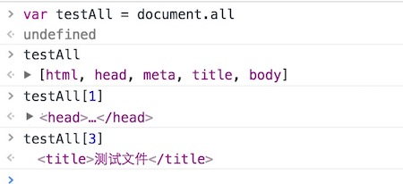
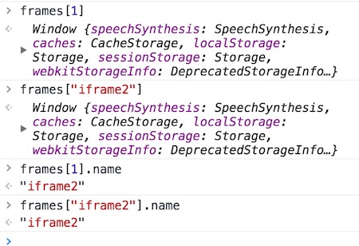
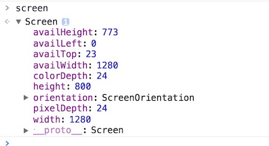

# 一、概述

  *BOM*（Browers Object Model，浏览器对象模型）是浏览器为JavaScript提供的一个*API*（Application Programming Interface，应用编程接口），所以它不是原生JavaScript提供的。通过BOM我们可以访问和设置浏览器的一些属性和函数。

  对于BOM的几乎所有操作都以依赖一个*全局对象*，那就是“*window*”对象。由于它是一个全局对象，所以很多时候在访问它内部的子对象的属性和方法的时候都是可以将window一词省略不写的，如“window.screen”可以直接写成“screen”也正常访问该子对象。

window对象下主要包含了以下子对象：

- ***document***：文档对象
- ***frames***：浏览器的框架（如iframe和现在废弃了的frameset）
- ***history***：浏览器浏览历史对象
- ***location***：浏览器页面所处位置对象
- ***navigator***：浏览器信息导航对象
- ***screen***：浏览器屏幕对象

  除了这些属性，window对象还提供了一些方法函数，如：*alert()*、*open()*、*close()*、*setTimeout()*、*clearTimeout()*、*setIntelval()*、*clearInterval()*等。

  BOM到现在都没有一个组织对其进行标准化，JavaScript语法的标准化组织是ECMA，DOM的标准化组织是W3C，但这并不妨碍浏览器厂商们对其的支持。随着Web编程技术的发展，浏览器厂商在很多BOM的内容上都达成了共识，这使得很多没有标准的属性和方法也可以在大多数现代浏览器上正常的使用。

  在全局环境下，window对象以下几种表示法：

- ***window***
- ***this***
- ***self***
- ***fremes***

  它们在全局环境下都是指向window对象


  window对象下的属性和方法非常之多，多至现在也没有一份权威的统计表明window下到底有多少个属性和方法，这个只需要打开Google Chrome（主要推荐，但也可以是其它非IE系列的主流浏览器）的控制台（ctrl+shift+J），然后输入“window.”（后面需要加上“点”）就可以看到window下的属性们了，而且里面很多属性下还包含二级、三级甚至更多级的属性。也就是说想要完全去掌握window下的所有属性和方法肯定是不现实的，我们只需要掌握一些常用的，对我们实际项目开发中有一定帮助的即可。接下来我们我们开始对window的这些主要属性和方法进行讲解。

# 二、文档对象 document

  对于window对象来说，document和DOM里面的document还是稍稍有些区别的，window对象的document子对象只有一个属性，就是“all”属性，它可以返回当前页面的标签集合，组成一个类似数组的对象。

  新建一个基本的HTML文档：

```html
<!DOCTYPE html>
<html lang="en">
<head>
	<meta charset="UTF-8">
	<title>测试文件</title>
</head>
<body></body>
</html>
```

  在控制台测试这个属性：



  该属性已经被标准化的DOM操作所代替，不过在一些较老的项目里仍然可以看到其身影。

# 三、框架对象 frames

  在这一章的第一节中通过例子我们已经见到过，frames和window是严格相等的，实际上，frames只是window的别名，它们表示的应用场景是不一样的。但只要window具有的属性，frames也具有，反之也成立。

  为了证明上述，我们看一个示例：

```html
<body>
	<iframe src="" frameborder="0" name="iframe1"></iframe>
	<iframe src="" frameborder="0" name="iframe2"></iframe>
	<iframe src="" frameborder="0" name="iframe3"></iframe>
</body>
<script type="text/javascript">

    // 设置当前窗口的名称
	window.name = "testIframe";
	// 访问frames的名称
	console.log(frames.name); // "testIframe"
	// 当前窗口含有的窗口
	console.log(window.length); // 3
	console.log(frames.length); // 3
</script>
```

   通过这个测试可以发现，window对象和frames对象完全是同一个对象，它们都是内存里那个window对象的引用，其中一个对象的属性发生变化，和它相关的对象随之变化。

  在HTML中提到过，\<iframe>标签就是“浏览器窗口中嵌入的浏览器窗口”。像上面那3个已经具有了name属性的\<iframe>标签我们可以通过这样的形式去访问：


  通过这个测试又可以发现，不仅可以简单地通过frames对象简单地去访问这些iframe;，而且它们返回的结果和之前我们看到的window等同引用的对象的返回结果基本是一样的，注意这里说的是“基本一样”，因为从最后三个测试结果可以发现，这三个iframe是互不相等的。

  要访问页面内指定的iframe除了上面提供的方法外，还可以用索引下标或中括号字符串的形式去访问。比如说现在我们要访问刚才那个name属性为“iframe2”的\<iframe>标签，还可以使用下面两种形式：



  在Ajax不盛行的年代，\<iframe>标签是在页面内嵌入网站的最好选择，但随着JavaScript相关编程技术的高速发展，使用\<iframe>标签嵌套子页面的形式已经开始不被推荐，而是用Ajax的异步加载的形式去请求“*文档片段*”，这样可以使得页面不需要再去加载子页面内的整个css和js等文件，和一些不必要的标签（包括整个\<head>标签和文档声明）。这样一来就使得页面加载的速度得到很大提升，页面也不会因为跳转刷新出现短暂白屏的情况，从而使得用户体验得到提升。不需要页面跳转，网站所有功能都通过一个页面完成的页面现在的术语叫法为“*SPA*”（single page application，译为：单页面应用程序。也有叫“SPWA”，其中的“W”表示“web”），是现在Web互联网应用开发的一个主流趋势。

# 四、屏幕对象 screen

  屏幕对象和相关的属性都是只读的，它们返回浏览器相对于当前计算机屏幕的数据信息。

  screen对象是用于描述当前浏览器相对于屏幕信息的主要对象，所含属性如下：



  其中availWidth和availHeight表示的是当前的浏览器窗口相对于屏幕而言的可用宽度和高度，而colorDepth和pixelDepth表示的是颜色深度和像素深度这些色彩图形学上的东西。

  和屏幕相关的还有以下属性：

- **screenLeft**：返回当前浏览器窗口距离屏幕左侧的像素数值
- **screenTop**：返回当前浏览器窗口距离屏幕上侧的像素数值
- **screenX**：作用和screenLeft相同
- **screenY**：作用和screenTop相同

  之所以出现这样同功能的属性归根到底，还是因为BOM一直没有一个标准造成的，根据资料显示支持screenLeft和screenTop的浏览器有：IE、Chrome、Safari、Opera，但Firxfox不支持。而支持screenX和screenY的浏览器有：Firxfox、Chrome、Safari、Opera，但IE不支持。

  为了解决这样兼容性问题，我们可以用一个自定义的三元表达式的办法来解决：

```javascript
// 窗口距离屏幕左侧
var scrMarginX = (typeof window.screenLeft == "number") ? window.screenLeft : window.screenX;
// 窗口距离屏幕右侧
var scrMarginY = (typeof window.screenTop == "number") ? window.screenTop : window.screenY;
```

  现在我们就尝试多次调整浏览器窗口来试验一下刚才自定义的“属性”：


  但是需要注意的是使用我们自定义变量来接收浏览器屏幕信息需要每次窗口移动后都要进行一次表达值赋值，否则我们的“属性值”永远是第一次取到的值。显然这样的做法并不好，但由于BOM标准的问题，这也是一种不得已而为之的办法，只是一种浏览器兼容性的方案。

# 五、window.open()和window.close()

  window.open()方法用于打开一个新的窗口（或标签页），而window.close()用于关闭当前窗口，他们同样可以将方法前的window对象省略不写，也能达到同样的方法效果。

  相比于close()方法用于直接关闭浏览器窗口，open()方法就要稍微复杂一些，该方法有4个可选参数，它们的作用分别是：

- **URL**

  新窗口的URL地址，为一个字符串。

- **名称**

  新窗口的名称，为一个字符串。

- **窗口特性**

  新窗口的URL，为一个字符串。具体可以配置以下内容：

  - *width*：窗口宽度，值为一个像素数值
  - *height*：窗口高度，值为一个像素数值
  - *left*：窗口的屏幕X坐标，值为一个像素数值
  - *top*：窗口的屏幕Y坐标，值为一个像素数值
  - *channelmode*：是否“影院模式”显示窗口，值：yes/no（默认）
  - *fullscreen*：是否全屏显示，处于全屏模式的窗口必须同时处于剧院模式，值：yes/no（默认）
  - *directories*：是否添加目录按钮，值：yes（默认）/no
  - *location*：是否显示地址字段，值：yes（默认）/no
  - *menubar*：是否显示菜单栏，值：yes（默认）/no
  - *resizable*：窗口是否可以调整尺寸，值：yes（默认）/no
  - *scrollbars*：是否显示滚动条，值：yes（默认）/no
  - *status*：是否显示状态栏，值：yes（默认）/no
  - *titlebar*：是否显示标题栏，值：yes（默认）/no
  - *toolbar*：是否显示工具栏，值：yes（默认）/no

  在这些配置项中，各浏览器的支持情况都不是很理想，在目前标准（包括HTML5标准和ECMAScript标准）支持最好的Google Chrome上也只支持上面的前四个配置。所以，如非定制浏览器开发，否则没有必要去进行配置。

- 记录

  在浏览器历史中替换或新建记录，为一个布尔值。true为替换，false为新建。

  我们来看一个示例：

```html
<!-- HTML部分 -->
<form>
	<button type="button" id="nothing">新窗口</button>
	<button type="button" id="openBaidu">百度</button>
	<button type="button" id="openTencent">腾讯</button>
</form>

<!-- JavaScript部分 -->
<script type="text/javascript">
	var nothing     = document.getElementById('nothing');
	var openBaidu   = document.getElementById('openBaidu');
	var openTencent = document.getElementById('openTencent');

	nothing.onclick = function() {
		window.open();
	}
	openBaidu.onclick = function() {
		window.open("https://www.baidu.com", "百度", "width=900, height=500, top=100,left=100");
	}
	openTencent.onclick = function() {
		window.open("http://www.qq.com/", "腾讯", "channelmode=yes, fullscreen=yes");
	}
</script>
```

