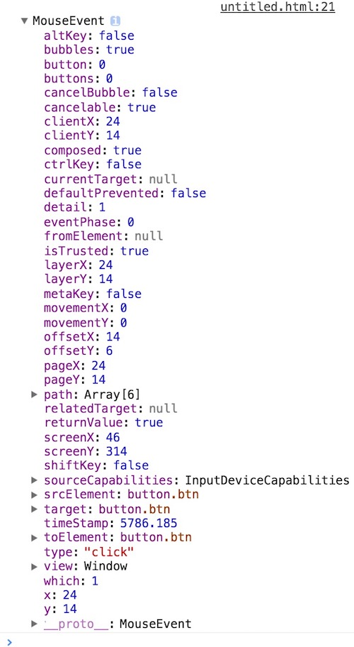
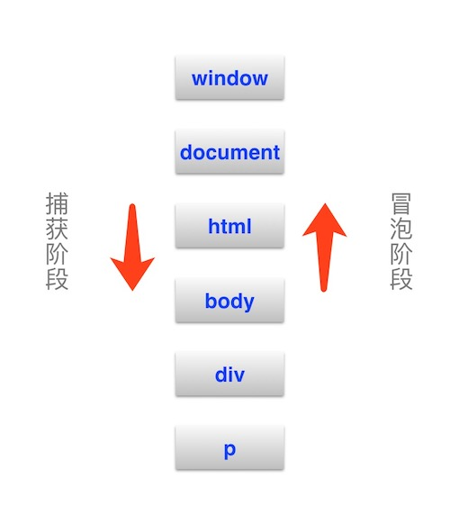

# # 概述

  事件是一种异步编程的实现方式，本质上是程序各个组成部分之间的通信。DOM支持大量的事件。

  事件是可以被 JavaScript 侦测到的行为。网页中的每个DOM元素都可以产生某些可以触发JavaScript函数的事件。简单的说，就是当用户对页面的元素进行操作的时候，页面发生的一些可见或不可见的变化。

  传统的页面交互是通过CSS实现的，不过CSS只能实现一些临时的、视觉上的简单交互。但随着互联网技术的发展，只停留在页面上的这些简单交互早已不能满足时代发展的要求了。这个时候JavaScript事件的出现很大程度地提升了界面的可交互性，这种交互不仅是停留在视觉上的，还可以是数据上的交互，可以临时的，通过和服务器端的配合也可以实现永久的页面样式和数据改变，从而更大程度地提升了用户体验。

  JavaScript的事件主要包括鼠标事件、键盘事件、表单事件、文档事件及这些事件提供的一系列处理机制，在HTML5规范确立的过程中又出现了触摸事件、拖拽事件、进度事件等一系列，本章的主要内容就是对这些事件进行介绍。

# # 事件添加

  事件一定要添加在某个页面元素后才会生效，包括window对象和document对象。事件的添加主要有以下几种形式：

- 1）、直接将代码写在HTMl上，在页面标签元素的 “*on-*” 属性上添加

  ```html
  <button type="button" onclick="alert('Hello, world!')">确定</button>
  ```

  代码少的还勉强可以，代码多的话你就会觉得有点打脑壳了。可能你会想着封装一个函数来触发：

  ```html
  <form>
  	<input type="text" oninput="validate()">
  	<button type="button" onclick="formSubmit()">提交</button>
  </form>
  ```

  ```javascript
  function validate() {
      // 事件处理部分
      // ...
      alert("处理input事件！");
  }
  function formSubmit() {
      // 事件处理部分
      // ... 
      alert("处理click事件！");
  }
  ```

    这种做法简化了代码量，但违背结构层和行为层分离的原则，除非是用于测试，在实际开发环境中并不被推荐。

- 2）、通过DOM元素添加

  直接通过document对象下的Element对象进行事件绑定，如例：

```html
<form>
	<input type="text">
	<button type="submit">提交</button>
</form>
```

```javascript
document.getElementsByTagName('input')[0].oninput = function() {
    // 事件处理
    // ...
    alert("处理input事件！");
}
document.getElementsByTagName('button')[0].onclick = function() {
    // 事件处理
    // ...
    alert("处理click事件！");
}
```

  这种做法代码可读性不高，而且不利于DOM元素的重复读取和事件绑定的设置，也不被推荐。

- 3）、通过实例化过后的Element对象添加

```html
<input type="text" onchange="validate()">
<button type="submit" onclick="submit()">登录</button>
```

```javascript
var ipt = document.getElementsByTagName('input')[0];
var btn = document.getElementsByTagName('button')[0];

ipt.onchange = function() {
    // 事件处理
    // ...
    alert("处理input事件！");
}
btn.onclick = function() {
    // 事件处理
    // ...
    alert("处理click事件！");
}
```

  这种做法看似比前两种方式多了一些代码，但由于将Element实例化为了一个对象存储于内存内，每次的访问和事件的绑定设置都是从内存去读取，无需再对DOM进行查询，很大程度上提高了代码的运行效率。而且在需要单元素多事件绑定的情况下，这种写法反而可以让代码更加的精简，节省了很多次对DOM查询消耗的代码字节。所以，这种方式在实际项目中是被大量使用的，也是比较推荐的一种方式。

- 4）、对实例化过后的Element对象进行监听

  这种方式和上面一种方式的形式一样，同样是对实例化的Element对象进行事件绑定，但这种绑定的方式一般叫做添加 “监听函数”，需要使用 Element 的 `addEventListener()` 方法，而且事件名称不需要前缀 “`on`”。表示方法如下：

```html
<form>
	<input type="text">
	<button type="submit">登录</button>
</form>
```

```javascript
var ipt = document.getElementsByTagName('input')[0];
var btn = document.getElementsByTagName('button')[0];

ipt.addEventListener('input', function() {
    // 事件处理部分
    // ... 
    alert("处理input事件！");
}, false);
btn.addEventListener('click', function() {
    // 事件处理部分
    // ... 
    alert("处理click事件！");
}, false);
```

  和普通事件的区别在于，监听函数可以为同一个实例化的Element对象添加同一个事件，而普通事件再次绑定同一个事件，后面的同名事件会覆盖之前的事件，使得之后最后一个事件才有效，之前的所有同名事件都会失效。具体我们会在后续小节里讲解。

# # 事件监听

  事件监听依赖的主要内容是“监听函数”，而监听函数是事件发生时，程序所要执行的函数。它是事件驱动编程模式的主要编程方式。

  在本章“事件的添加”一节中我们已经知道了监听函数的表示方法，并且明白了监听函数和普通函数在功能上的最大区别就是监听函数不会覆盖同名事件名称的函数，但是，若多个监听函数调用的是同一个函数，那代码也只会执行一次，这点需要注意区分。我们通过两个例子来说明这一点。

  当对同一个按钮元素执行同一个事件的不同监听函数：

```html
<!-- HTML -->
<form>
	<button type="button">测试监听函数</button>
</form>

<!-- JavaScript -->
<script type="text/javascript">
	var btn = document.getElementsByTagName('button')[0];

	btn.addEventListener('click', func_1, false);
	btn.addEventListener('click', func_2, false);


	function func_1() {
		console.log("测试函数1");
	}
	function func_2() {
		console.log("测试函数2");
	}
	// 点击按钮输出：
	// 测试函数1
	// 测试函数2
</script>
```

  当对同一个按钮元素执行同一个事件的同一个监听函数：

```html
<!-- HTML -->
<form>
	<button type="button">测试监听函数</button>
</form>

<!-- JavaScript -->
<script type="text/javascript">
	var btn = document.getElementsByTagName('button')[0];

	btn.addEventListener('click', func_1, false);
	btn.addEventListener('click', func_1, false);

	function func_1() {
		console.log("测试函数");
	}
	// 点击按钮输出：
	// 测试函数
</script>
```

  监听函数语法形式：`target.addEventListener(type, listener[, useCapture]);`

  监听函数的3个参数具体作用如下：

- **type**：事件名称，用字符串表示，不需要 `on` 前缀，大小写敏感；
- **listener**：执行函数，可以是一个函数名（不能是字符串，且不需要函数后面的“`()`”），也可以是一个匿名函数，事件发生时，会调用该监听函数；
- **useCapture**：表示监听函数是在 “捕获阶段” 触发还是在 “冒泡阶段” 触发，用一个布尔值表示。`true` 表示在 **捕获阶段** 触发，`false` 表示在 **冒泡阶段** 触发。老式浏览器规定该参数必写，较新版本的浏览器允许该参数可选。为了保持兼容，建议总是写上该参数。

  和普通函数还有一点区别就是，监听函数是可以移除的。要移除监听函数需要使用 `removeEventListener()` 方法，移除监听函数的参数必须和添加监听函数完全一致，否则无效。基本表示如下：

```html
<!-- HTML -->
<form>
	<button type="button">测试监听函数</button>
</form>

<!-- JavaScript -->
<script type="text/javascript">
	var btn = document.getElementsByTagName('button')[0];
	btn.addEventListener('click', func_1, false);
    // 移除监听函数，点击按钮不会触发监听函数
	btn.removeEventListener('click', func_1, false);
	function func_1() {
		console.log("测试函数");
	}
</script>
```

  另外需要指出的是，在IE10及之前的版本并不支持 `addEventListener()` 方法，要达到同样的效果需要使用 `attachEvent()` 方法，事件名称需要加上 `on` 前缀，而且没有第三个布尔值的参数。还有一点需要注意的是这个方法内部的 `this` 不是指向实例化的元素，而是指向 `window`。但IE11终于不再支持这个方法，接受了通用的DOM标准，开始使用 `addEventListener ` 方法。

```javascript
/**
 * 添加事件
 * @param element  事件对象
 * @param type     事件类型
 * @param callBack 回调函数
 */
function addEvent(element, type, callBack) {
    // 兼容IE10.0以下
    if(element.attachEvent) {
        element.attachEvent('on' + type, callBack);
    }else {
        element.addEventListener(type, callBack, false);
    }
}
```

# # 事件对象

  “事件对象 ” 指的是当一个事件产生后，会在事件函数内部生成一个 **Event** 的对象实例，并且将这个实例作为事件函数的参数（通常命名为“e”或“event”，IE下需要做兼容处理），我们尝试在一个事件中输出这个Event对象：

```html
<!-- HTML -->
<form>
	<button type="button" class="btn">按钮</button>
</form>

<!-- JavaScript -->
<script type="text/javascript">
	var btn = document.getElementsByClassName('btn')[0];
	// 参数‘e’为函数对象实例
	btn.onclick = function(e) {
		// 兼容IE浏览器
		e = e || event;
		console.log(e);
	}
</script>
```

  点击该按钮后在控制台中查看输出的Event对象：



  通过这个输出的事件对象Event，非常详细地反应了在这一次点击过程中的事件和被事件触发的对象之间的关系。包括了一系列重要的信息，如：点击时鼠标的X/Y坐标位置，事件是否冒泡，点击时是否按下了Ctrl/Alt/Shift键，被点击目标的相关信息等内容。但在实际开发过程中，我们只需要部分信息，这个时候就可以通过刚才我们实例化的那个“e”来进行选择性的输出：

```javascript
btn.onclick = function(e) {
	console.log("触发事件的是：" + e.target.tagName + "元素");
	console.log("事件的类型是：" + e.type);
	console.log("鼠标的X坐标：" + e.clientX);
	console.log("鼠标的Y坐标：" + e.clientY);
}
// 触发事件的是：BUTTON元素
// 事件的类型是：click
// 鼠标的X坐标：26
// 鼠标的Y坐标：21
```

  利用事件对象，我们可以在一次事件中做出更精细的判断，从而帮我们解决一些复杂的逻辑流程，实现更丰富的程序功能。

# # 事件传播

  当一个事件发生以后，它会在不同的DOM节点之间传播，这种传播会使得一个事件在多个节点上触发。事件传播分成三个阶段：

- 第一阶段：从window对象传导到目标节点，称为“捕获阶段”
- 第二阶段：在目标节点上触发，称为“目标阶段”
- 第三阶段：从目标节点传导回window对象，称为“冒泡阶段”



  我们我们先来看一个示例，冒泡阶段与捕获阶段。

```html
<style type="text/css">

.t1 {
	width: 150px;
	height: 150px;
	background-color: red;
	overflow: hidden;
}

.t2 {
	width: 100px;
	height: 100px;
	background-color: green;
	margin: 25px auto;
	overflow: hidden;
}

.t3 {
	width: 50px;
	height: 50px;
	background-color: blue;
	margin: 25px auto;
}

</style>

<div class="t1">
	<div class="t2">
		<div class="t3"></div>
	</div>
</div>

<!-- JavaScript -->
<script type="text/javascript">

let aDiv = document.getElementsByTagName(`div`);
aDiv = Array.prototype.slice.call(aDiv);
aDiv.forEach((div, idx) => {
	div.addEventListener(`click`, function() {
		alert(idx);
	}, false); //  冒泡阶段触发
});
	
</script>
```

  上述示例中，事件在冒泡阶段触发，因此弹框值依次为：2、1、0，如果将事件在捕获阶段触发，则弹框值一次为：0、1、2。

  由于事件传播的机制，会使得同一个事件会在同一个元素上多次触发。比如，假设在 `<div>` 之中嵌套一个 `<p>` 节点，如下所示：

```html
<style type="text/css">
	div {
		width: 100px;
		height: 100px;
		background-color: red;
		overflow: hidden;
	}
	p {
		width: 50px;
		height: 50px;
		background-color: orange;
		margin: 25px auto;
		text-align: center;
		line-height: 50px;
	}
</style>

<div>
	<p>点击</p>
</div>
```

  如果对这两个节点的 “click” 事件都设定监听函数，则 “click” 事件会被触发四次。

```html
<!-- JavaScript -->
<script type="text/javascript">

	var phases = {
		1: '捕获阶段', 
		2: '目标阶段',
		3: '冒泡阶段'
	};

	// 获取元素
	let oDiv = document.querySelector('div');
	let oP   = document.querySelector('p');
  
	// 添加事件
	oDiv.addEventListener('click', callback, true);  
	oDiv.addEventListener('click', callback, false); 

	oP.addEventListener('click', callback, true); 
	oP.addEventListener('click', callback, false);
    // 事件处理函数
	function callback(event) {
		// `eventPhase` 属性返回事件传播的当前阶段
		var phase = phases[event.eventPhase];
		alert(`${phase}：触发${this}节点事件`);
	}
</script>
```

  上面代码表示，**click** 事件被触发了四次：`<p>` 节点的捕获阶段和冒泡阶段各1次，`<div>`节点的捕获阶段和冒泡阶段各1次。

- 捕获阶段：事件从\<div>向\<p>传播时，触发\<div>的click事件；
- 目标阶段：事件从\<div>到达\<p>时，触发\<p>的click事件；
- 目标阶段：事件离开\<p>时，触发\<p>的click事件；
- 冒泡阶段：事件从\<p>传回\<div>时，再次触发\<div>的click事件。

  注意，用户点击网页的时候，浏览器总是假定 *click* 事件的目标节点，就是点击位置的嵌套最深的那个节点（嵌套在\<div>节点的\<p>节点）。所以，\<p>节点的捕获阶段和冒泡阶段，都会显示为 *target* 阶段。

  事件传播的最上层对象是window，接着依次是document，html（document.documentElement）和body（document.dody）。也就是说，如果\<body>元素中有一个\<div>元素，点击该元素。事件的传播顺序，在捕获阶段依次为:window -> document -> html -> body -> div，在冒泡阶段依次为div -> body -> html -> document -> window。

  使用事件对象的 `event.stopPropagation()` 方法可以让事件传播到当前的节点为止，不再继续传播。语法结构如下：

```javascript
event.stopPropagation();
```

  但是，*stopPropagation()*方法只会阻止当前监听函数的传播，不会阻止\<p>节点上的其他click事件的监听函数。如果想要不再触发那些监听函数，可以使用*stopImmediatePropagation()*方法。语法与*stopPropagation()*方法一致。

# # 事件代理

  “事件代理” 又叫做 “事件委托 ”，由于事件会在冒泡阶段向上传播到父节点，因此可以把子节点的监听函数定义在父节点上，由父节点的监听函数统一处理多个子元素的事件。这种方法叫做事件的代理（delegation）。

```html
<!-- HTML -->
<style type="text/css">
	.parent {
		width: 100px;
		height: 100px;
		background-color: red;
		overflow: hidden;
	}
	.child {
		width: 50px;
		height: 50px;
		background-color: green;
		margin: 25px auto;
	}
</style>

<section class="parent">
	<section class="child"></section>
</section>

<!-- JavaScript 部分 -->
<script type="text/javascript">
	let oParent = document.getElementsByClassName(`parent`)[0];
	let oChild  = document.getElementsByClassName(`child`)[0];

	oParent.addEventListener(`click`, function(event) {
		if (event.target.className == `child`) {
			event.target.style.backgroundColor = `orange`;
            this.style.backgroundColor = `black`;
		}
	}, false);
</script>
```

  从这个示例可以总结出两个结论：

- （1）、由于事件传播的捕获特性，父级元素可以为其子级元素绑定事件；
- （2）、事件中的this仍然是指向最初绑定事件的那个元素，这点需要留心。

# # 事件类型

## 1、鼠标事件

  鼠标事件指与鼠标相关的事件，当鼠标移动或鼠标按钮被单击时会触发鼠标事件，主要有以下一些。

- **（1）、click事件和dblclick事件**

  当用户在Element节点、document节点、window对象上单击鼠标（或者按下回车键）时，click事件触发。用户在同一个位置完成一次mousedown动作和mouseup动作。它们的触发顺序是：mousedown首先触发，mouseup接着触发，click最后触发。

  dblclick事件当用户在element、document、window对象上，双击鼠标时触发。该事件会在mousedown、mouseup、click之后触发。

- **（2）、mouseup事件、mousedown事件**

  mouseup事件在释放按下的鼠标键时触发。

  mousedown事件在按下鼠标键时触发。

  mousemove事件当鼠标在一个节点内部移动时触发。当鼠标持续移动时，该事件会连续触发。为了避免性能问题，建议对该事件的监听函数做一些限定，比如限定一段时间内只能运行一次代码。

- **（3）、mouseover事件和mouseenter事件**

  mouseover事件和mouseenter事件，都是鼠标进入一个节点时触发。

  两者的区别是，mouseenter事件只触发一次，而只要鼠标在节点内部移动，mouseover事件会在子节点上触发多次。

- **（4）、mouseout事件和mouseleave事件**

  mouseout事件和mouseleave事件，都是鼠标离开一个节点时触发。

  两者的区别是，mouseout事件会冒泡，mouseleave事件不会。子节点的mouseout事件会冒泡到父节点，进而触发父节点的mouseout事件。mouseleave事件就没有这种效果，所以离开子节点时，不会触发父节点的监听函数。

- **（5）、contextmenu事件**

  contextmenu事件在一个节点上点击鼠标右键时触发。

  通常鼠标具有三个键，即左键（主键）、右键和中间滚轮键，当他们被点击后事件的“button”属性会获得一个值，从而可以判断出用户点击的是哪一个键。当这个属性返回“0”时表示按下左键，返回“1”时表示中间滚轮，返回“2”时表示右键，返回“-1”时表示什么都没有按。


鼠标还提供与指针位置相关的一些属性

>- **clientX，clientY**
>
>  clientX属性返回鼠标位置相对于浏览器窗口左上角的水平坐标，单位为像素。
>
>  clientY属性返回鼠标位置相对于浏览器窗口左上角的垂直坐标，单位为像素。
>
>- **movementX，movementY**
>
>  movementX属性返回一个水平位移，单位为像素，表示当前位置与上一个mousemove事件之间的水平距离。在数值上，等于currentEvent.movementX = currentEvent.screenX - previousEvent.screenX。
>
>  movementY属性返回一个垂直位移，单位为像素，表示当前位置与上一个mousemove事件之间的垂直距离。在数值上，等于currentEvent.movementY = currentEvent.screenY - previousEvent.screenY。
>
>- **screenX，screenY**
>
>  screenX属性返回鼠标位置相对于屏幕左上角的水平坐标，单位为像素。
>
>  screenY属性返回鼠标位置相对于屏幕左上角的垂直坐标，单位为像素。

## 2、键盘事件

键盘事件用来描述键盘行为，主要有keydown、keypress、keyup三个事件。

- **（1）、keydown事件**

  按下键盘时触发该事件。

- **（2）、keypress事件**

  只要按下的键并非Ctrl、Alt、Shift和Meta，就接着触发keypress事件。

- **（3）、keyup事件**

  如果用户一直不松开键盘，键盘事件就会按照这样的顺序连续触发：keydown -> keypress -> keydown-> keypress -> ... （松开键盘后）-> keyup。

  当用户在按下键盘的过程中（keydown事件和keyup事件）可以通过*keyCode*属性获取当前键盘的值，返回的值是一个数字。可以根据获取的数字做出判断来完成特定的事件函数。

## 3、表单事件

  表单事件表示的是当HTML的\<form>标签内的元素被操作后发生的事件，在HTML中常见的表单标签有\<input>（不同的“type”属性支持的事件可能会有区别）、\<select>、\<textarea>、\<button>等，这些元素在内容在被操作或值发生改变时都会触发事件。

  表单元素主要有以下事件：

- **（1）、input事件**

  input事件当\<input>、\<textarea>的值发生变化时触发。此外，将contenteditable属性设置为“true”的非表单元素，只要值发生变化，也会触发input事件。input事件的一个特点，就是会连续触发，比如用户每次按下一次按键，就会触发一次input事件。

- **（2）、select事件**

  select事件当在\<input>、\<textarea>中选中文本时触发。

- **（3）、Change事件**

  Change事件当\<input>（单选框和复选框）、\<select>、\<textarea>（需要失去焦点时触发）的值发生变化时触发。它与input事件的最大不同，就是不会连续触发，只有当全部修改完成时才会触发，而且input事件必然会引发change事件。

- **（4）、reset事件**

  reset事件只能发生在表单元素\<form>上，当表单重置（所有表单成员变回默认值）时触发。

- **（5）、submit事件**

  submit事件只能发生在表单元素\<form>上，当表单数据向服务器提交时触发。注意，submit事件的发生对象是\<form>，而不是\<button>，因为提交的是表单，而不是按钮。

## 4、窗口事件

  文档事件就是DOM元素在特定的操作下一种事件，有的时候并非需要人为的操作，如页面加载时就会触发加载事件，页面将关掉时会触发卸载事件。又如，元素在获得焦点时会触发获得焦点事件，失去焦点又会触发失去焦点事件等。

- **（1）、load事件和error事件**

  load事件在页面加载成功时触发，error事件在页面加载失败时触发。页面从浏览器缓存加载，并不会触发load事件。

  这两个事件实际上属于进度事件，不仅发生在document对象，还发生在各种外部资源上面。浏览网页就是一个加载各种资源的过程，图像、样式表、脚本、视频、音频、Ajax请求等等。这些资源和document对象、window对象、XMLHttpRequestUpload对象，都会触发load事件和error事件。

- **（2）、unload事件**

  unload事件在窗口关闭或者document对象将要卸载时触发，发生在window、body、frameset等对象上面。它的触发顺序排在beforeunload、pagehide事件后面。unload事件只在页面没有被浏览器缓存时才会触发，换言之，如果通过按下“前进/后退”导致页面卸载，并不会触发unload事件。

- **（3）、DOMContentLoaded事件**

  当HTML文档下载并解析完成以后，就会在document对象上触发DOMContentLoaded事件。这时，仅仅完成了HTML文档的解析（整张页面的DOM生成），所有外部资源（样式表、脚本、iframe等等）可能还没有下载结束。也就是说，这个事件比load事件，发生时间早得多。

  需要注意的是，网页的JavaScript脚本是同步执行的，所以定义DOMContentLoaded事件的监听函数，应该放在所有脚本的最前面。否则脚本一旦发生堵塞，将推迟触发DOMContentLoaded事件。

- **（4）、readystatechange事件**

  readystatechange事件发生在Document对象和XMLHttpRequest对象加载完成后，当它们的readyState属性发生变化时触发。

  IE8不支持DOMContentLoaded事件，但是支持这个事件。因此，可以使用readystatechange事件，在低版本的IE中代替DOMContentLoaded事件。

- **（5）、scroll事件**

  scroll事件在文档或文档元素滚动时触发，可以是鼠标滚轮触发的滚动，也可以是用户用鼠标拖动滚动条。

- **（6）、resize事件**

  resize事件在改变浏览器窗口大小时触发，可以发生在window、body对象上面。

- **（7）、beforeunload事件**

  页面刷新或关闭时触发。


## 5、焦点事件

  当一个元素（比如链接或表单域）得到或失去焦点时发生。

- **（1）、focus事件和focusin事件**

  当元素获得焦点的时候触发。区别在于focus事件不会冒泡，而focusin事件（老版火狐浏览器不支持）会冒泡。focusin事件发生在focus事件之前。

  这两个事件对象都含有一个*target*属性，返回当前执行事件元素的元素节点。

- **（2）、blur事件和focusout事件**

  当元素失去焦点的时候触发。区别在于blur事件不会冒泡，而focusout事件（老版火狐浏览器不支持）会冒泡。focusout事件发生在blur事件之前。

  这两个事件对象也含有一个target属性，返回内容同上。

  ​


