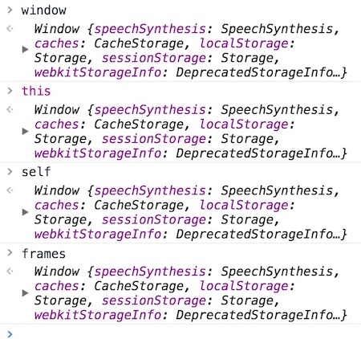
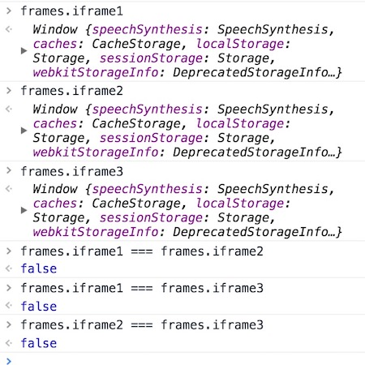
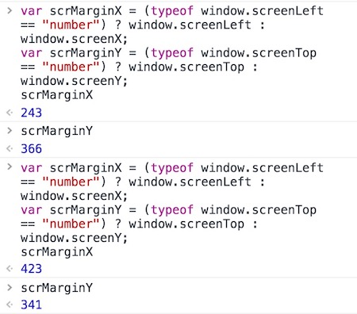
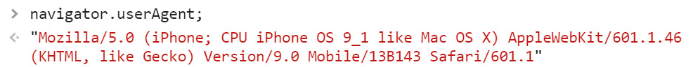
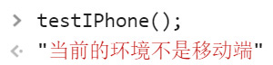
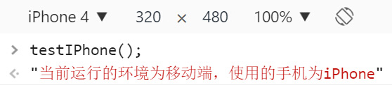
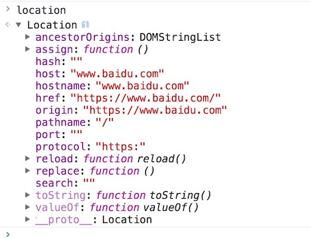
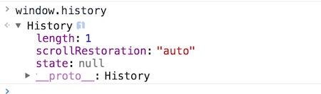
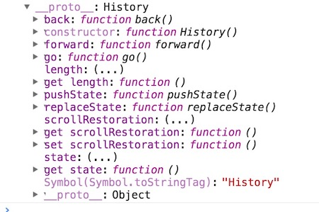

# # 概述

  **BOM**（Browers Object Model，浏览器对象模型）是浏览器为JavaScript提供的一个API（Application Programming Interface，应用编程接口），所以它不是原生JavaScript提供的。通过BOM我们可以访问和设置浏览器的一些属性和函数。

  对于BOM的几乎所有操作都依赖于一个全局对象，那就是“**window**”对象。由于它是一个全局对象，所以很多时候在访问它内部的子对象的属性和方法的时候都是可以将window一词省略不写的，如“window.screen”可以直接写成“screen”也能正常访问该子对象。

window对象下主要包含了以下子对象：

- **document**：文档对象
- **frames**：浏览器的框架（如iframe和现在废弃了的frameset）
- **history**：浏览器浏览历史对象
- **location**：浏览器页面所处位置对象
- **navigator**：浏览器信息导航对象
- **screen**：浏览器屏幕对象

  除了这些属性，window对象还提供了一些方法函数，如：*alert()*、*open()*、*close()*、*setTimeout()*、*clearTimeout()*、*setIntelval()*、*clearInterval()*等。

  BOM到现在都没有一个组织对其进行标准化，JavaScript语法的标准化组织是ECMA，DOM的标准化组织是W3C，但这并不妨碍浏览器厂商们对其的支持。随着Web编程技术的发展，浏览器厂商在很多BOM的内容上都达成了共识，这使得很多没有标准的属性和方法也可以在大多数现代浏览器上正常的使用。

  在全局环境下，window对象以下几种表示法：

- **window**
- **this**
- **self**
- **fremes**

  它们在全局环境下都是指向window对象




window 对象下的属性和方法非常之多，多至现在也没有一份权威的统计表明window下到底有多少个属性和方法，这个只需要打开Google Chrome（主要推荐，但也可以是其它非IE系列的主流浏览器）的控制台，然后输入“window.”（后面需要加上“点”）就可以看到window下的属性了，而且里面很多属性下还包含二级、三级甚至更多级的属性。也就是说想要完全去掌握window下的所有属性和方法肯定是不现实的，我们只需要掌握一些常用的，对我们实际项目开发中有一定帮助的即可。接下来我们我们开始对window的这些主要属性和方法进行讲解。

# # 窗口属性

用于描述当前浏览器窗口的相关属性，这对于现在这个屏幕小到“160x160”（如智能手表），大到“4096×2160”（4K屏幕）的互联网时代来说，要做到同一个项目在不同分辨率屏幕的设备上做出响应式的设计一直是前端开发工程师头痛的问题。虽然说现在已经有很多CSS框架都或多或少的能帮上一些忙，但它们都有各自的局限性，而且还存在一些学习成本。但是如果能掌握原生JavaScript一些关于浏览器窗口的属性，对于我们做响应式设计也有不小的帮助。

浏览器窗口相关的主要属性有以下（数值表示的单位统一为像素）:

- **window.innerWidth**：浏览器窗口的可见宽度
- **window.innerHeight**：浏览器窗口的可见高度
- **window.outerWidth**：浏览器窗口的实际宽度（包括浏览器菜单和边框）
- **window.outerHeight**：浏览器窗口的实际高度（包括浏览器菜单和边框）
- **window.window.pageXOffsett**：浏览器窗口滚动条水平滚动的距离
- **window.pageYOffset**：浏览器窗口滚动条垂直滚动的距离

> 提示：
>
> window.pageXOffset 类似于 scrollTop
>
> ```
> document.documentElement.scrollTop || document.body.scrollTop
> ```

> 注意：innerWidth、innerHeight、outerWidth、outerHeight都会包含滚动条的宽度。这些属性都是只读的，它们会根据当前浏览器的尺寸或内容的变化而动态地跟随变化。

```css
/*隐藏滚动条*/
body::-webkit-scrollbar {
    display: none;
}
```

# # 窗口方法

## 1、window.open() 和 window.close()

window.open() 方法用于打开一个新的窗口（或标签页），而window.close() 用于关闭当前窗口，他们同样可以将方法前的window对象省略不写，也能达到同样的方法效果。

相比于close()方法用于直接关闭浏览器窗口，open()方法就要稍微复杂一些，该方法有4个可选参数，它们的作用分别是：

- **URL**

  新窗口的URL地址，为一个字符串。

- **名称**

  新窗口的名称，为一个字符串。

- **窗口特性**

  新窗口的URL，为一个字符串。具体可以配置以下内容：

  - width：窗口宽度，值为一个像素数值
  - height：窗口高度，值为一个像素数值
  - left：窗口的屏幕X坐标，值为一个像素数值
  - top：窗口的屏幕Y坐标，值为一个像素数值
  - channelmode：是否“影院模式”显示窗口，值：yes/no（默认）
  - fullscreen：是否全屏显示，处于全屏模式的窗口必须同时处于剧院模式，值：yes/no（默认）
  - directories：是否添加目录按钮，值：yes（默认）/no
  - location：是否显示地址字段，值：yes（默认）/no
  - menubar：是否显示菜单栏，值：yes（默认）/no
  - resizable：窗口是否可以调整尺寸，值：yes（默认）/no
  - scrollbars：是否显示滚动条，值：yes（默认）/no
  - status：是否显示状态栏，值：yes（默认）/no
  - titlebar：是否显示标题栏，值：yes（默认）/no
  - toolbar：是否显示工具栏，值：yes（默认）/no

  在这些配置项中，各浏览器的支持情况都不是很理想，在目前标准（包括HTML5标准和ECMAScript标准）支持最好的Google Chrome上也只支持上面的前四个配置。所以，如非定制浏览器开发，否则没有必要去进行配置。

- 记录

  在浏览器历史中替换或新建记录，为一个布尔值。true为替换，false为新建。

  我们来看一个示例：

```html
<!-- HTML部分 -->
<form>
	<button type="button" id="blank">新窗口</button>
	<button type="button" id="openBaidu">百度</button>
	<button type="button" id="openTencent">腾讯</button>
</form>

<!-- JavaScript部分 -->
<script type="text/javascript">
	var blank       = document.getElementById('blank');
	var openBaidu   = document.getElementById('openBaidu');
	var openTencent = document.getElementById('openTencent');

	blank.onclick = function() {
		window.open();
	}
	openBaidu.onclick = function() {
		window.open("https://www.baidu.com", "百度", "width=900, height=500, top=100,left=100");
	}
	openTencent.onclick = function() {
		window.open("http://www.qq.com/", "腾讯", "channelmode=yes, fullscreen=yes");
	}
</script>
```

## 2、window.print()

在PC端很多网站的《XXX服务条款》或需要用传统笔来填写和签名的表格都会有一个“打印”按钮，用于连接有打印机的设备打印当前的页面。这个时候只需要简单一句代码即可实现，如例：

```html
<button type="button" onclick="print()">打印</button>
```

在点击了绑定 `print()` 按钮之后只需要按照平时页面打印的常规设置即可使用打印机进行打印。这里需要注意的一个小细节是，在打印页面最上方会有两段小的文字，一个是当前电脑上的月份和日期，后面一个是写在HTML的\<head>标签里\<title>标签内的文本内容，可以根据需要设置。

## 3、window.getSelection()

`getSelection()` 方法返回一个 **Selection** 对象，表示用户现在选中的文本。而用这个方法的 `toString()` 方法可以用于返回被选中的文本。我们来通过一个简单的示例来了解该方法的实际运用：

```html
<!-- HTML部分 -->
<div id="selText">
	<pre>曾经沧海难为水，除却巫山不是云。</pre>
	<pre>取次花丛懒回顾，半缘修道半缘君。</pre>
</div>
<p id="selDisplay">您选中的内容是：</p>

<!-- JavaScript部分 -->
<script type="text/javascript">
	var oDiv = document.getElementById('selText');
	var oSel = document.getElementById('selDisplay');

	oDiv.onmouseup = function() {
        // 获取选中对象
		var selObj = getSelection();
        // 将选中对象转为字符串
		var selTxt = selObj.toString();
		oSel.innerHTML = `您选中的内容是：<b>“${selTxt}”</b>`;
	}
</script>
```

示例中使用了一个 `mouseup` 事件来激活用户选择文本的操作。

# # 文档对象 document

对于window对象来说，document和DOM里面的document还是稍稍有些区别的，window对象的document子对象只有一个属性，就是“all”属性，它可以返回当前页面的标签集合，组成一个类似数组的对象。

新建一个基本的HTML文档：

```html
<!DOCTYPE html>
<html lang="en">
<head>
	<meta charset="UTF-8">
	<title>测试文件</title>
</head>
<body></body>
</html>
```

在控制台测试这个属性：


该属性已经被标准化的DOM操作所代替，不过在一些较老的项目里仍然可以看到其身影。

# # 框架对象 frames

在这一章的第一节中通过例子我们已经见到过，frames和window是严格相等的，实际上，frames只是window的别名，它们表示的应用场景是不一样的。但只要window具有的属性，frames也具有，反之也成立。

为了证明上述，我们看一个示例：

```html
<body>
	<iframe src="" frameborder="0" name="iframe1"></iframe>
	<iframe src="" frameborder="0" name="iframe2"></iframe>
	<iframe src="" frameborder="0" name="iframe3"></iframe>
</body>
<script type="text/javascript">
    // 设置当前窗口的名称
	window.name = "myiframe";
	// 访问frames的名称
	console.log(frames.name); // "myiframe"
	// 当前窗口含有的窗口
	console.log(window.length); // 3
	console.log(frames.length); // 3
</script>
```

通过这个测试可以发现，window对象和frames对象完全是同一个对象，它们都是内存里那个window对象的引用，其中一个对象的属性发生变化，和它相关的对象随之变化。

在HTML中提到过，\<iframe>标签就是“浏览器窗口中嵌入的浏览器窗口”。像上面那3个已经具有了name属性的\<iframe>标签我们可以通过这样的形式去访问：



通过这个测试又可以发现，不仅可以简单地通过frames对象简单地去访问这些iframe;，而且它们返回的结果和之前我们看到的window等同引用的对象的返回结果基本是一样的，注意这里说的是“基本一样”，因为从最后三个测试结果可以发现，这三个iframe是互不相等的。

要访问页面内指定的iframe除了上面提供的方法外，还可以用索引下标或中括号字符串的形式去访问。比如说现在我们要访问刚才那个name属性为“iframe2”的\<iframe>标签，还可以使用下面两种形式：


在Ajax不盛行的年代，\<iframe>标签是在页面内嵌入网站的最好选择，但随着JavaScript相关编程技术的高速发展，使用\<iframe>标签嵌套子页面的形式已经开始不被推荐，而是用Ajax的异步加载的形式去请求“ 文档片段 ”，这样可以使得页面不需要再去加载子页面内的整个css和js等文件，和一些不必要的标签（包括整个\<head>标签和文档声明）。这样一来就使得页面加载的速度得到很大提升，页面也不会因为跳转刷新出现短暂白屏的情况，从而使得用户体验得到提升。不需要页面跳转，网站所有功能都通过一个页面完成的页面现在的术语叫法为“*SPA*”（single page application，译为：单页面应用程序。也有叫“SPWA”，其中的“W”表示“web”），是现在Web互联网应用开发的一个主流趋势。

# # 屏幕对象 screen

屏幕对象相关属性都是只读的，它们返回浏览器相对于当前计算机屏幕的数据信息。

screen对象是用于描述当前浏览器相对于屏幕信息的主要对象，所含属性如下：


其中availWidth和availHeight表示的是当前的浏览器窗口相对于屏幕而言的可用宽度和高度，而colorDepth和pixelDepth表示的是颜色深度和像素深度这些色彩图形学上的东西。

和屏幕相关的还有以下属性：

- **screenLeft**：返回当前浏览器窗口距离屏幕左侧的像素数值
- **screenTop**：返回当前浏览器窗口距离屏幕上侧的像素数值
- **screenX**：作用和screenLeft相同
- **screenY**：作用和screenTop相同

之所以出现这样同功能的属性归根到底，还是因为BOM一直没有一个标准造成的，根据资料显示支持screenLeft和screenTop的浏览器有：IE、Chrome、Safari、Opera，但Firxfox不支持。而支持screenX和screenY的浏览器有：Firxfox、Chrome、Safari、Opera，但IE不支持。

为了解决这样兼容性问题，我们可以用一个自定义的三元表达式的办法来解决：

```javascript
// 窗口距离屏幕左侧
var scrMarginX = (typeof window.screenLeft == "number") ? window.screenLeft : window.screenX;
// 窗口距离屏幕右侧
var scrMarginY = (typeof window.screenTop == "number") ? window.screenTop : window.screenY;
```

现在我们就尝试多次调整浏览器窗口来试验一下刚才自定义的“属性”：



但是需要注意的是使用我们自定义变量来接收浏览器屏幕信息需要每次窗口移动后都要进行一次表达值赋值，否则我们的“属性值”永远是第一次取到的值。显然这样的做法并不好，但由于BOM标准的问题，这也是一种不得已而为之的办法，只是一种浏览器兼容性的方案。

# # 导航对象 navigator

这个对象用来包含浏览器详细信息的对象，通常用于做浏览器兼容性处理和设备的响应设计。可以打开浏览器输入这个navigator对象的名称来查看不同的浏览器的相关属性，这里我们还是以现在国内使用量[排行第一](http://tongji.baidu.com/data/browser)（并且也是最长时间来对[HTML5](http://html5test.com/)和[ECMAScript 6](https://kangax.github.io/compat-table/es6/)支持最好的浏览器）的Google Chrome进行测试：


在控制台输出的内容为一个对象，对象展开后会包含比较多的属性，其中“*userAgent*”是一个比较重要的属性。在早期作浏览器判断都是依靠这个属性，不过随着浏览器版本的发展，再用这个属性去区分不同的浏览器已经行不通了。

通过观察，可以在里面发现一些其它浏览器的信息，如“Mozilla”（FireFox浏览器厂商）和“Safari”（苹果浏览器）这些额外的信息，所以想通过它来判断当前浏览器究竟是哪个浏览器是不可能了，但是使用这个属性还是可以用于判断当前的设备是PC端还是移动端的。现在我们通过谷歌开发者工具将当前环境模拟为移动端环境，然后再次在控制内输入navigator.userAgent这个属性观察：



通过肉眼对比已经可以发现两端代码的长度是不一样的了，认真对比还会发现里面有些内容被替换了，而且还新增了一些字符，如“iPhone”、“iPhone OS 9_1”、“Mobile”等字符。利用这一点我们可以用来很好地解决一些跨平台的代码兼容性问题，或者开发针对设备的特殊交互效果。

现在我们利用navigator.userAgent来编写一段用于判断当前环境是否为移动端并且是否是“iPhone”手机的代码：

```javascript
function testIPhone() {
	let navUserAgent = window.navigator.userAgent.toLowerCase();
	let isMobile = /Mobile/i.test(navUserAgent);
	let isIPhone = /iphone/i.test(navUserAgent);
	if (isMobile && isIPhone) {
		return "当前运行的环境为移动端，使用的手机为'iphone'.";
	}else if(isMobile) {
		return "当前运行的环境为移动端，使用的手机不是'iphone'.";
	}else {
		return "当前运行的环境不是移动端";
	}
}
```

  然后我们就几种情况进行测试。

- PC端：

  


- iPhone 4：

  

- Samsung Note 3：

  

  若在PC端判断当前的浏览器厂商也提供了一个属性，就是“navigator.*vendor*”。虽然这个属性得到了现在主流浏览器的支持，但除了谷歌会返回“Google Inc.”的字符串结果外，其它浏览器目前返回的仍然是一个空字符串（以Google Chrome 57版本同期时段为例），相信以后更多浏览器厂商会加上这个信息。
# # 位置对象 location

该对象同样属于window对象中的一个子对象，它用于描述当前页面的地址信息。首先我们拿百度首页来做这个对象的测试，简单观察该对象的相关属性属性。



 现在我们就按照对象返回属性的这个顺序开始简单地讲解这个对象，我们首先来看里面的属性：

- **hash**

  地址栏的“*哈希值*”，返回或设置当前地址的哈希值，如果没有哈希值则返回空字符串。返回和设置的值以“#”号开始，后面接一段字符或简单符号组成的字符，如当前课件地址栏中的“#”+英文字母的部分。这个属性是现在SPA页面（单页面）做页面路由常用的一个属性。

- **host**

  设置或返回当前URL主机名和端口号（如果有的话）。通过设置这个属性可以达到跳转页面的效果。如现在有一个URL“https://github.com/LiHongyao/”，将其host设置为“baidu.com”的话，它会跳转到“https://www.baidu.com/”这个URL对应的页面。

- **hostname**

  设置或返回当前URL的主机名。除了不能返回端口号，该属性作用和host属性基本一致。

- **href**

  设置或返回完整的URL。相对于host等属性来说，href的表达更加完整，是经常用于做页面跳转的属性。

  该属性在项目的很多地方都会涉及。如这样一个场景：当一个用户进入一个有账户系统的网站去点击名为“个人中心”的导航按钮。这个时候我们就需要做出如下判断：通过一个设置在全局里值为布尔型的对象属性判断当前用户是否登录，如果登录了，那直接跳转向“个人中心”获取并显示该用户的相关信息；如果判断出该用户还没有登录，那将跳转向“用户登录”所在的页面。

  ```javascript
  var user = {
  	name: "Henrry Lee",
  	vip: 3,
  	loginState: true
  	// ...
  }
  // 当用户触发了“个人中心”的点击事件函数
  function toUserCenter() {
    	location.href = user.loginState ? "user/usercenter.html" : "user/login.html";
  }
  ```

  当然，在本例中使用的跳转只是跳转“同域”。如果有特殊需要也可以跳转向其它域名，这个时候就需要输入类似于“http://www.?????（注册域名名称）.com”这样的URL地址了。

- **origin**

  表面看上去它和href属性没有什么区别，但若当地址里面带有“?”及后面的参数的时候就不一样了，该属性只会返回“?”之前的内容，而href会将完整的URL返回（这一点可以进入任意电子商务网站，点击超链接进入用户登录的页面，观察地址栏）。

- **pathname**

  设置或返回当前URL的路径部分。在我们上面输出百度的location属性时看到这个属性返回的值为“/”，这是因为现在处于这个网站的根目录下。也就是说如果进入这个网站的更深一级目录，再去访问这个属性的时候即可看到当前所在的路径了（如果HTTP服务器设置的默认页面名不为“index.html”的话，那这个字符串也会被返回）。

- **port**

  设置或返回当前URL的端口号。

- **protocol**

  设置或返回当前URL的协议，常见如“http:”、“https:”、“file:” 等。现在通常用来做网站协议类型“http”升级到“https”之后的重定向，帮助用户点击浏览器收藏夹或复制而来的网址都能正常地跳转向“https”协议的地址。

- **search**

  设置或返回从问号“`?`”开始的URL，及查询部分。通常，我们可以通过 *search* 属性在页面之间进行传值。

  ```javascript
  function locSearchValToObj(searchStr) {
      // 异常处理
      if (!searchStr) {
          return null;
      }else {
          var str = searchStr.slice(1);
          var strArr = str.split('&');
          var obj = {};
          strArr.forEach(function(item, idx, arr){
              var arr = item.split('=');
              var key = decodeURI(arr[0]);
              var val = decodeURI(arr[1]);
              obj[key] = val;
          });
          return obj;
      }
  }
  ```


- **assign()**

  加载新的Web文档，除了“属性”和“方法”使用上的区别外，它和location.href的用途基本是完全一样的。

  ```javascript
  window.location.href = "https://www.baidu.com/"
  // 等价于
  window.location.assign("https://www.baidu.com/")
  ```

- **reload()**

  重新加载当前Web页面。相当于按下了键盘上的“F5”按键或点击浏览器刷新按钮的功能。该方法有一个可选参数，为一个布尔值。当值为true的时候，当前的页面将不会从浏览器缓存去加载当前的页面，而是去服务器端获取相关的资源，而值为false（默认）的时候，页面会从浏览器缓存里去获取相关资源。

- **replace()**

  该方法的使用和assign()一样，区别是该方法不会留下历史记录。因为从名称可以大概明白它的实现方式是用一个页面“替换”掉当前的Web页面，这样不会留下历史记录，即通过点击浏览器的返回按钮无法回到之前的页面。

# # 历史对象 history

浏览器有一个history对象，这个对象用于保存页面浏览通过超链接或程序链接跳转的记录，通常会将其直译为“*历史记录*”对象。首先，按照我们“一贯的作风”，将这个对象在浏览器的控制台进行一次输出观察。



可以发现，这个对象只有3个属性，分别是：记录长度、记录回滚和状态，但实际上这个对象的真正实用的方法都是“藏”在了原型里，我将“__proto__”展开后再看看这些方法。



细心一点可以发现，这个原型里面基本不包含属性（有也只是之前的那3个属性），基本都是以方法的形式存在的。我们首先来看一下这个对象常用的3个原型方法：

- **1）、history.back()**

  返回到上一个访问页面，等同于浏览器的后退键。用于制作手机客户端左上角的返回按钮是个不错的选择。不要将返回的按钮设置为一个超链接，因为有的时候不知道是从哪个页面跳到这个页面的，如果用超链接的方式有时是无法正确回到上一个页面的。

- **2）、history.forward()**

  前进到下一个访问页面，等同于浏览器的前进键。

- **3）、history.go()**

  相对当前记录后退或前进到第几个记录，参数为一个“正负整数”。如例说明：

  ```javascript
  history.go(-2); // 回退到上上个页面
  history.go(-1); // 回退到上个页面
  history.go(0);  // 相当于刷新当前页面
  history.go(1);  // 前进到下个页面
  history.go(2);  // 前进到下下个页面
  ```

另外，HTML5后还新增了pushState()和replaceState()这两个方法，它们用于新增和修改当前的历史记录，这两个方法都包含三个参数：

- **state**：一个与指定网址相关的状态对象，popstate事件触发时，该对象会传入回调函数。如果不需要这个对象，此处可以填null。
- **title**：新页面的标题，但是所有浏览器目前都忽略这个值，因此这里可以填null。
- **url**：新的网址，必须与当前页面处在同一个域。浏览器的地址栏将显示这个网址。

“state”这个里面的popstate事件是当同一个文档的history对象出现变化时才会触发。但是，仅仅调用pushState()方法或replaceState()方法 ，并不会触发该事件，只有用户点击浏览器倒退按钮和前进按钮，或者使用JavaScript调用back()、forward()、go()方法时才会触发。另外，该事件只针对同一个文档，如果浏览历史的切换，导致加载不同的文档，该事件也不会触发。

通过上面的描述，我们基本可以大致能归类出pushState()和replaceState()这两个方法的一个用途了，就是如果当前网站采用的是Ajax的SPA页面的话，可以使用这两个方法来模拟出页面的跳转（实际上页面并没有跳转，只是通过Ajax导入了新的内容，而这些内容正是这两个方法URL参数里对应的页面而已）

由于我们还没有正式地开始学习Ajax的相关内容，这两个方法现在就暂时不作深入的讲解了，在以后学习Ajax后再将这两个方法拿来做实际运用的例子。

