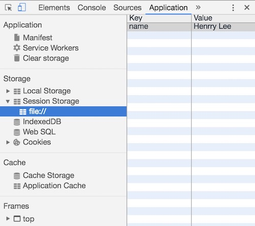

# # 概述

“**Web Storage**”是HTML5新增的一种数据存储机制，随着浏览器对HTML5的支持度不断增加，在新建的项目中基本已经取代了**cookie**（它是服务器保存在浏览器的一小段文本信息，每个Cookie的大小一般不能超过4KB，超过这个长度的Cookie，将被忽略，不会被设置）。

“Web Storage”更像是cookie的强化版，能够动用大得多的存储空间。目前，每个域名的存储上限据浏览器而定，Chrome是2.5MB，Firefox和Opera是5MB，IE是10MB。其中，Firefox的存储空间由一级域名决定，而其他浏览器没有这个限制。也就是说，在Firefox中，“https://music.baidu.com” 和“https://zhidao.baidu.com” 共享5MB的存储空间。另外，与Cookie一样，它们也受同域限制。某个网页存入的数据，只有同域下的网页才能读取。

“Web Storage”存储机制包含**sessionStorage（会话存储）**和**localStorage（本地存储）**这两个对象。它们存储值的方式和JavaScript中对象属性储存值的方式一样，都是以“键值对”存在的，这两个对象的区别是：会话存储（sessionStorage）的键值在浏览器关闭后会被清除，而本地存储（localStorage）存储的键值会一直存在于浏览器中，除非被手动清除或使用clear()方法清除。需要注意，浏览器自带的“历史记录”清除功能也无法将其清除。这样一来我们Web前端开发者也可以达到“数据持久化存储”的目的了。接下来我们看学习这两个对象的使用方式。

# # 会话存储

学习这个对象首先要从 `setItem()` 这个方法开始，这个方法包含两个参数，第一个参数为这个对象的键名（属性名），第二个参数为这个对象的键值（属性值），配置和访问方法如下：

```javascript
// 临时存储数据
sessionStorage.setItem("name", "Henrry Lee");
// 获取临时存储的数据
var msg = sessionStorage.getItem("name");
```

这样一来我们就将这个属性名为“name”的键值对存入了浏览器。除了直接输出sessionStorage这个对象以外，我们还可以在开发者工具的“Application”中“Storage”一栏的“Session Storage”子菜单中去查看存储的值。



这个值现在已经被存入浏览器，只要不关闭浏览器，当前域名下的这个值就始终是存在的，关闭浏览器后再次打开浏览器会发现这个键值对已经被销毁了。

如果是要读取已经存储于浏览器内的sessionStorage的值就需要用到 `getItem()` 这个方法了，方法参数为指定的键名，如例：

```javascript
var name = sessionStorage.getItem('name')
console.log(`您上次存储的作者名为：“${name}”`)
// 您上次存储的作者名为：“Henrry Lee”
```

如果需要清除指定的键值对可以使用 **removeItem()**，方法参数为指定的键名，如例：

```javascript
sessionStorage.removeItem('name')
sessionStorage.getItem('name')
// null
```

这个时候再去开发者工具“Application”栏里去查看刚才存储的值，发现“name”键值对已经不存在了。

如果是要一次性清除所有sessionStorage对象存储的键值对，可以使用 **clear()** 方法，该方法不需要参数。

```javascript
sessionStorage.clear()
```

# # 本地存储

本地存存使用 localStorage，该对象的所有方法和sessionStorage完全一致。在浏览器查看的位置位于开发者工具中“Application”栏中“Storage”一栏的“Local Storage”子菜单中。它们的区别在于，localStorage可以真正地实现数据的“永久存储”，即使用户关闭浏览器，或使用清除浏览历史等功能，通过localStorage存储的数据仍然存在。

# # 扩展

这两个存储对象可以通过` key()` 方法遍历出所有的键名，现在以localStorage为例先创建几个键值对，然后对其进行键名的遍历存入一个数组：

```javascript
localStorage.setItem('name', "Henrry Lee");
localStorage.setItem('age', "24");
localStorage.setItem('profession', "Web前端工程师");
localStorage.setItem('address', "四川省成都市");

var arr = [];
for (var i = 0; i < localStorage.length; i++) {
	arr.push(localStorage.key(i))
}
console.log(arr);
// ["address", "age", "name", "profession"]
```

当储存的数据发生变化时，会触发storage事件。我们可以为window添加监听函数来监听“Web Storage”的两个对象发生值变化事件，通过回调函数来执行相应的函数操作，回调函数接受一个event对象作为参数。这个event对象主要包含4个属性：

- **key**：保存发生变化的键名
- **oldValue**：更新前的值。如果该键为新增加，则这个属性为null
- **newValue**：更新后的值。如果该键被删除，则这个属性为null
- **url**：原始触发storage事件的那个网页的网址

监听函数的格式如下：

```javascript
window.addEventListener('storage', function(e) {
	console.log(e.key);
	console.log(e.oldValue);
	console.log(e.newValue);
	console.log(e.url);
});
```

值得特别注意的是，该事件不在导致数据变化的当前页面触发。如果浏览器同时打开一个域名下面的多个页面，当其中的一个页面改变sessionStorage或localStorage的数据时，其他所有页面的storage事件会被触发，而原始页面并不触发storage事件。可以通过这种机制，实现多个窗口之间的通信。所有浏览器之中，只有IE浏览器除外，它会在所有页面触发storage事件。

对于“Web Storage”还有一点需要补充说明的是，它们只能存储字符串的值。若需要进行数值计算和条件判断的时候记得需要进行数据类型转换。存储为数组形式的值，取到的值也是一段用逗号分隔的字符串，也需要用“*split(",")* ”方法重新转换回数组的形式。但如果是存储内容为一个对象的时候，返回的是"[object Object]"的字符串，如下。

```javascript
var obj = {
	name: "Henrry Lee",
	age: 24,
	address: "四川省成都市"
}
localStorage.setItem("userInfo", obj);
localStorage.getItem("userInfo");
// [object Object]
```

这个时候我们需要用JSON提供的两个方法来完成“Web Storage”对对象的存储，即：parse()和stringify()方法，使用方法如例：

```javascript
var obj = {
	name: "Henrry Lee",
	age: 24,
	address: "四川省成都市"
}
// 转成JSON字符串格式
var strObj = JSON.stringify(obj);
localStorage.setItem("userInfo", strObj);

// 访问
var storageStrObj = localStorage.getItem("userInfo");
// 将JSON字符串转为JS对象
var jsObj = JSON.parse(storageStrObj);
console.log(jsObj);
```