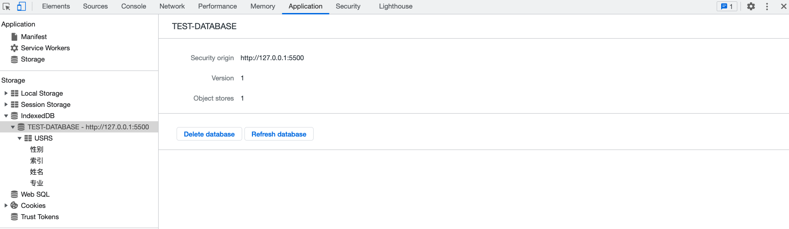

# 一、概述

数据存储，可以是临时存储，也可以是永久存储，接下来我们一起看看在Web中，有哪些方式可以存储数据。

# 二、Cookie

[参考指南 >>](<https://developer.mozilla.org/zh-CN/docs/Web/API/Document/cookie>)

[lg-cookie 库 >>](https://www.npmjs.com/package/lg-cookie)

# 三、Web Storage

## 1、概述

Web Storage 是HTML5新增的一种数据存储机制，随着浏览器对HTML5的支持度不断增加，在新建的项目中基本已经取代了cookie（它是服务器保存在浏览器的一小段文本信息，每个Cookie的大小一般不能超过4KB，超过这个长度的Cookie，将被忽略，不会被设置）。Web Storage更像是cookie的强化版，能够动用大得多的存储空间。Web Storage存储机制包含 会话存储 和 本地存储 这两个对象。它们存储值的方式和JavaScript中对象属性储存值的方式一样，都是以“键值对”存在的。

## 2、本地存储 & 会话存储

- `sessionStorage`：会话存储（临时存储），数据在浏览器关闭后会被清除	
- `localStorage`：本地存储，数据一直存在于浏览器中，除非调用 `clear` 清除，一般用于数据持久化存储

会话存储和本地存储常用的方法：

- `setItem(key, val)`：存储数据 & 修改数据
- `getItem(key)`：获取数据
- `removeItem(key)`：移除数据
- `clear()`：清空数据

> 提示：
>
> \- 不管是sessionStorage还是localStorage，他们的本质都是对象，所以我们可以通过点语法的形式对它们进行增删改查。
>
> \- 在浏览器调试工具的 Application 选项中可查看存储数据的可视化形式。

## 3、对象存储

Webstorage 不能直接存储对象类型的数据，需将对象类型的数据转换成 `JSON` 数据之后进行存储，读取的时候需进行解析。

```js
// 1. 存
sessionStorage.usr = JSON.stringify({
	name: "木子李",
	age: 31,
	major: "软件技术"
});

// 2. 取
JSON.parse(sessionStorage.usr);
```

## 4. Cookie vs Web Storage

- 存登录信息，大小限制为4KB左右

- localStorage是Html5新增的，用于本地数据存储，保存的数据没有过期时间，一般浏览器大小限制在5MB

- sessionStorage接口方法和localStorage类似，但保存的数据的只会在当前会话中保存下来，页面关闭后会被清空。


# 四、IndexDB

[参考 >>](https://developer.mozilla.org/zh-CN/docs/Web/API/IndexedDB_API)

## 1、概述

随着浏览器的功能不断增强，越来越多的网站开始考虑，将大量数据储存在客户端，这样可以减少从服务器获取数据，直接从本地获取数据。现有的浏览器数据储存方案，都不适合储存大量数据：Cookie 的大小不超过4KB，且每次请求都会发送回服务器；LocalStorage 在5MB（各家浏览器不同），而且不提供搜索功能，不能建立自定义的索引。所以，需要一种新的解决方案，这就是 IndexedDB 诞生的背景。

通俗地说，IndexedDB 就是浏览器提供的本地数据库，它可以被网页脚本创建和操作。IndexedDB 允许储存大量数据，提供查找接口，还能建立索引。这些都是 LocalStorage 所不具备的。就数据库类型而言，IndexedDB 不属于关系型数据库（不支持 SQL 查询语句），更接近 NoSQL 数据库。

IndexedDB 具有以下特点：

- 对象存储；
- 异步读写；
- 支持事务；
- 同源限制；
- 存储空间大，接近无限制；
- 支持二进制存储；

## 2、基本概念

操作对象：

- 数据库：`IDBDatabase`
- 对象仓库：`IDBObjectStore （表）`
- 索引：`IDBIndex `
- 事务：`IDBTransaction `
- 操作请求：`IDBRequest `
- 指针：`IDBCursor `
- 主键集合：`IDBKeyRange `

## 3. 操作

### 3.1. 新建数据库

新建数据库与打开数据库是同一个操作。如果指定的数据库不存在，就会新建。不同之处在于，后续的操作主要在`upgradeneeded`事件的监听函数里面完成，因为这时版本从无到有，所以会触发这个事件。

```js
/**
 * 获取数据库
 * @param {*} databaseName 数据库名称
 * @param {*} version  数据库版本
 * @returns
 */
function openDB(databaseName, version) {
  return new Promise((resolve, reject) => {
    const DBOpenRequest = window.indexedDB.open(databaseName, version);
    // 打开异常
    DBOpenRequest.onerror = (e) => {
      reject(e);
    };
    // 打开成功
    DBOpenRequest.onsuccess = (e) => {
      resolve(DBOpenRequest.result);
    };
    // 数据库升级事件，如果指定的版本号，大于数据库的实际版本号，就会发生数据库升级事件
    DBOpenRequest.onupgradeneeded = (e) => {
      console.log("Upgrading...");
    };
  });
}
```

调用

```js
(async function () {
  // 1. 打开数据库
  const db = await openDB("TEST-DATABASE");
  console.log(db);
})();
```

> 提示：如果浏览器已经存在该数据库，则直接返回，没如果不存在，则新建数据库之后返回。


### 3.2. 新建对象仓库（表）和索引

通常，新建数据库以后，第一件事是新建对象仓库（即新建表）。接下来我们在 `onupgradeneeded` 事件回调中新建一个仓库用于存储用户信息，并为其创建索引：

```js
DBOpenRequest.onupgradeneeded = (e) => {
  console.log('Upgrading...');
  let db = e.target.result;
  // 新建对象仓库（用户表）
  if (!db.objectStoreNames.contains('USRS')) {
    // 创建USRS对象仓库/主键为自增整数
    // 如果需要指定值为主键，则可以设置：{keyPath: "键" }
    let objStore = db.createObjectStore('USRS', { autoIncrement: 'id' });
    // 创建索引，语法形式：objStore.createIndex(名称, 索引, 配置对象)
    objStore.createIndex('姓名', 'name', { unique: false });
    objStore.createIndex('性别', 'gender', { unique: false });
    objStore.createIndex('年龄', 'age', { unique: false });
    objStore.createIndex('电话', 'phone', { unique: true });
    objStore.createIndex('地址', 'address', { unique: false });
  }
};
```



### 4.4. 添加记录

```javascript
const request = db
  .transaction(['USRS'], 'readwrite')
  .objectStore('USRS')
  .add({
    name: 'Li-HONGYAO',
    age: 28,
    gender: '男',
    address: '成都市高新区雅和南四路216号',
    phone: '17398888669',
  });
request.onsuccess = () => {
  console.log('Add success!');
};
request.onerror = (e) => {
  console.log(e);
};
```

上面代码中，写入数据需要新建一个事务。新建时必须指定表格名称和操作模式（"只读"或"读写"）。新建事务以后，通过`IDBTransaction.objectStore(name)`方法，拿到 IDBObjectStore 对象，再通过表格对象的`add()`方法，向表格写入一条记录。

写入操作是一个异步操作，通过监听连接对象的`success`事件和`error`事件，了解是否写入成功。


可以看到，`USRS` 表中已经插入了一条记录。

### 4.5. 获取记录

```javascript
const request = db.transaction(['USRS']).objectStore('USRS').get(1); // 1为索引
request.onsuccess = (e) => {
  console.log(request.result);
};
request.onerror = (e) => {
  console.log('Get fail with:', e);
};
```

### 4.6. 遍历记录

遍历数据表格的所有记录，要使用指针对象 `IDBCursor`。

```js
const objectStore = db.transaction('USRS').objectStore('USRS');
const res = [];
objectStore.openCursor().onsuccess = function (event) {
  var cursor = event.target.result;
  if (cursor) {
    res.push(cursor.value);
    cursor.continue();
  } else {
    console.log(res);
    console.log('No more entries!');
  }
};
```

### 4.7. 更新记录


