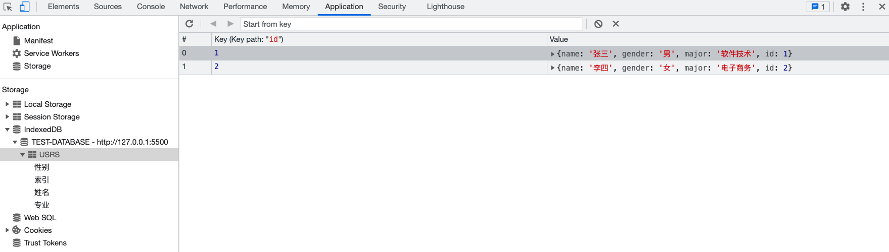

# 一、概述

数据存储，可以是临时存储，也可以是永久存储，接下来我们一起看看在Web中，有哪些方式可以存储数据。

# 二、Cookie

[参考指南 >>](<https://developer.mozilla.org/zh-CN/docs/Web/API/Document/cookie>)

[lg-cookie 库 >>](https://www.npmjs.com/package/lg-cookie)

## 面经：Cookie vs Session

### 什么是 Cookie❓

我们知道HTTP协议是无状态的，一次请求完成，不会持久化请求与响应的信息。那么，在购物车、用户登录状态、页面个性化设置等场景下，就无法识别特定用户的信息，这时Cookie就出现了。

Cookie是 **<u>客户端</u> 保存用户信息的一种机制**，将服务器发送到浏览器的数据保存在本地，下次向同一服务器再发起请求时被携带发送。对于Cookie，可以设置过期时间。

通常，Cookie用于告知服务端两个请求是否来自同一浏览器，如保持用户的登录状态。这样就解决了HTTP无状态的问题。

Cookie主要用于以下方面：

- **会话状态管理**（如用户登录状态、购物车、游戏分数或其它需要记录的信息）
- **个性化设置**（如用户自定义设置、主题等）
- **浏览器行为跟踪**（如跟踪分析用户行为等）

Cookie **存储在客户端**，这就意味着，可以通过一些方式进行修改，欺骗服务器。针对这个问题，怎么解决呢？那就引入了Session。

### 什么是 Session❓

Session 代表服务器和客户端一次会话的过程。

维基百科这样解释道：

> *在计算机科学领域来说，尤其是在网络领域，会话(session)是一种持久网络协议，在用户(或用户代理)端和服务器端之间创建关联，从而起到交换数据包的作用机制，session在网络协议(例如telnet或FTP)中是非常重要的部分。*

对照Cookie，Session是一种在服务器端保存数据的机制，用来跟踪用户状态的数据结构，可以保存在文件、数据库或者集群中。

当在应用程序的Web页之间跳转时，存储在Session对象中的变量将不会丢失，而会在整个用户会话中一直存在下去。当客户端关闭会话，或者Session超时失效时会话结束。

目前大多数的应用都是用Cookie实现Session跟踪的。第一次创建Session时，服务端会通过在HTTP协议中返回给客户端，在Cookie中记录SessionID，后续请求时传递SessionID给服务，以便后续每次请求时都可分辨你是谁。

### Cookie 与 Session 的区别 

关于Cookie与Session的区别：

- 作用范围不同，Cookie 保存在客户端（浏览器），Session 保存在服务器端。
- 存取方式的不同，Cookie只能保存 ASCII，Session可以存任意数据类型，比如 UserId 等。
- 有效期不同，Cookie 可设置为长时间保持，比如默认登录功能功能，Session一般有效时间较短，客户端关闭或者Session超时都会失效。
- 隐私策略不同，Cookie存储在客户端，信息容易被窃取；Session 存储在服务端，相对安全一些。
- 存储大小不同， 单个Cookie 保存的数据不能超过 4K，Session 可存储数据远高于 Cookie。

### 禁用 Cookie 会怎样❓

如果客户在浏览器禁用了Cookie，该怎么办呢?

方案一：**拼接SessionId参数**。在GET或POST请求中拼接SessionID，GET请求通常通过URL后面拼接参数来实现，POST请求可以放在Body中。无论哪种形式都需要与服务器获取保持一致。

这种方案比较常见，比如老外的网站，经常会提示是否开启Cookie。如果未点同意或授权，会发现浏览器的URL路径中往往有 “?sessionId=123abc” 这样的参数。

方案二：**基于Token(令牌)**。在APP应用中经常会用到Token来与服务器进行交互。Token本质上就是一个唯一的字符串，登录成功后由服务器返回，标识客户的临时授权，客户端对其进行存储，在后续请求时，通常会将其放在HTTP的Header中传递给服务器，用于服务器验证请求用户的身份。

### 分布式系统中 Session 如何处理❓

在分布式系统中，往往会有多台服务器来处理同一业务。如果用户在A服务器登录，Session位于A服务器，那么当下次请求被分配到B服务器，将会出现登录失效的问题。

针对类似的场景，有三种解决方案：

方案一：请求精确定位。也就是通过负载均衡器让来自同一IP的用户请求始终分配到同一服务上。比如，Nginx 的 ip_hash 策略，就可以做到。

方案二：Session复制共享。该方案的目标就是确保所有的服务器的 Session 是一致的。像Tomcat等多数主流web服务器都采用了Session复制实现Session的共享.

方案三：基于共享缓存。该方案是通过将Session放在一个公共地方，各个服务器使用时去取即可。比如，存放在Redis、Memcached等缓存中间件中。

在Spring Boot项目中，如果集成了Redis，Session共享可以非常方便的实现。

### 同源策略与跨域请求

所谓的 **同源** 指的是 三个相同：**协议相同**、**域名相同**、**端口相同**。只有这三个完全相同，才算是同源。

同源策略的目的：是为了保证用户信息的安全，防止恶意的网站窃取数据。

比如，用户访问了银行网站A，再去浏览其他网站，如果其他网站可以读取A的Cookie，隐私信息便会泄露。更可怕的是，通常Cookie还用来保存用户登录状态，会出现冒充用户行为。因此，"同源策略"是必需的，如果Cookie可以共享，互联网就毫无安全可言了。

同源策略保证了一定的安全性，但在某些场景下也带来了不便，比如常见的跨域请求问题。

在HTML中，\<a>,\<form>, \, \<script>, \<iframe>, \<link> 等标签以及Ajax都可以指向一个资源地址，而所谓的跨域请求就是指：当前发起请求的域与该请求指向的资源所在的域不一样。同源即同域，三项有一项不同便会出现跨域请求。

浏览器会对跨域请求做出限制，因为跨域请求可能会被利用发动CSRF攻击。

CSRF（Cross-site request forgery），即“跨站请求伪造”，也被称为：one click attack/session riding，缩写为：CSRF/XSRF。CSRF攻击者在用户已经登录目标网站之后，诱使用户访问一个攻击页面，利用目标网站对用户的信任，以用户身份在攻击页面对目标网站发起伪造用户操作的请求，达到攻击目的。

针对跨域请求通常有如下方法：

- 通过代理避开跨域请求；
- 通过Jsonp跨域；
- 通过跨域资源共享（CORS）；

关于跨域的具体解决步骤，就不再展开了。

# 三、Web Storage

## 1、概述

Web Storage 是HTML5新增的一种数据存储机制，随着浏览器对HTML5的支持度不断增加，在新建的项目中基本已经取代了cookie（它是服务器保存在浏览器的一小段文本信息，每个Cookie的大小一般不能超过4KB，超过这个长度的Cookie，将被忽略，不会被设置）。Web Storage更像是cookie的强化版，能够动用大得多的存储空间。Web Storage存储机制包含 会话存储 和 本地存储 这两个对象。它们存储值的方式和JavaScript中对象属性储存值的方式一样，都是以“键值对”存在的。

## 2、本地存储 & 会话存储

- `sessionStorage`：会话存储（临时存储），数据在浏览器关闭后会被清除	
- `localStorage`：本地存储，数据一直存在于浏览器中，除非调用 `clear` 清除，一般用于数据持久化存储

会话存储和本地存储常用的方法：

- `setItem(key, val)`：存储数据 & 修改数据
- `getItem(key)`：获取数据
- `removeItem(key)`：移除数据
- `clear()`：清空数据

> 提示：
>
> \- 不管是sessionStorage还是localStorage，他们的本质都是对象，所以我们可以通过点语法的形式对它们进行增删改查。
>
> \- 在浏览器调试工具的 Application 选项中可查看存储数据的可视化形式。

## 3、对象存储

Webstorage 不能直接存储对象类型的数据，需将对象类型的数据转换成 `JSON` 数据之后进行存储，读取的时候需进行解析。

```js
// 1. 存
sessionStorage.usr = JSON.stringify({
	name: "木子李",
	age: 31,
	major: "软件技术"
});

// 2. 取
JSON.parse(sessionStorage.usr);
```

## 4. Cookie vs Web Storage

- 存登录信息，大小限制为4KB左右
- localStorage是Html5新增的，用于本地数据存储，保存的数据没有过期时间，一般浏览器大小限制在5MB
- sessionStorage接口方法和localStorage类似，但保存的数据的只会在当前会话中保存下来，页面关闭后会被清空。

| #                | 生命期                                                       | 大小限制 | 与服务器通信                                                 |
| ---------------- | ------------------------------------------------------------ | -------- | ------------------------------------------------------------ |
| `cookie`         | 一般由服务器生成，可设置失效时间。如果在浏览器端生成Cookie，默认是关闭浏览器后失效。 | `4KB`    | 每次都会携带在HTTP头中，如果使用cookie保存过多数据会带来性能问题。 |
| `localStorage`   | 除非被清除，否则永久保存                                     | `5MB`    | 仅在浏览器中保存，不与服务器通信                             |
| `sessionStorage` | 仅在当前会话下有效，关闭页面或浏览器被清除                   | `5MB`    | 仅在浏览器中保存，不与服务器通信                             |

# 四、IndexDB

[参考 >>](https://developer.mozilla.org/zh-CN/docs/Web/API/IndexedDB_API)

## 1、概述

随着浏览器的功能不断增强，越来越多的网站开始考虑，将大量数据储存在客户端，这样可以减少从服务器获取数据，直接从本地获取数据。现有的浏览器数据储存方案，都不适合储存大量数据：Cookie 的大小不超过4KB，且每次请求都会发送回服务器；LocalStorage 在5MB（各家浏览器不同），而且不提供搜索功能，不能建立自定义的索引。所以，需要一种新的解决方案，这就是 IndexedDB 诞生的背景。

通俗地说，IndexedDB 就是浏览器提供的本地数据库，它可以被网页脚本创建和操作。IndexedDB 允许储存大量数据，提供查找接口，还能建立索引。这些都是 LocalStorage 所不具备的。就数据库类型而言，IndexedDB 不属于关系型数据库（不支持 SQL 查询语句），更接近 NoSQL 数据库。

IndexedDB 具有以下特点：

- 对象存储；
- 异步读写；
- 支持事务；
- 同源限制；
- 存储空间大，接近无限制；
- 支持二进制存储；

## 2、基本概念

操作对象：

- 数据库：`IDBDatabase`
- 对象仓库：`IDBObjectStore （表）`
- 索引：`IDBIndex `
- 事务：`IDBTransaction `
- 操作请求：`IDBRequest `
- 指针：`IDBCursor `
- 主键集合：`IDBKeyRange `

## 3、原生过程实现

IndexedDB 虽好但是用法没有LocalStorage 简单，我们先来看下步骤与写法。

1. 首先打开数据库 →  `indexedDB.open()` → IDBDatabase
2. 开始一个事务 → `IDBDatabase.transaction()` → IDBTransaction → IDBObjectStore
3. 新建数据库：`IDBObjectStore.createObjectStore()`
4. 事务操作
   - 新增数据：`IDBObjectStore.add()`
   - 读取数据：`IDBObjectStore.get()`
   - 更新数据：`IDBObjectStore.put()`
   - 删除数据：`IDBObjectStore.delete()`
5. 遍历数据：`IDBObjectStore.openCursor()`

### 3.1. 新建数据库

新建数据库与打开数据库是同一个操作。如果指定的数据库不存在，就会新建。不同之处在于，后续的操作主要在`upgradeneeded`事件的监听函数里面完成，因为这时版本从无到有，所以会触发这个事件。

```js
/**
 * 获取数据库
 * @param {*} databaseName 数据库名称
 * @param {*} version  数据库版本
 * @returns
 */
function openDB(databaseName, version) {
  return new Promise((resolve, reject) => {
    const DBOpenRequest = window.indexedDB.open(databaseName, version);
    // 打开异常
    DBOpenRequest.onerror = (e) => {
      reject(e);
    };
    // 打开成功
    DBOpenRequest.onsuccess = (e) => {
      resolve(DBOpenRequest.result);
    };
    // 数据库升级事件，如果指定的版本号，大于数据库的实际版本号，就会发生数据库升级事件
    DBOpenRequest.onupgradeneeded = (e) => {
      console.log("Upgrading...");
    };
  });
}
```

调用

```js
(async function () {
  // 1. 打开数据库
  const db = await openDB("TEST-DATABASE");
  console.log(db);
})();
```

> 提示：如果浏览器已经存在该数据库，则直接返回，没如果不存在，则新建数据库之后返回。


### 3.2. 新建对象仓库（表）和索引

通常，新建数据库以后，第一件事是新建对象仓库（即新建表）。接下来我们在 `onupgradeneeded` 事件回调中新建一个仓库用于存储用户信息，并为其创建索引：

```js
DBOpenRequest.onupgradeneeded = (e) => {
  console.log('Upgrading...');
  let db = e.target.result;
  // 新建对象仓库（用户表）
  if (!db.objectStoreNames.contains('USRS')) {
    // 创建USRS对象仓库/主键为自增整数
    // 如果需要指定值为主键，则可以设置：{keyPath: "键" }
    let objStore = db.createObjectStore('USRS', {
      keyPath: 'id',
      autoIncrement: 'id',
    });
    // 创建索引，语法形式：objStore.createIndex(名称, 索引, 配置对象)
    objStore.createIndex('索引', 'id', { unique: true });
    objStore.createIndex('姓名', 'name', { unique: false });
    objStore.createIndex('性别', 'gender', { unique: false });
    objStore.createIndex('专业', 'major', { unique: false });
  }
};
```


### 3.3. 添加记录

```javascript
const request = db
  .transaction(['USRS'], 'readwrite')
  .objectStore('USRS')
  .add({
    name: '李四',
    gender: '女',
    major: '电子商务',
  });
request.onsuccess = (e) => {
  console.log('Add success!');
};
request.onerror = (e) => {
  console.log(e);
};
```

上面代码中，写入数据需要新建一个事务。新建时必须指定表格名称和操作模式（"只读"或"读写"）。新建事务以后，通过`IDBTransaction.objectStore(name)`方法，拿到 IDBObjectStore 对象，再通过表格对象的`add()`方法，向表格写入一条记录。

写入操作是一个异步操作，通过监听连接对象的`success`事件和`error`事件，了解是否写入成功。



可以看到，`USRS` 表中已经插入了2条记录。

### 3.4. 获取记录

```javascript
const request = db.transaction(['USRS']).objectStore('USRS').get(1);
request.onsuccess = (e) => {
  console.log(request.result);
};
request.onerror = (e) => {
  console.log(e);
};
// {name: '张三', gender: '男', major: '软件技术', id: 1}
```

### 3.5. 遍历记录

遍历数据表格的所有记录，要使用指针对象 `IDBCursor`。

```js
const objectStore = db.transaction('USRS').objectStore('USRS');
const res = [];
objectStore.openCursor().onsuccess = function (event) {
  var cursor = event.target.result;
  if (cursor) {
    res.push(cursor.value);
    cursor.continue();
  } else {
    console.log(res);
    console.log('No more entries!');
  }
};

0: {name: '张三', gender: '男', major: '软件技术', id: 1}
1: {name: '李四', gender: '女', major: '电子商务', id: 2}
length: 2
```

### 3.6. 更新记录

```javascript
// 获取对象仓库
const objectStore = db
  .transaction(['USRS'], 'readwrite')
  .objectStore('USRS');
// 查询要修改的数据
const request = objectStore.get(1);
request.onsuccess = (e) => {
  const data = e.target.result;
  data.id = 1;
  data.major = '网络工程';
  // 执行更新
  const putRequest = objectStore.put({ ...data });
  putRequest.onsuccess = (e) => {
    console.log('Put success!');
  };
  putRequest.onerror = (e) => {
    console.log(e);
  };
};
```


可以看见， `id` 为 `1` 的那条记录，`major` 字段成功修改成 “网络工程”。

### 3.7. 删除记录

```shell
db.transaction(['USRS'], 'readwrite').objectStore('USRS').delete(2);
```

删除 `id` 值为 `2` 的那条数据。

### 3.8. 使用索引

索引的意义在于，可以让你搜索任意字段，也就是说从任意字段拿到数据记录。如果不建立索引，默认只能搜索主键（即从主键取值）。

接下来，我们通过索引 `姓名` 查找数据：

```javascript
const request = db
  .transaction(['USRS'], 'readwrite')
  .objectStore('USRS')
  .index('姓名')
  .get('张三');
request.onsuccess = function (e) {
  var result = e.target.result;
  console.log(result);
};

{name: '张三', gender: '男', major: '网络工程', id: 1}
```

> 提示：由于在开始我们创建索引时，名称使用的是中文，所以这里根据索引查找数据时，也应该填写中文。实际开发中，还是建议使用英文作为索引名称。

## 4、封装实现

```javascript
class DB {
  /**
   * 构造器
   * @param {string} databaseName 数据库名
   * @param {number} version 数据库版本号（仅支持整数）
   * @param {object} storeOptions 配置项 { 表名：主键 }
   */
  constructor(databaseName, version, storeOptions) {
    // 缓存数据库 { [name + version]：database }
    this._dbs = {};
    this._databaseName = databaseName;
    this.open(databaseName, version, storeOptions);
  }

  /**
   * 打开数据库
   * @param {string} databaseName 数据库名
   * @param {number} version 数据库版本号（仅支持整数）
   * @param {object} storeOptions 配置项
   */
  open(databaseName, version, storeOptions) {
    return new Promise((resolve, reject) => {
      // -- 检测是否有缓存，如果有缓存则直接从缓存中读取数据库
      if (this._dbs[databaseName + version]) {
        resolve(this._dbs[databaseName + version]);
        return;
      }
      // -- 打开数据库
      const request = indexedDB.open(databaseName, version);
      // -- 事件监听：版本更新，创建新的store的时候
      request.onupgradeneeded = (event) => {
        console.log('【Indexed-DB】：Upgrading...');
        // IDBDatabase
        const database = event.target.result;
        // 缓存起来
        this._dbs[databaseName + version] = database;
        // 遍历仓库配置项
        for (const key in storeOptions) {
          // 判断是否存在仓库（表），不存在则新建
          if (database.objectStoreNames.contains(key) === false) {
            const keyPath = storeOptions[key] ? storeOptions[key] : [];
            database.createObjectStore(key, { keyPath });
          }
        }
        resolve(database);
      };
      // -- 事件监听：数据库打开成功的回调
      request.onsuccess = (event) => {
        console.log('【Indexed-DB】：open success.');
        // IDBDatabase
        const database = event.target.result;
        // 缓存起来
        this._dbs[databaseName + version] = database;
        resolve(database);
      };
      // -- 事件监听：数据库打开失败的回调
      request.onerror = (event) => {
        reject(event);
        console.error('【Indexed-DB】：', event);
      };
    });
  }

  /**
   * 获取事务
   * @param {*} storeName
   * @param {*} version
   * @returns
   */
  async _getTransaction(storeName, version) {
    let db;
    // 先从缓存获取
    if (this._dbs[this._databaseName + version]) {
      db = this._dbs[this._databaseName + version];
    } else {
      db = await this.open(this._databaseName, version);
    }
    return db.transaction([storeName], 'readwrite');
  }

  /**
   * 获取store
   * objectStore: 表示允许访问IndexedDB数据库中的一组数据的对象存储，
   * @param {*} storeName
   * @param {*} version
   */
  async _getObjectStore(storeName, version) {
    const transaction = await this._getTransaction(storeName, version);
    return transaction.objectStore(storeName);
  }

  /**
   * 获取一个store
   */
  collection(storeName, version) {
    this.currentStore = storeName;
    this._getObjectStore(storeName, version);
    return this;
  }

  /**
   * 查询数据
   * @param {string | number} id
   * @returns
   */
  async get(id) {
    return new Promise(async (resolve, reject) => {
      const objectStore = await this._getObjectStore(this.currentStore);
      const request = objectStore.get(id);
      request.onsuccess = function (event) {
        resolve(event.target.result);
      };
      request.onerror = (event) => {
        reject(event);
      };
    });
  }
  /**
   * 添加数据
   * @param {object} data
   * @returns
   */
  async add(data) {
    return new Promise(async (resolve, reject) => {
      const objectStore = await this._getObjectStore(this.currentStore, 3);
      const request = objectStore.add(data);
      request.onsuccess = function (event) {
        resolve(event.target.result);
      };
      request.onerror = (event) => {
        reject(event);
      };
    });
  }
  /**
   * 删除数据
   * @param {string | number} id
   * @returns
   */
  async delete(id) {
    return new Promise(async (resolve, reject) => {
      const objectStore = await this._getObjectStore(this.currentStore);
      const request = objectStore.delete(id);
      request.onsuccess = function (event) {
        resolve(true);
      };
      request.onerror = (event) => {
        console.log('【Indexed-DB】：', event);
        reject(false);
      };
    });
  }
  /**
   * 更新数据
   * 数据不存在，则会新增数据
   * @param {*} data
   * @returns
   */
  async put(data) {
    console.log('Put...');
    return new Promise(async (resolve, reject) => {
      const objectStore = await this._getObjectStore(this.currentStore);
      const request = objectStore.put(data);
      request.onsuccess = function (event) {
        resolve(event.target.result);
      };
      request.onerror = (event) => {
        reject(event);
      };
    });
  }

  async clear(storeName) {
    return new Promise((resolve, reject) => {
      this._getObjectStore(this.currentStore).then((objectStore) => {
        const request = objectStore.clear(data);
        request.onsuccess = function (event) {
          resolve(event.target.result);
        };
        request.onerror = (event) => {
          reject(event);
        };
      });
    });
  }
  /**
   * 遍历数据
   * @returns
   */
  async each() {
    return new Promise(async (resolve, reject) => {
      const objectStore = await this._getObjectStore(this.currentStore);
      const request = objectStore.openCursor();
      const resp = [];
      request.onsuccess = function (event) {
        const cursor = event.target.result;
        if (cursor) {
          resp.push(cursor.value);
          cursor.continue();
        } else {
          resolve(resp);
        }
      };
      request.onerror = (event) => {
        reject(event);
      };
    });
  }
}

```

## 5、结尾

如果碰到前端频繁存储操作或者大文件缓存的需求，可以考虑使用IndexedDB。当然项目中推荐直接使用第三方库 [zangodb](https://erikolson186.github.io/zangodb/)、[dexie.js](https://dexie.org/) API更丰富。
