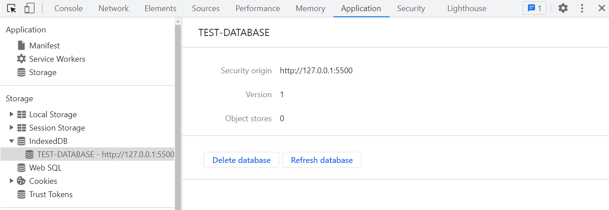
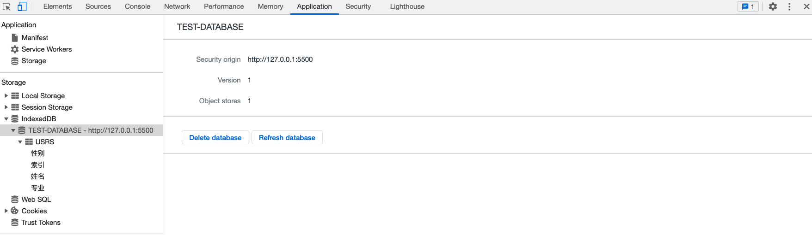
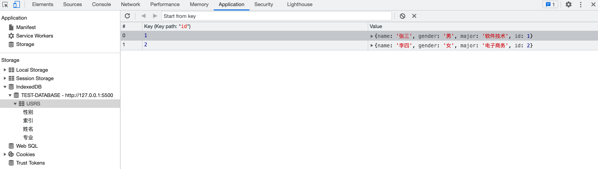
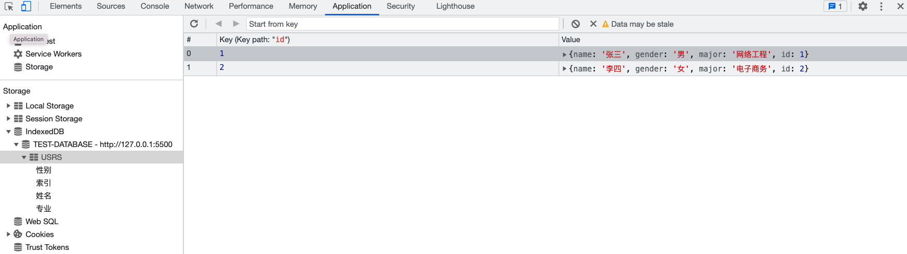

# 一、概述

浏览器缓存就是浏览器根据 url 第一次访问网站之后，将网站的 html、css、js、图片等文件复制一份保留到浏览器中，当你二次访问这个 url 的网站时，如果网站没有明确表示有更新时，浏览器直接在缓存中查找内容，不会再次请求网页内容，只有网页明确表示有更新时，浏览器才会向服务器发起网路请求，再次下载网页。

## 1. 为什么需要缓存？

1. 减少网络带宽消耗
2. 降低服务器压力
3. 减少网络延迟，加快网页加载

## 2. 浏览器缓存规则

浏览器缓存规则是指浏览器在请求和响应Web资源时如何处理缓存。常见的浏览器缓存规则如下：

1. 如果资源已经被缓存，则直接从缓存中读取。
2. 如果资源没有被缓存，或者缓存已过期，则向服务器发送请求并下载最新的资源。
3. 当服务器返回资源时，需要设置相应的缓存控制头信息，包括 Expires、Cache-Control 等字段，告诉浏览器如何缓存资源。
4. 根据缓存控制头信息，浏览器会将资源缓存到内存或磁盘中，并设置相应的缓存标识。
5. 下次请求该资源时，浏览器会检查缓存标识，如果符合缓存条件，则从缓存中读取，否则重新下载。

需要注意的是，浏览器缓存规则可能因不同的浏览器版本、资源类型或服务器配置而有所不同。

# 二、方案

## 1. Http缓存 *

Http 缓存是一种客户端和服务器之间的网络优化技术，用于减少对服务器的请求，提高网站性能和加载速度。

Http缓存都是从 **第二次请求时** 开始的，这是一个老生常谈的话题，无非就是那几个Http头的问题。

- [Expires](https://developer.mozilla.org/zh-CN/docs/Web/HTTP/Headers/Expires)（*强制缓存 · Http1.0*）
- [Cache-Control](https://developer.mozilla.org/zh-CN/docs/Web/HTTP/Headers/Cache-Control)（*强制缓存 · Http1.1*）
- [Last-Modified](https://developer.mozilla.org/zh-CN/docs/Web/HTTP/Headers/Last-Modified) / [If-Modified-Since](https://developer.mozilla.org/zh-CN/docs/Web/HTTP/Headers/If-Modified-Since)（*协商缓存*）
- [ETag](https://developer.mozilla.org/zh-CN/docs/Web/HTTP/Headers/ETag) / [If-None-Match](https://developer.mozilla.org/zh-CN/docs/Web/HTTP/Headers/If-None-Match)（*协商缓存*）

当浏览器请求一个资源时，在响应中包含缓存指令，例如Expires、Cache-Control和ETag等，这些指令告诉浏览器如何缓存该资源以及在何时重新验证该资源。如果资源已经被缓存并且缓存仍然有效，浏览器可以使用缓存的版本而无需向服务器发出新的请求，从而加快页面加载速度。

Http缓存应该算是前端开发中最常接触的缓存之一，它又可以细分为 **强制缓存** 和 **协商缓存**，二者最大的区别在于判断缓存命中时，浏览器是否需要向服务器端进行询问以协商缓存的相关信息，进而判断是否需要就响应内容进行重新请求，下面让我们来看看HTTP缓存的具体机制及缓存的决策策略。

### 1.1. 强制缓存

强制缓存是指浏览器在第一次请求资源时，将该资源的副本存储在本地缓存中，并在接下来的请求中直接从本地缓存中读取该资源，无需与服务器进行任何通信。在强制缓存生效期间，即使服务器上的资源已经发生了变化，浏览器仍然会使用本地缓存的资源，而不会去获取服务器上最新的版本。

强制缓存可以减少网络请求，提高页面加载速度和用户体验，但也可能导致用户看到过期的或者不一致的内容。为了解决这个问题，通常还需要使用其他缓存策略，如协商缓存来配合使用。

> **Http1.0**

在Http1.0，强制缓存主要由服务器端设置HTTP响应头中的 **Expires** 字段来实现，该字段指定了资源过期的时间，浏览器在接收到带有该字段的响应体后进行缓存，若之后浏览器再次发起相同的资源请求时，便会对比 expires 与本地当前的时间戳，如果当前请求的本地时间戳小于 expires 的值，则说明浏览器缓存的响应还未过期，可以直接使用而无须向服务器端再次发起请求。只有当本地时间戳大于expires 值，发生缓存过期时，才允许重新向服务器发起请求。

从上述强制缓存判断是否过期的机制中不难看出，这个方式存在一个很大的漏洞，即对本地时间戳过分依赖，如果客户端本地的时间与服务器端的时间不同步，或者对客户端的时间进行主动修改，那么对于缓存过期的判断可能就无法和预期相符。

> **Http1.1**

为了解决 expires 判断的局限性，从HTTP1.1协议开始新增了 [**Cache-Control**](https://developer.mozilla.org/zh-CN/docs/Web/HTTP/Headers/Cache-Control) 字段来对 expires 的功能进行拓展和完善。Cache-Control字段可以更加灵活地控制缓存的行为，例如设置 **max-age** 参数指定缓存有效期的秒数。

Cache-control常用值：

```markdown
# 1. 在发布缓存副本之前，强制要求缓存把请求提交给原始服务器进行验证 (协商缓存验证)
Cache-control: no-cache
# 2. 缓存不应存储有关客户端请求或服务器响应的任何内容，即不使用任何缓存。
Cache-control: no-store
# 3. 表明响应可以被任何对象（包括：发送请求的客户端，代理服务器，等等）缓存，即使是通常不可缓存的内容
Cache-control: public
# 4. 表明只有客户端才可以缓存
Cache-control: private
# 5. 设置缓存存储的最大周期，超过这个时间缓存被认为过期 (单位秒)
Cache-Control: max-age=<seconds>
```

*提示：如果 Cache-Control 的 max-age 和 expires 同时存在，则以 max-age 为准。*

### 1.2. 协商缓存

协商缓存通过在请求和响应头中使用特定的指令和值来判断资源是否需要更新。当客户端发起请求时，服务器会检查资源的状态并根据其状态返回相应的响应头，如果资源未被修改，则返回 304 Not Modified 状态码，让客户端使用已缓存的版本。协商缓存可以减少网络流量，提高性能和速度，并降低服务器负载。

常用的协商缓存相关的HTTP头有『Last-Modified / If-Modified-Since 及 Etag / If-None-Match』等。

**实例解读：**

> 假设客户端需要向服务器请求一个 manifest.js 的js文件，为了让该资源被再次请求时能够通过协商缓存的机制使用本地缓存，那么首次返回该图片资源的响应头中应包含一个名为 **Last-Modified** 的字段，该字段的属性值为该js文件最近一次修改的时间戳。
>
> 当我们刷新网页时，由于该js文件使用的是协商缓存，客户端浏览器无法确定本地缓存是否过期，所以需要向服务器发送一次GET请求，进行缓存有效性的协商，此次GET请求的请求头中需要包含一个 **If-Modified-Since** 字段，其值正是上次响应头中 **Last-Modified** 的字段值。
>
> 当服务器收到该请求后便会对比请求资源当前的修改时间戳与 **If-Modified-Since** 字段的值，如果二者相同则说明缓存未过期，可继续使用本地缓存，否则服务器重新返回全新的文件资源。

#### 1.2.1. 基于 [Last-Modified](https://developer.mozilla.org/zh-CN/docs/Web/HTTP/Headers/Last-Modified) 的协商缓存

代码示例（服务器端）：

```js
const data = fs.readFileSync('./images/logo.png');
const { mtime } = fs.statSync('./images/logo.png');
const ifModifiedSince = req.headers['if-modified-since'];
if (ifModifiedSince === mtime.toUTCString()) {
  res.statusCode = 304;
  res.end();
  return;
}
res.setHeader('last-modified', mtime.toUTCString());
res.setHeader('Cache-Control', 'no-cache');
res.end(data);
```

**缓存流程：**

1. 客户端第一次请求目标资源时，服务器返回的响应表头包含：Last-Modified 及 Cache-Control字段

   ```
   Cache-Control:no-cache
   Last-Modified:资源最后一次修改的时间戳
   ```

2. 客户端再次请求该资源的时候，会携带一个 If-Modified-Since 字段，其值为上次请求响应头中的 Last-Modified 的字段值

3. 服务器对比  If-Modified-Since 值与请求资源当前的修改时间戳，如果相同说明缓存没有过期，返回304状态码，否则返回新的资源。

> 需要注意的是：协商缓存判断缓存有效的响应状态码是304，但是如果是强制缓存判断有效的话，响应状态码是200。

**不足之处：**

- last-modified 是根据请求资源的最后修改时间戳进行判断的，虽然请求的文件资源进行了编辑，但是内容并没有发生任何变化，时间戳也会更新，从而导致协商缓存时关于有效性的判断验证为失效，需要重新进行完整的资源请求。这无疑会造成网络带宽资源的浪费，以及延长用户获取到目标资源的时间。
- 标识文件资源修改的时间戳单位是秒，如果文件修改的速度非常快，假设在几百毫秒内完成，那么通过时间戳的方式来验证缓存的有效性，是无法识别出该次文件资源的更新的。

> 其实造成上述两种缺陷的原因相同，就是服务器无法根据资源修改的时间戳识别出真正的更新，进而导致重新发起了请求，该重新请求却使用了缓存的Bug场景。

#### 1.2.2. 基于 [Etag](https://developer.mozilla.org/zh-CN/docs/Web/HTTP/Headers/ETag) 的协商缓存

代码示例（服务器端）：

```js
const data = fs.readFileSync('./images/logo.png');
const etagContent = etag(data);

const ifNoneMatch = req.headers['if-none-match'];
if (ifNoneMatch === etagContent) {
  res.statusCode = 304;
  res.end();
  return;
}
res.setHeader('etag', etagContent);
res.setHeader('Cache-Control', 'no-cache');
res.end(data);
```

为了弥补通过时间戳判断的不足，从HTTP1.1规范开始新增了一个 Etag 的头信息，即实体标签。 其内容主要是服务器为不同的资源进行哈希计算所生成的一个字符串，该字符串类似于文件指纹，只要文件内容编码存在差异，对应的 Etag 对文件资源进行更精准的变化感知。

**缓存流程：**

1. 客户端向服务器请求目标资源，服务器返回数据，并带上一个Etag（*通过etag模块进行哈希计算生成一个字符串*）

2. 客户端再次请求目标资源时，会携带上次请求时服务器返回的 Etag（*If-None-Match:Etag*）
3. 服务器校验Etag，判断是否过期，没过期则返回 304 Not Modified，过期则返回新的 Etag

**不足之处：**

不像强制缓存中Cache-Control可以完全替代Expires的功能，在协商缓存中，Etag并非Last-Modified的替代方案而是一种补充方案，因为依旧存在一些弊端。

1. 服务器对于生成文件资源的Etag需要付出额外的计算开销，如果资源的尺寸比较大，数量较多且修改频繁，那么生成的Etag的过程就会影响服务器的性能。

2. Etag字段值的生成分为强验证和弱验证，强验证根据资源内容进行生成，能够保证每个字节都相同，弱验证则根据资源的部分属性来生成，生成速度快但无法确保每个字节都相同，并且在服务器集群场景下，也会因为准确不够而降低协商缓存有效性的成功率，所以恰当的方式是根据具体的资源使用场景选择恰当的缓存校验方式。

### 1.3. 缓存决策及其注意事项

> **缓存决策**

假设在不考虑客户端缓存容量与服务器算力的理想情况下，我们当然希望客户端浏览器上的缓存触发率尽可能高，留存时间尽可能长，同时还要Etag实现当资源更新时进行高效的重新验证。但实际情况往往是容量与算力都有限，因此就需要制定合适的缓存策略，来利用有限的资源达到最优的性能效果，明确能力的边界，力求在边界内做到最好。

> **缓存决策树**

在面对一个具体的缓存需求时，我们可以参照如下的缓存决策树来逐步确定对一个资源具体的缓存策略。

- 是否使用缓存？
  - 否：no-store
  - 是：
    - 是否进行协商缓存？
      - 是：no-cache
      - 否：
        - 是否会被代理服务器缓存？
          - 是：public
          - 否：private
            - 配置强制缓存过期时间
              - 配置协商缓存的Etag或Last-Modified

## 2. Cookies *

[参考指南 >>](<https://developer.mozilla.org/zh-CN/docs/Web/API/Document/cookie>)

Cookie 可选属性值：

- path：路径，默认为当前文档位置的路径。
- domain：域名
- max-age：指定时间后过期，单位秒，如1年为：35=65 * 24 * 60 * 60
- expires：过期时间
- secure：只允许通过 https 协议 传输
- 自定义属性...

### 面经：Cookie vs Session

#### 什么是 Cookie？

我们知道HTTP协议是无状态的，一次请求完成，不会持久化请求与响应的信息。那么，在购物车、用户登录状态、页面个性化设置等场景下，就无法识别特定用户的信息，这时Cookie就出现了。

Cookie是 **<u>客户端</u> 保存用户信息的一种机制**，将服务器发送到浏览器的数据保存在本地，下次向同一服务器再发起请求时被携带发送。对于Cookie，可以设置过期时间。

通常，Cookie用于告知服务端两个请求是否来自同一浏览器，如保持用户的登录状态。这样就解决了HTTP无状态的问题。

Cookie主要用于以下方面：

- **会话状态管理**（如用户登录状态、购物车、游戏分数或其它需要记录的信息）
- **个性化设置**（如用户自定义设置、主题等）
- **浏览器行为跟踪**（如跟踪分析用户行为等）

Cookie **存储在客户端**，这就意味着，可以通过一些方式进行修改，欺骗服务器。针对这个问题，怎么解决呢？那就引入了Session。

#### 什么是 Session？

Session 代表服务器和客户端一次会话的过程。

维基百科这样解释道：

> *在计算机科学领域来说，尤其是在网络领域，会话(session)是一种持久网络协议，在用户(或用户代理)端和服务器端之间创建关联，从而起到交换数据包的作用机制，session在网络协议(例如telnet或FTP)中是非常重要的部分。*

对照Cookie，Session是一种在服务器端保存数据的机制，用来跟踪用户状态的数据结构，可以保存在文件、数据库或者集群中。

当在应用程序的Web页之间跳转时，存储在Session对象中的变量将不会丢失，而会在整个用户会话中一直存在下去。当客户端关闭会话，或者Session超时失效时会话结束。

目前大多数的应用都是用Cookie实现Session跟踪的。第一次创建Session时，服务端会通过在HTTP协议中返回给客户端，在Cookie中记录SessionID，后续请求时传递SessionID给服务，以便后续每次请求时都可分辨你是谁。

#### Cookie 与 Session 的区别？ 

关于Cookie与Session的区别：

- 作用范围不同，Cookie 保存在客户端（浏览器），Session 保存在服务器端。
- 存取方式的不同，Cookie只能保存 ASCII，Session可以存任意数据类型，比如 UserId 等。
- 有效期不同，Cookie 可设置为长时间保持，比如默认登录功能功能，Session一般有效时间较短，客户端关闭或者Session超时都会失效。
- 隐私策略不同，Cookie存储在客户端，信息容易被窃取；Session 存储在服务端，相对安全一些。
- 存储大小不同， 单个Cookie 保存的数据不能超过 4K，Session 可存储数据远高于 Cookie。

#### 禁用 Cookie 会怎样？

如果客户在浏览器禁用了Cookie，该怎么办呢?

方案一：**拼接SessionId参数**。在GET或POST请求中拼接SessionID，GET请求通常通过URL后面拼接参数来实现，POST请求可以放在Body中。无论哪种形式都需要与服务器获取保持一致。

这种方案比较常见，比如老外的网站，经常会提示是否开启Cookie。如果未点同意或授权，会发现浏览器的URL路径中往往有 “?sessionId=123abc” 这样的参数。

方案二：**基于Token(令牌)**。在APP应用中经常会用到Token来与服务器进行交互。Token本质上就是一个唯一的字符串，登录成功后由服务器返回，标识客户的临时授权，客户端对其进行存储，在后续请求时，通常会将其放在HTTP的Header中传递给服务器，用于服务器验证请求用户的身份。

#### 分布式系统中 Session 如何处理？

在分布式系统中，往往会有多台服务器来处理同一业务。如果用户在A服务器登录，Session位于A服务器，那么当下次请求被分配到B服务器，将会出现登录失效的问题。

针对类似的场景，有三种解决方案：

方案一：请求精确定位。也就是通过负载均衡器让来自同一IP的用户请求始终分配到同一服务上。比如，Nginx 的 ip_hash 策略，就可以做到。

方案二：Session复制共享。该方案的目标就是确保所有的服务器的 Session 是一致的。像Tomcat等多数主流web服务器都采用了Session复制实现Session的共享.

方案三：基于共享缓存。该方案是通过将Session放在一个公共地方，各个服务器使用时去取即可。比如，存放在Redis、Memcached等缓存中间件中。

在Spring Boot项目中，如果集成了Redis，Session共享可以非常方便的实现。

#### 同源策略与跨域请求

所谓的 **同源** 指的是 三个相同：**协议相同**、**域名相同**、**端口相同**。只有这三个完全相同，才算是同源。

同源策略的目的：是为了保证用户信息的安全，防止恶意的网站窃取数据。

比如，用户访问了银行网站A，再去浏览其他网站，如果其他网站可以读取A的Cookie，隐私信息便会泄露。更可怕的是，通常Cookie还用来保存用户登录状态，会出现冒充用户行为。因此，"同源策略"是必需的，如果Cookie可以共享，互联网就毫无安全可言了。

同源策略保证了一定的安全性，但在某些场景下也带来了不便，比如常见的跨域请求问题。

在HTML中，\<a>,\<form>, \, \<script>, \<iframe>, \<link> 等标签以及Ajax都可以指向一个资源地址，而所谓的跨域请求就是指：当前发起请求的域与该请求指向的资源所在的域不一样。同源即同域，三项有一项不同便会出现跨域请求。

浏览器会对跨域请求做出限制，因为跨域请求可能会被利用发动CSRF攻击。

CSRF（Cross-site request forgery），即“跨站请求伪造”，也被称为：one click attack/session riding，缩写为：CSRF/XSRF。CSRF攻击者在用户已经登录目标网站之后，诱使用户访问一个攻击页面，利用目标网站对用户的信任，以用户身份在攻击页面对目标网站发起伪造用户操作的请求，达到攻击目的。

针对跨域请求通常有如下方法：

- 通过代理避开跨域请求；
- 通过Jsonp跨域；
- 通过跨域资源共享（CORS）；

关于跨域的具体解决步骤，就不再展开了。

## 3. local and session Storage  *

### 3.1. 概述

Web Storage 是HTML5新增的一种数据存储机制，随着浏览器对HTML5的支持度不断增加，在新建的项目中基本已经取代了Cookie（它是服务器保存在浏览器的一小段文本信息，每个Cookie的大小一般不能超过4KB，超过这个长度的Cookie，将被忽略，不会被设置）。Web Storage更像是Cookie的强化版，能够动用大得多的存储空间。Web Storage存储机制包含 **会话存储** 和 **本地存储** 这两个对象。它们存储值的方式和js中对象属性储存值的方式一样，都是以 **键值对** 的形式存在的。

### 3.2. 本地存储 & 会话存储

- `sessionStorage`：会话存储（临时存储），数据在浏览器关闭后会被清除。
- `localStorage`：本地存储，数据一直存在于浏览器中，除非调用 `clear` / `removeItem` 清除，一般用于数据持久化。

会话存储和本地存储常用的方法：

- `setItem(key, val)`：存储数据 & 修改数据
- `getItem(key)`：获取数据
- `removeItem(key)`：移除数据
- `clear()`：清空数据

> 提示：
>
> \- 不管是 sessionStorage 还是 localStorage，他们的本质都是对象，所以我们可以通过点语法的形式对它们进行增删改查。
>
> \- 在浏览器调试工具的 Application 选项中可查看存储数据的可视化形式。

### 3.3. 对象存储

Web Storage 不能直接存储对象类型的数据，需将对象类型的数据转换成 JSON 字符串之后进行存储，读取的时候需进行解析。

```js
// 1. 存
localStorage.usr = JSON.stringify({
	name: "张三",
	age: 30,
	major: "软件工程"
});

// 2. 取
JSON.parse(localStorage.usr);
```

### 3.4. Cookie vs Web Storage

- 存登录信息，大小限制为4KB左右
- localStorage是Html5新增的，用于本地数据存储，保存的数据没有过期时间，一般浏览器大小限制在5MB
- sessionStorage接口方法和localStorage类似，但保存的数据的只会在当前会话中保存下来，页面关闭后会被清空。

| #                | 生命期                                                       | 限制  | 与服务器通信                     |
| ---------------- | ------------------------------------------------------------ | ----- | -------------------------------- |
| `cookie`         | 一般由服务器生成，可设置失效时间。如果在浏览器端生成Cookie，默认是关闭浏览器后失效。 | `4KB` | 发送至服务器                     |
| `localStorage`   | 除非被清除，否则永久保存                                     | `5MB` | 仅在浏览器中保存，不与服务器通信 |
| `sessionStorage` | 仅在当前会话下有效，关闭页面或浏览器被清除                   | `5MB` | 仅在浏览器中保存，不与服务器通信 |

## 4. Web-SQL

[参考 >>](https://www.runoob.com/html/html5-web-sql.html)

## 5. IndexedDB

[参考 >>](https://developer.mozilla.org/zh-CN/docs/Web/API/IndexedDB_API)

### 5.1. 概述

随着浏览器的功能不断增强，越来越多的网站开始考虑，将大量数据储存在客户端，这样可以减少从服务器获取数据，直接从本地获取数据。现有的浏览器数据储存方案，都不适合储存大量数据：Cookie 的大小不超过4KB，且每次请求都会发送回服务器；LocalStorage 在5MB（各家浏览器不同），而且不提供搜索功能，不能建立自定义的索引。所以，需要一种新的解决方案，这就是 IndexedDB 诞生的背景。

通俗地说，IndexedDB 就是浏览器提供的本地数据库，它可以被网页脚本创建和操作。IndexedDB 允许储存大量数据，提供查找接口，还能建立索引。这些都是 LocalStorage 所不具备的。就数据库类型而言，IndexedDB 不属于关系型数据库（不支持 SQL 查询语句），更接近 NoSQL 数据库。

IndexedDB 具有以下特点：

- 对象存储；
- 异步读写；
- 支持事务；
- 同源限制；
- 存储空间大，接近无限制；
- 支持二进制存储；

### 5.2. 基本概念

操作对象：

- 数据库：`IDBDatabase`
- 对象仓库：`IDBObjectStore （表）`
- 索引：`IDBIndex `
- 事务：`IDBTransaction `
- 操作请求：`IDBRequest `
- 指针：`IDBCursor `
- 主键集合：`IDBKeyRange `

### 5.3. 原生过程实现

IndexedDB 虽好但是用法没有LocalStorage 简单，我们先来看下步骤与写法。

1. 首先打开数据库 →  `indexedDB.open()` → IDBDatabase
2. 开始一个事务 → `IDBDatabase.transaction()` → IDBTransaction → IDBObjectStore
3. 新建数据库：`IDBObjectStore.createObjectStore()`
4. 事务操作
   - 新增数据：`IDBObjectStore.add()`
   - 读取数据：`IDBObjectStore.get()`
   - 更新数据：`IDBObjectStore.put()`
   - 删除数据：`IDBObjectStore.delete()`
5. 遍历数据：`IDBObjectStore.openCursor()`

#### 5.3.1. 新建数据库

新建数据库与打开数据库是同一个操作。如果指定的数据库不存在，就会新建。不同之处在于，后续的操作主要在`upgradeneeded`事件的监听函数里面完成，因为这时版本从无到有，所以会触发这个事件。

```js
/**
 * 获取数据库
 * @param {*} databaseName 数据库名称
 * @param {*} version  数据库版本
 * @returns
 */
function openDB(databaseName, version) {
  return new Promise((resolve, reject) => {
    const DBOpenRequest = window.indexedDB.open(databaseName, version);
    // 打开异常
    DBOpenRequest.onerror = (e) => {
      reject(e);
    };
    // 打开成功
    DBOpenRequest.onsuccess = (e) => {
      resolve(DBOpenRequest.result);
    };
    // 数据库升级事件，如果指定的版本号，大于数据库的实际版本号，就会发生数据库升级事件
    DBOpenRequest.onupgradeneeded = (e) => {
      console.log("Upgrading...");
    };
  });
}
```

调用

```js
(async function () {
  // 1. 打开数据库
  const db = await openDB("TEST-DATABASE");
  console.log(db);
})();
```

> 提示：如果浏览器已经存在该数据库，则直接返回，没如果不存在，则新建数据库之后返回。



#### 5.3.2. 新建对象仓库（表）和索引

通常，新建数据库以后，第一件事是新建对象仓库（即新建表）。接下来我们在 `onupgradeneeded` 事件回调中新建一个仓库用于存储用户信息，并为其创建索引：

```js
DBOpenRequest.onupgradeneeded = (e) => {
  console.log('Upgrading...');
  let db = e.target.result;
  // 新建对象仓库（用户表）
  if (!db.objectStoreNames.contains('USRS')) {
    // 创建USRS对象仓库/主键为自增整数
    // 如果需要指定值为主键，则可以设置：{keyPath: "键" }
    let objStore = db.createObjectStore('USRS', {
      keyPath: 'id',
      autoIncrement: 'id',
    });
    // 创建索引，语法形式：objStore.createIndex(名称, 索引, 配置对象)
    objStore.createIndex('索引', 'id', { unique: true });
    objStore.createIndex('姓名', 'name', { unique: false });
    objStore.createIndex('性别', 'gender', { unique: false });
    objStore.createIndex('专业', 'major', { unique: false });
  }
};
```



#### 5.3.3. 添加记录

```javascript
const request = db
  .transaction(['USRS'], 'readwrite')
  .objectStore('USRS')
  .add({
    name: '李四',
    gender: '女',
    major: '电子商务',
  });
request.onsuccess = (e) => {
  console.log('Add success!');
};
request.onerror = (e) => {
  console.log(e);
};
```

上面代码中，写入数据需要新建一个事务。新建时必须指定表格名称和操作模式（"只读"或"读写"）。新建事务以后，通过`IDBTransaction.objectStore(name)`方法，拿到 IDBObjectStore 对象，再通过表格对象的`add()`方法，向表格写入一条记录。

写入操作是一个异步操作，通过监听连接对象的`success`事件和`error`事件，了解是否写入成功。



可以看到，`USRS` 表中已经插入了2条记录。

#### 5.3.4. 获取记录

```javascript
const request = db.transaction(['USRS']).objectStore('USRS').get(1);
request.onsuccess = (e) => {
  console.log(request.result);
};
request.onerror = (e) => {
  console.log(e);
};
// {name: '张三', gender: '男', major: '软件技术', id: 1}
```

#### 5.3.5. 遍历记录

遍历数据表格的所有记录，要使用指针对象 `IDBCursor`。

```js
const objectStore = db.transaction('USRS').objectStore('USRS');
const res = [];
objectStore.openCursor().onsuccess = function (event) {
  var cursor = event.target.result;
  if (cursor) {
    res.push(cursor.value);
    cursor.continue();
  } else {
    console.log(res);
    console.log('No more entries!');
  }
};

0: {name: '张三', gender: '男', major: '软件技术', id: 1}
1: {name: '李四', gender: '女', major: '电子商务', id: 2}
length: 2
```

#### 5.3.6. 更新记录

```javascript
// 获取对象仓库
const objectStore = db
  .transaction(['USRS'], 'readwrite')
  .objectStore('USRS');
// 查询要修改的数据
const request = objectStore.get(1);
request.onsuccess = (e) => {
  const data = e.target.result;
  data.id = 1;
  data.major = '网络工程';
  // 执行更新
  const putRequest = objectStore.put({ ...data });
  putRequest.onsuccess = (e) => {
    console.log('Put success!');
  };
  putRequest.onerror = (e) => {
    console.log(e);
  };
};
```



可以看见， `id` 为 `1` 的那条记录，`major` 字段成功修改成 “网络工程”。

#### 5.3.7. 删除记录

```shell
db.transaction(['USRS'], 'readwrite').objectStore('USRS').delete(2);
```

删除 `id` 值为 `2` 的那条数据。

#### 5.3.8. 使用索引

索引的意义在于，可以让你搜索任意字段，也就是说从任意字段拿到数据记录。如果不建立索引，默认只能搜索主键（即从主键取值）。

接下来，我们通过索引 `姓名` 查找数据：

```javascript
const request = db
  .transaction(['USRS'], 'readwrite')
  .objectStore('USRS')
  .index('姓名')
  .get('张三');
request.onsuccess = function (e) {
  var result = e.target.result;
  console.log(result);
};

{name: '张三', gender: '男', major: '网络工程', id: 1}
```

> 提示：由于在开始我们创建索引时，名称使用的是中文，所以这里根据索引查找数据时，也应该填写中文。实际开发中，还是建议使用英文作为索引名称。

### 5.4. 封装实现

```javascript
class DB {
  /**
   * 构造器
   * @param {string} databaseName 数据库名
   * @param {number} version 数据库版本号（仅支持整数）
   * @param {object} storeOptions 配置项 { 表名：主键 }
   */
  constructor(databaseName, version, storeOptions) {
    // 缓存数据库 { [name + version]：database }
    this._dbs = {};
    this._databaseName = databaseName;
    this.open(databaseName, version, storeOptions);
  }

  /**
   * 打开数据库
   * @param {string} databaseName 数据库名
   * @param {number} version 数据库版本号（仅支持整数）
   * @param {object} storeOptions 配置项
   */
  open(databaseName, version, storeOptions) {
    return new Promise((resolve, reject) => {
      // -- 检测是否有缓存，如果有缓存则直接从缓存中读取数据库
      if (this._dbs[databaseName + version]) {
        resolve(this._dbs[databaseName + version]);
        return;
      }
      // -- 打开数据库
      const request = indexedDB.open(databaseName, version);
      // -- 事件监听：版本更新，创建新的store的时候
      request.onupgradeneeded = (event) => {
        console.log('【Indexed-DB】：Upgrading...');
        // IDBDatabase
        const database = event.target.result;
        // 缓存起来
        this._dbs[databaseName + version] = database;
        // 遍历仓库配置项
        for (const key in storeOptions) {
          // 判断是否存在仓库（表），不存在则新建
          if (database.objectStoreNames.contains(key) === false) {
            const keyPath = storeOptions[key] ? storeOptions[key] : [];
            database.createObjectStore(key, { keyPath });
          }
        }
        resolve(database);
      };
      // -- 事件监听：数据库打开成功的回调
      request.onsuccess = (event) => {
        console.log('【Indexed-DB】：open success.');
        // IDBDatabase
        const database = event.target.result;
        // 缓存起来
        this._dbs[databaseName + version] = database;
        resolve(database);
      };
      // -- 事件监听：数据库打开失败的回调
      request.onerror = (event) => {
        reject(event);
        console.error('【Indexed-DB】：', event);
      };
    });
  }

  /**
   * 获取事务
   * @param {*} storeName
   * @param {*} version
   * @returns
   */
  async _getTransaction(storeName, version) {
    let db;
    // 先从缓存获取
    if (this._dbs[this._databaseName + version]) {
      db = this._dbs[this._databaseName + version];
    } else {
      db = await this.open(this._databaseName, version);
    }
    return db.transaction([storeName], 'readwrite');
  }

  /**
   * 获取store
   * objectStore: 表示允许访问IndexedDB数据库中的一组数据的对象存储，
   * @param {*} storeName
   * @param {*} version
   */
  async _getObjectStore(storeName, version) {
    const transaction = await this._getTransaction(storeName, version);
    return transaction.objectStore(storeName);
  }

  /**
   * 获取一个store
   */
  collection(storeName, version) {
    this.currentStore = storeName;
    this._getObjectStore(storeName, version);
    return this;
  }

  /**
   * 查询数据
   * @param {string | number} id
   * @returns
   */
  async get(id) {
    return new Promise(async (resolve, reject) => {
      const objectStore = await this._getObjectStore(this.currentStore);
      const request = objectStore.get(id);
      request.onsuccess = function (event) {
        resolve(event.target.result);
      };
      request.onerror = (event) => {
        reject(event);
      };
    });
  }
  /**
   * 添加数据
   * @param {object} data
   * @returns
   */
  async add(data) {
    return new Promise(async (resolve, reject) => {
      const objectStore = await this._getObjectStore(this.currentStore, 3);
      const request = objectStore.add(data);
      request.onsuccess = function (event) {
        resolve(event.target.result);
      };
      request.onerror = (event) => {
        reject(event);
      };
    });
  }
  /**
   * 删除数据
   * @param {string | number} id
   * @returns
   */
  async delete(id) {
    return new Promise(async (resolve, reject) => {
      const objectStore = await this._getObjectStore(this.currentStore);
      const request = objectStore.delete(id);
      request.onsuccess = function (event) {
        resolve(true);
      };
      request.onerror = (event) => {
        console.log('【Indexed-DB】：', event);
        reject(false);
      };
    });
  }
  /**
   * 更新数据
   * 数据不存在，则会新增数据
   * @param {*} data
   * @returns
   */
  async put(data) {
    console.log('Put...');
    return new Promise(async (resolve, reject) => {
      const objectStore = await this._getObjectStore(this.currentStore);
      const request = objectStore.put(data);
      request.onsuccess = function (event) {
        resolve(event.target.result);
      };
      request.onerror = (event) => {
        reject(event);
      };
    });
  }

  async clear(storeName) {
    return new Promise((resolve, reject) => {
      this._getObjectStore(this.currentStore).then((objectStore) => {
        const request = objectStore.clear(data);
        request.onsuccess = function (event) {
          resolve(event.target.result);
        };
        request.onerror = (event) => {
          reject(event);
        };
      });
    });
  }
  /**
   * 遍历数据
   * @returns
   */
  async each() {
    return new Promise(async (resolve, reject) => {
      const objectStore = await this._getObjectStore(this.currentStore);
      const request = objectStore.openCursor();
      const resp = [];
      request.onsuccess = function (event) {
        const cursor = event.target.result;
        if (cursor) {
          resp.push(cursor.value);
          cursor.continue();
        } else {
          resolve(resp);
        }
      };
      request.onerror = (event) => {
        reject(event);
      };
    });
  }
}

```

### 5.5. 结尾

如果碰到前端频繁存储操作或者大文件缓存的需求，可以考虑使用IndexedDB。当然项目中推荐直接使用第三方库 [zangodb](https://erikolson186.github.io/zangodb/)、[dexie.js](https://dexie.org/) API更丰富。

## 6. ServiceWorker

[参考 >>](https://developer.mozilla.org/zh-CN/docs/Web/API/ServiceWorker)

## 7. CacheStorage

[参考 >>](https://developer.mozilla.org/zh-CN/docs/Web/API/CacheStorage) 
