# # 简介

Canvas是HTML5新增的组件，它就像一块幕布，可以用JavaScript在上面绘制各种图表、动画等。

没有Canvas的年代，绘图只能借助Flash插件实现，页面不得不用JavaScript和Flash进行交互。有了Canvas，我们就再也不需要Flash了，直接使用JavaScript完成绘制。

一个Canvas定义了一个指定尺寸的矩形框，在这个范围内我们可以随意绘制：

```html
<canvas id="test-canvas" width="500" height="300"></canvas>
```

由于浏览器对HTML5标准支持不一致，所以，通常在 `<canvas>` 内部添加一些说明性HTML代码，如果浏览器支持Canvas，它将忽略 `<canvas>` 内部的HTML，如果浏览器不支持Canvas，它将显示 `<canvas>` 内部的HTML：

```html
<canvas id="test-stock" width="500" height="300">
    <p>Current Price: 25.51</p>
</canvas>
```

在使用Canvas前，用 `canvas.getContext` 来测试浏览器是否支持Canvas：

```html
<canvas id="test-canvas" width="500" heigth="300">
    <p>你的浏览器不支持Canvas</p>
</canvas>
```

```javascript
var canvas = document.getElementById('test-canvas');
if (canvas.getContext) {
    console.log('你的浏览器支持Canvas!');
} else {
    console.log('你的浏览器不支持Canvas!');
}
```

`getContext('2d') ` 方法让我们拿到一个 **CanvasRenderingContext2D** 对象，所有的绘图操作都需要通过这个对象完成。

```javascript
var ctx = canvas.getContext('2d');
```

如果需要绘制3D怎么办？HTML5还有一个WebGL规范，允许在Canvas中绘制3D图形：

```javascript
gl = canvas.getContext("webgl");
```

本节我们只专注于绘制2D图形。

接下来我们还需要了解下Canvas的坐标系：


Canvas的坐标以左上角为原点，水平向右为X轴，垂直向下为Y轴，以像素为单位，所以每个点都是非负整数。

Canvas元素绘制图像的时候有两种方法，分别是

- ctx.fill() ：填充
- ctx.stroke()：绘制边框

在进行图形绘制前，要设置好绘图的样式：

- ctx.fillStyle：填充的样式
- ctx.strokeStyle：边框样式

你还可以设置边框宽度：

- ctx.lineWidth

# # 开始

HTML 基本结构如下，示例中我将统一使用这个画布。

```html
<canvas class="test-canvas" width="500" height="300" style="border: 1px solid #d3d3d3">
    <p>您的浏览器不支持Canvas！</p>
</canvas>
```

## 01. 文字 

- 填充文字：*context.fillText(text,x,y)*
- 绘制文字轮廓：*context.strokeText(text,x,y)*

> 参数解读：

- `text`：要绘制的文字
- `x`：文字起点的x坐标
- `y`：文字起点的y坐标

> 其他配置：

- *ctx.font*：设置字体样式

- *ctx.textAlign*：设置字体水平对齐方式（*start、end、left、right、center*）

  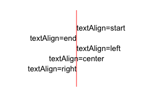

- *ctx.textBaseline*：设置字体垂直对齐方式（*top、hanging、middle、alphabetic、ideographic、bottom*）

  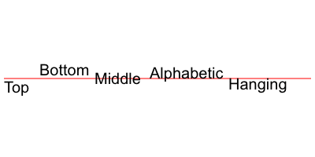

- *context.measureText(text)*：计算字体长度

```javascript
// 获取DOM元素
var canvas = document.querySelector(".test-canvas");
// 获取上下文（画布）
var ctx    = canvas.getContext("2d");

ctx.strokeStyle = "blue";
ctx.font = "italic 36px 微软雅黑";
ctx.textAlign = "center";
ctx.textBaseline = "middle";
ctx.strokeText("Hello, world!", 250, 150);
```

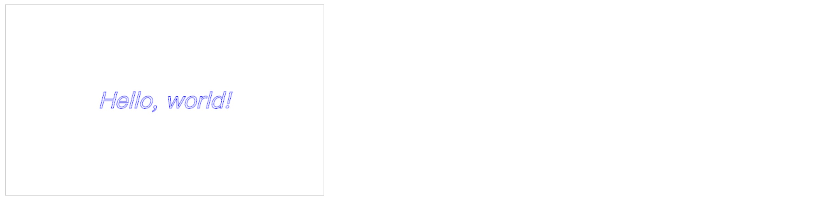

## 02. 矩形

- 填充矩形：*context.fillRect(x,y,width,height)*
- 绘制矩形：*strokeRect(x,y,width,height)*

```javascript
var canvas = document.querySelector(".test-canvas");
var ctx    = canvas.getContext("2d");

// 绘制
ctx.strokeStyle = "#000";
ctx.strokeRect(50, 75, 175, 150);

// 填充
ctx.fillStyle = "#333";
ctx.fillRect(275, 75, 175, 150);
```

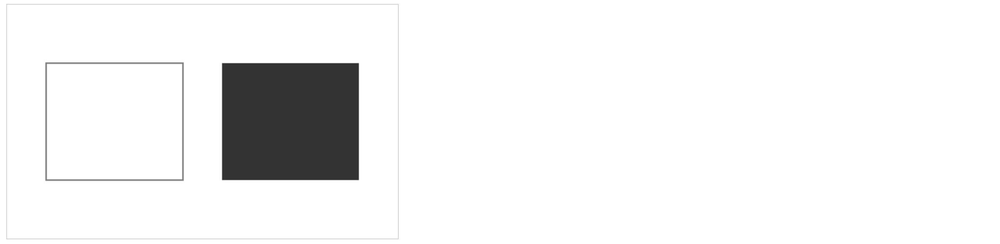

## 03. 清除矩形区域

清除矩形区域：*context.clearRect(x,y,width,height)*

```javascript
var canvas = document.querySelector(".test-canvas");
var ctx    = canvas.getContext("2d");

ctx.strokeStyle = "#000";
ctx.strokeRect(50, 75, 175, 150);

ctx.fillStyle = "#333";
ctx.fillRect(275, 75, 175, 150);

// 清除矩形区域
ctx.clearRect(175, 110,150, 80);
```

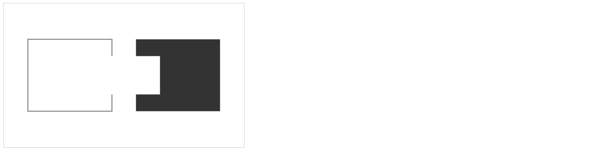

## 04. 圆弧

- 绘制圆弧：*context.arc(x, y, radius, starAngle,endAngle, anticlockwise)*

> 参数解读：

- `x`：圆心x坐标
- `y`：圆心y坐标
- `starAngle`：开始角度
- `endAngle`：结束角度
- `anticlockwise`：是否逆时针（ *true* 为逆时针，*false* 为顺时针）

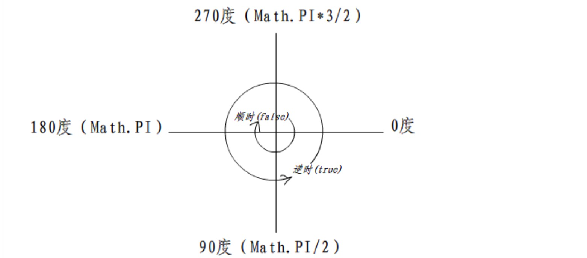

```javascript
var canvas = document.querySelector(".test-canvas");
var ctx    = canvas.getContext("2d");

ctx.beginPath();
ctx.arc(125, 150, 75, 0, 2 * Math.PI, false);
ctx.closePath();
ctx.fillStyle = "#333";
ctx.fill();


ctx.beginPath();
ctx.arc(325, 150, 75, 0, 45, true);
ctx.strokeStyle = "#333";
ctx.closePath();
ctx.stroke()
```

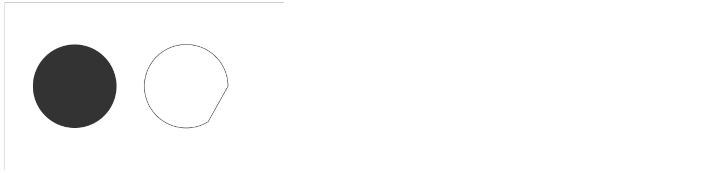

## 05. 线段

- *context.moveTo(x,y)*
- *context.lineTo(x,y)*

每次画线都从moveTo的点到lineTo的点，

如果没有moveTo那么第一次lineTo的效果和moveTo一样，

每次lineTo后如果没有moveTo，那么下次lineTo的开始点为前一次lineTo的结束点。

```javascript
var canvas = document.querySelector(".test-canvas");
var ctx    = canvas.getContext("2d");

ctx.moveTo(50, 100);
ctx.lineTo(450, 100);
ctx.stroke();

ctx.moveTo(50, 150);
ctx.lineTo(183, 150);
ctx.lineTo(250, 250);
ctx.lineTo(316, 150);
ctx.lineTo(450, 150);
ctx.strokeStyle = "#333";
ctx.stroke();
```

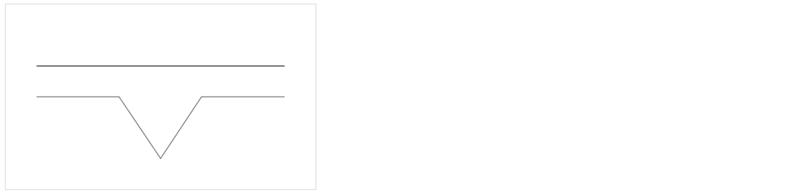

## 06. 贝塞尔曲线

[贝塞尔曲线扫盲](http://www.html-js.com/article/1628)

[动态绘制贝塞尔曲线](http://myst729.github.io/bezier-curve/)

- 三次贝塞尔曲线：*context.bezierCurveTo(cp1x,cp1y,cp2x,cp2y,x,y)*
- 二次贝塞尔曲线：*context.quadraticCurveTo(qcpx,qcpy,qx,qy)*

```javascript
var canvas = document.querySelector(".test-canvas");
var ctx    = canvas.getContext("2d");

ctx.moveTo(50, 100);
ctx.bezierCurveTo(100, 200, 150, 50, 250, 170);
ctx.stroke();
```

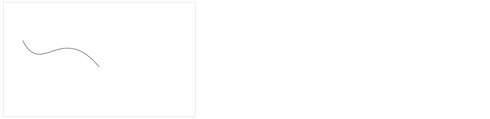

## 07. 线性渐变

- 创建线性渐变：*var lg =ctx.createLinearGradient(xStart,yStart,xEnd,yEnd)*
- 颜色节点：*lg.addColorStop(offset,color)*

> 参数解读

- `xstart`：渐变开始点x坐标
- `ystart`：渐变开始点y坐标

*    `xEnd`：渐变结束点x坐标


*    `yEnd`：渐变结束点y坐标
*    `offset`：设定的颜色离渐变结束点的偏移量(0~1)
*    `color`：绘制时要使用的颜色

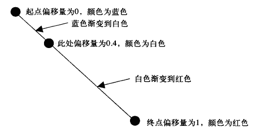

```javascript
var canvas = document.querySelector(".test-canvas");
var ctx    = canvas.getContext("2d");

var lg = ctx.createLinearGradient(0, 0, 400, 200);
lg.addColorStop( 0, "blue");
lg.addColorStop(.4, "white");
lg.addColorStop( 1, "red");

ctx.fillStyle = lg;
ctx.fillRect(50, 50, 400, 200);
```

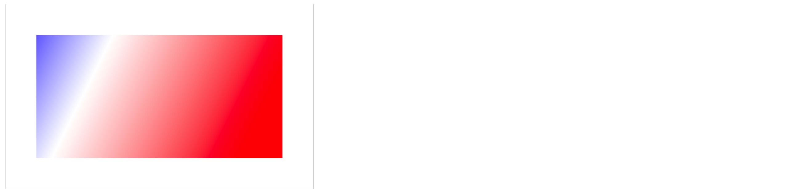

## 08. 径向渐变

- 创建径向渐变：*rg=ctx.createRadialGradient(xStart,yStart,radiusStart,xEnd,yEnd,radiusEnd)*
- 颜色节点：*rg.addColorStop(offset,color)*

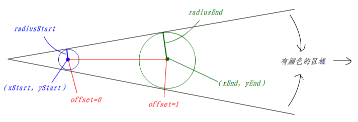

```javascript
var canvas = document.querySelector(".test-canvas");
var ctx    = canvas.getContext("2d");


var rg = ctx.createRadialGradient(250, 150, 0, 250, 150, 100);
rg.addColorStop(.1, "red");
rg.addColorStop( 1, "black");

ctx.beginPath();
ctx.arc(250, 150, 100,0, 2*Math.PI, true);
ctx.closePath();

ctx.fillStyle = rg;
ctx.fill();
```


## 09. 图形变形

- 位移：*ctx.translate(x, y)*
- 旋转：*ctx.rotate(angle)*
- 缩放：*ctx.scale(x, y)*

## 10. 图形组合

图形组合就是两个图形相互叠加了图形的表现形式，是后画的覆盖掉先画的呢，还是相互重叠的部分不显示等等，至于怎么显示取决于 `type`值。

语法形式：*context.globalCompositeOperation=type*

| type 值           | 描述                                 |
| ---------------- | ---------------------------------- |
| source-over（默认值） | 在原有图形上绘制新图形                        |
| destination-over | 在原有图形下绘制新图形                        |
| source-in        | 显示原有图形和新图形的交集，新图形在上，所以颜色为新图形的颜色    |
| destination-in   | 显示原有图形和新图形的交集，原有图形在上，所以颜色为原有图形的颜色  |
| source-out       | 只显示新图形非交集部分                        |
| destination-out  | 只显示原有图形非交集部分                       |
| source-atop      | 显示原有图形和交集部分，新图形在上，所以交集部分的颜色为新图形的颜色 |
| destination-atop | 显示新图形和交集部分，新图形在下，所以交集部分的颜色为原有图形的颜色 |
| lighter          | 原有图形和新图形都显示，交集部分做颜色叠加              |
| xor              | 重叠部分不显示                            |
| copy             | 只显示新图形                             |

看图理解：

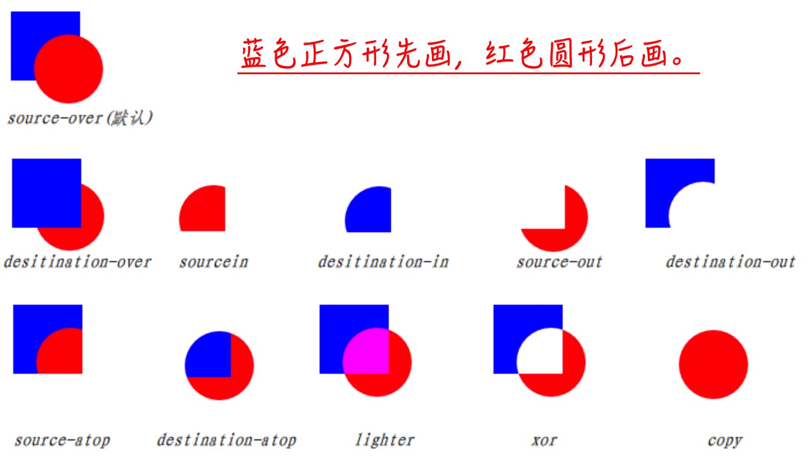

代码示例：

```javascript
var canvas = document.querySelector(".test-canvas");
var ctx    = canvas.getContext("2d");

// 蓝色矩形
ctx.fillStyle = 'blue';
ctx.fillRect(150, 100, 200, 100);

// 设置组合方式
ctx.globalCompositeOperation = 'lighter';
// 设置新图形（红色圆形）
ctx.beginPath();
ctx.fillStyle = 'red';
ctx.arc(250, 150, 180, 0, Math.PI * 2, false);
ctx.closePath();
ctx.fill();
```


## 11. 绘制图形阴影

* context.shadowOffsetX：阴影的横向位移量（默认值为0）
* context.shadowOffsetY：阴影的纵向位移量（默认值为0）
* context.shadowColor：阴影的颜色
* context.shadowBlur：阴影的模糊范围（值越大越模糊）

```javascript
ctx.shadowOffsetX = 15;
ctx.shadowOffsetY = 15;
ctx.shadowColor   = "#808080";
ctx.shadowBlur    = 10;

ctx.fillStyle = '#333';
ctx.fillRect(150, 100, 200, 100);
```

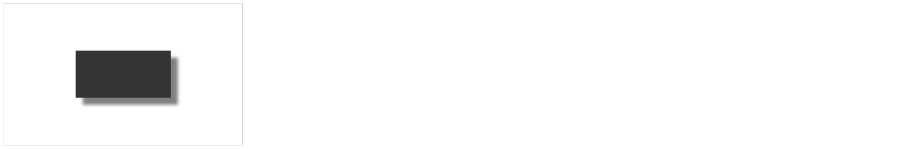

## 12. 绘制图像

绘图：*context.drawImage*

图像平铺：*context.createPattern(image,type)*

图像裁剪：*context.clip()*

像素处理：*var imagedata=context.getImageData(sx,sy,sw,sh)*

### 12.1. 绘图

绘图主要有三种方式

> **第 01 种方式**

- *context.drawImage(image,x,y)*

> 参数解读：

- `image`：Image对象 *var img=new Image(); img.src="url(...)";*
- `x`：绘制图像的x坐标
- ` y`：绘制图像的y坐标

> **第 02 种方式**

-  *context.drawImage(image,x,y,w,h)*

> 参数解读：

- `image`：Image对象 *var img=new Image(); img.src="url(...)";*
- `x`：绘制图像的x坐标
- ` y`：绘制图像的y坐标
- `w`：绘制图像的宽度
- `h`：绘制图像的高度

> **第 03 种方式**

- *context.drawImage(image,sx,sy,sw,sh,dx,dy,dw,dh)*：选取图像的一部分矩形区域进行绘制

> 参数解读：

- `image`：Image对象 *var img=new Image(); img.src="url(...)";*

*        `sx`：图像上的x坐标


*        `sy`：图像上的y坐标
*        `sw`：矩形区域的宽度
*        `sh`：矩形区域的高度
*        `dx`：画在canvas的x坐标
*        `dy`：画在canvas的y坐标
*        `dw`：画出来的宽度
*        `dh`：画出来的高度

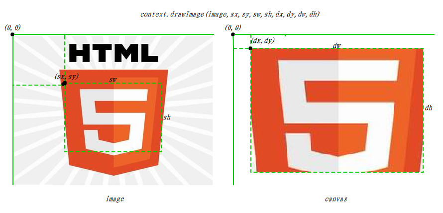

### 12.2. 平铺

- *context.createPattern(image,type)*

> 参数解读：

type 属性值

- no-repeat：不平铺
- repeat-x：横方向平铺
- repeat-y：纵方向平铺
- repeat：全方向平铺

```javascript
var canvas = document.querySelector(".test-canvas");
var ctx    = canvas.getContext("2d");

// 创建图片
var img = new Image();
// 设置图片
img.src = 'ruban.jpeg';
// 图片加载完成
img.onload = function () {
    // 设置平铺方式
    var ptrn = ctx.createPattern(img, 'repeat');
    ctx.fillStyle = ptrn;
    ctx.fillRect(50, 50, 400, 200);
};
```

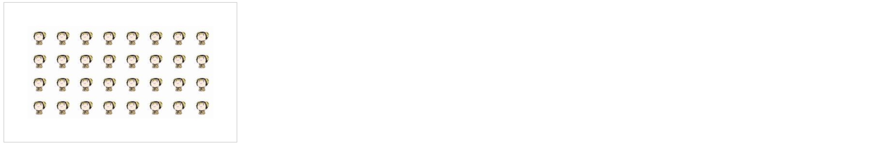

### 12.3. 裁剪

- context.clip()

只绘制封闭路径区域内的图像，不绘制路径外部图像，用的时候先创建裁剪区域，再绘制图像（之后绘制的图形都会采用这个裁剪区域，要取消这个裁剪区域就需要用到保存恢复状态，下面有讲）

```javascript
var canvas = document.querySelector(".test-canvas");
var ctx    = canvas.getContext("2d");

// 绘制一个黑色的矩形区域做背景
ctx.fillStyle = 'black';
ctx.fillRect(0, 0, 500, 300);

// 创建图片
// 图片宽度 500 x 889
var img = new Image();
// 设置图片
img.src = 'YAOGE.JPG';
// 图片加载完成
img.onload = function () {
    // 绘制裁剪区域
    ctx.beginPath();
    ctx.arc(250, 150, 120, 0, Math.PI * 2, true);
    ctx.closePath();
    // 裁剪
    ctx.clip();
    // 加载图片
    ctx.drawImage(img, 30, -380);
};
```


## 13. 保存/恢复状态 

- 保存：*context.save()*，调用该方法，会保存当前context的状态、属性（把他理解成游戏存档）
- 恢复：*context.restore()*，调用该方法就能恢复到save时候context的状态、属性（游戏回档）

在上面的裁剪图片提过，一旦设定了裁剪区域，后来绘制的图形都只显示裁剪区域内的内容，要“取消”这个裁剪区域才能正常绘制其他图形，其实这个“取消”是利用 *save()* 方法和 *restore()* 方法来实现的。

```javascript
var canvas = document.querySelector(".test-canvas");
var ctx    = canvas.getContext("2d");

ctx.fillStyle = '#333';
// 保存当前ctx状态
ctx.save();

ctx.fillStyle = 'red';
ctx.fillRect(50, 75, 175, 150);

// 恢复到刚刚保存的状态
ctx.restore();
ctx.fillRect(275, 75, 175, 150);
```

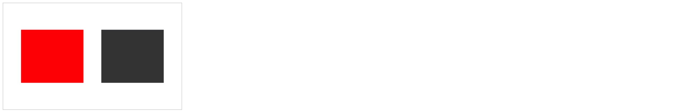

## 14. 保存文件

在canvas中绘出的图片只是canvas标签而已，并非是真正的图片，是不能右键，另存为的，我们可以利用*canvas.toDataURL()* 这个方法把canvas绘制的图形生成一幅图片，生成图片后，就能对图片进行相应的操作了。

```html
<canvas class="test-canvas" width="500" height="300" style="border: 1px solid #d3d3d3">
    <p>您的浏览器不支持Canvas！</p>
</canvas>

```

```javascript
var canvas = document.querySelector(".test-canvas");
// ......
var imgTag = document.getElementById('img');
imgTag.src = canvas.toDataURL();
```

执行完之后图片标签为：

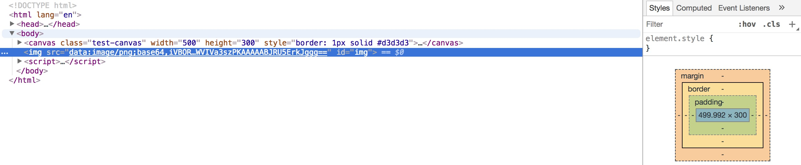

## 15. canvas 动画

canvas 动画实现的基本原理就是结合定时器绘制，并定时清除整个canvas重新绘制。

[canvas-block 时钟demo示例](https://lihongyao.github.io/practise/javascript/09.%20canvas-clock/index.html)

# # 参考/资料 

1. [runoob-canvas](http://www.runoob.com/tags/ref-canvas.html)
2. [w3school-canvas](http://www.w3school.com.cn/tags/html_ref_canvas.asp)
3. [Canvas-Tutorial](https://developer.mozilla.org/zh-CN/docs/Web/API/Canvas_API/Tutorial)
4. [WebGL](http://www.hewebgl.com/)
5. [Canvas-demos](https://github.com/supperjet/H5-Animation)


