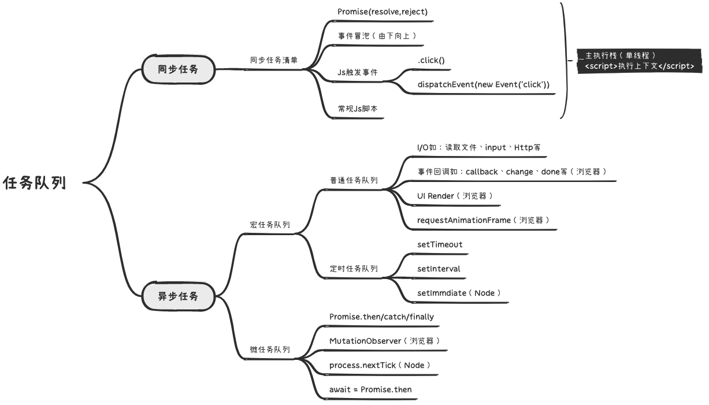

# 一、概述

事件循环是一种机制，用于管理代码执行期间的异步回调函数和事件处理程序。它利用 **单线程** 模型来协调不同类型的事件并保证它们按照预期顺序被执行。

在事件循环中，事件被放置在 **任务队列** 中，然后按照它们被触发的顺序进行处理。当主线程空闲时，它会从任务队列中取出一个事件并执行对应的回调函数或事件处理程序。如果任务队列为空，事件循环将持续等待新事件的到来。

JavaScript事件循环由三个主要组成部分组成：**调用堆栈**、**任务队列** 和 **事件循环引擎**。调用堆栈用于跟踪当前正在执行的代码位置，任务队列用于保存待执行的事件，事件循环引擎则负责协调这两者之间的交互。

# 二、相关概念

## 1. 同步任务 & 异步任务

同步任务和异步任务是指在程序执行过程中，不同操作的执行方式：

- **同步任务**：是指在执行一个操作时，程序会一直等待该操作完成后再继续执行下一个操作，直到所有操作都执行完成。这种方式会阻塞程序的执行，也就是说程序无法同时处理其他任务。
- **异步任务**：是指在执行一个操作时，程序可以继续执行下一个操作，无需等待当前操作完成。当该操作完成后，程序会通过回调函数等方式通知执行结果。这种方式可以充分利用计算机资源，提高程序的运行效率。

总的来说，同步任务采用阻塞式的方式执行操作，而异步任务采用非阻塞式的方式执行操作，并通过回调函数等方式获取操作结果。

## 2. 宏任务 & 微任务

在事件循环中，异步任务被分为两类：**宏任务** 和 **微任务**。



> 提示：
>
> - js事件循环通过宏任务和微任务的交替执行，实现了异步任务的执行顺序和优先级控制。
> - 微任务优先于宏任务执行。

# 三、执行顺序

事件循环的执行顺序如下：

1. 执行同步代码，直到遇到异步操作
2. 将异步操作添加到任务队列中
   - 微任务进入微任务队列
   - 宏任务进入宏任务队列
3. 继续执行同步代码，直到所有同步代码执行完成
4. 检查异步任务队列是否有待处理的任务，如果有，则按照它们被添加的顺序依次执行（微任务 → 宏任务）
5. 重复上述步骤，不断地从任务队列中获取并执行操作，直到任务队列为空

> 提示：这个过程被称为事件循环(Event loops)，它会不断重复上述步骤，以保证 JavaScript 可以异步执行代码。

# 四、代码示例

[参考 >>](https://developer.mozilla.org/en-US/docs/Web/JavaScript/EventLoop)

【示例-01】

```js
console.log('start'); 
setTimeout(function cb() {
  console.log('setTimeout1'); 
});

console.log('message'); 

setTimeout(function cb1() {
  console.log('setTimeout2'); 
}, 0);

console.log('end'); 
```

分析：

- 同步代码：start、message、end
- 宏任务：setTimeout1、setTimeout2

输出顺序：start → message → end → setTimeout1 → setTimeout2

【示例-02】

```js
console.log('start');

setTimeout(() => {
  console.log('setTimeout');
}, 0);

Promise.resolve()
  .then(() => {
    console.log('promise1');
  })
  .then(() => {
    console.log('promise2');
  });

console.log('end');
```

分析：

- 同步代码：start、end
- 微任务：promise1、promise2
- 宏任务：setTimeout

输出顺序：start → end → promise1 → promise2 → setTimeout

【示例-03】

```javascript
console.log('start'); 

setTimeout(function () {
  console.log('timeout1');
}, 5);

new Promise((resolve) => {
  console.log('promise1');
  resolve();
  setTimeout(() => console.log('timeout2'), 5); 
}).then(function () {
  console.log('then1'); 
});

console.log('end'); 
```

- 同步代码：start、promise1、end
- 微任务：then1
- 宏任务：timeout1、timeout2

输出顺序：start → promise1 → end → then1 → timeout1 → timeout2

