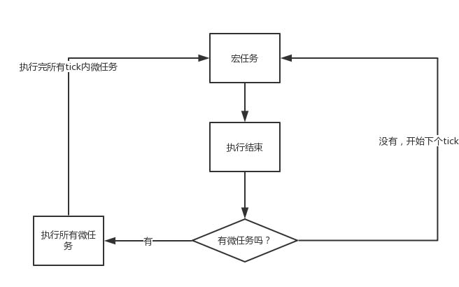
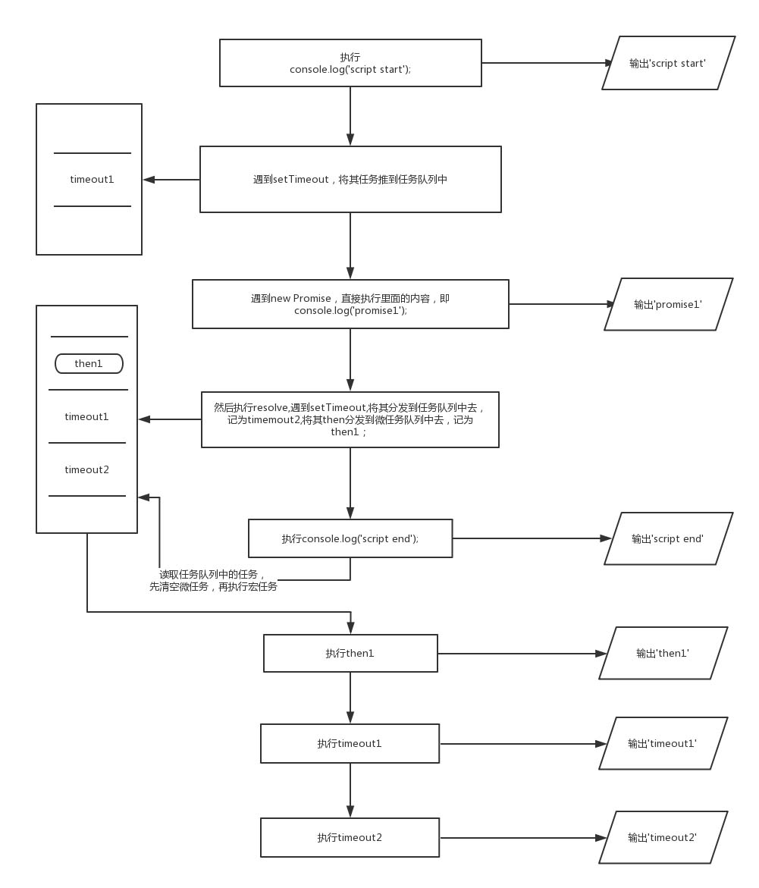

# 一、概述

JavaScript 是一门 **单线程的 / 非阻塞** 的脚本语言，单线程意味着JavaScript在处理任务的时候，所有任务只能在一个线程上排队被执行。非阻塞靠的就是 Event loop（事件循环）。

为了协调事件、用户交互、脚本、UI 渲染和网络处理等行为，用户引擎必须使用 event loops（摘自[官网](https://html.spec.whatwg.org/multipage/webappapis.html#event-loops)译文）。Event Loop 包含两类：一类是基于 Browsing Context ，一种是基于 [Web-Worker]()  ，二者是独立运行的。

Event loop主要由两部分组成：**主线程（执行栈）、任务队列**

# 二、相关概念

## 1. 同步任务 & 异步任务

单线程就意味着它只有一条运行线路，也就是一次只能做一件事情，那么，问题就来了，如果是CPU一直在工作，那也就罢了，但是如果CPU处于空闲状态，而且等待的事务对接下来的任务没有影响，这就浪费了大量的资源。例如：获取网络上的信息，线程一直等到信息获取完成再执行，在此之前都处于等待状态就太浪费了。于是JavaScript就引人了同步异步机制。

**同步任务**：下一个任务受上一个任务所影响，即需要上一个任务执行完之后才能执行下一个任务。

**异步任务**：异步任务就是不进入主线程，而进入“任务队列”，(并不是立即执行)，等到可以执行了，任务队列会通知主线程：某个异步任务可以执行了。该任务才会被主线程调用执行。（回调函数、定时器函数、用户点击事件等）

**运行方式**：所有同步任务进入主线程队列执行，所有异步任务进入任务队列，主线程先执行完所有同步任务，再调用可执行的异步任务。（主线程空闲的时候才会调用执行异步任务）。任务队列是一个**先进先出**的数据结构，排在前面的事件优先被主线程读取。主线程调用时会先检查时间,因为存在定时器函数，这类函数只有满足规定的时间才会被调用。   

## 2. 宏任务 & 微任务

在JavaScript中，异步任务被分为两种：宏任务（macro task）和微任务（micro task）


> 提示：微任务优先于宏任务执行
>

# 四、执行顺序

1、先执行主线程

2、当遇到宏任务（macro task）时，将其放到宏任务队列（macro task queue）

3、当遇到微任务（micro task）时，将其放到微任务队列（micro task queue）

4、主线程执行完毕

5、执行微任务队列，微任务队列执行完毕

6、执行宏任务队列，宏任务队列执行完毕

7、结束一次事件循环


上述过程的不断重复就是我们说的 <ins> Event Loop</ins>。

在事件循环中，每进行一次循环操作称为 `tick`，每一次 `tick` 的任务处理模型是比较复杂的，其关键的步骤可以总结如下：

1. 在此次 tick 中选择最先进入队列的任务( oldest task )，如果有则执行(一次)
2. 检查是否存在任务队列（宏任务 / 微任务） ，如果存在则不停地执行，直至清空 Microtask Queue
3. 更新 render
4. 主线程重复执行上述步骤

可以用一张图来说明下流程：



> 说明：
>
> 主线程运行时会产生执行栈，栈中的代码调用某些api时（如定时器，ajax），会在其他对应线程上进行，当这些任务执行完或者满足触发条件后，如ajax请求完毕, 对应的执行代码或任务函数就会被添加到任务队列中。而栈中的代码执行完毕，就会读取事件队列（任务队列）中的事件函数进入到执行栈中，去执行那些任务函数或代码，如此不断循环就形成了**EventLoop事件循环**

# 五、代码示例

[参考 >>](https://developer.mozilla.org/en-US/docs/Web/JavaScript/EventLoop)

【示例-01】

```js
(function() {

  console.log('this is the start');

  setTimeout(function cb() {
    console.log('Callback 1: this is a msg from call back');
  }); // has a default time value of 0

  console.log('this is just a message');

  setTimeout(function cb1() {
    console.log('Callback 2: this is a msg from call back');
  }, 0);

  console.log('this is the end');

})();

// "this is the start"
// "this is just a message"
// "this is the end"
// "Callback 1: this is a msg from call back"
// "Callback 2: this is a msg from call back"
```

【示例-02】

```js
console.log('start');

setTimeout(() => {
  console.log('setTimeout');
}, 0);

Promise.resolve().then(() => {
  console.log('promise1');
}).then(() => {
  console.log('promise2');
});

console.log('end');
```

代码分析：

\1. 整体 script  作为第一个宏任务进入主线程，遇到 console.log，输出 ”start“

\2. 遇到 setTimeout，其回调函数被分发到宏任务 Event Queue 中

\3. 遇到 Promise，其 then函数被分到微任务 Event Queue 中,记为 then1，之后又遇到了 then 函数，将其分到微任务 Event Queue 中，记为 then2

\4. 遇到 console.log，输出 script end

至此，Event Queue 中存在三个任务，如下表：

| 宏任务     | 微任务 |
| ---------- | ------ |
| setTimeout | then1  |
| -          | then2  |

\5. 执行微任务，首先执行then1，输出 promise1, 然后执行 then2，输出 promise2，这样就清空了所有微任务

\6. 执行 setTimeout 任务，输出 setTimeout 

因此，输出的顺序是：start -> end -> promise1 -> promise2 -> setTimeout

【示例-03】

```javascript
console.log('start');

setTimeout(function() {
  console.log('timeout1');
}, 5);

new Promise(resolve => {
    console.log('promise1');
    resolve();
    setTimeout(() => console.log('timeout2'), 5);
}).then(function() {
    console.log('then1')
})

console.log('end');
```

代码分析：




因此，输出顺序为：start -> promise1 -> end -> then1 -> timeout1 -> timeout2

# 六、拓展

NodeJS 中的非IO的异步API提供了四种方法，分别为`setTimeOut()`, `setInterval(),` `setImmediate()`以及`process.nextTick()`，四种方法实现原理相似，但达到的效果略有区别：

| #                    | 描述                                                         |
| -------------------- | ------------------------------------------------------------ |
| `process.nextTick()` | 效率最高，消费资源小，但会阻塞CPU的后续调用                  |
| `setTimeout()`       | 精确度不高，可能有延迟执行的情况发生，且因为动用了红黑树，所以消耗资源大； |
| `setImmediate()`     | 消耗的资源小，也不会造成阻塞，但效率也是最低的。             |

> 注意：**JavaScript 是一门单线程语言，异步操作都是放到事件循环队列里面，等待主执行栈来执行的，并没有专门的异步执行线程**


